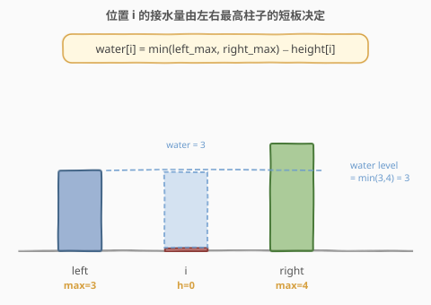
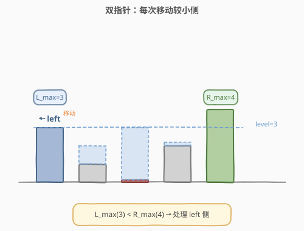
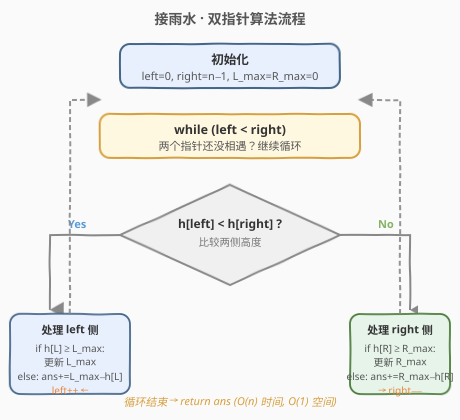
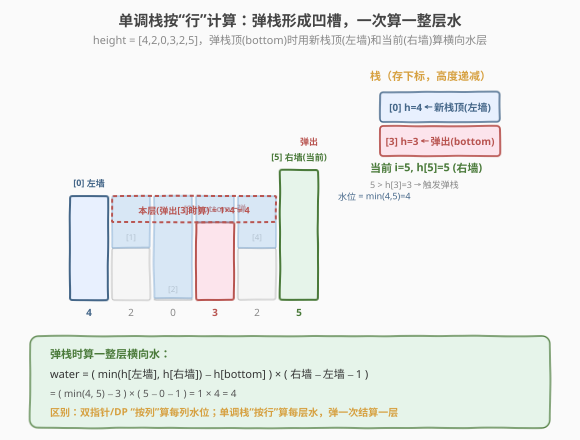

# 接雨水

- **题目名称**：接雨水
- **链接**：[42. 接雨水](https://leetcode.cn/problems/trapping-rain-water/)
- **难度**：困难
- **标签**：数组、双指针、栈、动态规划、单调栈

## 1. 题目概述

给定 `n` 个非负整数表示每个宽度为 1 的柱子的高度图，计算按此排列的柱子，下雨之后能接多少雨水。

**示例 1**：

```text
输入：height = [0,1,0,2,1,0,1,3,2,1,2,1]
输出：6
解释：上面是由数组 [0,1,0,2,1,0,1,3,2,1,2,1] 表示的高度图，在这种情况下可以接 6 个单位的雨水。
```

**示例 2**：

```text
输入：height = [4,2,0,3,2,5]
输出：9
```

**约束条件**：

- `n == height.length`
- `1 <= n <= 2 * 10^4`
- `0 <= height[i] <= 10^5`

---

## 2. 解题思路

### 2.1 核心观察：每个位置能接多少水？

对于下标 `i` 处的柱子，能接的雨水量取决于：**左边最高柱子和右边最高柱子中的较小者**。



上图展示了关键直觉：

- 位置 `i` 处形成一个"凹槽"，雨水会被左右两侧更高的柱子挡住。
- 水位高度 = `min(max_left, max_right)`，其中 `max_left` 是 `i` 左侧最高柱子，`max_right` 是 `i` 右侧最高柱子。
- 位置 `i` 能接的雨水 = `min(max_left, max_right) - height[i]`（如果结果为正）。

> 为什么取左右最大值中的较小者？因为水会从较低的一侧溢出，所以真正决定水位的是"短板"。

### 2.2 双指针法：最优解法

核心思路：

- 用两个指针 `left` 和 `right` 分别指向数组两端。
- 维护 `left_max` 和 `right_max` 分别表示左右两侧遇到的最大高度。
- 每次移动高度较小一侧的指针，因为该侧的水位已经被确定。

**为什么移动较小侧？**



假设 `left_max < right_max`：

- 对于 `left` 位置，左侧最大值是 `left_max`。
- 虽然右侧最大值 `right_max` 可能不是全局右侧最大值，但它已经 >= `left_max`。
- 因此位置 `left` 的水位由 `left_max` 决定：`left_max - height[left]`。
- 处理完 `left` 后，向右移动 `left` 指针。

同理，当 `right_max <= left_max` 时，处理右侧。

### 2.3 算法流程图



### 2.4 单调栈法：按"行"计算雨水

双指针和 DP 都是"**按列**"算——逐个位置求 `min(max_left, max_right) - height[i]`。单调栈换了个视角："**按行**"算——每当遇到一个"右墙"，就一次性结算掉它和某个"左墙"之间的一整层横向水。

**关键定义**：维护一个**栈**，栈中存放下标，对应高度从栈底到栈顶**单调递减**（与 [每日温度](../../week2/day6/每日温度.md) 同模板）。

**核心规则**：遍历每根柱子 `i`：

- 若 `height[i]` **大于**栈顶高度：说明 `i` 是栈顶那根柱子的"右墙"。弹出栈顶 `bottom`，此时**新栈顶**就是"左墙" `left`。这一层的水量为：
  - `water = (min(height[left], height[i]) - height[bottom]) * (i - left - 1)`
  - 即：底降到 `height[bottom]`、水位取左右墙较矮者、宽度为两墙之间的间隔。**循环弹**直到栈顶高度 ≥ 当前（保持单调性）或栈空。
- 然后**把** `i` **入栈**（它还没遇到右墙，等后续更高的来结算）。



**为什么是递减栈？** 栈里存的是"还没遇到右墙"的柱子，它们应**递减**排列。当一根更高的柱子 `i` 到来时，它就是栈里那些较矮柱子的右墙；弹掉栈顶（凹槽的底）后，新栈顶正好是凹槽的左墙。这样"左墙—底—右墙"的凹槽结构自然浮现，每次弹栈结算一横层水。

> 💡 **与每日温度/496 的同与异**：骨架完全相同——都是"遍历 + while 弹栈结算 + 入栈"。区别仅在**结算内容**：每日温度算"隔几天"（`i - top`），496 算"下一个更大的值"并写哈希表，接雨水算"一整层面积"（需要弹栈后**再看新栈顶**当左墙）。同一套 `while + pop + push`，换个结算公式就是新题。

### 2.5 单调栈示例演算

以 `height = [4,2,0,3,2,5]`（示例 2）为例，重点看弹栈结算的时刻：

![示例演算：[4,2,0,3,2,5] 单调栈逐行结算](images/trap_monotonic_stack_walkthrough.svg)

| 步骤 | i | h[i] | 栈(处理后) | 弹栈结算 | 累计水 |
|------|---|------|-----------|---------|--------|
| 1 | 0 | 4 | [0] | 栈空入栈 | 0 |
| 2 | 1 | 2 | [0,1] | 2<4 入栈 | 0 |
| 3 | 2 | 0 | [0,1,2] | 0<2 入栈 | 0 |
| 4 | 3 | 3 | [0,3] | 3>0 弹[2]→左1右3=(2−0)×1=2；3>2 弹[1]→左0右3=(3−2)×2=2；3<4 入栈 | 4 |
| 5 | 4 | 2 | [0,3,4] | 2<3 入栈 | 4 |
| 6 | 5 | 5 | [5] | 5>2 弹[4]→左3右5=(3−2)×1=1；5>3 弹[3]→左0右5=(4−3)×4=4；5>4 弹[0]→栈空无左墙=0；入栈 | 9 |

注意步骤 6：`i=5`（高度 5）连续弹了 `[4]、[3]、[0]` 三个下标，每弹一个就算一横层水。其中弹 `[3]` 时左墙是 `[0]`(h=4)、右墙是 `i=5`(h=5)，算出最宽的一层 `(4−3)×4=4`。弹 `[0]` 时栈已空、没有左墙，说明它左侧没有更高柱子，接不住水，跳过。最终 `9`，与示例 2 一致。

> 💡 对比双指针：双指针在每个位置算"该列能接多少"（纵向），单调栈每次弹栈算"该层能接多少"（横向）。两种视角等价，总和相同，但单调栈把"凹槽"结构显式化，是 [柱状图最大矩形](../../week1/day7/柱状图中最大的矩形.md) 的姊妹解法。

---

## 3. 参考代码

### 方法一：双指针（O(1) 空间，推荐）

### C++

```cpp
class Solution {
  public:
    int trap(vector<int>& height) {
        int n = height.size();
        if (n <= 2)
            return 0;

        int left = 0, right = n - 1;
        int left_max = 0, right_max = 0;
        int ans = 0;

        while (left < right) {
            if (height[left] < height[right]) {
                if (height[left] >= left_max) {
                    left_max = height[left];
                } else {
                    ans += left_max - height[left];
                }
                left++;
            } else {
                if (height[right] >= right_max) {
                    right_max = height[right];
                } else {
                    ans += right_max - height[right];
                }
                right--;
            }
        }

        return ans;
    }
};
```

### Python

```python
class Solution:
    def trap(self, height: List[int]) -> int:
        if len(height) <= 2:
            return 0

        left, right = 0, len(height) - 1
        left_max = right_max = 0
        ans = 0

        while left < right:
            if height[left] < height[right]:
                if height[left] >= left_max:
                    left_max = height[left]
                else:
                    ans += left_max - height[left]
                left += 1
            else:
                if height[right] >= right_max:
                    right_max = height[right]
                else:
                    ans += right_max - height[right]
                right -= 1

        return ans
```

### 方法二：单调栈（O(n) 空间，按行结算）

### C++

```cpp
// 单调递减栈：按"行"计算雨水
#include <vector>
#include <stack>
using namespace std;

class Solution {
  public:
    int trap(vector<int>& height) {
        int n = height.size();
        int ans = 0;
        stack<int> stk; // 存下标，对应高度单调递减

        for (int i = 0; i < n; ++i) {
            // 当前柱子是栈顶的"右墙" → 弹栈结算一整层
            while (!stk.empty() && height[i] > height[stk.top()]) {
                int bottom = stk.top(); stk.pop(); // 凹槽的底
                if (stk.empty()) break;            // 栈空无左墙，接不住水
                int left = stk.top();              // 凹槽的左墙
                int h = min(height[left], height[i]) - height[bottom];
                int w = i - left - 1;              // 两墙之间的间隔
                ans += h * w;
            }
            stk.push(i);
        }
        return ans;
    }
};
```

### Python

```python
class Solution:
    def trap(self, height: List[int]) -> int:
        ans = 0
        stack = []  # 存下标，对应高度单调递减

        for i, h in enumerate(height):
            # 当前柱子是栈顶的"右墙" → 弹栈结算一整层
            while stack and h > height[stack[-1]]:
                bottom = stack.pop()          # 凹槽的底
                if not stack:
                    break                     # 栈空无左墙，接不住水
                left = stack[-1]              # 凹槽的左墙
                dh = min(height[left], h) - height[bottom]
                w = i - left - 1              # 两墙之间的间隔
                ans += dh * w
            stack.append(i)

        return ans
```

> 💡 注意弹栈后要**再判一次栈空**：若栈空，说明被弹的 `bottom` 左侧没有更高的柱子当左墙，水会从左边流走，接不住，直接 `break`。这是接雨水单调栈解法与每日温度最大的不同——每日温度弹栈即结算（必有答案），接雨水弹栈后还可能"无左墙"。

---

## 4. 复杂度分析

| 维度 | 方法 | 复杂度 | 说明 |
|------|------|--------|------|
| 时间复杂度 | 双指针 | O(n) | 双指针各遍历一次数组 |
| 空间复杂度 | 双指针 | O(1) | 只使用常数额外变量 |
| 时间复杂度 | 单调栈 | O(n) | 每个下标入栈 1 次、出栈 1 次，总操作 2n |
| 空间复杂度 | 单调栈 | O(n) | 栈最多存 n 个下标（高度严格递减时） |

> ⚠️ 单调栈的 `while` 嵌套在 `for` 里，但**均摊分析**：每个下标至多入栈 1 次出栈 1 次，`while` 的总弹出次数 ≤ n，所以总时间 O(n)。与双指针同为 O(n) 时间，但空间多 O(n)，因此**面试首选双指针**；单调栈的价值在于"凹槽"视角可直接迁移到柱状图最大矩形等题。

---

## 5. 面试要点

1. **为什么双指针法是对的？**
   - 移动较小侧时，该侧的 `left_max` 或 `right_max` 就是当前位置的"短板"，另一侧已有更高的柱子保证水不会溢出。

2. **和动态规划版本相比优势是什么？**
   - DP 版本需要 O(n) 空间存储每个位置的左右最大值。
   - 双指针版本只需要 O(1) 空间。

3. **单调栈法和双指针法的区别？**
   - **视角不同**：双指针/DP"按列"算（每列 `min(max_left, max_right) - height[i]`），单调栈"按行"算（每次弹栈结算一横层 `min(h[L], h[R]) - h[bottom]) * (R - L - 1)`）。
   - **复杂度不同**：双指针 O(n) 时间 O(1) 空间；单调栈 O(n) 时间 O(n) 空间。面试首选双指针。
   - **迁移性不同**：单调栈的"凹槽"视角可直接迁移到 [柱状图最大矩形](../../week1/day7/柱状图中最大的矩形.md)（找左右第一个更矮），双指针则不能。

4. **单调栈弹栈后为什么要再判一次栈空？**
   - 弹出 `bottom` 后，若栈空，说明 `bottom` 左侧没有更高的柱子当左墙，水会从左边流走，接不住，直接 `break`。
   - 这是接雨水与每日温度最大的不同——每日温度弹栈即结算（必有答案），接雨水弹栈后还可能"无左墙"。

5. **什么情况下接不了雨水？**
   - 数组长度 <= 2。
   - 数组单调递增或单调递减。

6. **如果题目改成二维接雨水怎么做？**
   - 使用优先队列（最小堆）+ BFS，从边界向内部填充，时间复杂度 O(mn log(mn))。

---

## 7. 同类练习题
- [11. 盛最多水的容器](https://leetcode.cn/problems/container-with-most-water/)：双指针，两指针从两端向中间收拢
- [407. 接雨水 II](https://leetcode.cn/problems/trapping-rain-water-ii/)：3D 接雨水，BFS + 优先队列
- [84. 柱状图中最大的矩形](https://leetcode.cn/problems/largest-rectangle-in-histogram/)（[题解](../../week1/day7/柱状图中最大的矩形.md)）：单调栈求最大矩形面积，与接雨水单调栈同骨架
- [739. 每日温度](https://leetcode.cn/problems/daily-temperatures/)（[题解](../../week2/day6/每日温度.md)）：单调栈招牌题，与接雨水同 `while+pop+push` 模板
- [496. 下一个更大元素 I](https://leetcode.cn/problems/next-greater-element-i/)（[题解](../../week2/day6/下一个更大元素 I.md)）：单调栈入门，存值+哈希表查表
