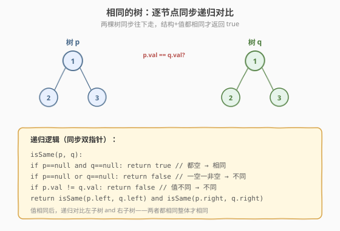
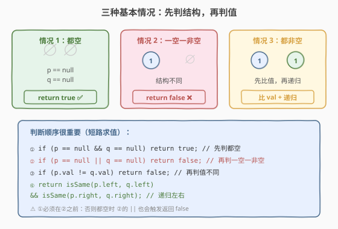
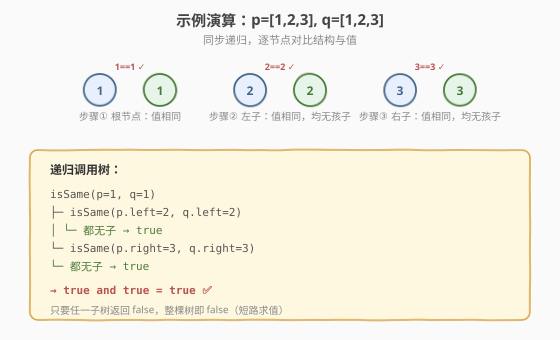

# 相同的树

- **题目名称**：相同的树
- **链接**：[100. 相同的树](https://leetcode.cn/problems/same-tree/)
- **难度**：简单
- **标签**：树、DFS

## 1. 题目概述

给定两棵二叉树的根节点 `p` 和 `q`，判断它们是否**相同**。两棵树相同的定义：**结构相同**，且**对应节点的值相同**。

**示例 1**：

```text
输入：p = [1,2,3], q = [1,2,3]
    1         1
   / \       / \
  2   3     2   3
输出：true
```

**示例 2**：

```text
输入：p = [1,2], q = [1,null,2]
    1         1
   /           \
  2             2
输出：false
解释：结构不同（p 的 2 是左子，q 的 2 是右子）。
```

**示例 3**：

```text
输入：p = [1,2,1], q = [1,1,2]
    1         1
   / \       / \
  2   1     1   2
输出：false
解释：结构相同，但对应节点值不同。
```

**约束条件**：

- 两棵树节点数目范围 `[0, 100]`
- `-10^4 <= Node.val <= 10^4`

> 💡 这是「同步双指针递归」的招牌题——两棵树一起往下走，逐节点对比结构与值。它和「对称二叉树」是孪生题：把「相同树」的「左对左、右对右」改成「左对右、右对左」就是对称判断。掌握这道题，你就理解了「树形递归 + 配对比较」的通用骨架。

---

## 2. 解题思路

### 2.1 基础思路：逐节点对比

最直观的做法：两棵树同步遍历，每到一对节点 `(p, q)`，先判断「结构是否一致」（是否同时为空 / 同时非空），再判断「值是否相等」，然后递归对比左右子树。

### 2.2 核心观察：三种基本情况 + 递归



关键在于把「两棵树是否相同」拆成**三种基本情况**的判断：

| 情况 | p | q | 结论 |
|------|---|---|------|
| 1 | `null` | `null` | 都空 → `true` |
| 2 | `null` | 非空（或反之） | 一空一非空 → `false` |
| 3 | 非空 | 非空 | 比值 + 递归左右 |



> ⚠️ **判断顺序很重要**：必须先判「都空」（情况 1），再判「一空一非空」（情况 2）。如果顺序反了，当 `p` 和 `q` 都为 `null` 时，情况 2 的 `||` 也会触发，错误返回 `false`。

### 2.3 算法流程图

逻辑步骤（已在 2.2 图中展示）：

1. **情况 1**：`p == null && q == null` → 返回 `true`
2. **情况 2**：`p == null || q == null` → 返回 `false`（此时必然一空一非空）
3. **情况 3**：`p.val != q.val` → 返回 `false`
4. **递归**：返回 `isSame(p.left, q.left) && isSame(p.right, q.right)`

> 💡 第 4 步用 `&&` 短路求值——左子树不同时直接返回 `false`，不会递归右子树。这保证了「一旦发现不同立即停止」，平均情况下能剪掉大量子树。

### 2.4 示例演算

以示例 1 `p = [1,2,3], q = [1,2,3]` 为例：



| 步骤 | 对比节点 | 结构 | 值 | 结果 |
|------|---------|------|----|------|
| ① | p=1, q=1 | 都非空 ✓ | 1==1 ✓ | 递归左右 |
| ② | p=2, q=2 | 都非空 ✓ | 2==2 ✓ | 均无子，true |
| ③ | p=3, q=3 | 都非空 ✓ | 3==3 ✓ | 均无子，true |
| 汇总 | — | — | — | true && true = **true** ✅ |

> 💡 整个递归展开成一棵「调用树」，每个节点对应一次 `isSame` 调用。只要有一个调用返回 `false`，根调用就返回 `false`（短路）。本题所有调用都返回 `true`，故最终 `true`。

---

## 3. 参考代码

### C++

```cpp
// 相同的树.cpp —— 同步递归 DFS
struct TreeNode {
    int val;
    TreeNode* left;
    TreeNode* right;
    TreeNode() : val(0), left(nullptr), right(nullptr) {
    }
    TreeNode(int x) : val(x), left(nullptr), right(nullptr) {
    }
    TreeNode(int x, TreeNode* l, TreeNode* r) : val(x), left(l), right(r) {
    }
};

class Solution {
  public:
    bool isSameTree(TreeNode* p, TreeNode* q) {
        if (p == nullptr && q == nullptr) return true;   // 都空
        if (p == nullptr || q == nullptr) return false;  // 一空一非空
        if (p->val != q->val) return false;              // 值不同
        return isSameTree(p->left, q->left) &&           // 递归左 && 右
               isSameTree(p->right, q->right);
    }
};
```

### Python

```python
class Solution:
    def isSameTree(self, p: TreeNode | None, q: TreeNode | None) -> bool:
        if not p and not q:           # 都空
            return True
        if not p or not q:            # 一空一非空
            return False
        if p.val != q.val:            # 值不同
            return False
        return (self.isSameTree(p.left, q.left) and
                self.isSameTree(p.right, q.right))
```

> 💡 Python 里 `not p and not q` 检查都空，`not p or not q` 检查一空一非空——这两个条件的顺序不能反，逻辑与 C++ 完全一致。代码极简，但「判断顺序」是本题最易错的点。

---

## 4. 复杂度分析

| 维度 | 复杂度 | 说明 |
|------|--------|------|
| **时间复杂度** | `O(min(m, n))` | `m`、`n` 分别为两棵树节点数；最坏遍历到较短树的所有节点 |
| **空间复杂度** | `O(min(h_p, h_q))` | 递归栈深度 = 两棵树中较矮者的高度 |

> ⚠️ 时间复杂度是 `O(min(m,n))` 而非 `O(m+n)`——因为短路求值：一旦发现不同立即返回，不继续递归。最坏情况（两棵树完全相同）才遍历 `min(m,n)` 个节点对。若两树结构差异很大，可能在前几层就剪枝返回。

---

## 5. 扩展：迭代解法（BFS 双队列）

递归之外，可用**两个队列同步 BFS**：每次各出一个节点对比，再把对应的孩子按相同顺序入队。适合面试官要求「不用递归」或担心栈溢出的场景。

```python
from collections import deque

class Solution:
    def isSameTree(self, p: TreeNode | None, q: TreeNode | None) -> bool:
        dq = deque([(p, q)])
        while dq:
            n1, n2 = dq.popleft()
            if not n1 and not n2:
                continue
            if not n1 or not n2:
                return False
            if n1.val != n2.val:
                return False
            dq.append((n1.left, n2.left))
            dq.append((n1.right, n2.right))
        return True
```

> 💡 迭代版把递归的「调用栈」显式化为「队列」，逻辑完全等价。把 null 节点也入队可以省去「判断孩子是否存在」的分支——遇到 `(null, null)` 直接 `continue`。

---

## 6. 面试要点

1. **为什么先判「都空」再判「一空一非空」？**

   - 若先判 `p == null || q == null`：当 `p`、`q` 都为 `null` 时，`||` 也会为真，错误返回 `false`。
   - 必须先 `&&` 排除「都空」返回 `true` 的情况，剩下的 `||` 才精确表示「恰好一个为空」。这是短路逻辑的经典坑。

2. **这道题和「对称二叉树」（101）什么关系？**

   - 完全同构。「相同树」：`isSame(p.left, q.left) && isSame(p.right, q.right)`（左对左、右对右）。
   - 「对称二叉树」：`isMirror(p.left, q.right) && isMirror(p.right, q.left)`（左对右、右对左）。
   - 只把递归参数的配对方式改一下，其余骨架完全复用。

3. **短路求值在这里起什么作用？**

   - `&&` 左操作数为 `false` 时不再求值右操作数。若 `isSame(p.left, q.left)` 返回 `false`，右子树递归直接跳过。
   - 平均情况下能省掉大量递归调用。最坏情况（两树相同）才遍历全部节点。

4. **时间复杂度为什么是 O(min(m,n)) 而不是 O(m+n)？**

   - 递归是「同步」的——每次只对比一对节点 `(p, q)`，不会单独遍历某棵树。
   - 一旦某棵树先「走完」（`null`）而另一棵还有节点，立即返回 `false`，不继续走另一棵。所以最多走 `min(m,n)` 步。

5. **如何判断「结构相同但值不同」？**

   - 情况 3 里：若 `p`、`q` 都非空但 `p.val != q.val`，返回 `false`。示例 3 就是这个情况——结构一致（都有左右子），但对应位置值不同（2 vs 1、1 vs 2）。
   - 结构判断在情况 1、2，值判断在情况 3，两者分开处理逻辑清晰。

> 💡 **一句话总结**：相同的树是「同步双指针递归」的招牌题——两棵树一起往下走，用「三种基本情况」逐一判断结构与值。判断顺序（先 `&&` 后 `||`）是最易错的点。把配对方式从「左左、右右」改成「左右、右左」就是对称二叉树，是一道「改一行迁移」的典型题。

---

## 7. 同类练习题

- [101. 对称二叉树](https://leetcode.cn/problems/symmetric-tree/)：把「左左、右右」改成「左右、右左」（[题解](../../week7/day2/对称二叉树.md)）
- [572. 另一棵树的子树](https://leetcode.cn/problems/subtree-of-another-tree/)：遍历主树每个节点，调用 isSame 判断是否匹配
- [226. 翻转二叉树](https://leetcode.cn/problems/invert-binary-tree/)：同套递归骨架，操作而非比较（[题解](../../week4/day4/翻转二叉树.md)）
- [104. 二叉树的最大深度](https://leetcode.cn/problems/maximum-depth-of-binary-tree/)：单树后序汇总（[题解](../../week6/day2/二叉树的最大深度.md)）
- [100. 相同的树](https://leetcode.cn/problems/same-tree/)（[题解](相同的树.md)）：本题，双树配对递归模板
