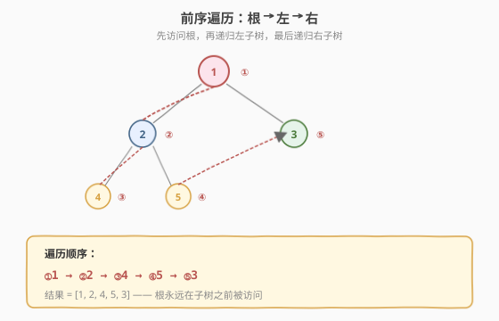
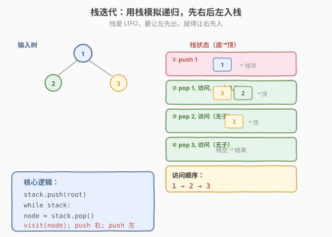
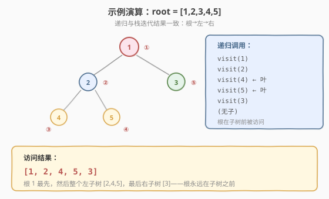

# 二叉树的前序遍历

- **题目名称**：二叉树的前序遍历
- **链接**：[144. 二叉树的前序遍历](https://leetcode.cn/problems/binary-tree-preorder-traversal/)
- **难度**：简单
- **标签**：树、栈

## 1. 题目概述

给定二叉树的根节点 `root`，返回其节点值的**前序遍历**结果。前序遍历的顺序为：**根 → 左 → 右**。

**示例 1**：

```text
输入：root = [1,null,2,3]
    1
     \
      2
     /
    3
输出：[1,2,3]
```

**示例 2**：

```text
输入：root = [1,2,3,4,5]
        1
       / \
      2   3
     / \
    4   5
输出：[1,2,4,5,3]
```

**示例 3**：

```text
输入：root = []
输出：[]
```

**约束条件**：

- 树中节点数目范围 `[0, 100]`
- `-100 <= Node.val <= 100`

> 💡 前序遍历是二叉树遍历的基础之一，与 [94. 中序遍历](../../week10/day2/二叉树的中序遍历.md) 互补。前序的特点是「根最先」——访问顺序天然适合「复制树」「序列化树」等需要先知道根的场景。本题同时考察递归和栈迭代两种写法，迭代版用栈模拟递归，是理解「递归本质 = 栈」的入门题。

---

## 2. 解题思路

### 2.1 基础思路：递归

前序遍历的递归定义极其简洁：访问根，再递归左子树，最后递归右子树。三行写完。

```text
preorder(node):
    if node == null: return
    result.append(node.val)   // ① 根
    preorder(node.left)        // ② 左
    preorder(node.right)       // ③ 右
```

### 2.2 核心观察：栈迭代——先右后左入栈



递归的本质是**系统调用栈**。我们可以用一个**显式栈**模拟：栈是 LIFO（后进先出），要让左子树先被访问，就必须让**右子树先入栈**、左子树后入栈——这样出栈时左在右前。



```text
stack = [root]
while stack 非空:
    node = stack.pop()        // 出栈 = 访问
    result.append(node.val)
    if node.right: stack.push(node.right)   // 右先入
    if node.left:  stack.push(node.left)    // 左后入（左在栈顶，先出）
```

> 💡 **入栈顺序与访问顺序相反**——前序是「根→左→右」，入栈就得「根→右→左」。这是栈迭代的通用技巧：用栈模拟递归时，操作顺序倒过来入栈。记住口诀「前序迭代：出栈访问，先右后左」。

### 2.3 算法流程图

**栈迭代完整步骤**：

1. **特判**：`root == null` 返回空列表
2. **初始化**：栈 `stack = [root]`，结果 `result = []`
3. **while 栈非空**：
   - `node = stack.pop()`（出栈）
   - `result.append(node.val)`（访问根）
   - `if node.right: stack.push(node.right)`（右先入栈）
   - `if node.left: stack.push(node.left)`（左后入栈）
4. 返回 `result`

> ⚠️ 第 3 步的顺序不能反——必须先 push 右、再 push 左。若先 push 左，左在栈底、右在栈顶，出栈时右先访问，变成「根→右→左」，不是前序。

### 2.4 示例演算

以 `root = [1,2,3,4,5]` 为例：



**栈迭代过程**：

| 步骤 | 栈（底→顶） | 出栈节点 | 访问 | 入栈（右先左后） | result |
|------|-----------|---------|------|----------------|--------|
| 1 | [1] | 1 | ① 1 | push 3, push 2 → [3,2] | [1] |
| 2 | [3,2] | 2 | ② 2 | push 5, push 4 → [3,5,4] | [1,2] |
| 3 | [3,5,4] | 4 | ③ 4 | （无子）→ [3,5] | [1,2,4] |
| 4 | [3,5] | 5 | ④ 5 | （无子）→ [3] | [1,2,4,5] |
| 5 | [3] | 3 | ⑤ 3 | （无子）→ [] | [1,2,4,5,3] |
| 6 | [] | — | 栈空，结束 | — | — |

最终 `result = [1,2,4,5,3]`。

> 💡 注意步骤 2：出栈 2 后，push 右孩子 5、再 push 左孩子 4，栈变成 `[3,5,4]`（4 在顶）。步骤 3 出栈 4（2 的左子），步骤 4 出栈 5（2 的右子），然后才出栈 3（1 的右子）。这正是「左子树全部访问完才访问右子树」的前序语义。

---

## 3. 参考代码

### C++

```cpp
// 二叉树的前序遍历.cpp —— 递归 + 栈迭代
#include <vector>
#include <stack>
using namespace std;

struct TreeNode {
    int val;
    TreeNode* left;
    TreeNode* right;
    TreeNode() : val(0), left(nullptr), right(nullptr) {
    }
    TreeNode(int x) : val(x), left(nullptr), right(nullptr) {
    }
    TreeNode(int x, TreeNode* l, TreeNode* r) : val(x), left(l), right(r) {
    }
};

// 递归
class Solution {
  public:
    vector<int> preorderTraversal(TreeNode* root) {
        vector<int> result;
        dfs(root, result);
        return result;
    }
  private:
    void dfs(TreeNode* node, vector<int>& result) {
        if (!node) return;
        result.push_back(node->val);   // ① 根
        dfs(node->left, result);        // ② 左
        dfs(node->right, result);       // ③ 右
    }
};

// 栈迭代
class SolutionIter {
  public:
    vector<int> preorderTraversal(TreeNode* root) {
        vector<int> result;
        if (!root) return result;
        stack<TreeNode*> st;
        st.push(root);
        while (!st.empty()) {
            TreeNode* node = st.top(); st.pop();
            result.push_back(node->val);        // 访问根
            if (node->right) st.push(node->right); // 右先入栈
            if (node->left)  st.push(node->left);  // 左后入栈（左在顶，先出）
        }
        return result;
    }
};
```

### Python

```python
# 递归
class Solution:
    def preorderTraversal(self, root: TreeNode | None) -> list[int]:
        result = []
        def dfs(node):
            if not node:
                return
            result.append(node.val)    # ① 根
            dfs(node.left)              # ② 左
            dfs(node.right)             # ③ 右
        dfs(root)
        return result

# 栈迭代
class SolutionIter:
    def preorderTraversal(self, root: TreeNode | None) -> list[int]:
        result = []
        if not root:
            return result
        stack = [root]
        while stack:
            node = stack.pop()
            result.append(node.val)          # 访问根
            if node.right:
                stack.append(node.right)     # 右先入栈
            if node.left:
                stack.append(node.left)      # 左后入栈（左在顶，先出）
        return result
```

> 💡 Python 用 `list` 的 `append`/`pop` 模拟栈（末尾操作 `O(1)`）。递归版用内部嵌套函数 `dfs`，避免 `self.result` 的类属性写法，更函数式。

---

## 4. 复杂度分析

| 维度 | 复杂度 | 说明 |
|------|--------|------|
| **时间复杂度** | `O(n)` | 每个节点入栈/出栈各一次 |
| **空间复杂度** | `O(h)` | 栈深度 = 树高 `h`；最坏链状 `O(n)` |

> ⚠️ 空间复杂度是 `O(h)` 不是 `O(n)`——栈在同一时刻最多存「从根到当前节点路径上的所有右兄弟」。平衡树约 `O(log n)`，链状树 `O(n)`。这与递归的空间开销一致（递归栈深度也是 `h`），证明「迭代 = 显式栈模拟递归」的等价性。

---

## 5. 扩展：Morris 遍历（O(1) 空间）

栈迭代的空间是 `O(h)`，若要求 `O(1)` 空间，可用 **Morris 遍历**——利用叶子节点的空闲右指针，临时指向后继节点，遍历完后恢复。前序的 Morris 写法比中序稍复杂，核心是「找前驱、建立线索、访问、断开线索」。

```python
# Morris 前序遍历（O(1) 空间）
class Solution:
    def preorderTraversal(self, root: TreeNode | None) -> list[int]:
        result = []
        node = root
        while node:
            if not node.left:
                result.append(node.val)     # 无左子，访问，走右
                node = node.right
            else:
                prev = node.left
                while prev.right and prev.right != node:
                    prev = prev.right       # 找左子树的最右节点
                if not prev.right:
                    result.append(node.val) # 建立线索前先访问（前序特点）
                    prev.right = node       # 线索指向当前
                    node = node.left
                else:
                    prev.right = None       # 已有线索，断开
                    node = node.right
        return result
```

> 💡 Morris 的优势是 `O(1)` 空间，代价是代码复杂、会临时修改树结构。面试中若没要求 `O(1)` 空间，用递归或栈迭代即可。Morris 更多是「炫技」或面试官追问时的加分项。

---

## 6. 面试要点

1. **前序遍历的「前」指什么？**

   - 「前序」指**根在前**——根 → 左 → 右。中序是「左 → 根 → 右」（根在中），后序是「左 → 右 → 根」（根在后）。
   - 三种遍历的递归骨架完全相同，只是「访问根」这一步的位置不同：前序在递归左子树**之前**，中序在**之间**，后序在**之后**。

2. **栈迭代为什么「先右后左」入栈？**

   - 栈是 LIFO（后进先出）。要让左子树先被访问（前序是根→左→右），就得让左子树后入栈（在栈顶），右子树先入栈（在栈底）。
   - 口诀：**访问顺序 = 根→左→右，入栈顺序 = 根→右→左**。入栈顺序是访问顺序的反转（除根外）。

3. **递归和栈迭代哪个更好？**

   - 逻辑完全等价——递归用系统调用栈，迭代用显式栈。时间都是 `O(n)`，空间都是 `O(h)`。
   - 递归代码更简洁（3 行），迭代更直观地展示「栈」的作用。面试中两者都要会，递归作首选，迭代作为「不用递归」要求的备选。

4. **前序遍历有什么实际应用？**

   - **复制树**：先创建根，再递归创建左右子树——前序天然适合。
   - **序列化树**：前序 + null 标记可唯一还原一棵树（如 LeetCode 的序列化格式）。
   - **前缀表达式**：表达式树的前序遍历得到前缀表示（波兰表达式）。
   - 因为「根在前」，前序常用于「需要先知道根才能处理子树」的场景。

5. **前序遍历能唯一确定一棵树吗？**

   - 不能。仅前序无法区分「左子」和「右子」——`[1,2]` 可能是 1 的左子是 2，也可能是右子是 2。
   - 需要「前序 + 中序」或「前序 + null 标记」才能唯一确定。[105. 前+中构造二叉树](https://leetcode.cn/problems/construct-binary-tree-from-preorder-and-inorder-traversal/) 就是利用这个性质。

> 💡 **一句话总结**：前序遍历的核心是「根→左→右」。递归版三行写完，栈迭代版用「先右后左入栈」模拟递归——入栈顺序是访问顺序的反转。记住口诀「前序迭代：出栈访问，先右后左」，就能轻松写出所有二叉树的前序遍历。

---

## 7. 同类练习题

- [94. 二叉树的中序遍历](https://leetcode.cn/problems/binary-tree-inorder-traversal/)：左→根→右，栈迭代稍复杂（[题解](../../week10/day2/二叉树的中序遍历.md)）
- [145. 二叉树的后序遍历](https://leetcode.cn/problems/binary-tree-postorder-traversal/)：左→右→根，栈迭代需巧思（[题解](../day6/二叉树的后序遍历.md)）
- [589. N 叉树的前序遍历](https://leetcode.cn/problems/n-ary-tree-preorder-traversal/)：N 叉树版，孩子逆序入栈
- [105. 从前序与中序遍历序列构造二叉树](https://leetcode.cn/problems/construct-binary-tree-from-preorder-and-inorder-traversal/)（[题解](../../week5/day5/从前序与中序遍历序列构造二叉树.md)）：前序定位根，中序分左右
- [114. 二叉树展开为链表](https://leetcode.cn/problems/flatten-binary-tree-to-linked-list/)：前序顺序展开，右指针串联（[题解](../../week9/day5/二叉树展开为链表.md)）
