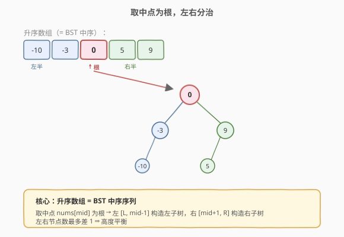
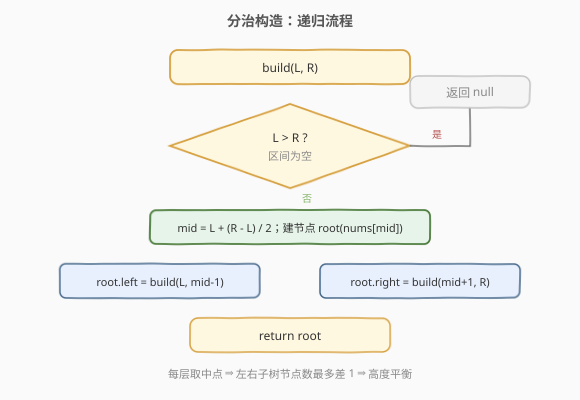
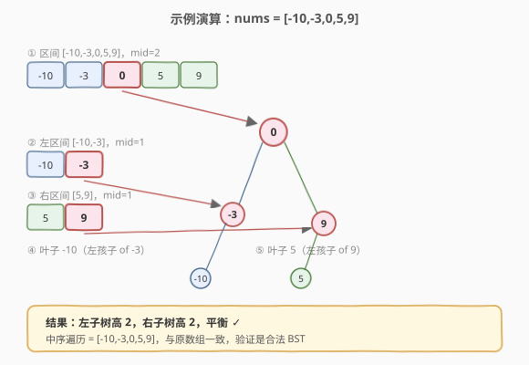

# 将有序数组转换为二叉搜索树

- **题目名称**：将有序数组转换为二叉搜索树
- **链接**：[108. 将有序数组转换为二叉搜索树](https://leetcode.cn/problems/convert-sorted-array-to-binary-search-tree/)
- **难度**：简单
- **标签**：树、BST、分治

## 1. 题目概述

给你一个**升序排列**的整数数组 `nums`，请将其转换为一棵**高度平衡**的二叉搜索树（BST）。高度平衡是指每个节点的左右两个子树的高度差不超过 1。

**示例 1**：

```text
输入：nums = [-10,-3,0,5,9]
输出：[0,-3,9,-10,null,5] 或 [0,-10,5,null,-3,null,9]
解释：两种都是合法的高度平衡 BST
```

**示例 2**：

```text
输入：nums = [1,3]
输出：[3,1] 或 [1,null,3]
```

**约束条件**：

- `1 <= nums.length <= 10^4`
- `nums` 按 **严格升序** 排列
- `-10^4 <= nums[i] <= 10^4`

---

## 2. 解题思路

### 2.1 暴力思路：逐个插入

按数组顺序逐个调用 BST 的「插入」操作。由于数组已升序，这样会得到一条向右倾斜的链表，**完全不平衡**，违背题意。即便打乱顺序插入，平衡性也难以保证。

### 2.2 核心观察：取中点为根，分治构造



关键观察来自 BST 与**中序遍历**的关系：

1. **BST 的中序遍历是升序的**，而已知数组升序，因此数组本身就是某棵 BST 的中序序列。
2. 要让树**平衡**，应当让左右子树节点数尽量相等——即取数组**中点**为根。
3. 中点左侧构造左子树，右侧构造右子树，递归进行。

> 💡 选「中间偏左」`mid = (L+R)/2` 还是「中间偏右」`mid = (L+R+1)/2` 都能构造合法平衡 BST，答案不唯一。LeetCode 接受任意一种，通常取下中点 `mid = (L+R)/2`。

### 2.3 算法流程图



### 2.4 示例演算



以 `nums = [-10,-3,0,5,9]` 为例，逐步分治：

| 步骤 | 当前区间 | 中点值 | 左子树区间 | 右子树区间 |
|------|----------|--------|------------|------------|
| 1 | [-10,-3,0,5,9] | 0 | [-10,-3] | [5,9] |
| 2 | [-10,-3] | -3 | [-10] | [] |
| 3 | [5,9] | 9 | [5] | [] |
| 4 | [-10] | -10 | [] | [] |
| 5 | [5] | 5 | [] | [] |

最终树：`0` 的左孩子 `-3`、右孩子 `9`；`-3` 的左孩子 `-10`；`9` 的左孩子 `5`。左右子树高度差为 1，满足平衡。

---

## 3. 参考代码

### C++

```cpp
class Solution {
  public:
    TreeNode* sortedArrayToBST(vector<int>& nums) {
        return build(nums, 0, (int)nums.size() - 1);
    }

  private:
    TreeNode* build(vector<int>& nums, int L, int R) {
        if (L > R) return nullptr;
        int mid = L + (R - L) / 2;          // 取下中点
        TreeNode* root = new TreeNode(nums[mid]);
        root->left  = build(nums, L, mid - 1);
        root->right = build(nums, mid + 1, R);
        return root;
    }
};
```

### Python

```python
class Solution:
    def sortedArrayToBST(self, nums: List[int]) -> Optional[TreeNode]:
        def build(L: int, R: int) -> Optional[TreeNode]:
            if L > R:
                return None
            mid = (L + R) // 2                 # 取下中点
            root = TreeNode(nums[mid])
            root.left = build(L, mid - 1)
            root.right = build(mid + 1, R)
            return root

        return build(0, len(nums) - 1)
```

> 💡 `mid = L + (R-L)/2` 而非 `(L+R)/2`，是为了避免 `L+R` 整型溢出。Python 中无此问题，但保持一致写法便于记忆。

---

## 4. 复杂度分析

| 维度 | 复杂度 | 说明 |
|------|--------|------|
| 时间复杂度 | O(n) | 每个元素作为某层根被访问一次，共 n 个节点 |
| 空间复杂度 | O(log n) | 递归栈深度等于平衡树高度 O(log n)；若链状则 O(n)，但本题构造必平衡 |

---

## 5. 扩展：有序链表转 BST（109）

[109. 有序链表转换二叉搜索树](https://leetcode.cn/problems/convert-sorted-list-to-binary-search-tree/) 把数组换成单链表，无法 O(1) 取中点。两种做法：

1. **快慢指针**找中点，分治递归。每层 O(n) 找中点，总 O(n log n)。
2. **先转数组**再按本题方法，O(n) 时间 O(n) 空间。
3. **中序模拟**：先递归左子树到最深，回溯时按链表顺序「填值」，O(n) 时间 O(log n) 空间，最优。

> ⚠️ 「中序模拟」利用了「数组即中序序列」的性质：递归构造顺序与中序遍历顺序一致，按链表顺序依次填入节点值即可，无需显式取中点。

---

## 6. 面试要点

1. **为什么取中点就能保证平衡？**
   - 每次取中点，左右子树节点数最多差 1，递归到子树仍如此。如此构造的树高度为 `⌈log₂(n+1)⌉`，每个节点左右子树高度差不超过 1，满足平衡 BST 定义。

2. **答案是否唯一？**
   - 不唯一。偶数长度区间取左中点或右中点都合法；中点位置不同，最终树形不同但都平衡。LeetCode 判题接受任意合法答案。

3. **为什么不用「逐个插入 + 旋转平衡」？**
   - 那是构造一般 AVL/红黑树的做法，复杂且无必要。本题已给升序数组，分治取中点直接得到平衡 BST，代码极简。

4. **能否改成迭代？**
   - 可以。用栈模拟递归，每个栈帧存 `(L, R, 节点, 是否已处理左)`，按层序填充。但递归写法更直观，面试默认写递归。

5. **如果数组有重复元素怎么办？**
   - BST 通常要求左子树 ≤ 根 < 右子树（或类似约定）。取中点为根、左右递归仍成立，构造出的 BST 允许重复，但中序遍历不再严格递增。本题保证严格升序，无需考虑。

---

## 7. 同类练习题

- [109. 有序链表转换二叉搜索树](https://leetcode.cn/problems/convert-sorted-list-to-binary-search-tree/)：把数组换成链表，快慢指针取中点
- [105. 从前序与中序遍历序列构造二叉树](https://leetcode.cn/problems/construct-binary-tree-from-preorder-and-inorder-traversal/)（[题解](../../week5/day5/从前序与中序遍历序列构造二叉树.md)）：分治构造树的思想相通
- [1382. 将二叉搜索树变平衡](https://leetcode.cn/problems/balance-a-binary-search-tree/)：先中序展开为有序数组，再用本题方法重建
- [94. 二叉树的中序遍历](https://leetcode.cn/problems/binary-tree-inorder-traversal/)（[题解](../../week10/day2/二叉树的中序遍历.md)）：BST 中序升序的理论基础
