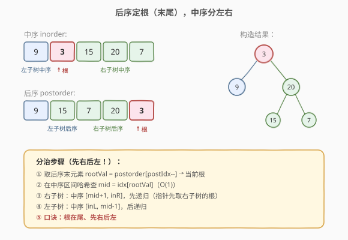
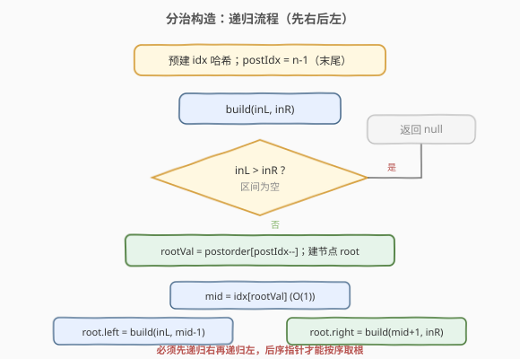
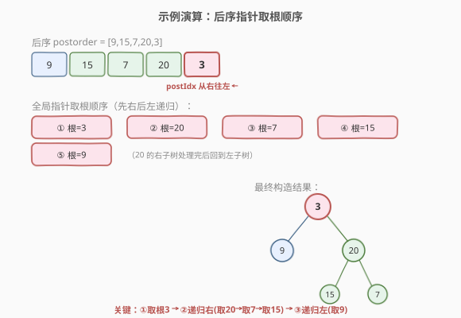

# 从中序与后序遍历序列构造二叉树

- **题目名称**：从中序与后序遍历序列构造二叉树
- **链接**：[106. 从中序与后序遍历序列构造二叉树](https://leetcode.cn/problems/construct-binary-tree-from-inorder-and-postorder-traversal/)
- **难度**：中等
- **标签**：树、二叉树、分治、哈希表

## 1. 题目概述

给定两个整数数组 `inorder` 和 `postorder`，分别表示同一棵二叉树的**中序遍历**与**后序遍历**，请构造并返回这棵二叉树。题目保证 `inorder` 与 `postorder` 元素互不相同。

**示例 1**：

```text
输入：inorder = [9,3,15,20,7], postorder = [9,15,7,20,3]
输出：[3,9,20,null,null,15,7]
```

**示例 2**：

```text
输入：inorder = [-1], postorder = [-1]
输出：[-1]
```

**约束条件**：

- `1 <= inorder.length <= 3000`
- `postorder.length == inorder.length`
- `-3000 <= inorder[i], postorder[i] <= 3000`
- `inorder` 和 `postorder` 互不相同
- 保证 `inorder` 是某棵树的中序遍历，`postorder` 是同一棵树的后序遍历

---

## 2. 解题思路

### 2.1 暴力思路：逐层扫描找根

后序最后一个元素是根，在 `inorder` 里线性扫描找根的位置需 `O(n)`，每层都找一遍，总复杂度 `O(n^2)`。可用**哈希表**把查找降到 `O(1)`。

### 2.2 核心观察：后序定根（末尾），中序分左右



两条遍历序列的合作方式：

1. **后序**的最后一个元素 `postorder[postR]` 一定是当前子树的**根**（后序顺序是「左-右-根」）。
2. 在 `inorder` 中找到这个根的位置 `idx`，则：
   - `inorder[inL .. idx-1]` 是**左子树**的中序（共 `k = idx - inL` 个元素）。
   - `inorder[idx+1 .. inR]` 是**右子树**的中序。
3. 由「左右子树节点数相同」对应回后序：
   - `postorder[postL .. postL+k-1]` 是左子树的后序。
   - `postorder[postL+k .. postR-1]` 是右子树的后序。
4. 对左右子树**递归**构造。

> 💡 用一个**全局后序指针** `postIdx` 从右往左移动（初始指向末尾），每取一个根就 `postIdx--`。关键是**先递归右子树再递归左子树**——因为后序中根的出现顺序是「整棵右子树的根 → 整棵左子树的根 → 当前根」的反向。

> 💡 记忆口诀：**前序配中序，根在首、先左后右；后序配中序，根在尾、先右后左。**

### 2.3 算法流程图



### 2.4 示例演算



以 `inorder = [9,3,15,20,7]`，`postorder = [9,15,7,20,3]` 为例：

| 步骤 | 当前根 | inorder 区间 | 划分 | post 左区间 | post 右区间 |
|------|--------|--------------|------|-------------|-------------|
| 1    | 3      | [9,3,15,20,7] | 左=[9], 右=[15,20,7] | [9] | [15,7,20] |
| 2    | 20     | [15,20,7]    | 左=[15], 右=[7] | [15] | [7] |
| 3    | 7      | [7]          | 叶子 | — | — |
| 4    | 15     | [15]         | 叶子 | — | — |
| 5    | 9      | [9]          | 叶子 | — | — |

注意：全局后序指针从右往左取根，顺序为 `3 → 20 → 7 → 15 → 9`，对应**先右后左**的递归顺序。最终树：`3` 的左孩子 `9`、右孩子 `20`；`20` 的左孩子 `15`、右孩子 `7`。

---

## 3. 参考代码

### C++

```cpp
class Solution {
  public:
    TreeNode* buildTree(vector<int>& inorder, vector<int>& postorder) {
        unordered_map<int, int> idx;
        for (int i = 0; i < (int)inorder.size(); ++i) idx[inorder[i]] = i;
        int postIdx = (int)postorder.size() - 1;   // 全局指针，从后序末尾向左移动
        return build(inorder, postorder, idx, postIdx, 0, (int)inorder.size() - 1);
    }

  private:
    TreeNode* build(vector<int>& inorder, vector<int>& postorder,
                    unordered_map<int, int>& idx, int& postIdx, int inL, int inR) {
        if (inL > inR) return nullptr;
        int rootVal = postorder[postIdx--];        // 后序末尾就是根
        TreeNode* root = new TreeNode(rootVal);
        int mid = idx[rootVal];                    // O(1) 定位中序中的根
        root->right = build(inorder, postorder, idx, postIdx, mid + 1, inR);  // 先右
        root->left  = build(inorder, postorder, idx, postIdx, inL, mid - 1);  // 再左
        return root;
    }
};
```

### Python

```python
class Solution:
    def buildTree(self, inorder: List[int], postorder: List[int]) -> Optional[TreeNode]:
        idx = {v: i for i, v in enumerate(inorder)}
        post_iter = reversed(postorder)            # 从后序末尾向左取根

        def build(inL: int, inR: int) -> Optional[TreeNode]:
            if inL > inR:
                return None
            rootVal = next(post_iter)              # 后序末尾就是根
            root = TreeNode(rootVal)
            mid = idx[rootVal]
            root.right = build(mid + 1, inR)       # 先右
            root.left  = build(inL, mid - 1)       # 再左
            return root

        return build(0, len(inorder) - 1)
```

> ⚠️ 全局后序指针必须**先递归右子树再递归左子树**。若顺序写反，指针会取错根导致整棵树构造错误。这是与「前序+中序」（先左后右）最大的区别。

---

## 4. 复杂度分析

| 维度 | 复杂度 | 说明 |
|------|--------|------|
| 时间复杂度 | O(n) | 每个节点构造一次；哈希表查根 O(1) |
| 空间复杂度 | O(n) | 哈希表 O(n)；递归栈最坏 O(n)（链状树） |

---

## 5. 扩展：与前序+中序构造（105）的对比

| 维度 | 105 前序+中序 | 106 中序+后序 |
|------|---------------|---------------|
| 根的位置 | 前序**首部** | 后序**末尾** |
| 全局指针移动方向 | 从左到右（`preIdx++`） | 从右到左（`postIdx--`） |
| 递归顺序 | **先左后右** | **先右后左** |
| 哈希表 | 存 inorder 下标 | 存 inorder 下标 |

两者本质都是「一根定根 + 中序分左右」，只是根的来源和递归方向不同。

> 💡 还有「前序+后序」构造（889），但**当某节点只有一个孩子时解不唯一**，因为无法判断该孩子是左还是右。

---

## 6. 面试要点

1. **为什么后序的最后一个元素是根？**
   - 后序遍历顺序是「左-右-根」，所以任何一段后序子序列的**末元素**就是该子树的根。这是后序配合中序重构树的根本依据。

2. **为什么递归顺序是先右后左？**
   - 全局后序指针从右往左移动。后序中根的出现顺序（反向看）是「当前根 → 右子树所有根 → 左子树所有根」。要让指针按此顺序取根，必须先递归构造右子树、再构造左子树。

3. **为什么不用传 postL/postR 区间？**
   - 与 105 类似，全局指针会自动按正确顺序取根，省去后序区间计算。只要递归顺序正确（先右后左），指针就与递归展开顺序一致。

4. **如果元素有重复怎么办？**
   - 哈希表映射失效。需改为「在后序取根后，于中序区间内线性找第一个匹配且未被占用位置」。本题保证互不相同，无需考虑。

5. **能否改成迭代法？**
   - 可以，思路与 105 的迭代版对称：按后序**逆序**（即「根-右-左」）压栈，当栈顶等于 `inorder` 当前值时弹栈并移动 `inorder` 指针，构造左子树。面试一般写递归版即可。

---

## 7. 同类练习题

- [105. 从前序与中序遍历序列构造二叉树](https://leetcode.cn/problems/construct-binary-tree-from-preorder-and-inorder-traversal/)（[题解](../../week5/day5/从前序与中序遍历序列构造二叉树.md)）：根在前序首部，先左后右
- [889. 根据前序和后序遍历构造二叉树](https://leetcode.cn/problems/construct-binary-tree-from-preorder-and-postorder-traversal/)（[题解](../day3/根据前序与后序遍历构造二叉树.md)）：无中序，解不唯一
- [1008. 前序遍历构造二叉搜索树](https://leetcode.cn/problems/construct-binary-search-tree-from-preorder-traversal/)（[题解](../day4/前序遍历构造二叉搜索树.md)）：仅前序 + BST 性质
- [297. 二叉树的序列化与反序列化](https://leetcode.cn/problems/serialize-and-deserialize-binary-tree/)（[题解](../../week6/day1/二叉树的序列化与反序列化.md)）：用遍历序列表示树
