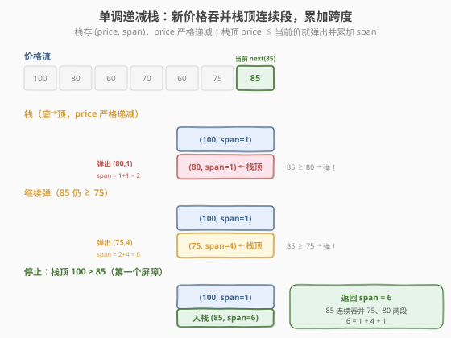
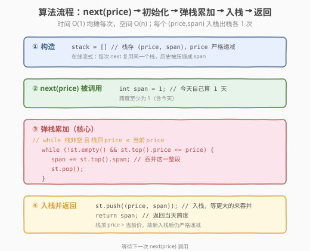
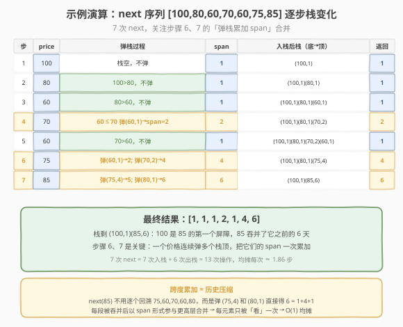

# 股票价格跨度

- **题目名称**：股票价格跨度
- **链接**：[901. 股票价格跨度](https://leetcode.cn/problems/online-stock-span/)
- **难度**：中等
- **标签**：栈、单调栈、设计

## 1. 题目概述

设计一个 `StockSpanner` 类，它收集某些股票的**每日报价**（价格），并返回该股票**当天价格的跨度**。

- 对当天的价格 `price`，跨度定义为：**从今天向前回溯**（含今天），**连续**的、价格**小于或等于** `price` 的最大天数。
- 通俗地说：往前数多少天，股价一直 ≤ 今天；遇到第一个比今天**高**的就停下。

实现 `StockSpanner.next(int price)`，返回当天的跨度。

**示例 1**：

```text
输入：
  ["StockSpanner","next","next","next","next","next","next","next"]
  [[],[100],[80],[60],[70],[60],[75],[85]]
输出：[null,1,1,1,2,1,4,6]

解释：
  next(100) → 跨度 1：今天 100，前面没数据               → [100]
  next(80)  → 跨度 1：80 ≤ 100? 不，80 < 100 但 100 > 80 停 → [80]
  next(60)  → 跨度 1：60 < 80 停                           → [60]
  next(70)  → 跨度 2：70≥60，再前 70<80 停 → 60,70 共 2 天  → [60,70]
  next(60)  → 跨度 1：60 < 70 停                            → [60]
  next(75)  → 跨度 4：75≥60,75≥70,75≥60,75<80 停 → 共 4 天  → [60,70,60,75]
  next(85)  → 跨度 6：85≥75,85≥60,85≥70,85≥60,85≥80,85<100 → 共 6 天
```

**示例 2**：

```text
输入：["StockSpanner","next","next","next","next","next"]
     [[],[31],[34],[33],[39],[35]]
输出：[null,1,2,1,4,1]
```

**约束条件**：

- `1 <= price <= 10^5`
- `StockSpanner.next` 最多被调用 `10^5` 次

> 💡 这是 **单调栈（monotonic stack）** 的招牌设计题，与 [每日温度](每日温度.md)、[下一个更大元素 I](下一个更大元素%20I.md) 是同一套模板。每日温度是「**离线**找右边第一个更大」，本题是「**在线**找左边连续 ≤ 当前的天数」。核心差异有两点：① 数据是一条流，逐个 `next` 进来；② 结算时不算「距离」而是**累加跨度**——这正是本题最精妙的优化，把回溯跳转化成 O(1) 的「弹栈合并」。

---

## 2. 解题思路

### 2.1 暴力思路：每次向前回溯

最直观的做法：把所有历史价格存进数组，每次 `next(price)` 从末尾向前扫，遇到第一个 `> price` 的就停，统计天数。

```text
prices = []
next(price):
    prices.append(price)
    span = 0
    i = len(prices) - 1
    while i >= 0 and prices[i] <= price:
        span += 1
        i -= 1
    return span
```

最坏情况（价格严格递增，如 `[1,2,3,...,n]`），第 `k` 次要回溯 `k` 步，总调用 `n` 次的代价是 $1+2+\dots+n = O(n^2)$。`n = 10^5` 时约 `10^10`，**超时**。

> ⚠️ 暴力法的问题：每次 `next` 都从头回溯，**重复扫了大量已经确认 ≤ 的历史价格**。例如 `[60,70,60,75]` 后来一个 85，它要把这 4 个全部重扫一遍；而这 4 个在 `next(75)` 时就已经被确认为「连续 ≤ 75」了。这些「已经被某次更大价格吞并的连续段」完全可以**压缩成一个聚合记录**——这正是单调栈的用武之地。

### 2.2 核心观察：单调递减栈 + 跨度合并

**关键定义**：维护一个**栈**，栈中存放 `(price, span)` 二元组，且 `price` 从栈底到栈顶**严格递减**。

**核心规则**：每次 `next(price)`：

1. 初始化 `span = 1`（今天自己算 1 天）。
2. **只要**栈顶的 `price <= 当前 price`：说明栈顶那一整段「连续 ≤ 栈顶价」的天数，必然也「连续 ≤ 当前价」（因为当前价 ≥ 栈顶价）。于是把栈顶**弹出**，把它的 `span` **累加**进当前 `span`——这一步相当于一次性「吞并」了栈顶代表的整段历史。
3. 循环弹直到栈顶 `price > 当前 price`（或栈空），保持栈**严格递减**。
4. 把 `(price, span)` **入栈**，返回 `span`。



**为什么存 `(price, span)` 而不是下标？** 每日温度存下标，是因为要算「隔几天」（下标差），而且数据一次性给齐。本题是**在线流式**数据，且要的是「连续天数」而非「到下一个更大的距离」。把每一段被吞并的历史**压缩成一个 span 数字**，下次遇到更大价格时只需 `O(1)` 把 span 加进来，就跳过了那一整段——这是把暴力的 `O(n)` 回溯压成 `O(1)` 跳转的关键。

> 💡 **跨度合并的精髓**：栈里每个元素代表「一段连续的、彼此 ≤ 的天数」。当一个更大的价格到来时，它能把所有 `price ≤ 它` 的栈顶段**合并**成一个更大的段。这就像「并查集」的合并思想——小段不断被大段吸收，每个元素被合并一次后就不再单独参与计算。因此每个 `(price, span)` 入栈 1 次、出栈 1 次，`n` 次 `next` 的总操作 `O(n)`，均摊每次 `O(1)`。

### 2.3 算法流程图



**完整步骤**：

1. **初始化**：栈 `stack = []`（空），后续每次 `next` 复用。
2. **每次** `next(price)`：
   - `span = 1`
   - `while stack 非空 且 stack.top().price <= price`：
     - `(p, s) = stack.pop()`
     - `span += s`（吞并这一段）
   - `stack.push((price, span))`
   - `return span`
3. **不变式**：栈中 `price` 始终**严格递减**（栈底最大，栈顶最小）。因为每次入栈前，所有 `price ≤ 当前价` 的栈顶都被弹掉了，留下来的栈顶 `price > 当前价`，新入栈的反而更小。

> ⚠️ 比较时用 `<=`（小于等于）而非 `<`：题意是「价格**小于或等于**今天」都算进跨度，所以遇到相等的也要吞并。若用 `<` 会留下等价段，导致后续重复计算——这是与「找严格更大」类题的细微差别。

### 2.4 示例演算

以 `next` 序列 `[100,80,60,70,60,75,85]` 为例：



| 步骤 | price | 弹栈过程 | 累加后 span | 入栈后栈（底→顶） | 返回 |
|------|-------|---------|------------|------------------|------|
| 1 | 100 | 栈空，不弹 | 1 | (100,1) | 1 |
| 2 | 80 | 栈顶 100 > 80，不弹 | 1 | (100,1)(80,1) | 1 |
| 3 | 60 | 栈顶 80 > 60，不弹 | 1 | (100,1)(80,1)(60,1) | 1 |
| 4 | 70 | 60≤70 弹(60,1)→span=2；80>70 停 | 2 | (100,1)(80,1)(70,2) | 2 |
| 5 | 60 | 栈顶 70 > 60，不弹 | 1 | (100,1)(80,1)(70,2)(60,1) | 1 |
| 6 | 75 | 60≤75 弹(60,1)→span=2；70≤75 弹(70,2)→span=4；80>75 停 | 4 | (100,1)(80,1)(75,4) | 4 |
| 7 | 85 | 75≤85 弹(75,4)→span=5；80≤85 弹(80,1)→span=6；100>85 停 | 6 | (100,1)(85,6) | 6 |

关注步骤 6 和 7：`next(75)` 一次弹掉了 `(60,1)` 和 `(70,2)`，把它们的 span 累加成 4——这正是「跨度合并」的威力。如果不合并，`next(85)` 要回溯 6 个元素；合并后只需弹 2 次（`(75,4)` 和 `(80,1)`），`6 = 1+4+1` 直接算出。

> 💡 对比暴力法：`next(85)` 暴力要从 75 往前逐个比到 80，共 6 次比较；单调栈只需弹 2 次（`(75,4)` 和 `(80,1)`），因为 `(75,4)` 已把 75、60、70、60 这 4 天压缩成一个记录。每个 `(price, span)` 入栈 1 次、出栈 1 次，7 次 `next` 共 7 次入栈 + 6 次出栈 = 13 次操作，均摊每次不到 2 步。

---

## 3. 参考代码

### C++

```cpp
// 股票价格跨度.cpp —— 单调递减栈 + 跨度合并
// 编译: g++ -O2 -std=c++17 股票价格跨度.cpp -o stockspan
#include <stack>
#include <utility>
using namespace std;

class StockSpanner {
    // 栈存 (price, span)，price 从底到顶严格递减
    stack<pair<int,int>> st;
  public:
    StockSpanner() {}

    int next(int price) {
        int span = 1;                       // 今天自己算 1 天
        // 栈顶价 <= 当前价 → 吞并这一整段
        while (!st.empty() && st.top().first <= price) {
            span += st.top().second;
            st.pop();
        }
        st.push({price, span});             // 入栈，等更大的价格来吞并
        return span;
    }
};
```

### Python

```python
class StockSpanner:
    def __init__(self):
        self.st = []          # 存 (price, span)，price 严格递减

    def next(self, price: int) -> int:
        span = 1                                # 今天自己算 1 天
        # 栈顶价 <= 当前价 → 吞并这一整段
        while self.st and self.st[-1][0] <= price:
            span += self.st.pop()[1]
        self.st.append((price, span))           # 入栈，等更大的来吞并
        return span
```

> 💡 Python 用 `list` 当栈，`st[-1]` 是栈顶 `(price, span)`，`st[-1][0]` 取价、`st[-1][1]` 取跨度。`pop()` 返回并移除栈顶，`pop()[1]` 直接拿到要累加的 span。注意 `__init__` 里要初始化空栈——这是设计题的常见考点，别忘构造函数。

---

## 4. 复杂度分析

| 维度 | 复杂度 | 说明 |
|------|--------|------|
| **时间复杂度** | `O(1)` 均摊每次 / `O(n)` 总计 | 每个 `(price, span)` 入栈 1 次、出栈 1 次，`n` 次 `next` 总操作 `≤ 2n` |
| **空间复杂度** | `O(n)` | 栈最多存 `n` 个元素（价格严格递减时，如 `[5,4,3,2,1]`，每次都不弹） |

> ⚠️ 虽然单次 `next` 内有 `while` 循环，看似最坏 `O(n)`，但**均摊分析**：所有 `next` 调用的总弹出次数 ≤ 总入栈次数 ≤ `n`。把 `n` 次弹栈平摊到 `n` 次调用上，每次均摊 `O(1)`。这与 [每日温度](每日温度.md) 的「每元素均摊 O(1)」完全同理，是单调栈的标志性复杂度。

---

## 5. 扩展：跨度合并思想与变体对比

### 5.1 为什么「累加 span」能把暴力降阶？

暴力回溯慢在：每次 `next` 都从尾巴逐个比较，那些「已经被前一次更大价格吞并」的元素会被**反复扫描**。

单调栈的解法把「一段连续 ≤ 某价的天数」压缩成一个 `span` 数字。当更大的价格到来时，它直接把若干个 `span` 加起来，**跳过**了这些段内部的逐元素比较。本质上，每个原始天数只在其入栈时被「看」一次，之后永远以 `span` 的形式参与更高层合并——这就是「均摊 O(1)」的来源。

### 5.2 与每日温度、下一个更大元素的对比

| 维度 | 每日温度 (739) | 下一个更大元素 I (496) | 股票价格跨度 (901) |
|------|---------------|----------------------|-------------------|
| 数据形态 | 离线（一次给齐） | 离线（两个数组） | 在线（流式 `next`） |
| 栈存内容 | 下标 | 值 / 下标 | `(price, span)` 二元组 |
| 结算方式 | 算距离 `i - top` | 记录下一个更大值 | **累加 span** |
| 栈单调性 | 递减（找更大） | 递减（找更大） | **严格**递减（≤ 也弹） |
| 复杂度 | `O(n)` | `O(n+m)` | `O(1)` 均摊 / `O(n)` 总 |

> 💡 三题骨架相同——都是「遍历 + while 弹栈 + 入栈」。差异在：739/496 是「**一个元素等一个更大值来结算**」，901 是「**一个价格来吞并若干连续段**」。901 的 `(price, span)` 二元组是「压缩历史」的技巧，本质上是把单调栈从「记录元素」升级为「记录聚合段」。

### 5.3 如果用 DP？

可以反向思考：`span[i]` 表示第 `i` 天的跨度。若 `price[i-k] > price[i]`，则 `span[i] = k`；否则 `span[i] = k + span[i-k]`，跳到 `i-k-span[i-k]+1` 继续比。这其实就是「单调栈」的数组版——用 `span` 当跳转指针。但需要存全部历史，且代码不如栈直观，在线场景下栈更自然。单调栈是该问题的标准最优解。

---

## 6. 面试要点

1. **为什么用单调栈而不是每次回溯？**

   - 暴力每次 `next` 都从头回溯，价格递增时退化到 `O(n)` 单次、`O(n²)` 总计。
   - 单调栈把「已被更大价格吞并的连续段」压缩成一个 `span`，下次遇到更大价格时 `O(1)` 合并，跳过逐元素比较。
   - 每个元素入栈 1 次、出栈 1 次，`n` 次调用总 `O(n)`，均摊 `O(1)`。这是「空间换时间 + 聚合压缩」的经典范式。

2. **栈里存什么？为什么是 `(price, span)` 而不是下标？**

   - 存 `(price, span)` 二元组。`price` 用来判断能否被当前价吞并，`span` 是这段历史的天数，累加进当前跨度。
   - 不存下标，因为本题要的是「连续天数」而非「到下一个更大的距离」，下标差无意义；且数据是流式的，没有固定数组下标。
   - 通用原则：**需要算距离/位置时存下标**（如每日温度），**需要聚合连续段时存 `(值, 计数)`**（如本题）。

3. **为什么是严格递减栈？比较用 `<=` 还是 `<`？**

   - 栈中 `price` 严格递减：每次入栈前弹掉所有 `price ≤ 当前价` 的栈顶，留下的栈顶 `price > 当前价`，新入栈的更小，故严格递减。
   - 比较用 `<=`（小于等于）：题意是「价格**小于或等于**今天」都算进跨度，所以遇到相等的也要吞并，否则会留下等价段导致重复计算。
   - 口诀：**找更大用递减栈，连续 ≤ 用严格递减**（≤ 也弹）。

4. **单次 `next` 最坏 `O(n)`，为什么说均摊 `O(1)`？**

   - 最坏单次确实 `O(n)`（如 `[1,2,3,...,n]` 中最后一次 `next(n)` 会弹掉前面所有元素）。
   - 但**均摊分析**：所有 `next` 的总入栈 = `n`，总出栈 ≤ `n`，平摊到 `n` 次调用上每次 `≤ 2` 次操作。
   - 关键：一个元素一旦被弹出就**永不再入栈**，所以「弹」的总次数有上界 `n`。这是「账本分析法」的典型例子——贵的操作（连弹多个）由之前多次便宜的入栈「预付」了。

5. **跨度的正确性如何保证？弹栈累加会不会漏算或多算？**

   - **不漏**：栈顶段的 `price ≤ 当前价`，意味着这一整段（`span` 天）的价格都 `≤ 当前价`，且它们在原序列中**紧挨在当前天之前**（否则中间会被更大的价格隔断留在栈里），所以全算进当前跨度。
   - **不多**：一旦遇到栈顶 `price > 当前价`，由于栈严格递减，再往下的 `price` 更大，必然也 `> 当前价`，所以停止是正确的——第一个比今天高的「屏障」就是栈顶。
   - 这两个不变式（栈顶即第一个屏障、被弹段紧邻当前天）是正确性的核心，面试时能讲清楚就过关。

> 💡 **一句话总结**：股票价格跨度是单调栈的在线设计题——它用「`(price, span)` 二元组 + 严格递减栈 + 弹栈累加跨度」三件套，把流式数据的「向前数连续 ≤ 的天数」从 `O(n²)` 降到 `O(n)` 总、`O(1)` 均摊。核心技巧是**把历史压缩成 span 再合并**，与每日温度的「存下标算距离」互补。这个「聚合段 + 弹栈合并」骨架可迁移到所有「连续 ≤ / ≥ 计数」类在线问题，是面试必会的单调栈进阶模板。

---

## 7. 同类练习题
- [739. 每日温度](https://leetcode.cn/problems/daily-temperatures/)：单调栈离线版，存下标算距离
- [496. 下一个更大元素 I](https://leetcode.cn/problems/next-greater-element-i/)：单调栈 + 哈希查表
- [503. 下一个更大元素 II](https://leetcode.cn/problems/next-greater-element-ii/)：环形数组单调栈
- [84. 柱状图中最大的矩形](https://leetcode.cn/problems/largest-rectangle-in-histogram/)：单调栈两侧扫描算面积
