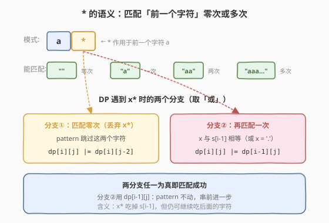
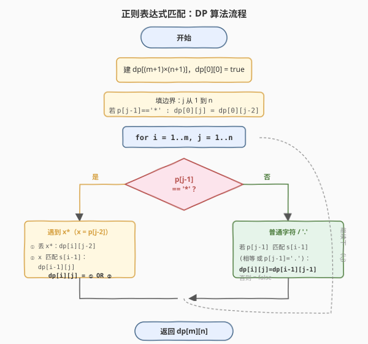
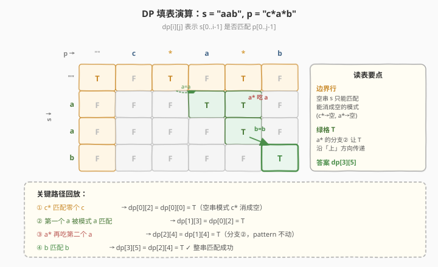

# LeetCode 正则表达式匹配 题解

## 1. 题目概述

- **标题 / 题号**：正则表达式匹配（#10，hard）
- **链接**：https://leetcode.cn/problems/regular-expression-matching/
- **难度**：困难
- **标签**：动态规划、字符串、递归

**题意**：给你一个字符串 `s` 和一个字符模式 `p`，请你来实现一个支持 `.` 和 `*` 的正则表达式匹配。

- `.` 匹配任意单个字符
- `*` 匹配**零个或多个**前面的那一个字符

所谓匹配，是要涵盖**整个**字符串 `s`（而不是部分）。

**示例 1**：

```text
输入：s = "aa", p = "a"
输出：false
解释："a" 无法匹配整个字符串 "aa"。
```

**示例 2**：

```text
输入：s = "aa", p = "a*"
输出：true
解释：'*' 表示它前面的 'a' 可以重复零次或多次，于是 "a*" 可匹配 "aa"。
```

**示例 3**：

```text
输入：s = "ab", p = ".*"
输出：true
解释：".*" 表示任意字符（'.'）重复任意次，能匹配 "ab"。
```

**示例 4**：

```text
输入：s = "aab", p = "c*a*b"
输出：true
解释：c* 匹配零个 c，a* 匹配两个 a，b 匹配 b，于是整体匹配 "aab"。
```

**示例 5**：

```text
输入：s = "mississippi", p = "mis*is*p*."
输出：false
```

**约束**：

- `1 <= s.length <= 20`
- `1 <= p.length <= 20`
- `s` 只包含小写字母。
- `p` 只包含小写字母、`.` 和 `*`。
- 保证每次出现字符 `*` 时，前面都有一个有效字符可匹配。

> ⚠️ **关键提醒**：`*` 不是「匹配任意字符」，而是修饰**它前面的那一个字符**，让其可出现零次或多次。这是本题最易踩的坑——它和通配符里的 `*`（[44. 通配符匹配](https://leetcode.cn/problems/wildcard-matching/)）语义完全不同。

## 2. 解题思路

### 2.1 暴力思路（递归枚举）

从左到右尝试匹配：看 `s[0]` 与 `p[0]` 是否相等（或 `p[0]=='.'`）。难点在 `*`——它可能让前面的字符重复 0 次、1 次、2 次……每种选择都要试。朴素递归会反复求解相同子问题，最坏指数级 `O(2^(m+n))`，超时。

### 2.2 核心观察：`*` 的两个分支



`*` 总是和它**前一个字符** `x` 绑定成 `x*` 这个整体。面对 `x*`，只有两种选择：

| 分支 | 含义 | DP 来源 |
|------|------|---------|
| **① 匹配零次** | 直接丢弃 `x*`，模式向后跳两格 | `dp[i][j-2]` |
| **② 再匹配一次** | `x` 能匹配 `s[i-1]`，则串向后走一格、模式不动（`x*` 还能继续吃） | `dp[i-1][j]` |

两分支取「或」——任一成功即匹配。**分支②是精髓**：它用 `dp[i-1][j]`（模式下标 `j` 不变），表达「`x*` 已经吃掉了 `s[i-1]`，但还能继续吃后面的字符」。

> 💡 **为什么不是 `dp[i-1][j-2]`？** 因为吃掉一个 `s[i-1]` 后，`x*` 并没有耗尽——它还能再吃零个或多个。所以模式指针停在 `j`（仍指向 `*`），而不是跳过 `x*`。这正是 `*`「零次或多次」语义在 DP 里的精确表达。

### 2.3 状态定义与转移

定义 `dp[i][j]` 表示 `s[0..i-1]` 是否匹配 `p[0..j-1]`。

**边界**：

```text
dp[0][0] = true                       # 空串匹配空模式
dp[0][j] = dp[0][j-2]  (当 p[j-1]=='*')  # 空串 vs 形如 a*b*c* 的模式
```

> 空串 `s` 只能被「能消成空」的模式匹配——即若干个 `x*` 串起来，每个 `x*` 都选「匹配零次」。

**转移**（`i >= 1, j >= 1`）：

```text
若 p[j-1] == '*':       # x = p[j-2]
    dp[i][j] = dp[i][j-2]                                  # ① 丢弃 x*
             OR ((p[j-2]=='.' 或 p[j-2]==s[i-1]) AND dp[i-1][j])  # ② 再吃一个

否则（普通字符或 '.'）:
    dp[i][j] = (p[j-1]=='.' 或 p[j-1]==s[i-1]) AND dp[i-1][j-1]
```

**答案**：`dp[m][n]`。

### 2.4 算法流程图



### 2.5 示例演算

`s = "aab"`, `p = "c*a*b"`（`m=3, n=5`，模式字符依次为 `c * a * b`）：



逐格解读关键路径：

1. **`dp[0][2] = T`**：`c*` 选「匹配零个 c」→ `dp[0][0] = T`。空串被 `c*` 消成空。
2. **`dp[1][3] = T`**：`p[2]='a'` 与 `s[0]='a'` 相等 → `dp[0][2] = T`（对角线转移）。
3. **`dp[1][4] = T`**：`a*` 分支②，`a` 匹配 `s[0]='a'` → `dp[0][4] = T`（向上转移）。
4. **`dp[2][4] = T`**：`a*` 分支②再吃 `s[1]='a'` → `dp[1][4] = T`。
5. **`dp[3][5] = T`**：`p[4]='b'` 与 `s[2]='b'` 相等 → `dp[2][4] = T` ✓

最终 `dp[3][5] = true`，整串匹配成功。

> 💡 注意 `a*` 这两列（`j=3,4`）的 `T` 是**沿「上」方向**逐行传递的——这正是分支② `dp[i-1][j]` 的作用：`a*` 把每个 `a` 都吃掉，`T` 一路下传。

## 3. 参考代码

### C++

```cpp
class Solution {
  public:
    bool isMatch(string s, string p) {
        int m = s.size(), n = p.size();
        vector<vector<bool>> dp(m + 1, vector<bool>(n + 1, false));
        dp[0][0] = true;

        // 边界：空串 s 只能匹配「能消成空」的模式（x* 选零次）
        for (int j = 2; j <= n; j++)
            if (p[j - 1] == '*')
                dp[0][j] = dp[0][j - 2];

        for (int i = 1; i <= m; i++) {
            for (int j = 1; j <= n; j++) {
                if (p[j - 1] == '*') {
                    // ① 丢弃 x*（匹配零次）
                    dp[i][j] = dp[i][j - 2];
                    // ② x 再匹配一次 s[i-1]
                    char x = p[j - 2];
                    if (x == '.' || x == s[i - 1])
                        dp[i][j] = dp[i][j] || dp[i - 1][j];
                } else {
                    char c = p[j - 1];
                    if (c == '.' || c == s[i - 1])
                        dp[i][j] = dp[i - 1][j - 1];
                }
            }
        }
        return dp[m][n];
    }
};
```

### Python

```python
class Solution:
    def isMatch(self, s: str, p: str) -> bool:
        m, n = len(s), len(p)
        dp = [[False] * (n + 1) for _ in range(m + 1)]
        dp[0][0] = True

        # 边界：x* 可匹配空串
        for j in range(2, n + 1):
            if p[j - 1] == '*':
                dp[0][j] = dp[0][j - 2]

        for i in range(1, m + 1):
            for j in range(1, n + 1):
                if p[j - 1] == '*':
                    dp[i][j] = dp[i][j - 2]              # ① 丢弃 x*
                    x = p[j - 2]
                    if x == '.' or x == s[i - 1]:        # ② 再匹配一次
                        dp[i][j] |= dp[i - 1][j]
                else:
                    c = p[j - 1]
                    if c == '.' or c == s[i - 1]:
                        dp[i][j] = dp[i - 1][j - 1]
        return dp[m][n]
```

## 4. 复杂度分析

| 维度 | 复杂度 | 说明 |
|------|--------|------|
| 时间复杂度 | `O(m × n)` | 填 `(m+1)×(n+1)` 表，每格 `O(1)` 转移 |
| 空间复杂度 | `O(m × n)` | 二维 dp 表 |

> ⚠️ 本题数据规模很小（`m, n ≤ 20`），但 `O(m×n)` DP 是通用解法，能扩展到 `m, n` 更大的场景（如 [44. 通配符匹配](https://leetcode.cn/problems/wildcard-matching/) 的 `n ≤ 2000`）。空间可用滚动数组压到 `O(n)`，但本题规模无需。

## 5. 扩展：自顶向下记忆化递归

DP 也可写成自顶向下的递归 + 记忆化，思路更贴近「分情况枚举」的直觉：

```cpp
class Solution {
  public:
    vector<vector<int>> memo;
    string s, p;

    bool isMatch(string s, string p) {
        this->s = s;
        this->p = p;
        memo.assign(s.size() + 1, vector<int>(p.size() + 1, -1));
        return dfs(0, 0);
    }

    bool dfs(int i, int j) {
        if (memo[i][j] != -1) return memo[i][j];
        bool res;
        if (j == p.size()) {
            res = (i == s.size());   // 模式用完，串也必须用完
        } else {
            bool first = (i < s.size()) && (p[j] == s[i] || p[j] == '.');
            if (j + 1 < p.size() && p[j + 1] == '*') {
                // x*：匹配零次 dfs(i, j+2)，或匹配一次 first && dfs(i+1, j)
                res = dfs(i, j + 2) || (first && dfs(i + 1, j));
            } else {
                res = first && dfs(i + 1, j + 1);
            }
        }
        return memo[i][j] = res;
    }
};
```

两种写法等价，复杂度同为 `O(m×n)`。面试中自底向上 DP 更不容易漏边界；自顶向下更易讲解思路。建议两种都能默写。

## 6. 面试要点

1. **`*` 的语义是什么？和通配符的 `*` 有何区别？**

   - 正则里 `*` 修饰**前一个字符**，表示该字符出现零次或多次（如 `a*` 匹配 `""`、`"a"`、`"aa"`…）
   - 通配符（[44 题](https://leetcode.cn/problems/wildcard-matching/)）里的 `*` 单独使用，匹配**任意长度任意字符**的串
   - 二者 DP 转移因此不同：正则的 `*` 依赖前一个字符 `p[j-2]`，通配符的 `*` 不依赖

2. **遇到 `*` 时两个分支分别对应什么？为什么取「或」？**

   - 分支① `dp[i][j-2]`：`x*` 匹配零次，直接丢弃，模式跳两格
   - 分支② `dp[i-1][j]`：`x` 匹配掉 `s[i-1]`，串前进一格、模式不动（`x*` 还能继续吃）
   - 取「或」：两种选择只要有一种能让剩余部分匹配即可

3. **为什么分支② 用的是 `dp[i-1][j]` 而不是 `dp[i-1][j-2]`？**

   - 吃掉一个 `s[i-1]` 后，`x*` 仍未耗尽——它还能再吃零个或多个
   - 所以模式指针停在 `j`（仍指向 `*`），让后续状态继续决定 `x*` 吃几个
   - 若用 `dp[i-1][j-2]` 则相当于「`x*` 只能恰好吃一个」，丢失了「吃多个」的能力

4. **边界 `dp[0][j]` 为什么要单独处理？**

   - 空串 `s` 非空模式时仍可能匹配——当模式形如 `a*b*c*`，每个 `x*` 都选零次即可消成空
   - 所以 `dp[0][j]` 在 `p[j-1]=='*'` 时取 `dp[0][j-2]`，把 `x*` 丢掉
   - 漏掉这步会导致 `s=""`、`p="a*"` 这类用例判错

5. **能不能用贪心或双指针？为什么必须 DP？**

   - `*` 的匹配次数有「后效性」：吃几个 `a` 取决于后面模式还要不要 `a`，局部贪心无法决策
   - 例如 `s="aaa"`, `p="a*a"`：`a*` 该吃两个 `a` 留一个给末尾的 `a`，贪心吃满三个就会错
   - DP 用 `dp[i-1][j]` 把「还能继续吃」的延迟决策编码进状态，自然消解后效性

## 同类练习题

| # | 题目 | 与本题的关联 |
|---|------|-------------|
| 44 | [通配符匹配](https://leetcode.cn/problems/wildcard-matching/) | `*` 匹配任意串、`?` 匹配单字符，DP 转移更简洁（`*` 不依赖前一字符） |
| 1143 | [最长公共子序列](https://leetcode.cn/problems/longest-common-subsequence/)（[题解](../1101-1200/1143_最长公共子序列.md)） | 二维 DP 母题，字符相等/不等两分支 |
| 72 | [编辑距离](https://leetcode.cn/problems/edit-distance/)（[题解](72_编辑距离.md)） | 二维 DP，三种操作转移取 min |
| 97 | [交错字符串](https://leetcode.cn/problems/interleaving-string/) | 二维 DP 判定两字符串能否交错拼成第三串 |
