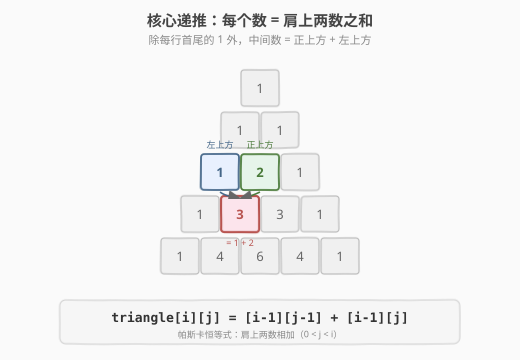
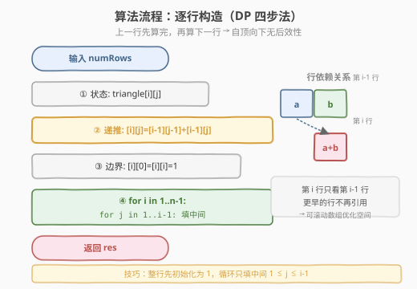
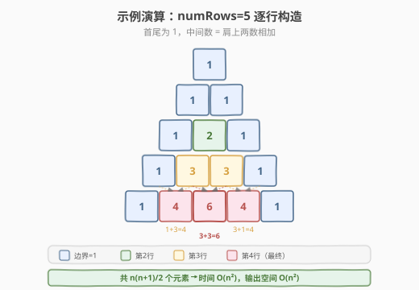

# 杨辉三角

- **题目名称**：杨辉三角
- **链接**：[118. 杨辉三角](https://leetcode.cn/problems/pascals-triangle/)
- **难度**：简单
- **标签**：数组、动态规划

## 1. 题目概述

给定一个非负整数 `numRows`，生成「杨辉三角」的前 `numRows` 行。

在「杨辉三角」中，每个数是它**左上方**和**右上方**两个数的和。每行的首尾两个数固定为 `1`。

**示例 1**：

```text
输入：numRows = 5
输出：[[1],[1,1],[1,2,1],[1,3,3,1],[1,4,6,4,1]]
```

直观来看就是下面这个三角形：

```text
        1
       1 1
      1 2 1
     1 3 3 1
    1 4 6 4 1
```

**示例 2**：

```text
输入：numRows = 1
输出：[[1]]
```

**约束条件**：

- `1 <= numRows <= 30`

> 💡 这是**二维递推**的入门模板题。它的递推关系 `triangle[i][j] = triangle[i-1][j-1] + triangle[i-1][j]` 是理解"逐行构造、肩上两数相加"的最佳起点。掌握它，你就拿到了所有二维表格递推题（不同路径、最小路径和）的通用钥匙。它和 [70. 爬楼梯](70_爬楼梯.md) 的关系是：爬楼梯是一维递推 `f(i)=f(i-1)+f(i-2)`，杨辉三角是二维递推，骨架完全相同。

---

## 2. 解题思路

### 2.1 暴力思路：组合数公式

杨辉三角第 `i` 行（从 0 开始编号）的第 `j` 个元素恰好是组合数 $C_i^j$，即：

$$C_i^j = \frac{i!}{j! \cdot (i-j)!}$$

最直接的暴力做法是：对每个位置 $(i, j)$ 直接套公式算阶乘再做除法。

> ⚠️ 这种做法的问题有三：
> 1. **重复计算**：每个位置都要重算一遍阶乘，前面算过的中间结果完全不复用；
> 2. **溢出风险**：`numRows=30` 时 `30!` 约为 $2.65 \times 10^{32}$，远超 `long long` 上限（约 $9.2 \times 10^{18}$），必须边乘边除或引入大数；
> 3. **除法不直观**：面试里手写阶乘除法容易出错，且掩盖了"肩上两数相加"这一最本质的结构。

这正是递推（动态规划）出场的时候——杨辉三角本身就是递推定义的。

### 2.2 核心观察：肩上两数相加

**关键定义**：设 `triangle[i][j]` 表示第 `i` 行第 `j` 个元素（`i`、`j` 均从 0 开始）。

**核心思考**：除每行首尾两个 `1` 之外，中间的每个数都等于它**正上方**和**左上方**两个数之和——也就是"肩上两数相加"。

- 边界：`triangle[i][0] = triangle[i][i] = 1`（行首行尾恒为 1）
- 递推：`triangle[i][j] = triangle[i-1][j-1] + triangle[i-1][j]`（`0 < j < i`）



> 💡 **为什么是加法？** 因为从上一行走到当前位置，只有"从左上方下来"和"从正上方下来"两条路径，这两类方案互斥，总数 = 两类之和（加法原理）。这与 [70. 爬楼梯](70_爬楼梯.md) 中"`f(i) = f(i-1) + f(i-2)`"的加法原理同源，只是从"一维前后依赖"扩展到了"二维肩上依赖"。

### 2.3 算法流程图

有了递推关系，剩下的就是"初始化边界 + 逐行自顶向下计算"：



**四步法**（所有 DP 题通用）：

1. **状态定义**：`triangle[i][j]` = 第 `i` 行第 `j` 个元素
2. **转移方程**：`triangle[i][j] = triangle[i-1][j-1] + triangle[i-1][j]`
3. **初始条件**：每行首尾为 1，即 `triangle[i][0] = triangle[i][i] = 1`；`triangle[0][0] = 1`
4. **计算顺序**：从 `i=1` 到 `i=numRows-1`，**自顶向下逐行**，行内从左到右

> 💡 注意**计算顺序**必须是"上一行先算完，再算下一行"——因为第 `i` 行完全依赖第 `i-1` 行的值。这正是二维 DP 的无后效性：当前行只看上一行，更早的行不再被引用，所以可以用滚动数组优化空间（见第 5 节）。

### 2.4 示例演算

以 `numRows=5` 为例，看三角形如何逐行被构造出来：



| 行号 i | 该行元素 | 中间元素如何得来 |
|--------|---------|-----------------|
| 0 | `[1]` | 边界，恒为 1 |
| 1 | `[1, 1]` | 首尾为 1，无中间元素 |
| 2 | `[1, 2, 1]` | `2 = 1 + 1`（第 1 行的两个 1） |
| 3 | `[1, 3, 3, 1]` | `3 = 1 + 2`、`3 = 2 + 1` |
| 4 | `[1, 4, 6, 4, 1]` | `4 = 1 + 3`、`6 = 3 + 3`、`4 = 3 + 1` |

最终输出 `[[1],[1,1],[1,2,1],[1,3,3,1],[1,4,6,4,1]]`。

> 💡 观察对称性：每行左右对称（`C_i^j = C_i^{i-j}`）。这是因为递推时左右两侧的"肩"对称分布。利用这一点可以把计算量减半，但 `numRows ≤ 30` 时无必要。

---

## 3. 参考代码

### C++

```cpp
// 杨辉三角.cpp —— 二维递推
// 编译: g++ -O2 -std=c++17 杨辉三角.cpp -o pascal
#include <vector>
using namespace std;

class Solution {
  public:
    vector<vector<int>> generate(int numRows) {
        vector<vector<int>> res(numRows);
        for (int i = 0; i < numRows; ++i) {
            res[i] = vector<int>(i + 1, 1); // 整行初始化为 1，首尾自动满足边界
            for (int j = 1; j < i; ++j) {   // 只需填中间 0 < j < i
                res[i][j] = res[i - 1][j - 1] + res[i - 1][j];
            }
        }
        return res;
    }
};
```

### Python

```python
class Solution:
    def generate(self, numRows: int) -> List[List[int]]:
        res = []
        for i in range(numRows):
            row = [1] * (i + 1)              # 整行先填 1
            for j in range(1, i):            # 只填中间
                row[j] = res[i - 1][j - 1] + res[i - 1][j]
            res.append(row)
        return res
```

> 💡 两种语言都用同一个技巧：**先把整行初始化为 1**，这样首尾两个边界元素自动满足条件，循环只需处理 `1 <= j <= i-1` 的中间部分，代码更简洁、不易越界。

---

## 4. 复杂度分析

| 维度 | 复杂度 | 说明 |
|------|--------|------|
| **时间复杂度** | `O(n²)` | 三角形共有 $\frac{n(n+1)}{2}$ 个元素，每个元素 `O(1)` 计算或直接为边界 |
| **空间复杂度（含输出）** | `O(n²)` | 输出本身占据 $\frac{n(n+1)}{2}$ 个整数 |
| **空间复杂度（不含输出）** | `O(1)` | 仅用循环变量，原地构造结果 |

> ⚠️ 注意：本题**必须返回完整三角形**，所以 `O(n²)` 的输出空间是题目硬性要求，无法压缩。只有当题目改为"只返回第 `k` 行"（如 [119. 杨辉三角 II](https://leetcode.cn/problems/pascals-triangle-ii/)）时，滚动数组优化才有意义。

---

## 5. 扩展：空间优化与组合数递推

### 5.1 滚动数组：只用上一行

由于第 `i` 行**只依赖第 `i-1` 行**，更早的行不再被引用。可以只保留"上一行"，把额外空间从 `O(n²)` 降到 `O(n)`：

```cpp
// 只保留上一行（用于只需返回最后一行的场景）
int getRowValue(int rowIndex) {
    vector<int> prev{1};
    for (int i = 1; i <= rowIndex; ++i) {
        vector<int> cur(i + 1, 1);
        for (int j = 1; j < i; ++j)
            cur[j] = prev[j - 1] + prev[j];
        prev = move(cur);
    }
    return prev.back(); // 或返回 prev 整行
}
```

### 5.2 组合数递推：`O(n)` 空间 + `O(n)` 时间算单行

第 `i` 行的组合数满足递推：

$$C_i^j = C_i^{j-1} \times \frac{i - j + 1}{j}$$

即"前一个组合数"乘以一个分数得到"后一个组合数"，**从左到右递推一行只需 `O(n)`**，无需保留上一行。这是 [119. 杨辉三角 II](https://leetcode.cn/problems/pascals-triangle-ii/) 的最优解法。

> ⚠️ 这里的除法 `/ j` 在数学上是整除（结果必为整数），但 C++ 中直接写整数除法要保证顺序正确：必须**先乘后除**，且中间结果不会因截断出错。安全写法是用 `long long` 暂存乘积。

### 5.3 相关变体题

| 题目 | 要求 | 与本题关系 |
|------|------|-----------|
| [119. 杨辉三角 II](https://leetcode.cn/problems/pascals-triangle-ii/) | 只返回第 `k` 行 | 用 5.2 的组合数递推做到 `O(k)` 空间 |
| [62. 不同路径](https://leetcode.cn/problems/unique-paths/) | 网格左上到右下的路径数 | 把"肩上两数相加"换成"上方+左方"，二维递推骨架相同 |
| [64. 最小路径和](https://leetcode.cn/problems/minimum-path-sum/) | 网格最小路径和 | 把"加法"换成"`min` + 当前格" |

> 💡 这些题的骨架**完全相同**——都是二维表格里每个格子依赖上方/左方格子，只是转移方程的运算和边界不同。掌握杨辉三角的"逐行构造 + 肩上相加"，不同路径、最小路径和都能秒杀。

---

## 6. 面试要点

1. **为什么这题是 DP / 递推而不是组合数公式？**

   - DP 的适用条件是**重叠子问题** + **最优子结构**（计数场景下即"可递推"）。本题每个 `triangle[i][j]` 由上一行两个值唯一确定，而上一行在计算更下方行时会被反复复用——典型的重叠子问题。
   - 组合数公式虽然能算，但每算一个位置都重算阶乘、不复用、还易溢出，掩盖了递推结构。面试中递推写法更清晰、更安全。

2. **边界 `triangle[i][0] = triangle[i][i] = 1` 怎么处理最简洁？**

   - 代码里**先把整行初始化为 1**（`vector<int>(i+1, 1)` / `[1] * (i+1)`），首尾两个边界元素就自动满足条件，内层循环只跑 `1 <= j <= i-1` 的中间部分。这样既不会越界，也不用单独 `if` 判断首尾。

3. **计算顺序为什么必须自顶向下、逐行进行？**

   - 第 `i` 行**完全依赖第 `i-1` 行**的值。若第 `i-1` 行还没算完就去算第 `i` 行，会用到未初始化的值。二维 DP 的无后效性要求"被依赖的状态先于依赖它的状态计算"，这里即"上一行先于下一行"。

4. **为什么输出空间不能优化到 `O(n)`？**

   - 本题要求返回**整个三角形**（`numRows` 行全部），输出本身就占 `O(n²)` 空间，这是题目硬性要求，无法压缩。只有改成"只返回某一行"（如 119 题）时，滚动数组 / 组合数递推才有意义。

5. **杨辉三角和组合数 $C_i^j$ 的关系是什么？**

   - 第 `i` 行第 `j` 个元素（从 0 开始）恰好等于 $C_i^j$（从 `i` 个里选 `j` 个的组合数）。这是递推公式 `C_i^j = C_{i-1}^{j-1} + C_{i-1}^j` 的组合恒等式（帕斯卡恒等式）的直接体现——选第 `j` 个元素要么包含某个固定元素（$C_{i-1}^{j-1}$），要么不包含（$C_{i-1}^j$）。

> 💡 **一句话总结**：杨辉三角是二维递推的"Hello World"——`triangle[i][j] = triangle[i-1][j-1] + triangle[i-1][j]` 把"肩上两数相加"这一最本质的递推结构展现得最清晰。掌握"整行初始化为 1 + 逐行构造"的写法后，不同路径、最小路径和、杨辉三角 II 等同构题都能秒杀。

---

## 7. 同类练习题

- [119. 杨辉三角 II](https://leetcode.cn/problems/pascals-triangle-ii/)：只返回第 `k` 行，用组合数递推做到 `O(k)` 空间
- [62. 不同路径](https://leetcode.cn/problems/unique-paths/)：网格路径计数，"上方+左方"二维递推，骨架与本题相同
- [70. 爬楼梯](https://leetcode.cn/problems/climbing-stairs/)（[题解](70_爬楼梯.md)）：一维递推 `f(i)=f(i-1)+f(i-2)`，杨辉三角是其二维版本
- [509. 斐波那契数](https://leetcode.cn/problems/fibonacci-number/)：一维递推入门，与爬楼梯同源
