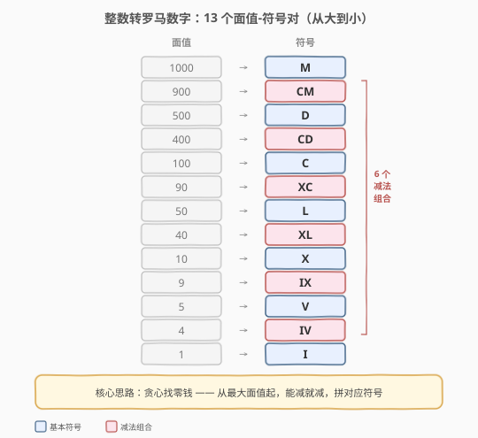
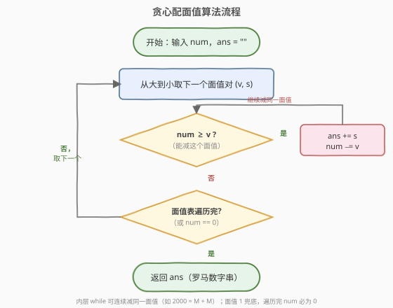
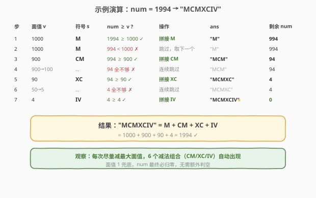

# 整数转罗马数字

- **题目名称**：整数转罗马数字
- **链接**：[12. 整数转罗马数字](https://leetcode.cn/problems/integer-to-roman/)
- **难度**：中等
- **标签**：哈希表、字符串、贪心、数学

## 1. 题目概述

罗马数字由七个不同的符号表示：`I`、`V`、`X`、`L`、`C`、`D`、`M`，分别对应 $1, 5, 10, 50, 100, 500, 1000$。

通常情况下，大的数字在小的数字左边表示相加；但存在**六种减法组合**——小的数字在大的数字左边时表示相减（如 `IV` = 4、`IX` = 9、`CM` = 900）。给定一个整数 `num`（范围 1 ~ 3999），将其转换为罗马数字字符串。

**示例 1**：

```text
输入：num = 3
输出："III"
解释：3 = 1 + 1 + 1 = I + I + I
```

**示例 2**：

```text
输入：num = 58
输出："LVIII"
解释：58 = 50 + 5 + 3 = L + V + I + I + I
```

**示例 3**：

```text
输入：num = 1994
输出："MCMXCIV"
解释：1994 = 1000 + 900 + 90 + 4 = M + CM + XC + IV
```

**约束条件**：

- `1 <= num <= 3999`

---

## 2. 解题思路

### 2.1 暴力思路：逐位拆分 + 特判 4/9

把 `num` 按千/百/十/个位拆开，对每一位独立转换：千位直接拼 `M` 的重复；百位、十位、个位则需分别处理 $1\sim3$（重复小符号）、$4$（减法组合）、$5$（大符号）、$6\sim8$（大符号 + 小符号重复）、$9$（减法组合）五种情况。这种写法分支多、易写错，且 4 和 9 必须特判，逻辑繁琐。

### 2.2 核心观察：贪心配面值（找零钱）



关键是把**六个减法组合也当作「面值」**，与七个基本符号合并，得到 **13 个「面值-符号」对**，并**从大到小排列**：

$$1000, 900, 500, 400, 100, 90, 50, 40, 10, 9, 5, 4, 1$$

于是问题立刻化归为经典的**找零钱问题**：手里有 13 种面值的硬币，每次**尽可能多地用掉最大面值**，把剩余数值不断减小，直到为 0。每次能减就拼接对应符号，减不动就换下一个更小的面值。

> 💡 **关键直觉**：把 `IV`/`IX`/`XL`/`XC`/`CD`/`CM` 这些「两位减法组合」整体当作一个面值塞进表里，就不用再特判 4 和 9 了——贪心减法会**自动**在合适的时候选中它们。例如 `1994` 减到剩 `94` 时，最大能减的面值是 `90 (XC)`，于是 `XC` 自然出现；继续减到剩 `4`，最大能减的面值是 `4 (IV)`，于是 `IV` 自然出现。

**为什么贪心一定正确？** 罗马数字对每个十进制位（千/百/十/个）独立编码，且每位的面值设计满足**贪心最优性**（每位最多重复 3 次小符号，4 和 9 用减法组合表示）。从大到小选面值等价于从高位到低位逐位确定符号，结果唯一。

**时间复杂度**：$O(1)$——`num` 上界 3999，13 个面值每个最多被减 3 次，总迭代次数不超过 39；**空间复杂度**：$O(1)$（输出串长度不超过 15，视为常数）。

### 2.3 算法流程图



外层按面值从大到小遍历 13 个「面值-符号」对；对每个面值，内层 `while` **连续**减去该面值并拼接符号（如 `2000` 会连减两次 `1000` 拼出 `MM`），直到减不动再换下一个更小的面值。面值 `1` 兜底，遍历结束后 `num` 必为 0。

### 2.4 示例演算



上表逐步展示 `num = 1994` 的贪心配面值过程：

- 面值 `1000 (M)`：$1994 \ge 1000$ → 拼 `M`，num = 994；再判 $994 < 1000$ → 跳过
- 面值 `900 (CM)`：$994 \ge 900$ → 拼 `CM`，num = 94
- 面值 `900→100`：$94$ 全不够 → 连续跳过
- 面值 `90 (XC)`：$94 \ge 90$ → 拼 `XC`，num = 4
- 面值 `50→5`：$4$ 全不够 → 连续跳过
- 面值 `4 (IV)`：$4 \ge 4$ → 拼 `IV`，num = 0

最终 `ans = "MCMXCIV"`，即 $1000 + 900 + 90 + 4 = 1994$，与示例一致。

---

## 3. 参考代码

### C++（贪心配面值）

```cpp
class Solution {
  public:
    string intToRoman(int num) {
        const vector<pair<int, string>> pairs = {
            {1000, "M"}, {900, "CM"}, {500, "D"}, {400, "CD"},
            {100, "C"},  {90, "XC"},  {50, "L"},  {40, "XL"},
            {10, "X"},   {9, "IX"},   {5, "V"},   {4, "IV"},
            {1, "I"}};
        string ans;
        for (const auto &[v, s] : pairs) {
            while (num >= v) {
                ans += s;
                num -= v;
            }
        }
        return ans;
    }
};
```

### Python（贪心配面值）

```python
class Solution:
    def intToRoman(self, num: int) -> str:
        pairs = [
            (1000, "M"), (900, "CM"), (500, "D"), (400, "CD"),
            (100, "C"),  (90, "XC"),  (50, "L"),  (40, "XL"),
            (10, "X"),   (9, "IX"),   (5, "V"),   (4, "IV"),
            (1, "I"),
        ]
        ans = []
        for v, s in pairs:
            while num >= v:
                ans.append(s)
                num -= v
        return "".join(ans)
```

> ⚠️ **写法细节**：面值表**必须从大到小排列**，否则贪心失效。C++ 用 `vector<pair>` 保序；Python 用列表元组。Python 中用 `list.append` + `"".join` 比直接 `+=` 拼字符串更高效（字符串不可变，`+=` 每次创建新对象）。

---

## 4. 复杂度分析

| 维度 | 复杂度 | 说明 |
|------|--------|------|
| 时间复杂度 | $O(1)$ | `num` 上界 3999，13 个面值每个最多被减 3 次（罗马数字每位的符号最多重复 3 次），总迭代不超过 39 次 |
| 空间复杂度 | $O(1)$ | 面值表固定 13 项；输出串最长 15 字符（`MMMDCCCLXXXVIII` = 3888），视为常数额外空间 |

> 💡 若放宽 `num` 上界讨论一般情形，时间复杂度为 $O(\log_{10} n)$（位数），但因罗马数字标准符号无法表示 4000 以上，本题严格意义下是 $O(1)$。

---

## 5. 扩展：硬编码数位法（O(1) 最快）

由于 `num` 范围固定且罗马数字按十进制位独立编码，可把千/百/十/个位的所有可能符号**预计算成四个查表数组**，按数位直接索引拼接，无需任何循环：

```cpp
class Solution {
  public:
    string intToRoman(int num) {
        const string M[] = {"", "M", "MM", "MMM"};
        const string C[] = {"",  "C",  "CC",  "CCC",  "CD",
                            "D", "DC", "DCC", "DCCC", "CM"};
        const string X[] = {"",  "X",  "XX",  "XXX",  "XL",
                            "L", "LX", "LXX", "LXXX", "XC"};
        const string I[] = {"",  "I",  "II",  "III",  "IV",
                            "V", "VI", "VII", "VIII", "IX"};
        return M[num / 1000] + C[(num % 1000) / 100] +
               X[(num % 100) / 10] + I[num % 10];
    }
};
```

- 个位数组 `I[]` 的下标 4 对应 `"IV"`、下标 9 对应 `"IX"`——减法组合已被硬编码进表里。
- 优点：无循环、无判断，真正的 $O(1)$ 且常数极小；缺点：仅适用于 1~3999 的固定范围，扩展性差。

> 💡 **面试取舍**：贪心配面值法**通用、易扩展**（支持更大数只需加面值对），是面试口述的首选；硬编码法作为「还能更快吗」的进阶回答，展示对罗马数字按位编码本质的理解。

---

## 6. 面试要点

1. **为什么把六个减法组合也放进面值表？**

   - 若只放七个基本符号，遇到 4 和 9 时必须特判「左小右大」的两位组合，逻辑分支多。把 `IV`/`IX`/`XL`/`XC`/`CD`/`CM` 整体当作面值塞进表里，统一用贪心减法处理，**无需任何特判**，代码大幅简化。

2. **贪心策略为什么一定正确？**

   - 罗马数字对每个十进制位（千/百/十/个）独立编码，每位的面值设计满足贪心最优性：每位最多重复 3 次小符号，4 和 9 用减法组合。从大到小选面值等价于从高位到低位逐位确定，结果唯一确定，不存在「选了大的导致后面凑不出」的反例。

3. **内层 while 会不会无限循环？**

   - 不会。每次执行 `num -= v`，而 `v >= 1`，故 `num` 严格递减，必然在有限步内终止。面值 `1` 兜底，保证最终 `num` 一定能减到 0。

4. **为什么数值范围限制在 3999？**

   - 标准罗马数字符号最大为 `M` = 1000，表示 4000 需超长 `MMMM` 或引入上划线记法（上划线表示 ×1000）。题目范围 `[1, 3999]` 保证用标准符号唯一表示，与 [13. 罗马数字转整数](https://leetcode.cn/problems/roman-to-integer/) 的范围一致。

5. **贪心法与硬编码法如何选择？**

   - 贪心法通用、易扩展（加面值对即可支持更大数），是面试首选写法；硬编码法 $O(1)$ 且常数极小，但仅适用固定范围。面试中先写贪心法，再口头补充硬编码法作为「极致优化」的进阶回答，能展示对问题本质（按位独立编码）的深入理解。

---

## 7. 同类练习题

- [13. 罗马数字转整数](https://leetcode.cn/problems/roman-to-integer/)（[题解](13_罗马数字转整数.md)）：本题逆问题，逐位贪心判定加减，两题合在一起完整理解罗马数字规则
- [279. 完全平方数](https://leetcode.cn/problems/perfect-squares/)（[题解](../0201-0300/279_完全平方数.md)）：类似的「面值拆解」思想，但需 DP 因为完全平方数面值不保证贪心最优
- [322. 零钱兑换](https://leetcode.cn/problems/coin-change/)（[题解](../0301-0400/322_零钱兑换.md)）：通用找零钱问题，对比为何本题面值设计能让贪心成立而通用硬币需 DP
- [168. Excel 表列名称](https://leetcode.cn/problems/excel-sheet-column-title/)（[题解](168_Excel表列名称.md)）：1-indexed 进制转换，同为「数值 → 符号串」的映射类问题
- [415. 字符串相加](https://leetcode.cn/problems/add-strings/)（[题解](../0401-0500/415_字符串相加.md)）：逐位处理 + 拼接结果字符串的模拟套路
