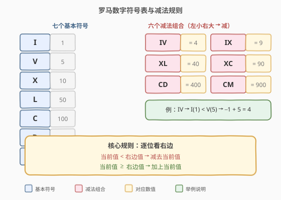
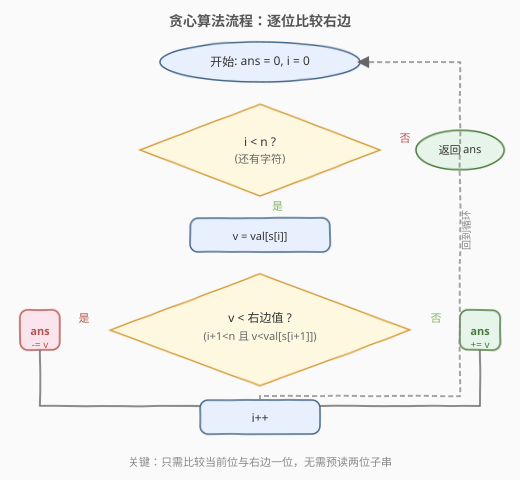
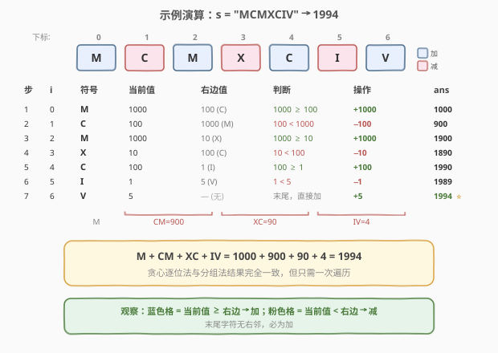

# 罗马数字转整数

- **题目名称**：罗马数字转整数
- **链接**：[13. 罗马数字转整数](https://leetcode.cn/problems/roman-to-integer/)
- **难度**：简单
- **标签**：哈希表、字符串、贪心

## 1. 题目概述

罗马数字由七个不同的符号表示：`I`、`V`、`X`、`L`、`C`、`D`、`M`，分别对应 $1, 5, 10, 50, 100, 500, 1000$。

通常情况下，小的数字在大的数字右边表示相加；但存在**六种减法组合**——小的数字在大的数字左边时表示相减（如 `IV` = 4、`IX` = 9）。给定一个罗马数字字符串 `s`（范围 1 ~ 3999），将其转换为整数。

**示例 1**：

```text
输入：s = "III"
输出：3
解释：I + I + I = 1 + 1 + 1 = 3
```

**示例 2**：

```text
输入：s = "LVIII"
输出：58
解释：L + V + I + I + I = 50 + 5 + 3 = 58
```

**示例 3**：

```text
输入：s = "MCMXCIV"
输出：1994
解释：M + CM + XC + IV = 1000 + 900 + 90 + 4 = 1994
```

**约束条件**：

- `1 <= s.length <= 15`
- `s` 仅含字符 `('I', 'V', 'X', 'L', 'C', 'D', 'M')`
- 题目数据保证 `s` 是一个有效的罗马数字，且表示的数值在范围 `[1, 3999]` 内

---

## 2. 解题思路

### 2.1 暴力思路：枚举减法组合

先用哈希表存储七个基本符号的值，然后从左到右扫描字符串，每次尝试匹配**两位**的减法组合（`IV`/`IX`/`XL`/`XC`/`CD`/`CM`）：若匹配成功则加上对应值并跳过两位，否则只取一位的基本值。这种写法需要维护六个特判分支或一个减法组合表，逻辑稍显繁琐。

### 2.2 核心观察：贪心逐位比较



减法组合的本质是一条**局部规律**：

> 若某个字符的值**小于**它右边字符的值，则该字符应被**减去**；否则**加上**。

例如 `IV`：`I`(1) < `V`(5)，所以减 `I` 加 `V`，得 $-1 + 5 = 4$。同理 `CM`：`C`(100) < `M`(1000)，得 $-100 + 1000 = 900$。

于是只需**一次遍历**：对每个位置 `i`，比较 `val[s[i]]` 与 `val[s[i+1]]`（若 `i` 是末位则直接加上），小则减、大则加。无需显式枚举六种组合，规则统一且简洁。

> 💡 **关键直觉**：罗马数字的减法表示法本质上就是「**左小右大时左减**」，这是一条逐位成立的局部规则——不需要回头看两位子串，只看右边一位即可决策。

**时间复杂度**：$O(n)$，其中 $n$ 为字符串长度，一次遍历；**空间复杂度**：$O(1)$（哈希表仅存 7 个符号，常数大小）。

### 2.3 算法流程图



外层循环以 `i` 递增遍历每个字符；取当前值 `v` 后，只要 `i+1` 未越界且 `v` 小于右边值就减，否则加；末位字符无右邻，必走「加」分支。

### 2.4 示例演算



上表逐步展示 `s = "MCMXCIV"` 的贪心逐位解析过程：

- `M`(1000) ≥ 右边 `C`(100) → **加** 1000，ans = 1000
- `C`(100) < 右边 `M`(1000) → **减** 100，ans = 900
- `M`(1000) ≥ 右边 `X`(10) → **加** 1000，ans = 1900
- `X`(10) < 右边 `C`(100) → **减** 10，ans = 1890
- `C`(100) ≥ 右边 `I`(1) → **加** 100，ans = 1990
- `I`(1) < 右边 `V`(5) → **减** 1，ans = 1989
- `V`(5) 为末位 → **加** 5，ans = **1994**

结果与分组法 `M + CM + XC + IV = 1000 + 900 + 90 + 4 = 1994` 完全一致。

---

## 3. 参考代码

### C++（贪心逐位）

```cpp
class Solution {
  public:
    int romanToInt(string s) {
        unordered_map<char, int> val = {
            {'I', 1}, {'V', 5}, {'X', 10}, {'L', 50},
            {'C', 100}, {'D', 500}, {'M', 1000}};
        int ans = 0, n = s.size();
        for (int i = 0; i < n; i++) {
            int v = val[s[i]];
            if (i + 1 < n && v < val[s[i + 1]]) {
                ans -= v;
            } else {
                ans += v;
            }
        }
        return ans;
    }
};
```

### Python（贪心逐位）

```python
class Solution:
    def romanToInt(self, s: str) -> int:
        val = {'I': 1, 'V': 5, 'X': 10, 'L': 50,
               'C': 100, 'D': 500, 'M': 1000}
        ans = 0
        n = len(s)
        for i, ch in enumerate(s):
            v = val[ch]
            if i + 1 < n and v < val[s[i + 1]]:
                ans -= v
            else:
                ans += v
        return ans
```

> ⚠️ **两种写法对比**：C++ 用 `unordered_map` 查表，Python 直接用字典；逻辑完全一致——核心就是一个 `if` 判断当前值是否小于右邻值。也可用 `switch` / 数组替代哈希表，但 7 个符号的哈希表常数可忽略。

---

## 4. 复杂度分析

| 维度 | 复杂度 | 说明 |
|------|--------|------|
| 时间复杂度 | $O(n)$ | $n$ 为字符串长度，一次遍历，每位做一次哈希查询和比较 |
| 空间复杂度 | $O(1)$ | 哈希表固定存 7 个符号，仅用常数额外变量 |

---

## 5. 扩展：整数转罗马数字（LeetCode 12）

本题的逆问题是 [12. 整数转罗马数字](https://leetcode.cn/problems/integer-to-roman/)：给定一个整数（1 ~ 3999），转为罗马数字字符串。思路是用**贪心配面值**——把 13 个「面值-符号」对（含 6 个减法组合）从大到小排列，每次尽可能多地减去最大面值并拼接对应符号，与找零钱逻辑一致。两题合在一起理解罗马数字的「加法侧」与「减法侧」规则最为完整。

---

## 6. 面试要点

1. **为什么只需看右边一位就能判断加减？**

   - 罗马数字的减法组合**只涉及相邻两位**（如 `IV`、`CM`），不存在跨越三位的减法。因此「当前值 < 右边值」是减、否则是加的规则在逐位层面完全正确，无需预读两位子串。

2. **末尾字符如何处理？**

   - 末位字符没有右邻，`i + 1 < n` 为假，直接走「加」分支。这也符合语义：末位不可能作为减法组合的左元素（因为没有右元素与之配对）。

3. **能否从右往左遍历？**

   - 可以。从右往左扫描时维护「已见过的最大值」，若当前值小于该最大值则减、否则加并更新最大值。两种方向等价，从左到右更直观、面试口述更顺。

4. **为什么数值范围限制在 3999？**

   - 罗马数字没有表示 0 和 5000 以上数值的常规符号（标准符号最大为 `M` = 1000）。要表示 4000 需要超长 `MMMM` 或引入特殊上划线记法，题目范围 `[1, 3999]` 保证用标准符号即可唯一表示。

5. **哈希表和数组哪种更优？**

   - 符号只有 7 个且为 ASCII 字符，可用 `int val[128]` 数组以字符为下标直接索引，避免哈希开销。但实际差异极小，哈希表写法更清晰、面试足够，是可接受的写法。

---

## 7. 同类练习题

- [12. 整数转罗马数字](https://leetcode.cn/problems/integer-to-roman/)：本题逆问题，贪心配面值 + 拼接符号
- [279. 完全平方数](https://leetcode.cn/problems/perfect-squares/)（[题解](../0201-0300/279_完全平方数.md)）：贪心思想 + DP，类似的「面值」拆解
- [415. 字符串相加](https://leetcode.cn/problems/add-strings/)（[题解](../0401-0500/415_字符串相加.md)）：字符串逐位扫描 + 规则判定
- [8. 字符串转换整数 (atoi)](https://leetcode.cn/problems/string-to-integer-atoi/)（[题解](8_字符串转换整数atoi.md)）：字符串解析 + 边界条件处理
