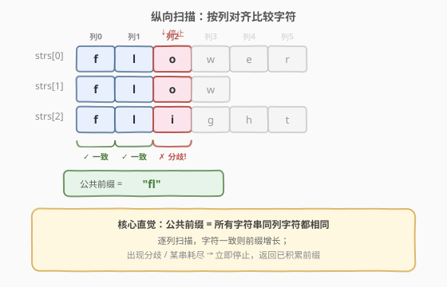
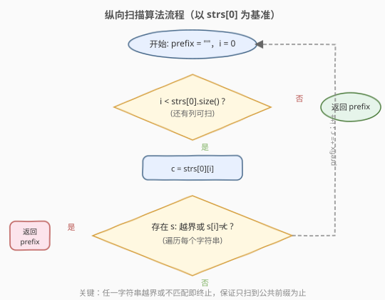
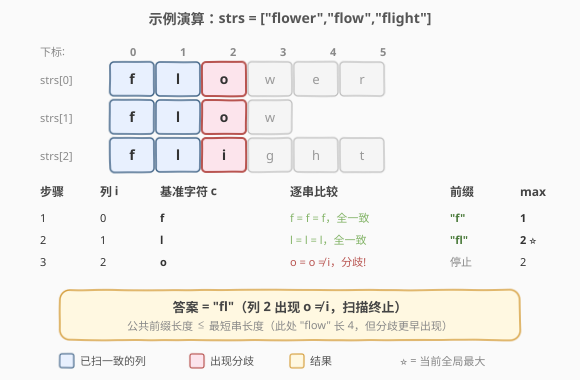

# 最长公共前缀

- **题目名称**：最长公共前缀
- **链接**：[14. 最长公共前缀](https://leetcode.cn/problems/longest-common-prefix/)
- **难度**：简单
- **标签**：字符串、数组

## 1. 题目概述

编写一个函数来查找字符串数组中的**最长公共前缀**。如果不存在公共前缀，返回空字符串 `""`。

**示例 1**：

```text
输入：strs = ["flower","flow","flight"]
输出："fl"
```

**示例 2**：

```text
输入：strs = ["dog","racecar","car"]
输出：""
解释：输入不存在公共前缀。
```

**约束条件**：

- `1 <= strs.length <= 200`
- `0 <= strs[i].length <= 200`
- `strs[i]` 仅由小写英文字母组成

---

## 2. 解题思路

### 2.1 暴力思路

枚举所有可能的「前缀长度」$L$（从最短字符串长度开始递减），对每个 $L$ 检查是否所有字符串的前 $L$ 个字符都相同。时间复杂度 $O(S \cdot n)$（$S$ 为最短串长度），但写法繁琐且要反复取子串比较。

### 2.2 核心观察：纵向扫描



公共前缀的本质是「**所有字符串在相同列（下标）上的字符都相同**」。于是可以按**列**扫描：

- 取第 0 列，检查所有字符串的第 0 个字符是否都相同；
- 若相同，继续第 1 列、第 2 列……
- 一旦某列出现**字符不一致**，或某个字符串已经到达末尾（即下标等于该串长度），就停止——前面扫过的列就是最长公共前缀。

> 💡 关键直觉：**「公共前缀」只可能出现在每个字符串的开头**，所以按列对齐比较即可，不必关心后面的字符。同时，公共前缀的长度**不会超过最短的那个字符串**——任意一串耗尽即终止。

**时间复杂度**：$O(m \cdot n)$，其中 $m$ 为公共前缀长度（最坏为最短串长度），$n$ 为字符串个数；**空间复杂度**：$O(1)$。

### 2.3 算法流程图



外层循环以列下标 `i` 递增，内层只需遍历每个字符串；一旦条件不满足立即返回已积累的前缀。

### 2.4 示例演算



上表逐步展示 `strs = ["flower","flow","flight"]` 的纵向扫描过程：

- 第 0、1 列所有字符相同（`f`、`l`），前缀增长为 `"fl"`。
- 第 2 列出现分歧：`o` vs `o` vs `i`，扫描停止，最终答案 `"fl"`。

---

## 3. 参考代码

### C++（纵向扫描）

```cpp
class Solution {
  public:
    string longestCommonPrefix(vector<string>& strs) {
        if (strs.empty()) return "";
        string prefix;
        for (int i = 0; i < strs[0].size(); i++) {
            char c = strs[0][i];
            for (const string& s : strs) {
                if (i == s.size() || s[i] != c) {
                    return prefix;
                }
            }
            prefix += c;
        }
        return prefix;
    }
};
```

### Python（横向扫描，逐串裁剪前缀）

```python
class Solution:
    def longestCommonPrefix(self, strs: List[str]) -> str:
        if not strs:
            return ""
        prefix = strs[0]
        for s in strs[1:]:
            while not s.startswith(prefix):
                prefix = prefix[:-1]
                if not prefix:
                    return ""
        return prefix
```

> ⚠️ **两种扫描的区别**：纵向扫描按列比较、早停更直接（适合面试口述）；横向扫描以第一个串为候选前缀，逐串裁剪，写法更简洁但每次裁剪需重新匹配。二者复杂度同级。

---

## 4. 复杂度分析

| 维度 | 复杂度 | 说明 |
|------|--------|------|
| 时间复杂度 | $O(m \cdot n)$ | $m$ 为公共前缀长度（≤ 最短串长度），$n$ 为字符串个数；最坏需比较 $m \cdot n$ 个字符 |
| 空间复杂度 | $O(1)$ | 仅用常数额外变量（不含返回的前缀字符串） |

---

## 5. 扩展：分治与二分

### 5.1 分治法

将字符串数组对半分，分别求左半与右半的最长公共前缀，再对两个结果求公共前缀。递归树深度 $O(\log n)$，每层合并开销与串长相关，总复杂度仍为 $O(m \cdot n)$，但常数更大，适合考察递归思维而非实战。

### 5.2 二分答案

公共前缀长度 $L$ 具有单调性：若长度 $k$ 可行，则 $k-1$ 也可行。对 $L \in [0, \min\text{Len}]$ 二分，每次验证「所有串前 $mid$ 个字符是否相同」需 $O(m \cdot n)$，总复杂度 $O(m \cdot n \log \min\text{Len})$。当字符集大、单次比较昂贵时才有价值，本题字符为小写字母，二分并不优于线性扫描。

---

## 6. 面试要点

1. **纵向扫描和横向扫描各适合什么场景？**

   - 纵向扫描（按列比较）早停直接、无需反复取子串，适合公共前缀较短或字符串较多时；横向扫描以首串为候选、逐串裁剪，写法简洁，适合字符串数量少、长度接近时。两者复杂度同级。

2. **为什么公共前缀长度不超过最短字符串的长度？**

   - 公共前缀是所有字符串共有的前缀，最短字符串一旦耗尽，其后面没有字符可参与比较，前缀自然不能更长。因此可先求最短长度作为上界。

3. **如果数组中含空字符串 `""`，结果是什么？**

   - 任意一个字符串为空，公共前缀必为 `""`。纵向扫描在第 0 列即遇到 `i == s.size()` 而立即返回空；横向扫描裁剪时也会立刻清空。

4. **字符串数量 $n=1$ 时需要特判吗？**

   - 不必。纵向扫描取 `strs[0]` 作为基准遍历，内层循环只比较它自身，必然全部相等，返回整个串即正确。代码中的 `strs.empty()` 判空仅为健壮性。

5. **能否用 Trie 解决？复杂度如何？**

   - 可以：把所有字符串插入 Trie，然后从根沿「只有一个孩子」的路径往下走，走到第一个分叉或单词结束符即得公共前缀。建树 $O(S)$（$S$ 为所有字符总数），查询 $O(m)$；适合需要反复查询多个数组公共前缀的场景，单题用 Trie 反而过度设计。

---

## 7. 同类练习题

- [14. 最长公共前缀](https://leetcode.cn/problems/longest-common-prefix/)（[题解](14_最长公共前缀.md)）：纵向 / 横向扫描模板
- [415. 字符串相加](https://leetcode.cn/problems/add-strings/)（[题解](../0401-0500/415_字符串相加.md)）：字符串逐位对齐处理
- [165. 比较版本号](https://leetcode.cn/problems/compare-version-numbers/)（[题解](../0101-0200/165_比较版本号.md)）：字符串切分 + 逐段比较
- [5. 最长回文子串](https://leetcode.cn/problems/longest-palindromic-substring/)（[题解](5_最长回文子串.md)）：字符串中心扩展扫描
