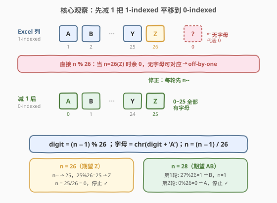
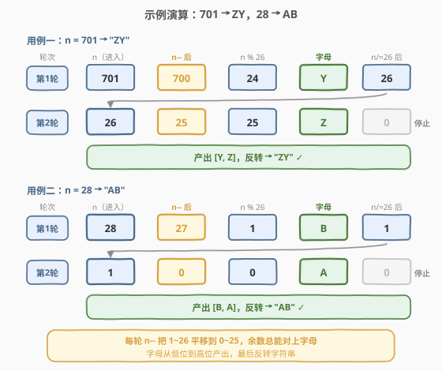

# Excel表列名称

- **题目名称**：Excel表列名称
- **链接**：[168. Excel表列名称](https://leetcode.cn/problems/excel-sheet-column-title/)
- **难度**：中等
- **标签**：数学、字符串

## 1. 题目概述

给定一个正整数 `columnNumber`，返回它在 Excel 表格中对应的**列名称**。Excel 列的命名规则与 26 进制类似但**并非普通 26 进制**：

```text
A -> 1
B -> 2
C -> 3
...
Z -> 26
AA -> 27
AB -> 28
...
```

**示例 1**：

```text
输入：columnNumber = 1
输出："A"
```

**示例 2**：

```text
输入：columnNumber = 28
输出："AB"
```

**示例 3**：

```text
输入：columnNumber = 701
输出："ZY"
```

**示例 4**：

```text
输入：columnNumber = 2147483647
输出："FXSHRXW"
```

**约束条件**：

- $1 \le \text{columnNumber} \le 2^{31} - 1$

> ⚠️ **本题最大的坑**：它**长得像** 26 进制转换，却不能直接套用「除 K 取余」模板。原因是普通 26 进制的数码是 $0 \sim 25$（0-indexed），而这里字母对应 $1 \sim 26$（**1-indexed**，没有代表 0 的字母）。直接 `columnNumber % 26` 会在末位为 `Z`（余 0）时崩掉——下文的核心观察就是解决这个 off-by-one。

---

## 2. 解题思路

### 2.1 暴力思路：硬套十进制转 K 进制模板

很多人第一反应是直接搬「除 K 取余」：循环 `columnNumber % 26` 得到末位字母，再 `columnNumber /= 26` 缩小。但跑一下 `columnNumber = 26`（期望 `"Z"`）就会发现：

- `26 % 26 = 0`，没有字母对应余数 `0`（字母下标是 $1 \sim 26$）；
- 即便强行把 `0` 映射成 `Z`，接着 `26 / 26 = 1`，下一轮又取 `1 % 26 = 1` 得到 `A`，拼成 `"AZ"` —— 错了。

> 💡 **问题根源**：普通进制每一位的取值范围是 $[0, K)$，数码集合含 `0`；而 Excel 列名的「数码」是 $[1, 26]$，**不含 0**。这是一套**没有 0 的 1-indexed 进制**，必须先做一次「平移」把 $1 \sim 26$ 归一到 $0 \sim 25$，才能套用熟悉的取余模板。

### 2.2 核心观察：先减 1，把 1-indexed 转成 0-indexed



破局点是**每一位取余前先把 `n` 减 1**：

$$\text{digit} = (n - 1) \bmod 26, \qquad 0 \le \text{digit} \le 25$$

这样 $1 \sim 26$ 被平移成 $0 \sim 25$，恰好对应 `A` ~ `Z`（`0 → A`、`25 → Z`）。减完之后再做取余和整除：

- 末位字母：`chr((n - 1) % 26 + ord('A'))`
- 缩小：`n = (n - 1) // 26`（注意是减 1 之后再整除）

> 💡 **为什么减 1 要在取余和整除之前？** 因为 `n` 表示的是「当前剩余的、以 1 为起点的数值」。减 1 把它变成「以 0 为起点的偏移量」，此时取余得到 $[0,25]$ 内的数码，整除得到「去掉末位后剩余的、仍以 1 为起点的数值」——这正好让循环不变量成立：**每一轮的 `n` 始终代表 1-indexed 的剩余值**，于是下一轮开头依然要再减 1。

以 `columnNumber = 26`（期望 `"Z"`）验证：

| 步骤 | `n` | `n-1` | 末位 `(n-1)%26` | 字母 | 新 `n=(n-1)//26` |
|------|-----|-------|-----------------|------|------------------|
| 第 1 轮 | 26 | 25 | 25 | `Z` | `25 // 26 = 0` |
| 第 2 轮 | 0 | — | — | 停止 | — |

结果 `"Z"` ✓。再看 `columnNumber = 28`（期望 `"AB"`）：

| 步骤 | `n` | `n-1` | 末位 `(n-1)%26` | 字母 | 新 `n=(n-1)//26` |
|------|-----|-------|-----------------|------|------------------|
| 第 1 轮 | 28 | 27 | 1 | `B` | `27 // 26 = 1` |
| 第 2 轮 | 1 | 0 | 0 | `A` | `0 // 26 = 0` |
| 第 3 轮 | 0 | — | — | 停止 | — |

倒序拼接 `["B", "A"]` 得 `"AB"` ✓。

> ⚠️ **「先减 1」的等价写法**：也可以写成 `n--` 后再 `n % 26` 与 `n /= 26`。两种写法完全等价，差别仅在 `n` 的更新时机——一种是「先用 `n-1` 计算、不动 `n`」，一种是「先把 `n` 减 1 再参与运算」。下文代码采用更紧凑的 `n--` 形式。

**时间复杂度**：$O(\log_{26} n)$，即结果字符串的位数；**空间复杂度**：$O(\log_{26} n)$（存储结果字符串）。

### 2.3 算法流程图


流程只有一个循环，每轮三步：**减 1 → 取余定字母 → 整除缩小**，直到 `n` 归零。注意字母是**从低位到高位**产出的，最后要**反转**字符串。

### 2.4 示例演算



逐步展示两个典型用例的转换过程：

**用例一：`columnNumber = 701` → `"ZY"`**

| 轮次 | `n`（进入时） | `n--` 后 | `n % 26` | 字母 | `n /= 26` 后 |
|------|---------------|----------|----------|------|--------------|
| 1 | 701 | 700 | 24 | `Y` | 26 |
| 2 | 26 | 25 | 25 | `Z` | 0 |
| 3 | 0 | — | — | 停止 | — |

产出序列 `[Y, Z]`，反转得 `"ZY"` ✓。

**用例二：`columnNumber = 28` → `"AB"`**

| 轮次 | `n`（进入时） | `n--` 后 | `n % 26` | 字母 | `n /= 26` 后 |
|------|---------------|----------|----------|------|--------------|
| 1 | 28 | 27 | 1 | `B` | 1 |
| 2 | 1 | 0 | 0 | `A` | 0 |
| 3 | 0 | — | — | 停止 | — |

产出序列 `[B, A]`，反转得 `"AB"` ✓。

> 💡 **直觉记忆**：把每一轮的 `n--` 想成「给当前最低位付掉 1 个起点的税」。普通进制里最低位免费占 `0` 这个槽位，而 Excel 字母没有 `0`，所以每次取一位都得先交掉这「1 个起点」的税，剩下的才是干净的 $0 \sim 25$ 数码。

---

## 3. 参考代码

### C++（先减 1 再取余）

```cpp
class Solution {
  public:
    string convertToTitle(int columnNumber) {
        string ans;
        while (columnNumber > 0) {
            columnNumber--;                     // 1-indexed -> 0-indexed
            int d = columnNumber % 26;
            ans.push_back('A' + d);
            columnNumber /= 26;
        }
        reverse(ans.begin(), ans.end());
        return ans;
    }
};
```

### Python（先减 1 再取余）

```python
class Solution:
    def convertToTitle(self, columnNumber: int) -> str:
        ans = []
        while columnNumber > 0:
            columnNumber -= 1                   # 1-indexed -> 0-indexed
            ans.append(chr(columnNumber % 26 + ord('A')))
            columnNumber //= 26
        return ''.join(reversed(ans))
```

> ⚠️ **两种写法对比**：逻辑完全一致——核心只有「`n--` 在 `% 26` 和 `/= 26` 之前」这一行。Python 用列表收集字符再 `join`，比字符串拼接更高效（字符串不可变，每次 `+=` 都会复制）；C++ 直接 `push_back` 到可变 `string` 即可。最后都要**反转**，因为字符是从低位到高位产出的。

---

## 4. 复杂度分析

| 维度 | 复杂度 | 说明 |
|------|--------|------|
| 时间复杂度 | $O(\log_{26} n)$ | 每轮 `n` 缩小到原来的 $1/26$，循环次数即结果字符串的位数，约为 $\log_{26} n$ |
| 空间复杂度 | $O(\log_{26} n)$ | 结果字符串长度等于循环次数；不计输出则 $O(1)$（仅用常数变量） |

> 💡 题目上界 $n = 2^{31}-1$ 时结果为 `"FXSHRXW"`（7 位），故循环最多 7 次，实际为常数级；但按位数增长的渐进界 $O(\log_{26} n)$ 是更本质的刻画。

---

## 5. 扩展：逆问题——Excel表列序号（LeetCode 171）

本题的逆问题是 [171. Excel表列序号](https://leetcode.cn/problems/excel-sheet-column-number/)：给定列名称字符串，返回对应整数。这是**正向累加**的 26 进制，反而比 168 简单——因为累加时不存在「取余遇 0」的尴尬：

$$\text{result} = 0;\quad \text{for } ch \text{ in } s:\ \text{result} = \text{result} \times 26 + (\text{ord}(ch) - \text{ord}('A') + 1)$$

```python
class Solution:
    def titleToNumber(self, columnTitle: str) -> int:
        res = 0
        for ch in columnTitle:
            res = res * 26 + (ord(ch) - ord('A') + 1)
        return res
```

> 💡 **为什么 171 不用做 off-by-one 修正？** 168 是「分解」（不断取余降位），分解时必须把 $1 \sim 26$ 归一到 $0 \sim 25$ 才能对齐整除；171 是「合成」（从高位向低位累乘加），累加时 `ord(ch) - ord('A') + 1` 直接得到 $1 \sim 26$，正好就是 1-indexed 的位权，无需平移。两题合看，能完整理解「1-indexed 进制」的分解与合成两个方向。

---

## 6. 面试要点

1. **为什么不能直接套「除 26 取余」模板？**

   - 普通 26 进制数码是 $0 \sim 25$（含 0），而 Excel 字母对应 $1 \sim 26$（不含 0）。直接取余时，末位为 `Z`（对应 26）会让 `n % 26 = 0`，没有字母映射到 0；即便强行把 0 映射成 `Z`，整除后的商也多出 1，导致高位算错。本质是「没有 0 数码」带来的 off-by-one。

2. **`n--` 为什么必须放在取余和整除之前？**

   - `n` 在每轮开头代表「1-indexed 的剩余值」。先 `n--` 把它变成「0-indexed 偏移量」，此时 `% 26` 得到 $[0,25]$ 内的数码、`/ 26` 得到「去掉末位后剩余的 1-indexed 值」。若把 `n--` 放在整除之后，则本轮取余用的还是 1-indexed 的 `n`，余数会落在 $[1,26]$，无法直接映射字母。

3. **结果为什么要反转？**

   - 取余总是先产出**最低位**字母，再产出次低位……与最终字符串「高位在前」的顺序相反。所以边产出边追加到尾部，最后整体反转。也可以改为每次在头部插入（如 Python 的 `ans.insert(0, ch)` 或用 `deque.appendleft`），但头部插入在数组上是 $O(n)$，反转法 $O(n)$ 更优。

4. **`columnNumber = 26` 时如何得到 `"Z"`？**

   - 第 1 轮：`n = 26`，`n--` → `25`，`25 % 26 = 25` → `'Z'`，`n = 25 / 26 = 0`；第 2 轮 `n = 0` 退出。结果 `"Z"`。这是「直接套模板会出错」的最小反例，面试时用它演示 `n--` 的必要性最有说服力。

5. **和 LeetCode 171（表列序号）是什么关系？**

   - 互为逆运算。171 是「合成」（累乘加），不需要 off-by-one 修正；168 是「分解」（取余降位），必须先减 1。两者合在一起，恰好展示了「1-indexed 进制」从字符串到整数、从整数到字符串的两个方向，是面试中常被一起追问的姊妹题。

---

## 7. 同类练习题

- [171. Excel表列序号](https://leetcode.cn/problems/excel-sheet-column-number/)：本题逆问题，正向累加的 26 进制，对比理解「合成无需平移、分解需要平移」
- [12. 整数转罗马数字](https://leetcode.cn/problems/integer-to-roman/)：同样是「整数 → 符号串」的转换，但用贪心配面值而非取余，可对比两种思路
- [504. 七进制数](https://leetcode.cn/problems/base-7/)：标准 0-indexed 进制转换（含负数），对比「含 0 数码」时无需 off-by-one 的简单情况
- [50. Pow(x, n)](https://leetcode.cn/problems/powx-n/)（[题解](50_Powx_n.md)）：另一类「数学 + 递推」母题，快速幂与进制分解共享「反复除以基数」的思想
