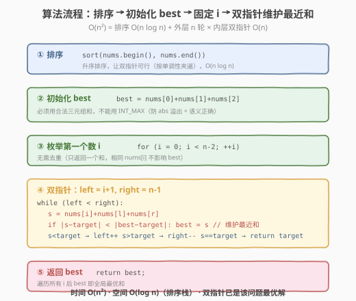
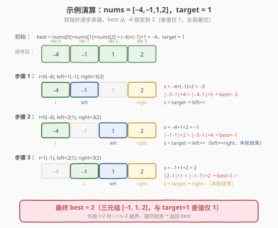

# LeetCode 最接近的三数之和 题解

## 1. 题目概述

- **标题 / 题号**：最接近的三数之和（#16，medium）
- **链接**：https://leetcode.cn/problems/3sum-closest/
- **难度**：中等
- **标签**：数组、双指针、排序

**题意**：给定一个长度为 `n` 的整数数组 `nums` 和一个目标值 `target`，从 `nums` 中选出**三个整数**，使它们的和**最接近** `target`。返回这三个数的和。**假定每组输入只存在唯一解**。

**示例 1**：

```text
输入：nums = [-1,2,1,-4], target = 1
输出：2
解释：与 target 最接近的和是 2 (-1 + 2 + 1 = 2)
```

**示例 2**：

```text
输入：nums = [0,0,0], target = 1
输出：0
解释：唯一一个三元组 [0,0,0] 的和为 0，与 target=1 最接近
```

**约束**：

- `3 <= nums.length <= 1000`
- `-1000 <= nums[i] <= 1000`
- `-10^4 <= target <= 10^4`

> 💡 本题是 [15. 三数之和](15_三数之和.md) 的孪生题——同样是「排序 + 固定一个 + 双指针」骨架，差别只有两点：① 目标从「和等于 0」变成「和最接近 `target`」；② 不要求去重（只返回一个和，不需要枚举所有三元组）。正因为不用去重，本题反而**更简单**。掌握了三数之和的双指针模板，本题只需在指针移动时多维护一个「当前最优和」即可秒杀。

## 2. 解题思路

### 2.1 暴力思路：三重循环枚举

最直接的做法：三重循环枚举所有 `(i, j, k)` 组合，计算 `nums[i]+nums[j]+nums[k]`，记录与 `target` 差值绝对值最小的那个和。

```text
best = nums[0]+nums[1]+nums[2]
for i in 0..n:
    for j in i+1..n:
        for k in j+1..n:
            s = nums[i]+nums[j]+nums[k]
            if |s - target| < |best - target|:
                best = s
return best
```

时间复杂度 $O(n^3)$，`n=1000` 时约 $10^9$ 次运算，**超时**。无需去重，但纯枚举太慢。

> ⚠️ 暴力法的瓶颈只有一个：三重循环 $O(n^3)$。破局思路与三数之和完全一致——先排序，把「无序找数对」变成「有序双指针夹逼」，把内两层循环合并成 $O(n)$，总复杂度降到 $O(n^2)$。

### 2.2 核心观察：排序 + 双指针维护最近和

**关键转换**：先对数组**升序排序**。排序后：

1. **双指针可行**：固定第一个数 `nums[i]`，在剩余区间 `[i+1, n-1]` 用左右双指针 `left`/`right` 计算三数之和 `s`。因为数组有序，可根据 `s` 与 `target` 的大小关系单调移动指针，让 `s` 逼近 `target`。
2. **无需去重**：本题只返回一个和，即使枚举到相同三元组也不影响结果，省去三数之和里最易错的去重逻辑。

![双指针：固定 nums[i]，left/right 夹逼让三数之和逼近 target](../images/three_sum_closest_two_pointers.svg)

**双指针移动规则**（设 `s = nums[i] + nums[left] + nums[right]`）：

- 用 `best` 记录「当前最接近 `target` 的和」，每次计算 `s` 后若 $|s - \text{target}| < |\text{best} - \text{target}|$ 就更新 `best`
- 若 `s < target`：和太小，`left++`（向右找更大的数，让 `s` 增大逼近 `target`）
- 若 `s > target`：和太大，`right--`（向左找更小的数，让 `s` 减小逼近 `target`）
- 若 `s == target`：差值为 0，已是绝对最优，**直接返回 `target`**（不可能更近）

> 💡 **为什么双指针不会漏掉最近和？** 因为数组有序，当 `s < target` 时，对当前 `left`，任何 `right' < right` 都有 `nums[left]+nums[right'] ≤ nums[left]+nums[right]`，得到的三数之和更小、离 `target` 更远。所以 `left` 可以安全右移，不会漏掉以当前 `left` 开头的更优解。这是「单调性」保证的双指针正确性——与三数之和找等于 0 的论证完全同构，只是把「找等于」推广成「找最近」。

### 2.3 算法流程图



**完整步骤**：

1. **排序**：`nums` 升序排序，$O(n \log n)$
2. **初始化** `best = nums[0] + nums[1] + nums[2]`（保证是一个合法三元组和）
3. **枚举第一个数** `i`：从 `0` 到 `n-3`，对每个 `nums[i]`
   - **双指针**：`left = i+1`，`right = n-1`
   - 循环 `while (left < right)`：
     - 计算 `s = nums[i] + nums[left] + nums[right]`
     - 若 $|s - \text{target}| < |\text{best} - \text{target}|$，更新 `best = s`
     - 若 `s < target`：`left++`
     - 若 `s > target`：`right--`
     - 若 `s == target`：**直接返回 `target`**（差值 0，不可能更优）
4. 返回 `best`

> 💡 **两处可省的优化**：① 本题不要求去重，因此**不需要**三数之和里的「跳过相邻重复 `nums[i]`」和「找到解后跳过重复 left/right」逻辑——即使枚举到相同值，`best` 也不会被改坏，只会重复比较一次，不影响正确性。② `s == target` 时提前返回是重要的常数优化：差值已为 0，绝不可能更近，继续搜无意义。

### 2.4 示例演算

以 `nums = [-4,-1,1,2]`（排序后）、`target = 1` 为例，看双指针如何逐步逼近并锁定最优和 `2`：



| 步骤 | i | nums[i] | left | right | s = 三数之和 | target | \|s-target\| | best（更新前→后） | 动作 |
|------|---|---------|------|-------|--------------|--------|--------------|-------------------|------|
| 0 | — | — | — | — | — | 1 | — | `-4 + (-1) + 1 = -4`（初值） | 初始化 best=-4 |
| 1 | 0 | -4 | 1 (-1) | 3 (2) | -4+(-1)+2 = -3 | 1 | 4 | -4 → -3（4 < 5） | s < target，left++ |
| 2 | 0 | -4 | 2 (1) | 3 (2) | -4+1+2 = -1 | 1 | 2 | -3 → -1（2 < 4） | s < target，left++ |
| 3 | 0 | -4 | 3 (2) | 3 (2) | left == right，本轮结束 | — | — | — | i++ |
| 4 | 1 | -1 | 2 (1) | 3 (2) | -1+1+2 = 2 | 1 | 1 | -1 → 2（1 < 2）✅ | s > target，right-- |
| 5 | 1 | -1 | 2 (1) | 2 (1) | left == right，本轮结束 | — | — | — | i++ |
| 6 | 2 | 1 | — | — | i = n-2，外层结束 | — | — | — | 返回 best=2 |

最终 `best = 2`（来自三元组 `[-1,1,2]`），与 `target=1` 差值仅 1，是全局最优。

> 💡 注意步骤 4：当 `s = 2 > target = 1` 时，我们更新 `best` 后让 `right--`（而不是 `left++`）。因为 `s` 已大于 `target`，要让和变小才能继续逼近，必须右指针左移。这正是双指针「按单调性夹逼」的核心：和太大就缩右端，和太小就扩左端。

## 3. 参考代码

### C++

```cpp
// 最接近的三数之和.cpp —— 排序 + 双指针 + 维护最近和
// 编译: g++ -O2 -std=c++17 最接近的三数之和.cpp -o threesumclosest
#include <vector>
#include <algorithm>
#include <cmath>
using namespace std;

class Solution {
  public:
    int threeSumClosest(vector<int>& nums, int target) {
        sort(nums.begin(), nums.end());          // ① 排序
        int n = nums.size();
        int best = nums[0] + nums[1] + nums[2];  // ② 初始化为一个合法三元组和

        for (int i = 0; i < n - 2; ++i) {        // ③ 枚举第一个数
            int left = i + 1, right = n - 1;     // ④ 双指针
            while (left < right) {
                int s = nums[i] + nums[left] + nums[right];
                // 维护最近和
                if (abs(s - target) < abs(best - target)) {
                    best = s;
                }
                if (s < target) {
                    ++left;                      // 和太小，左指针右移
                } else if (s > target) {
                    --right;                     // 和太大，右指针左移
                } else {
                    return target;               // s == target，差值 0，绝对最优
                }
            }
        }
        return best;
    }
};
```

### Python

```python
class Solution:
    def threeSumClosest(self, nums: list[int], target: int) -> int:
        nums.sort()                              # ① 排序
        n = len(nums)
        best = nums[0] + nums[1] + nums[2]       # ② 初始化

        for i in range(n - 2):                   # ③ 枚举第一个数
            left, right = i + 1, n - 1           # ④ 双指针
            while left < right:
                s = nums[i] + nums[left] + nums[right]
                if abs(s - target) < abs(best - target):
                    best = s                     # 维护最近和
                if s < target:
                    left += 1                    # 和太小
                elif s > target:
                    right -= 1                   # 和太大
                else:
                    return target               # s == target，绝对最优
        return best
```

> 💡 两个易错点：① `best` 必须初始化为一个**合法三元组和**（如 `nums[0]+nums[1]+nums[2]`），不能用 `INT_MAX`——否则 `abs(best-target)` 第一次比较时可能溢出，且语义上 `best` 始终应是某个真实三元组的和。② 提前返回 `target` 的分支不可省：它既是常数优化，也避免在已找到最优解后做无意义的指针移动。约束下三数之和最多 $3000$、`target` 最多 $10^4$，`abs(s-target)` 不会溢出 32 位 int，C++ 直接用 `int` 即可（对比 [18 题](18_四数之和.md) 四个 $10^9$ 相加需 `long long`）。

## 4. 复杂度分析

| 维度 | 复杂度 | 说明 |
|------|--------|------|
| **时间复杂度** | $O(n^2)$ | 排序 $O(n \log n)$ + 外层 $n$ 轮 × 内层双指针 $O(n)$ = $O(n^2)$ |
| **空间复杂度** | $O(\log n)$ | 排序的栈空间（C++ `sort` 为快排变种）；不计返回值 |
| **最优时间** | $O(n^2)$ | 双指针已是该问题最优解（无 $O(n \log n)$ 解法） |

> ⚠️ 为什么不用哈希表？与三数之和同理：哈希枚举两数 + 查第三数同为 $O(n^2)$，但找「最近和」需在哈希表里查「最接近某值的元素」，哈希表不支持 $O(1)$ 最近邻查询（需有序结构 + 二分，退化为 $O(n^2 \log n)$）。排序 + 双指针天然利用单调性夹逼，每步 $O(1)$ 决定指针走向，是标准解法。

## 5. 扩展：k-sum 最近和的推广

### 5.1 递归降维：k-sum → (k-1)-sum

本题与 [15. 三数之和](15_三数之和.md)、[18. 四数之和](18_四数之和.md) 同属 **k-sum 系列**。统一模板：排序后外层固定 `k-2` 个数，最内层用双指针找两数。求「等于」与「最近」的差别仅在「记录命中」vs「维护最优」：

- **等于型**（15/18）：`s == target` 时收集结果，需去重
- **最近型**（16）：`s == target` 时直接返回，无需去重，平时维护 `best`

### 5.2 双指针移动的「夹逼」直觉

双指针本质是**在有序数组上贪心地让 `s` 逼近 `target`**：

| `s` 与 `target` 关系 | 指针动作 | 直觉 |
|----------------------|----------|------|
| `s < target` | `left++` | 和太小，要变大 → 左端换更大的数 |
| `s > target` | `right--` | 和太大，要变小 → 右端换更小的数 |
| `s == target` | 返回 | 已命中，无需再搜 |

这个「夹逼」直觉也适用于二分答案类题目（如 [875. 爱吃香蕉的珂珂](../0801-0900/875_爱吃香蕉的珂珂.md)）：把「指针移动」换成「`mid` 调整」，单调性保证不漏解。

| 题目 | 与本题差异 | 核心改动 |
|------|-----------|---------|
| 15 三数之和 | 最近 → 等于 0 | 收集所有解 + 双层去重 |
| 18 四数之和 | 三数 → 四数 | 多一层外循环 + 多一层去重 + `long long` 防溢出 |
| 259 较小三数之和 | 最近 → 小于 target | 双指针移动时按区间计数（`+= r-l`） |

> 💡 k-sum 系列的统一心法：**排序 + 固定前若干个 + 双指针扫剩余**。「等于型」收解去重，「最近型」维护最优，「计数型」按区间累加。骨架不变，只换内层动作。

## 6. 面试要点

1. **本题与三数之和的核心差别是什么？为什么更简单？**

   - 三数之和要求**返回所有和等于 0 的不重复三元组**，需双层去重；本题只要求**返回最接近 `target` 的一个和**，唯一解。
   - 因此本题①不需要去重（相同三元组不影响 `best`）；②`s == target` 可提前返回（差值 0 已是绝对最优）。少了去重这一最易错点，所以更简单。

2. **`best` 为什么必须初始化为合法三元组和，而不是 `INT_MAX`？**

   - 语义上 `best` 应始终是某个真实三元组的和。若初始化为 `INT_MAX`，第一次 `abs(best - target)` 在 `target` 为负且 `INT_MAX` 接近上界时可能**溢出**（`INT_MAX - (-10^4)` 超过 `INT_MAX`）。
   - 用 `nums[0]+nums[1]+nums[2]` 既保证合法、又规避溢出，是安全写法。

3. **双指针为什么不会漏掉最近和？**

   - 当 `s < target` 时，对当前 `left`，任何 `right' < right` 都有 `nums[left]+nums[right'] ≤ nums[left]+nums[right]`，三数之和更小、离 `target` 更远。所以 `left` 可安全右移，不会漏掉以当前 `left` 开头的更优解。
   - 这依赖**数组有序**带来的单调性。无序数组双指针无此保证——这也是为什么必须先排序。

4. **`s == target` 时直接返回 `target` 的正确性？**

   - 差值 $|s - \text{target}| = 0$ 是全局最小（绝对值非负），不可能有更近的和。
   - 题目保证唯一解，此时返回的 `target` 即是答案。提前返回避免后续无意义的指针移动，是常数优化。

5. **为什么不需要像三数之和那样去重？**

   - 本题返回的是一个**标量**（最接近的和），不是三元组列表。即使枚举到相同的三元组，`best` 只会被相同值「重新比较」一次，结果不变。
   - 三数之和需要去重是因为它返回**列表**，重复三元组会污染输出。本题无此问题，去重是多余开销（虽然加上也不错，只是非必需）。

> 💡 **一句话总结**：最接近的三数之和是 k-sum 双指针模板的「最近型」变体——排序后固定一个数、双指针夹逼让和逼近 `target`，沿途维护差值最小的 `best`，命中即返回。掌握三数之和的双指针骨架后，本题只需把「收解去重」换成「维护最优」，即可秒杀。

## 同类练习题

| # | 题目 | 与本题的关联 |
|---|------|-------------|
| 15 | [三数之和](https://leetcode.cn/problems/3sum/)（[题解](15_三数之和.md)） | 等于型母题，排序 + 双指针 + 双层去重 |
| 18 | [四数之和](https://leetcode.cn/problems/4sum/)（[题解](18_四数之和.md)） | k-sum 升级，固定两个 + 双指针 + `long long` 防溢出 |
| 259 | [较小的三数之和](https://leetcode.cn/problems/3sum-smaller/) | 计数型变体，双指针移动时按区间累加 `r-l` |
| 912 | [排序数组](https://leetcode.cn/problems/sort-an-array/)（[题解](../0901-1000/912_排序数组.md)） | 手撕排序，k-sum 系列的前置依赖 |
