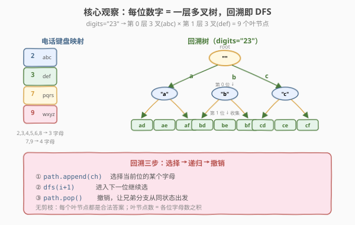
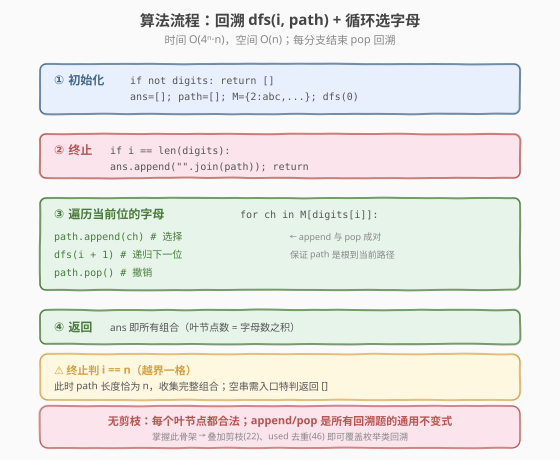
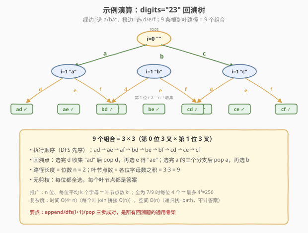

# 电话号码的字母组合

- **题目名称**：电话号码的字母组合
- **链接**：[17. 电话号码的字母组合](https://leetcode.cn/problems/letter-combinations-of-a-phone-number/)
- **难度**：中等
- **标签**：回溯、递归、字符串

## 1. 题目概述

给定一个仅包含数字 `2`–`9` 的字符串 `digits`，返回它能表示的所有字母组合。电话按键到字母的映射如下（与老式手机九宫格键盘一致）：

```text
2: abc     3: def
4: ghi     5: jkl     6: mno
7: pqrs    8: tuv     9: wxyz
```

数字 `1`、`0` 不对应任何字母。答案可以按任意顺序返回。

**示例 1**：

```text
输入：digits = "23"
输出：["ad","ae","af","bd","be","bf","cd","ce","cf"]
```

**示例 2**：

```text
输入：digits = ""
输出：[]
```

**示例 3**：

```text
输入：digits = "2"
输出：["a","b","c"]
```

**约束条件**：

- `0 <= digits.length <= 4`
- `digits[i]` 是范围 `['2', '9']` 内的一个数字

> 💡 这是回溯最朴素的入门题：**每个位置有若干个选择，全部枚举到底**。与 [22. 括号生成](22_括号生成.md) 不同，本题**无合法性剪枝**——任何选择都合法，因此回溯树的每个叶节点都是答案。掌握这个「多叉树遍历」骨架后，再叠加剪枝就能解决组合/排列/子集等一系列枚举题。

---

## 2. 解题思路

### 2.1 暴力思路：多重循环硬编码

最直观的做法是写「层数 = `digits` 长度」的嵌套循环：

```python
for c1 in M[digits[0]]:
    for c2 in M[digits[1]]:
        for c3 in M[digits[2]]:
            ans.append(c1 + c2 + c3)
```

问题在于**循环层数随输入长度变化**，无法在代码里写死。当 `digits` 长度是 `n` 时，需要 `n` 层嵌套——这正是**递归**的标准用武之地：递归深度天然对应「当前填到第几位」，每层用 `for` 遍历当前数字对应的所有字母。

### 2.2 核心观察：回溯 = 多叉树的深度优先遍历



把「在每一位上选一个字母」画成一棵树：

- **第 `i` 层**对应 `digits[i]`，该层每个节点的子节点数 = `digits[i]` 对应的字母数（3 或 4）。
- **根到叶路径**就是一条字母组合，叶节点在第 `n` 层（`n = len(digits)`）。

回溯骨架就是 **「选择 → 递归 → 撤销」** 三步：

1. **选择**：把某个字母 `append` 到 `path` 尾部；
2. **递归**：进入下一位 `dfs(i + 1)`；
3. **撤销**：`pop()` 恢复 `path`，让兄弟分支从相同状态出发。

> 💡 **为什么叫「回溯」？** 关键在第三步「撤销」。如果不撤销，`path` 会不断累积，兄弟分支就会带着前一个分支的字母往下走，得到错误结果。`append` / `pop` 成对出现，保证进入每个节点时 `path` 恰好是「根到当前节点」的路径——这是所有回溯题的通用不变式。

### 2.3 算法流程图



**完整步骤**：

1. **边界**：`digits` 为空 → 直接返回 `[]`（题目要求空输入返回空列表，而非 `[""]`）。
2. **建映射**：`M = {'2':"abc", '3':"def", ..., '9':"wxyz"}`。
3. **递归函数** `dfs(i, path)`：
   - **终止**：`i == len(digits)` → `ans.append("".join(path))`，返回。
   - **遍历选择**：对 `digits[i]` 对应的每个字母 `ch`：`path.append(ch)` → `dfs(i+1, path)` → `path.pop()`。
4. 调用 `dfs(0, [])`，返回 `ans`。

> ⚠️ **终止条件的判断时机**：是 `i == n` 时记录，而不是 `i == n-1` 时。后者会在倒数第二位就停下，漏掉最后一位字母。让递归「越界一格」再收集，能保证 `path` 长度恰为 `n`，逻辑最简洁。

### 2.4 示例演算

以 `digits = "23"` 为例，回溯树（边标选中的字母）：



```text
dfs(0, "")
├─ a → dfs(1, "a")
│       ├─ d → dfs(2, "ad") ✓
│       ├─ e → dfs(2, "ae") ✓
│       └─ f → dfs(2, "af") ✓
├─ b → dfs(1, "b")
│       ├─ d → dfs(2, "bd") ✓
│       ├─ e → dfs(2, "be") ✓
│       └─ f → dfs(2, "bf") ✓
└─ c → dfs(1, "c")
        ├─ d → dfs(2, "cd") ✓
        ├─ e → dfs(2, "ce") ✓
        └─ f → dfs(2, "cf") ✓
```

| 路径 | 选中字母 | 组合 |
|------|----------|------|
| 0→1→2 | a, d | `"ad"` |
| 0→1→2 | a, e | `"ae"` |
| 0→1→2 | a, f | `"af"` |
| 0→1→2 | b, d | `"bd"` |
| 0→1→2 | b, e | `"be"` |
| 0→1→2 | b, f | `"bf"` |
| 0→1→2 | c, d | `"cd"` |
| 0→1→2 | c, e | `"ce"` |
| 0→1→2 | c, f | `"cf"` |

共 `3 × 3 = 9` 个组合。`digits="2"` 时只有一层，3 个叶子 `["a","b","c"]`；`digits=""` 时根节点直接命中终止条件，但因为题目要求返回 `[]`，需要在入口处特判。

> 💡 **树的形态由输入决定**：每一位数字对应字母数（3 或 4）就是该层的分支数。`n` 位数字、每位平均 `k` 个字母，叶节点数约 $k^n$。`n=4` 且全为 7/9 时最多 $4^4 = 256$ 个组合，规模可控。

---

## 3. 参考代码

### C++

```cpp
// 电话号码的字母组合.cpp —— 回溯（多叉树 DFS）
// 编译: g++ -O2 -std=c++17 电话号码的字母组合.cpp -o phonenum
class Solution {
public:
    vector<string> letterCombinations(string digits) {
        if (digits.empty()) return {};          // 空输入特判
        vector<string> ans;
        string path;
        path.reserve(digits.size());
        unordered_map<char, string> M = {
            {'2',"abc"}, {'3',"def"}, {'4',"ghi"}, {'5',"jkl"},
            {'6',"mno"}, {'7',"pqrs"}, {'8',"tuv"}, {'9',"wxyz"}
        };
        dfs(0, digits, path, ans, M);
        return ans;
    }
private:
    void dfs(int i, const string& digits, string& path,
             vector<string>& ans, const unordered_map<char,string>& M) {
        if (i == (int)digits.size()) {           // 越界一格，收集答案
            ans.push_back(path);
            return;
        }
        for (char ch : M.at(digits[i])) {        // 遍历当前位的所有字母
            path.push_back(ch);                  // 选择
            dfs(i + 1, digits, path, ans, M);    // 递归
            path.pop_back();                     // 撤销
        }
    }
};
```

### Python

```python
class Solution:
    def letterCombinations(self, digits: str) -> List[str]:
        if not digits:                           # 空输入特判
            return []
        M = {
            '2': "abc", '3': "def",  '4': "ghi", '5': "jkl",
            '6': "mno", '7': "pqrs", '8': "tuv", '9': "wxyz",
        }
        ans = []
        path = []

        def dfs(i: int):
            if i == len(digits):                 # 越界一格，收集答案
                ans.append("".join(path))
                return
            for ch in M[digits[i]]:              # 遍历当前位的所有字母
                path.append(ch)                  # 选择
                dfs(i + 1)                       # 递归
                path.pop()                       # 撤销

        dfs(0)
        return ans
```

> 💡 **两个细节**：① 用 `path` 列表 + `append/pop` 而非字符串拼接，回溯时 `pop` `O(1)` 恢复，记录答案时 `"".join(path)` 一次性转串。② 空输入返回 `[]` 而非 `[""]`，因为题目约定空字符串没有组合；若把终止条件写成「`i == n` 收集」，空串会在根节点直接收集出 `[""]`，所以必须在入口处特判。

---

## 4. 复杂度分析

| 维度 | 复杂度 | 说明 |
|------|--------|------|
| **时间** | $O(4^n \cdot n)$ | 最坏每位 4 个字母（7/9），叶节点数 $\le 4^n$；每个叶节点 `join` 拼接 `O(n)` |
| **空间** | $O(n)$ | 递归栈深 `n` + `path` 长 `n`（不计答案存储） |

> ⚠️ 设 `m` 为映射到 3 个字母的数字个数、`n` 为映射到 4 个字母的数字个数，则叶节点数 = $3^m \cdot 4^n$，时间 $O(3^m \cdot 4^n \cdot (m+n))$。约束 `n <= 4` 时最多 $4^4 = 256$ 个组合，常数级。回溯树无剪枝，每个叶节点都是有效答案，无冗余分支。

---

## 5. 扩展：迭代法与 BFS 队列

回溯是 DFS，也可以用**迭代/BFS** 思路：维护一个结果列表，逐位「扩展」。

```python
class Solution:
    def letterCombinations(self, digits: str) -> List[str]:
        if not digits:
            return []
        M = {'2':"abc",'3':"def",'4':"ghi",'5':"jkl",
             '6':"mno",'7':"pqrs",'8':"tuv",'9':"wxyz"}
        ans = [""]
        for d in digits:                          # 逐位扩展
            nxt = []
            for prefix in ans:
                for ch in M[d]:
                    nxt.append(prefix + ch)
            ans = nxt
        return ans
```

> 💡 **DFS vs BFS（迭代）**：DFS 用递归栈、`path` 共享一个数组；BFS 用显式队列、每层生成新列表。两者生成的组合数相同，但 DFS 空间 `O(n)`（栈深），BFS 空间 $O(4^n)$（同时持有一整层）。面试中 DFS 回溯更通用、可扩展性强（易加剪枝），是首选；迭代法胜在无递归、常数小，适合不允许递归的场景。

---

## 6. 面试要点

1. **回溯三步「选择—递归—撤销」各是什么？为什么撤销不可或缺？**

   > 选择：`path.append(ch)`；递归：`dfs(i+1)`；撤销：`path.pop()`。撤销保证进入任一节点时 `path` 恰是「根到当前节点」的路径。若不撤销，兄弟分支会带着前一分支遗留的字母，组合错误（如 `digits="23"` 会得到 `"ad"` 之后接 `b` 变 `"adb"` 之类）。`append/pop` 成对是所有回溯题的通用不变式。

2. **终止条件为什么是 `i == n` 而不是 `i == n-1`？**

   > `i == n`（越界一格）时 `path` 长度恰为 `n`，收集到完整组合；若在 `i == n-1` 收集，会漏掉最后一位的选择。让递归「多走一格」再记录，逻辑最简洁，无需在叶子内部再循环。空串 `n=0` 会在根节点命中终止而收集 `[""]`，故入口特判返回 `[]`。

3. **时间复杂度为什么是 $O(4^n \cdot n)$ 而不是 $O(4^n)$？**

   > 叶节点数最坏 $4^n$（全为 7/9），但每个叶节点需要把长度 `n` 的 `path` 拼成字符串（`join` 或拷贝），耗时 `O(n)`。因此总时间为 $O(4^n \cdot n)$。若忽略字符串构造只数节点数，会漏掉这 `n` 倍因子。

4. **`path` 用列表还是字符串？**

   > 列表 + `append/pop`。字符串不可变，`path + ch` 每次创建新对象，回溯无法原地撤销，且拷贝 `O(n)`。列表 `pop` 是 `O(1)` 恢复，记录答案时 `"".join(path)` 一次转串，整体 $O(4^n \cdot n)$。C++ 中 `std::string` 可变，`push_back/pop_back` 即可，并建议 `reserve(n)` 预分配。

5. **本题和「括号生成」（22）、「全排列」（46）的回溯有何区别？**

   > 本题是**多叉树全枚举**，无剪枝，每个叶节点都合法。22 题在枚举上叠加**合法性剪枝**（`open`/`close` 余量约束），回溯树只长合法前缀。46 题是**排列**而非笛卡尔积，每层从「未使用集合」中选，用 `used` 数组去重。三题共享「选择—递归—撤销」骨架，区别在于「每层的选择集合」与「是否剪枝」——本题选择集合固定（当前位的字母），最简单，是回溯入门的最佳起点。

> 💡 **一句话总结**：17 题是回溯的「Hello World」——用 `dfs(i)` 枚举第 `i` 位，`for` 遍历当前数字的字母，`append/dfs(i+1)/pop` 三步走。无剪枝、无去重，叶节点数 = 字母数之积。掌握这个多叉树 DFS 骨架，再加上剪枝（22）、`used` 去重（46）、子集（78），就能覆盖几乎所有枚举类回溯题。

---

## 7. 同类练习题

- [22. 括号生成](https://leetcode.cn/problems/generate-parentheses/)（[题解](22_括号生成.md)）：回溯 + 合法性剪枝，本题叠加约束后的进阶
- [46. 全排列](https://leetcode.cn/problems/permutations/)（[题解](46_全排列.md)）：回溯 + `used` 去重，选择集合从「字母」变成「未用元素」
- [39. 组合总和](https://leetcode.cn/problems/combination-sum/)（[题解](39_组合总和.md)）：回溯 + 剪枝（剩余和），选择可重复的模板
- [78. 子集](https://leetcode.cn/problems/subsets/)（[题解](78_子集.md)）：回溯枚举「选/不选」，另一种多叉树形态
- [93. 复原 IP 地址](https://leetcode.cn/problems/restore-ip-addresses/)：回溯 + 分段剪枝，本题骨架叠加「分段长度」约束
