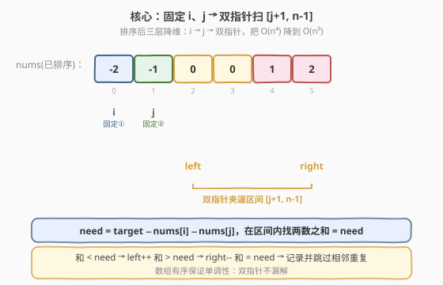
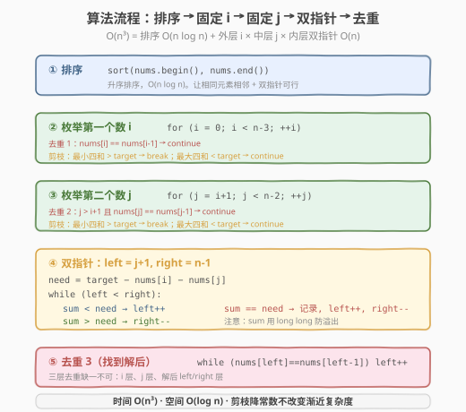
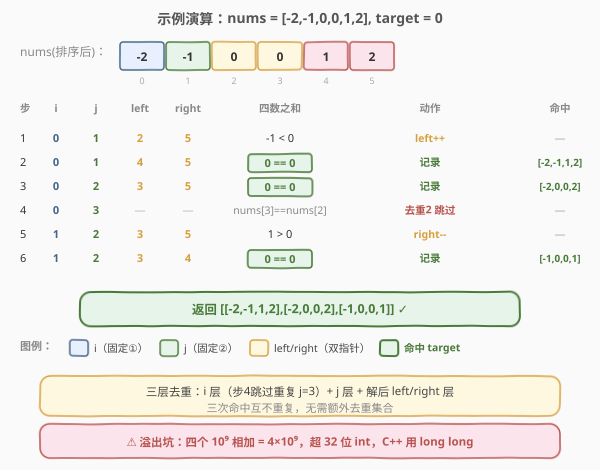

# 四数之和

- **题目名称**：四数之和
- **链接**：[18. 四数之和](https://leetcode.cn/problems/4sum/)
- **难度**：中等
- **标签**：数组、双指针、排序

## 1. 题目概述

给定一个整数数组 `nums` 和一个目标值 `target`，返回所有满足「四元组之和等于 `target`」且**不重复**的四元组 `[nums[a], nums[b], nums[c], nums[d]]`（下标互不相同）。答案中同一四元组只能出现一次，顺序任意。

**示例 1**：

```text
输入：nums = [1,0,-1,0,-2,2], target = 0
输出：[[-2,-1,1,2],[-2,0,0,2],[-1,0,0,1]]
解释：四个不重复的四元组（去重后）如上，均和为 0
```

**示例 2**：

```text
输入：nums = [2,2,2,2,2], target = 8
输出：[[2,2,2,2]]
解释：唯一一个四元组 [2,2,2,2] 和为 8
```

**约束条件**：

- `1 <= nums.length <= 200`
- $-10^9 \leq \text{nums}[i] \leq 10^9$
- $-10^9 \leq \text{target} \leq 10^9$

> 💡 本题是 [Day 15 三数之和](15_三数之和.md) 的直接升级版——把"固定一个 + 双指针"再叠一层，变成"固定两个 + 双指针"。掌握这个递推后，**所有 k-sum 问题都能用同一套模板降维**：排序后，外层固定 `k-2` 个数，最内层用双指针找两数之和。注意一个新坑：四个 $10^9$ 相加可达 $4 \times 10^9$，**会溢出 32 位 int**，C++ 中求和必须用 `long long`。

---

## 2. 解题思路

### 2.1 暴力思路：四重循环枚举

最直接的做法：四重循环枚举所有 `(a, b, c, d)` 组合，判断 `nums[a]+nums[b]+nums[c]+nums[d]==target`，再用集合去重。

```text
for a in 0..n:
    for b in a+1..n:
        for c in b+1..n:
            for d in c+1..n:
                if nums[a]+nums[b]+nums[c]+nums[d]==target: 加入结果
去重
```

时间复杂度 $O(n^4)$，`n=200` 时约 $1.6 \times 10^9$ 次运算，**超时**。且去重同样繁琐。

> ⚠️ 暴力法两个老问题：① 四重循环 $O(n^4)$ 太慢；② 去重逻辑复杂。破局思路与三数之和完全一致——先排序，把"无序"变"有序"，就能用双指针把最内两层循环合并成 $O(n)$。

### 2.2 核心观察：排序 + 固定两个 + 双指针

**关键转换**：先对数组**升序排序**。排序后：

1. **双指针可行**：固定前两个数 `nums[i]`、`nums[j]`，在剩余区间 `[j+1, n-1]` 用左右双指针 `left`/`right` 找两数之和等于 `target - nums[i] - nums[j]`。数组有序，根据和的大小单调移动指针。
2. **去重简单**：相同元素相邻，跳过相邻重复值即可避免重复四元组。



**双指针移动规则**（设 `need = target - nums[i] - nums[j]`）：

- 若 `nums[left] + nums[right] < need`：和太小，`left++`
- 若 `nums[left] + nums[right] > need`：和太大，`right--`
- 若 `nums[left] + nums[right] == need`：找到一组，记录后 `left++` 且 `right--`，并跳过相邻重复值

> 💡 **正确性保证与三数之和同源**：数组有序带来单调性。当 `nums[left]+nums[right] < need` 时，对当前 `left`，任何 `right' < right` 配出的和更小，都不可能是解，所以 `left` 可安全右移——不会漏掉以当前 `left` 开头的解。

### 2.3 算法流程图



**完整步骤**：

1. **排序**：`nums` 升序排序，$O(n \log n)$
2. **枚举第一个数** `i`：从 `0` 到 `n-4`
   - **去重 1**：若 `nums[i] == nums[i-1]`，跳过
   - **剪枝 1a**：若 `nums[i] + nums[i+1] + nums[i+2] + nums[i+3] > target`，最小的四个都已超 target，`break`
   - **剪枝 1b**：若 `nums[i] + nums[n-3] + nums[n-2] + nums[n-1] < target`，`nums[i]` 配最大的三个都不够，`continue`
3. **枚举第二个数** `j`：从 `i+1` 到 `n-3`
   - **去重 2**：若 `j > i+1` 且 `nums[j] == nums[j-1]`，跳过
   - **剪枝 2a**：若 `nums[i] + nums[j] + nums[j+1] + nums[j+2] > target`，`break`
   - **剪枝 2b**：若 `nums[i] + nums[j] + nums[n-2] + nums[n-1] < target`，`continue`
4. **双指针找两数之和 =** `target - nums[i] - nums[j]`：`left = j+1`，`right = n-1`
   - 和 < need：`left++`
   - 和 > need：`right--`
   - 和 == need：记录四元组，`left++`、`right--`，并**跳过相邻重复**的 `nums[left]` 和 `nums[right]`
5. 返回所有记录的四元组

### 2.4 示例演算

以 `nums = [-2,-1,0,0,1,2]`（排序后），`target = 0` 为例，`n = 6`，下标 `0..5`：



| 步骤 | i | nums[i] | j | nums[j] | left | right | 四数之和 | 动作 | 结果 |
|------|---|---------|---|---------|------|-------|----------|------|------|
| 1 | 0 | -2 | 1 | -1 | 2 (0) | 5 (2) | -2-1+0+2 = -1 < 0 | left++ | — |
| 2 | 0 | -2 | 1 | -1 | 4 (1) | 5 (2) | -2-1+1+2 = 0 == 0 | 命中 `[-2,-1,1,2]` | `[-2,-1,1,2]` |
| 3 | 0 | -2 | 2 | 0 | 3 (0) | 5 (2) | -2+0+0+2 = 0 == 0 | 命中 `[-2,0,0,2]` | `[-2,0,0,2]` |
| 4 | 0 | -2 | 3 | 0 | — | — | `nums[3]==nums[2]` | 去重 2 跳过 j=3 | — |
| 5 | 1 | -1 | 2 | 0 | 3 (0) | 5 (2) | -1+0+0+2 = 1 > 0 | right-- | — |
| 6 | 1 | -1 | 2 | 0 | 3 (0) | 4 (1) | -1+0+0+1 = 0 == 0 | 命中 `[-1,0,0,1]` | `[-1,0,0,1]` |

最终得到三组解 `[[-2,-1,1,2],[-2,0,0,2],[-1,0,0,1]]`。注意 `j=3` 时 `nums[3]==nums[2]==0`，被**去重 2** 跳过，避免与 `j=2` 重复命中 `[-2,0,0,2]`。

> 💡 去重是本题最易错的点，**三层去重**缺一不可：① `i` 层去重；② `j` 层去重；③ 找到解后 `left`/`right` 去重。

---

## 3. 参考代码

### C++

```cpp
// 四数之和.cpp —— 排序 + 固定两个 + 双指针 + 三层去重 + 剪枝
// 编译: g++ -O2 -std=c++17 四数之和.cpp -o foursum
#include <vector>
#include <algorithm>
using namespace std;

class Solution {
  public:
    vector<vector<int>> fourSum(vector<int>& nums, int target) {
        vector<vector<int>> result;
        int n = nums.size();
        sort(nums.begin(), nums.end()); // ① 排序

        for (int i = 0; i < n - 3; ++i) { // ② 枚举第一个数
            // 去重 1：跳过相邻重复的 nums[i]
            if (i > 0 && nums[i] == nums[i - 1])
                continue;
            // 剪枝 1a：最小的四个都已 > target
            if ((long)nums[i] + nums[i + 1] + nums[i + 2] + nums[i + 3] > target)
                break;
            // 剪枝 1b：nums[i] 配最大的三个仍 < target
            if ((long)nums[i] + nums[n - 3] + nums[n - 2] + nums[n - 1] < target)
                continue;

            for (int j = i + 1; j < n - 2; ++j) { // ③ 枚举第二个数
                // 去重 2：跳过相邻重复的 nums[j]
                if (j > i + 1 && nums[j] == nums[j - 1])
                    continue;
                // 剪枝 2a
                if ((long)nums[i] + nums[j] + nums[j + 1] + nums[j + 2] > target)
                    break;
                // 剪枝 2b
                if ((long)nums[i] + nums[j] + nums[n - 2] + nums[n - 1] < target)
                    continue;

                int left = j + 1, right = n - 1; // ④ 双指针
                while (left < right) {
                    long sum = (long)nums[i] + nums[j] + nums[left] + nums[right];
                    if (sum < target) {
                        ++left;
                    } else if (sum > target) {
                        --right;
                    } else {
                        result.push_back({nums[i], nums[j], nums[left], nums[right]});
                        ++left;
                        --right;
                        // 去重 3：跳过相邻重复的 left 和 right
                        while (left < right && nums[left] == nums[left - 1])
                            ++left;
                        while (left < right && nums[right] == nums[right + 1])
                            --right;
                    }
                }
            }
        }
        return result;
    }
};
```

### Python

```python
class Solution:
    def fourSum(self, nums: list[int], target: int) -> list[list[int]]:
        nums.sort()                              # ① 排序
        result = []
        n = len(nums)

        for i in range(n - 3):                   # ② 枚举第一个数
            if i > 0 and nums[i] == nums[i - 1]: # 去重 1
                continue
            # 剪枝 1a / 1b
            if nums[i] + nums[i + 1] + nums[i + 2] + nums[i + 3] > target:
                break
            if nums[i] + nums[n - 3] + nums[n - 2] + nums[n - 1] < target:
                continue

            for j in range(i + 1, n - 2):        # ③ 枚举第二个数
                if j > i + 1 and nums[j] == nums[j - 1]:  # 去重 2
                    continue
                # 剪枝 2a / 2b
                if nums[i] + nums[j] + nums[j + 1] + nums[j + 2] > target:
                    break
                if nums[i] + nums[j] + nums[n - 2] + nums[n - 1] < target:
                    continue

                left, right = j + 1, n - 1       # ④ 双指针
                while left < right:
                    total = nums[i] + nums[j] + nums[left] + nums[right]
                    if total < target:
                        left += 1
                    elif total > target:
                        right -= 1
                    else:
                        result.append([nums[i], nums[j], nums[left], nums[right]])
                        left += 1
                        right -= 1
                        # 去重 3
                        while left < right and nums[left] == nums[left - 1]:
                            left += 1
                        while left < right and nums[right] == nums[right + 1]:
                            right -= 1
        return result
```

> ⚠️ **溢出坑**：`nums[i]` 取值达 $10^9$，四数之和最大 $4 \times 10^9$，超过 32 位 `int` 上界（约 $2.1 \times 10^9$）。C++ 必须把求和转为 `long`/`long long`，**剪枝里的求和同样要转**（`(long)nums[i] + ...`），否则剪枝判定本身会溢出得到错误结果。Python 整数无上限，无需处理。

---

## 4. 复杂度分析

| 维度 | 复杂度 | 说明 |
|------|--------|------|
| **时间复杂度** | $O(n^3)$ | 排序 $O(n \log n)$ + 外层 `i` 轮 $n$ × 中层 `j` 轮 $n$ × 内层双指针 $O(n)$ = $O(n^3)$；剪枝降低常数但不改变渐近复杂度 |
| **空间复杂度** | $O(\log n)$ | 排序的栈空间；返回结果不计入 |
| **最优时间** | $O(n^3)$ | 已知最优解（4-sum 无 $O(n^2)$ 解法，除非允许近似或额外假设） |

> 💡 **为什么剪枝重要？** 渐近复杂度不变，但 `n=200` 时 $O(n^3) = 8 \times 10^6$ 本就在时限内，剪枝主要把"大量明显无解的 `(i,j)`"提前排除，常数大幅下降，对极端用例（全相同元素、target 极端）尤其有效。

---

## 5. 扩展：k-sum 通用模板

四数之和的"固定两个 + 双指针"可继续推广——**任意 k-sum 都能递归降维**：排序后固定前 `k-2` 个数，最内层用双指针找两数之和。

| k | 解法 | 时间复杂度 |
|---|------|-----------|
| 2 | 双指针 / 哈希 | $O(n)$ / $O(n)$ |
| 3 | 固定 1 个 + 双指针 | $O(n^2)$ |
| 4 | 固定 2 个 + 双指针 | $O(n^3)$ |
| k | 固定 `k-2` 个 + 双指针 | $O(n^{k-1})$ |

**递归写法**（面试可作为加分项提及）：把 k-sum 写成 `kSum(start, k, target)`：当 `k==2` 退化为双指针；否则枚举第一个数后递归调用 `(k-1)-sum`，每层做去重和剪枝。这样三数之和、四数之和共用一份代码。

> 💡 工业界对 $k \geq 4$ 也常用哈希预计算两数之和（pair sum），把 4-sum 降到 $O(n^2)$，但需额外 $O(n^2)$ 空间且去重更复杂。面试中双指针递归模板更稳、更易讲清。

---

## 6. 面试要点

1. **四数之和与三数之和的最大区别是什么？**

   - 结构上只是多套一层"固定 `j`"的循环，去重也从两层变三层。
   - **关键新坑是溢出**：三数之和求和最大 $3 \times 10^5$（旧约束）或 $3 \times 10^9$（新约束），而四数之和四个 $10^9$ 相加达 $4 \times 10^9$，**必溢出 32 位**。C++ 求和用 `long long`，且剪枝里的求和也要转。这是面试高频追问点。

2. **三层去重各是什么？漏掉会怎样？**

   - **`i` 层**：`if (i>0 && nums[i]==nums[i-1]) continue`，避免第一个数重复枚举。
   - **`j` 层**：`if (j>i+1 && nums[j]==nums[j-1]) continue`，避免同一 `i` 下第二个数重复。注意条件是 `j>i+1`，保证 `j = i+1` 这个首个 `j` 不被误跳。
   - **解后层**：`while (nums[left]==nums[left-1]) left++`，避免同一 `(i,j)` 下用相同 `left` 再次匹配。
   - 任一层漏掉都会产生重复四元组。

3. **四道剪枝的正确性？**

   - **1a / 2a（break）**：数组升序，`nums[i]+nums[i+1]+nums[i+2]+nums[i+3]` 是以 `nums[i]` 开头的最小四数和；若已 > target，则更大的 `j/left/right` 只会更大，且 `i` 增大后最小和更大，故 `break` 整个 `i` 层。
   - **1b / 2b（continue）**：`nums[i]+nums[n-3]+nums[n-2]+nums[n-1]` 是以 `nums[i]` 开头的最大四数和；若仍 < target，当前 `i` 无解，但 `i` 增大可能够，故 `continue` 而非 `break`。
   - 面试常被追问"为什么一个是 break 一个是 continue"——单调性方向不同。

4. **为什么不用哈希表？**

   - 四数之和用哈希需 $O(n^2)$ 枚举两数 + 哈希查另两数，时间理论 $O(n^2)$ 更优，但**去重极复杂**（四元组无序，需排序后入集合，常数大、易错），且空间 $O(n^2)$。
   - 双指针 $O(n^3)$ 在 `n=200` 下仅 $8 \times 10^6$，完全在时限内，去重简洁、空间 $O(1)$，是标准解法。哈希方案仅在大 `n` 时才有理论优势。

5. **能否推广到 k 数之和？**

   - 能。递归模板：`kSum(start, k, target)`，`k==2` 时双指针，否则枚举首位后递归 `kSum(start+1, k-1, target-nums[start])`，每层做去重和剪枝。时间 $O(n^{k-1})$。这是"一题学一模板"的典型——三数、四数共用同一份递归骨架。

> 💡 **一句话总结**：四数之和是三数之和的自然延拓——多套一层"固定 `j`"，去重变三层，并新增溢出这个坑（C++ 用 `long long`）。它的"排序 + 固定 `k-2` 个 + 双指针扫剩余"模板可推广到任意 k-sum，是面试 k-sum 系列的统一套路。

---

## 7. 同类练习题
- [15. 三数之和](https://leetcode.cn/problems/3sum/)：固定 1 个 + 双指针，本题的母题
- [16. 最接近的三数之和](https://leetcode.cn/problems/3sum-closest/)：双指针找最接近 target，无需去重
- [454. 四数相加 II](https://leetcode.cn/problems/4sum-ii/)：四个独立数组、只需计数、用哈希分组两两求和 $O(n^2)$
- [1. 两数之和](https://leetcode.cn/problems/two-sum/)：哈希一次遍历，k-sum 系列的起点
