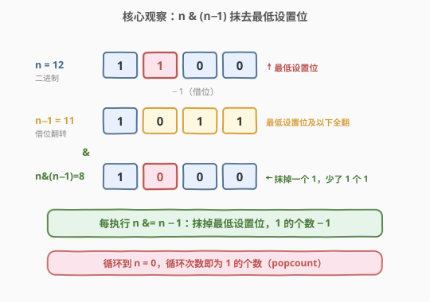
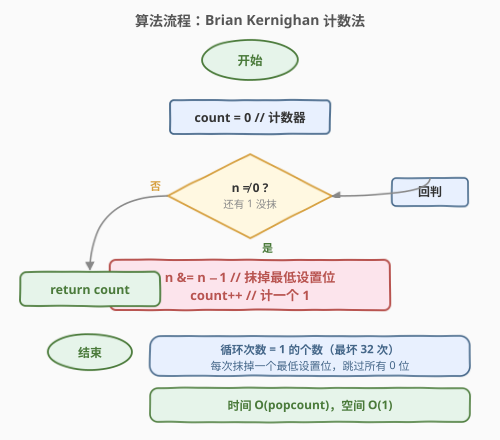
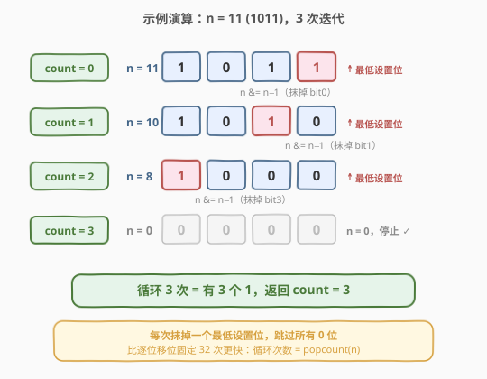

# LeetCode 位 1 的个数 题解

## 1. 题目概述

- **标题 / 题号**：位 1 的个数（#191，easy）
- **链接**：https://leetcode.cn/problems/number-of-1-bits/
- **难度**：简单
- **标签**：位运算、分治

**题意**：给定一个无符号整数 `n`（在 Java/C++ 中为 32 位无符号类型 `uint32_t`），编写函数返回它的二进制表示中 **`1` 的个数**（也称「汉明重量 / Hamming Weight / popcount」）。

> ⚠️ **输入解释**：题目以 32 位二进制串形式展示输入。在某些语言（如 Java）中没有无符号整数类型，输入会以**有符号整数**给出——例 3 中 `11111111111111111111111111111101` 是 32 位补码表示的 `-3`。但无论是按有符号还是无符号解读，**其二进制各位完全相同**，因此实现不受影响。

**示例 1**：

```text
输入：n = 00000000000000000000000000001011
输出：3
解释：输入的二进制串 00000000000000000000000000001011 中，共有三位为 '1'。
```

**示例 2**：

```text
输入：n = 00000000000000000000000010000000
输出：1
解释：输入的二进制串 00000000000000000000000010000000 中，共有一位为 '1'。
```

**示例 3**：

```text
输入：n = 11111111111111111111111111111101
输出：31
解释：输入的二进制串 11111111111111111111111111111101 中，共有 31 位为 '1'。
```

**约束**：

- 输入是一个长度为 32 的二进制串。

> 💡 **进阶提示**：如果多次调用该函数，你将如何优化？答案是「查表法」或直接使用 CPU 的 `POPCNT` 指令（见第 5 节）。

## 2. 解题思路

### 2.1 暴力思路：逐位移位统计

最直观的做法是固定循环 32 次，每次取最低位 `n & 1` 累加，再右移 `n >>= 1`：

```python
count = 0
for _ in range(32):
    count += n & 1
    n >>= 1
return count
```

时间 $O(32) = O(1)$，空间 $O(1)$。能 AC，但**无论 `n` 中有几个 `1` 都要循环满 32 次**——当 `1` 很稀疏时（如 `n = 8`，只有一个 `1`），仍要空转 31 次检查 `0` 位，做了大量无用功。

> 💡 转机在于：能否**一次性跳过所有连续的 `0` 位**，只对真正的 `1` 做计数？`n & (n - 1)` 恰好能做到。

### 2.2 核心观察：`n & (n−1)` 抹去最低设置位



关键性质是 **Brian Kernighan 技巧**：`n & (n - 1)` 会把 `n` 的**最低设置位**（最右边的 `1`）抹成 `0`，其余各位不变。

理解这一点要看「减 1 借位」的过程。设 `n` 的最低设置位在第 `k` 位：

- 该位为 `1`，其右侧（更低）所有位均为 `0`；
- `n - 1` 时第 `k` 位向低位借位：第 `k` 位变 `0`，第 `0..k-1` 位全部由 `0` 翻转为 `1`，第 `k` 位以上保持不变；
- 再与 `n` 做按位与：第 `k` 位 `1 & 0 = 0`（抹掉）；更低位的 `0 & 1 = 0`（仍为 `0`）；更高位 `原 & 原 = 原`（不变）。

于是 `n & (n - 1)` 相比 `n` **恰好少了一个 `1`**，且这个被抹掉的正是最低设置位。

> 💡 **关键转化**：既然每次操作恰好消去一个 `1`，那么「**消到 `0` 一共操作了几次**」就等于 `n` 中 `1` 的个数。循环次数从「固定 32 次」变成「等于 popcount 次」。

### 2.3 算法流程图



算法只需一个计数器和一个循环：

1. `count = 0`。
2. 只要 `n ≠ 0`：执行 `n &= n - 1`（抹掉最低设置位），`count += 1`。
3. 循环结束时 `count` 即为 `1` 的个数。

> ⚠️ **正确性**：每轮循环 `n` 中 `1` 的个数严格减 1（最低设置位被抹去，其余不变）。有限位整数必有有限个 `1`，故循环必在 popcount 步后使 `n = 0` 终止，此时 `count` 恰好累加了 popcount 次。

### 2.4 示例演算

以示例 1 的 `n = 11`（二进制 `1011`，3 个 `1`）为例：



| 轮次 | n（十进制） | n（二进制） | n−1（二进制） | n & (n−1) | count |
|------|------------|------------|--------------|-----------|-------|
| 初始 | 11 | 1011 | — | — | 0 |
| 1 | 11 → 10 | 1011 | 1010 | 1010 | 1 |
| 2 | 10 → 8 | 1010 | 1001 | 1000 | 2 |
| 3 | 8 → 0 | 1000 | 0111 | 0000 | 3 |

3 轮后 `n = 0`，循环结束，`count = 3` ✓。注意每轮被抹掉的都是当前 `n` 的最低设置位（bit0 → bit1 → bit3），中间的 `0` 位被一次性跳过——这正是该技巧比逐位移位更快的根源。

## 3. 参考代码

### C++

```cpp
class Solution {
  public:
    int hammingWeight(uint32_t n) {
        int count = 0;
        while (n) {
            n &= n - 1;   // 抹掉最低设置位
            count++;
        }
        return count;
    }
};
```

### Python

```python
class Solution:
    def hammingWeight(self, n: int) -> int:
        count = 0
        while n:
            n &= n - 1    # 抹掉最低设置位
            count += 1
        return count
```

> ⚠️ **Python 的有符号整数陷阱**：Python 整数是**无限精度**的，负数采用「无限前导 `1`」的补码形式。若 `n` 是负数（如 `-3`），`n & (n - 1)` 会**永不归零**导致死循环。力扣在本题传给 Python 的是**无符号正值**（如把例 3 的串解读为 `4294967293`），故上述代码可直接通过。但若面试官刻意传入负数，需先截到 32 位：`n &= 0xFFFFFFFF`，再进入循环。

也可一行调用内置函数（语义等价，底层走 C 实现）：

```python
class Solution:
    def hammingWeight(self, n: int) -> int:
        return n.bit_count()          # Python 3.10+，最快
        # 或：return bin(n).count('1')
```

## 4. 复杂度分析

| 维度 | 复杂度 | 说明 |
|------|--------|------|
| 时间复杂度 | $O(\text{popcount}(n))$ | 循环次数恰为 `1` 的个数；最坏情况（32 位全 `1`）为 $O(32) = O(1)$ |
| 空间复杂度 | $O(1)$ | 仅用计数器 `count` 一个变量 |

> 💡 与逐位移位固定循环 32 次相比，Brian Kernighan 在 `1` 稀疏时优势明显（`n = 8` 只循环 1 次）。对 32 位整数二者最坏都是常数级，但本题作为「位运算入门母题」，`n & (n-1)` 是面试官最想听到的写法。

## 5. 扩展：其他 popcount 写法对比

数一个整数中 `1` 的个数有多种实现，复杂度与适用场景各异：

| 写法 | 循环次数 | 说明 |
|------|----------|------|
| 逐位移位 `n & 1; n >>= 1` | 固定 32 | 不跳 `0`，最朴素 |
| **Brian Kernighan `n &= n - 1`** | popcount | 跳过所有 `0` 位，本题最优解 |
| 查表法（256 项字节 LUT） | 4 | 每次按 8 位查表相加，适合高频调用 |
| `__builtin_popcount` / `n.bit_count()` | 1（CPU 指令） | 编译器映射到 `POPCNT` 指令，最快 |

**查表法**适合「频繁调用」的进阶场景：预计算 `0..255` 每个数的 popcount 存入 256 项数组，再把 32 位整数拆成 4 个字节分别查表相加，循环次数从 32 降到 4：

```cpp
int popcount(uint32_t n) {
    static int table[256] = { /* 0..255 的 popcount */ };
    return table[n & 0xff]
         + table[(n >> 8) & 0xff]
         + table[(n >> 16) & 0xff]
         + table[(n >> 24) & 0xff];
}
```

> 💡 **`n & (n−1)` 的另一经典应用——判断 2 的幂**：2 的幂的二进制只有一个 `1`，抹掉后必为 `0`，故 `n > 0 && (n & (n - 1)) == 0` 即可判定（见 [231. 2 的幂](https://leetcode.cn/problems/power-of-two/)）。同一个技巧，在本题用于「数 1」，在 231 用于「判 1 的个数是否恰为 1」。

## 6. 面试要点

1. **为什么 `n & (n−1)` 能抹去最低设置位？**

   - 设最低设置位在第 `k` 位。`n - 1` 向低位借位：第 `k` 位 `1→0`，第 `0..k-1` 位 `0→1`，更高位不变。与 `n` 按位与后，第 `k` 位 `1 & 0 = 0`（抹掉），更低位的 `0 & 1 = 0`（仍为 0），更高位 `原 & 原 = 原`。故结果只比 `n` 少一个最低设置位。

2. **Brian Kernighan 与逐位移位哪个更快？**

   - 循环次数：Brian Kernighan 为 popcount 次，逐位移位固定 32 次。`1` 稀疏时前者更快；最坏（全 `1`）都是 32 次。现代 CPU 有 `POPCNT` 单指令，`__builtin_popcount` / `n.bit_count()` 最快，但面试中 `n & (n-1)` 是展示位运算功底的标准答案。

3. **Python 中负数输入会有什么坑？**

   - Python 整数无限精度，负数补码有无限前导 `1`，`n & (n - 1)` 永不归零，死循环。需先 `n &= 0xFFFFFFFF` 截断到 32 位再循环。力扣本题传入无符号正值故无需处理，但面试时要主动提及这一语言差异。

4. **如何用该技巧判断一个数是否为 2 的幂？**

   - 2 的幂的二进制恰有一个 `1`，`n & (n - 1)` 把它抹掉后为 `0`。加上 `n > 0` 排除 `n = 0`，即 `n > 0 && (n & (n - 1)) == 0`。注意 `n = 1` 也满足（$2^0 = 1$）。

5. **时间复杂度是 $O(1)$ 还是 $O(\text{popcount})$？**

   - 严格说是 $O(\text{popcount}(n))$，循环次数等于 `1` 的个数。但 32 位整数 popcount 上界为 32，故也可视作 $O(1)$（最坏 32 次常数级操作）。两种表述都对，关键是能说清「循环次数 = 1 的个数」这一性质。

## 同类练习题

| # | 题目 | 与本题的关联 |
|---|------|-------------|
| 338 | [比特位计数](https://leetcode.cn/problems/counting-bits/)（[题解](../0301-0400/338_比特位计数.md)） | 对 `0..n` 每个数求 popcount，用 DP 复用 `ans[i & (i-1)]`，本题的「批量版」 |
| 461 | [汉明距离](https://leetcode.cn/problems/hamming-distance/) | 两数异或后数 `1`，popcount 的直接应用 |
| 190 | [颠倒二进制位](https://leetcode.cn/problems/reverse-bits/) | 同样逐位处理 32 位无符号数，位运算基础练习 |
| 231 | [2 的幂](https://leetcode.cn/problems/power-of-two/) | 用 `n & (n-1) == 0` 判定，同一技巧的另一经典应用 |
| 1356 | [根据数字二进制下 1 的数目排序](https://leetcode.cn/problems/sort-integers-by-the-number-of-1-bits/) | 先算每个数的 popcount 再排序，可用本题技巧预处理 |
