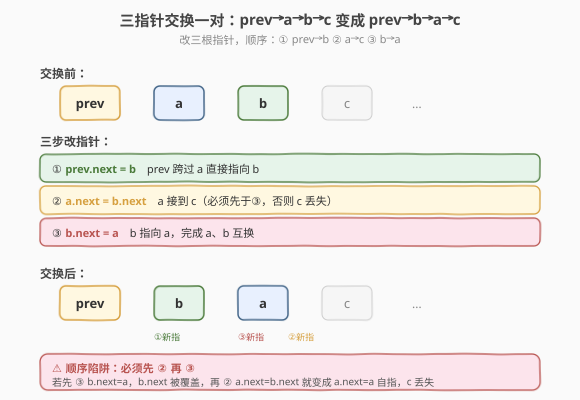
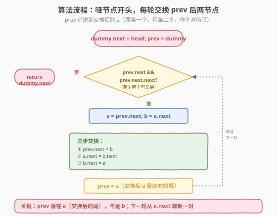
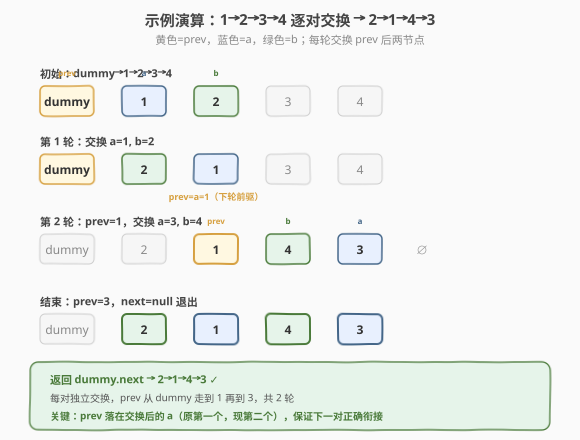

# LeetCode 两两交换链表中的节点 题解

## 1. 题目概述

- **标题 / 题号**：两两交换链表中的节点（#24，medium）
- **链接**：https://leetcode.cn/problems/swap-nodes-in-pairs/
- **难度**：中等
- **标签**：链表

**题意**：给定一个单链表，**两两交换**其中**相邻的节点**，并返回交换后链表的头节点。必须实际**修改节点指针**（不能只交换值）。如果节点数为奇数，最后一个节点保持原位。

**示例 1**：

```text
输入：head = [1,2,3,4]
输出：[2,1,4,3]
解释：交换 (1,2) → (2,1)，交换 (3,4) → (4,3)，得到 2→1→4→3。
```

**示例 2**：

```text
输入：head = []
输出：[]
```

**示例 3**：

```text
输入：head = [1]
输出：[1]
解释：只有一个节点，无法成对，保持原样。
```

**约束**：

- 链表节点数目范围 `[0, 100]`
- `0 <= Node.val <= 100`

> 💡 这是链表**指针操作**的经典题，和 [反转链表（206）](../0201-0300/206_反转链表.md)、[K 个一组翻转（25）](25_K个一组翻转链表.md) 一脉相承。核心是**哑节点 + 三指针**：用 `prev` 指向待交换对的前驱，每次交换它后面的两个节点 `a` 和 `b`，把 `prev→a→b→...` 变成 `prev→b→a→...`。K=2 的特例就是本题，掌握它再推广到 K 个一组翻转。

## 2. 解题思路

### 2.1 暴力思路：只交换值

遍历链表，每两个节点交换它们的 `val`，指针不动。代码极简：

```python
curr = head
while curr and curr.next:
    curr.val, curr.next.val = curr.next.val, curr.val
    curr = curr.next.next
```

能过测试，但**不符合题意**。题目明确要求"不能通过改变节点内部的值来交换节点，需要实际进行节点交换"。更关键的是：一旦节点带额外信息（如 [138. 复制带随机指针的链表](https://leetcode.cn/problems/copy-list-with-random-pointer/) 里的 `random` 指针），只换值会留下错误引用。面试官会立刻追问"能不能改指针？"。

> ⚠️ 暴力法的硬伤：① 违反题意（明确禁止换值）；② 节点带额外字段时失效。链表题的"正解"永远是**改指针指向**，换值只是取巧。从一开始就用指针操作，避免面试翻车。

### 2.2 核心观察：哑节点 + 三指针逐对交换

**为什么需要哑节点？** 交换后，原 `head`（第一个节点）会被换到第二位，新头变成原第二个节点。若没有哑节点，要单独处理"换头"这一边界。引入**哑节点** `dummy`，让 `dummy.next = head`，则第一对的交换和后续每对完全统一，最后返回 `dummy.next` 即可。

**三指针交换一对**：设 `prev` 指向待交换对的前驱，待交换的是 `a = prev.next` 和 `b = a.next`。目标是把 `prev → a → b → c` 改成 `prev → b → a → c`（`c = b.next`）。需要改三根指针：



1. `prev.next = b`（prev 跨过 a 指向 b）
2. `a.next = b.next`（a 接到 c，即原 b 的下一个）
3. `b.next = a`（b 指向 a，完成 a、b 互换）

> 💡 **三步顺序很关键**：必须先让 `a.next = b.next`（或先存 `c = b.next`），否则第 3 步 `b.next = a` 会覆盖掉 `b.next`，丢失 c 的位置。安全写法是先把三根指针都算清楚再依次赋值，或用临时变量存 `b.next`。改指针的题最容易在"覆盖"上翻车，画图 + 理清顺序是法宝。

### 2.3 算法流程图



**完整步骤**：

1. **建哑节点**：`dummy = ListNode(0)`，`dummy.next = head`，`prev = dummy`
2. **循环**：当 `prev.next` 和 `prev.next.next` 都非空（至少还有两个节点可交换）：
   - `a = prev.next`，`b = a.next`
   - 三步交换：`prev.next = b`；`a.next = b.next`；`b.next = a`
   - `prev = a`（a 交换后是这对的第二个，即下一对的前驱）
3. **返回** `dummy.next`（新头）

> ⚠️ 循环条件 `prev.next && prev.next.next` 保证每次交换都有**完整的一对**。奇数链最后一个节点不满足"两个"，自动跳过保持原位。`prev` 每轮前进两步（到交换后的 `a`，即原 `a` 现在是这对的尾、下对的前驱），保证每对独立处理。

### 2.4 示例演算

以 `head = [1,2,3,4]` 为例：



| 轮次 | prev 位置 | 待交换对 | 交换后链表 | prev 前进到 |
|------|-----------|---------|-----------|------------|
| 初始 | dummy | 1, 2 | dummy→1→2→3→4 | — |
| 第 1 轮 | dummy | a=1, b=2 | dummy→2→1→3→4 | 节点 1 |
| 第 2 轮 | 节点 1 | a=3, b=4 | dummy→2→1→4→3 | 节点 3 |
| 结束 | 节点 3 | prev.next=null | — | — |

最终 `dummy.next` 指向 2，返回 `2→1→4→3`，与示例 1 一致。

> 💡 注意 `prev` 的移动：每轮交换后，`a`（原第一个节点）变成了这对的第二个，正好是下一对的前驱。所以 `prev = a` 而不是 `prev = b`——这是最容易写错的地方。画图确认"交换后谁在前、谁在后"再决定 `prev` 落点。

## 3. 参考代码

### C++

```cpp
/**
 * Definition for singly-linked list.
 * struct ListNode {
 *     int val;
 *     ListNode *next;
 *     ListNode() : val(0), next(nullptr) {}
 *     ListNode(int x) : val(x), next(nullptr) {}
 *     ListNode(int x, ListNode *next) : val(x), next(next) {}
 * };
 */
class Solution {
  public:
    ListNode* swapPairs(ListNode* head) {
        ListNode* dummy = new ListNode(0);
        dummy->next = head;
        ListNode* prev = dummy;
        while (prev->next != nullptr && prev->next->next != nullptr) {
            ListNode* a = prev->next;          // 待交换的第一个
            ListNode* b = a->next;             // 待交换的第二个
            // 三步交换：prev→a→b→c 变成 prev→b→a→c
            prev->next = b;                    // ① prev 跨过 a 指向 b
            a->next = b->next;                 // ② a 接到 c（先存 b->next 防覆盖）
            b->next = a;                       // ③ b 指向 a，完成互换
            prev = a;                          // a 交换后是这对的尾，作下轮 prev
        }
        return dummy->next;
    }
};
```

### Python

```python
# Definition for singly-linked list.
# class ListNode:
#     def __init__(self, val=0, next=None):
#         self.val = val
#         self.next = next
class Solution:
    def swapPairs(self, head: Optional[ListNode]) -> Optional[ListNode]:
        dummy = ListNode(0)
        dummy.next = head
        prev = dummy
        while prev.next and prev.next.next:    # 至少还有两个节点
            a = prev.next                      # 待交换的第一个
            b = a.next                         # 待交换的第二个
            # 三步交换：prev→a→b→c 变成 prev→b→a→c
            prev.next = b                      # ① prev 指向 b
            a.next = b.next                    # ② a 接到 c
            b.next = a                         # ③ b 指向 a
            prev = a                           # a 交换后是这对的尾，作下轮 prev
        return dummy.next
```

> 💡 两版代码逻辑一致。注意 C++ 用 `new` 建哑节点，严谨写法应在返回前 `delete dummy` 防内存泄漏，但 LeetCode 不强制。Python 由 GC 自动回收。三步交换的顺序不能乱：必须先 `a->next = b->next`（把 c 接到 a）再 `b->next = a`，否则 `b->next` 被覆盖后 c 就丢了。

## 4. 复杂度分析

| 维度 | 复杂度 | 说明 |
|------|--------|------|
| **时间复杂度** | `O(n)` | `prev` 每轮前进 2 步，遍历 `n/2` 轮，每轮 `O(1)` 操作，总 `O(n)` |
| **空间复杂度** | `O(1)` | 只用 `dummy`、`prev`、`a`、`b` 四个指针，常数额外空间 |

> ⚠️ 本题迭代法 `O(1)` 空间。若用递归，每层调用栈 `O(1)` 但深度 `O(n/2)`，总空间 `O(n)`，长链表可能栈溢出。面试默认写迭代法，递归作为思路展示。

## 5. 扩展：递归写法与 K 个一组翻转

### 5.1 递归写法

两两交换可以递归理解：**先交换后面的子链表，再把前两个节点接上**。

```python
def swapPairs(self, head):
    if not head or not head.next:         # 不足两个，直接返回
        return head
    new_head = head.next                  # 第二个节点变成新头
    head.next = self.swapPairs(new_head.next)  # 第一个节点接上后面已交换的子链
    new_head.next = head                  # 第二个节点指向第一个
    return new_head
```

递归的思路：把 `head` 和 `head.next` 当作一对，先把 `head.next.next` 开始的子链递归交换好，然后 `head.next = 子链新头`、`head.next.next = head`，完成本对交换。代码极简，但空间 `O(n)`，长链表慎用。

### 5.2 推广到 K 个一组翻转

本题是 [K 个一组翻转链表（25）](25_K个一组翻转链表.md) 在 `K=2` 时的特例。25 题中每 K 个一组翻转，套路完全一致：

- **哑节点**统一处理头部边界
- **`prev` 指向待翻转段的前驱**
- 翻转 `[a, ...]` 共 K 个节点后接回
- `prev` 前进到翻转段的尾（即原段首）

> 💡 把本题的"交换一对"理解成"翻转 K=2 的一组"，就能无缝迁移到 25 题。**哑节点 + prev 前驱 + 段内翻转 + 接回 + prev 前进**是分段链表操作的五步通用模板。

## 6. 面试要点

1. **为什么需要哑节点？**

   - 交换后头节点会变（原第二个变成新头）。没有哑节点要单独写"换头"逻辑，引入哑节点后第一对和后续每对的处理代码完全统一。
   - 通用原则：**链表操作可能改变头节点时，优先用哑节点**。合并有序链表、删除节点、分段翻转都靠它简化边界。

2. **三步交换的顺序为什么不能乱？**

   - 必须 `a->next = b->next` 在 `b->next = a` 之前。若先 `b->next = a`，`b.next` 被覆盖成 `a`，再 `a->next = b->next` 就变成 `a->next = a`，自指死循环，c 及后续节点全丢。
   - 安全做法：先用临时变量 `c = b->next`，或保证赋值顺序不破坏待用信息。改指针题的核心是**想清谁的信息还要用、别提前覆盖**。

3. **循环条件为什么是 `prev.next && prev.next.next`？**

   - 保证至少还有两个节点可交换。`prev.next` 判第一个节点存在，`prev.next.next` 判第二个存在。
   - 奇数链最后一个节点不满足"两个"，自动跳过保持原位，无需特判。短路求值保证 `prev.next` 为空时不求 `prev.next.next`，避免空指针。

4. **交换后 `prev` 为什么指向 `a` 而不是 `b`？**

   - 交换前是 `prev → a → b → c`，交换后是 `prev → b → a → c`。`a` 现在是这对的第二个，紧接下一对的前面，正是下一对的前驱。
   - 若 `prev = b`，下一轮会从 b 后面取节点交换，相当于跳过了 a，链表结构错乱。画图确认"交换后谁在尾"再定 `prev` 落点。

5. **迭代法和递归法如何选择？**

   - 迭代 `O(1)` 空间、不会爆栈，面试默认写法。
   - 递归代码简洁、体现"子问题"思维，但 `O(n)` 调用栈，链表超 ~1000 节点可能栈溢出。作为"另一种思路"回答即可，优先迭代。

> 💡 **一句话总结**：24 是链表指针操作的进阶题——哑节点统一边界，`prev` 指向待交换对前驱，三步把 `prev→a→b→c` 改成 `prev→b→a→c`，`prev` 前进到 `a`（交换后的尾）继续下一对。`O(n)` 一遍遍历、`O(1)` 空间。核心难点是**三步赋值顺序**和 **prev 落点**。它是 K 个一组翻转的 K=2 特例，掌握后 25 题就是分段套用同一模板。

## 同类练习题

| # | 题目 | 与本题的关联 |
|---|------|-------------|
| 206 | [反转链表](https://leetcode.cn/problems/reverse-linked-list/)（[题解](../0201-0300/206_反转链表.md)） | 链表指针操作基础，三指针掉头 |
| 25 | [K 个一组翻转链表](https://leetcode.cn/problems/reverse-nodes-in-k-group/)（[题解](25_K个一组翻转链表.md)） | 本题的 K 通用版，分段翻转 |
| 92 | [反转链表 II](https://leetcode.cn/problems/reverse-linked-list-ii/)（[题解](92_反转链表 II.md)） | 反转指定区间，哑节点 + 局部翻转 |
| 21 | [合并两个有序链表](https://leetcode.cn/problems/merge-two-sorted-lists/)（[题解](21_合并两个有序链表.md)） | 哑节点统一头处理的经典用法 |
| 445 | [两数相加 II](https://leetcode.cn/problems/add-two-numbers-ii/)（[题解](../0401-0500/445_两数相加 II.md)） | 链表 + 栈/反转，综合指针操作 |
