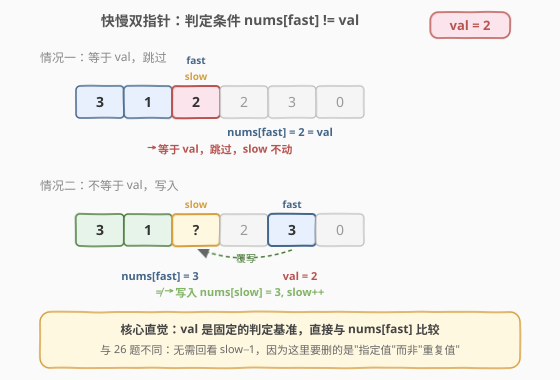
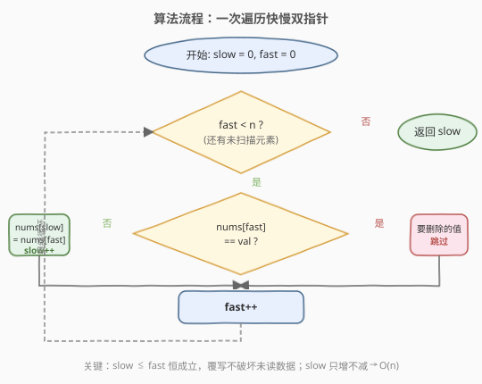

# 移除元素

- **题目名称**：移除元素
- **链接**：[27. 移除元素](https://leetcode.cn/problems/remove-element/)
- **难度**：简单
- **标签**：数组、双指针

## 1. 题目概述

给定一个整数数组 `nums` 和一个整数 `val`，请你**原地**移除所有数值等于 `val` 的元素，并返回移除后数组的新长度。

**元素的顺序可以改变**。不需要考虑数组中超出新长度后面的元素。

**不要使用额外的数组空间**，必须在原地修改输入数组并用 `O(1)` 额外空间完成。

**示例 1**：

```text
输入：nums = [3,2,2,3], val = 3
输出：2, nums = [2,2,_,_]
解释：函数应返回新的长度 2，并且原数组的前两个元素被修改为 2, 2。
     不需要考虑数组中超出新长度后面的元素。
```

**示例 2**：

```text
输入：nums = [0,1,2,2,3,0,4,2], val = 2
输出：5, nums = [0,1,3,0,4,_,_,_]
解释：函数应返回新的长度 5，并且原数组的前五个元素被修改为 0, 1, 3, 0, 4。
     注意这五个元素可为任意顺序。不需要考虑数组中超出新长度后面的元素。
```

**约束条件**：

- `0 <= nums.length <= 100`
- `0 <= nums[i] <= 50`
- `0 <= val <= 100`

> 💡 本题与 [26. 删除有序数组中的重复项](https://leetcode.cn/problems/remove-duplicates-from-sorted-array/)（[站内题解](../0001-0100/26_删除有序数组中的重复项.md)）是双指针原地覆写的"姊妹题"。区别在于：26 题数组**有序**、删除"重复值"，需回看 `slow−1`；本题数组**无序**、删除"指定值 `val`"，直接与 `val` 比较即可。此外本题允许**改变顺序**，这为"左右双指针交换"这一更优写法埋下了伏笔（见第 5 节）。

---

## 2. 解题思路

### 2.1 暴力思路

每遇到一个等于 `val` 的元素，就把后面所有元素整体前移一位覆盖它。两层循环：外层找 `val`，内层搬移。时间复杂度 $O(n^2)$，空间 $O(1)$。能出结果但效率低——**完全没有利用"双指针一次扫描"的结构**。

另一种直觉是新建数组，把不等于 `val` 的元素依次拷过去，但这需要 $O(n)$ 额外空间，违反原地要求。

### 2.2 核心观察：快慢双指针 + 与 val 直接比较



维护两个指针：

- **`slow`**：指向下一个**写入位置**（已保留部分的尾部）。
- **`fast`**：扫描每个元素（读取位置）。

判定条件非常直接——**`nums[fast] != val` 就写入，等于 `val` 就跳过**：

> 如果 `nums[fast] != val`，说明该元素要保留，写入 `nums[slow]` 并让 `slow` 前进一步；如果 `nums[fast] == val`，说明该元素要删除，`slow` 不动，`fast` 继续前进。

**为什么不需要像 26 题那样回看 `slow−1`？** 因为本题要删的是**一个固定的目标值 `val`**——判定基准是常数 `val`，直接拿 `nums[fast]` 和 `val` 比即可。26 题要删的是"重复值"，"重复"是相对概念，必须回看上一个保留的值 `nums[slow−1]` 才能判断。这是两题最本质的差异。

> ⚠️ **与 26 题的起始条件不同**：26 题首元素必保留，`slow` 从 `1` 起步；本题首元素也可能等于 `val` 需要删除，所以 **`slow` 和 `fast` 都从 `0` 起步**。

### 2.3 算法流程图



整个流程只有一重循环，`fast` 从 `0` 走到 `n - 1`，`slow` 只增不减，时间复杂度 $O(n)$。

### 2.4 示例演算

![示例演算：nums = [0,1,2,2,3,0,4,2], val = 2](../images/remove_element_walkthrough.svg)

以 `nums = [0,1,2,2,3,0,4,2]`，`val = 2` 为例：

- 第 1 步：`fast = 0`，`nums[0] = 0 ≠ 2` → 写入 `nums[0] = 0`（原位），`slow = 1`。
- 第 2 步：`fast = 1`，`nums[1] = 1 ≠ 2` → 写入 `nums[1] = 1`（原位），`slow = 2`。
- 第 3 步：`fast = 2`，`nums[2] = 2 == 2` → **跳过**，`slow` 不动。
- 第 4 步：`fast = 3`，`nums[3] = 2 == 2` → **跳过**，`slow` 不动。
- 第 5 步：`fast = 4`，`nums[4] = 3 ≠ 2` → 写入 `nums[2] = 3`，`slow = 3`。
- 第 6 步：`fast = 5`，`nums[5] = 0 ≠ 2` → 写入 `nums[3] = 0`，`slow = 4`。
- 第 7 步：`fast = 6`，`nums[6] = 4 ≠ 2` → 写入 `nums[4] = 4`，`slow = 5`。
- 第 8 步：`fast = 7`，`nums[7] = 2 == 2` → **跳过**。
- 最终 `slow = 5`，前 5 个元素为 `[0, 1, 3, 0, 4]`。

> 💡 注意第 5 步：连续跳过两个 `2` 后，`slow` 停在 `2`，`fast` 走到 `4`，写入 `nums[2] = 3` 正好覆盖掉第一个要删的 `2`。这正是"覆写不破坏未读数据"的体现——因为 `slow ≤ fast` 恒成立。

---

## 3. 参考代码

### C++

```cpp
class Solution {
  public:
    int removeElement(vector<int>& nums, int val) {
        int slow = 0; // 下一个写入位置
        for (int fast = 0; fast < (int)nums.size(); ++fast) {
            if (nums[fast] != val) {
                nums[slow] = nums[fast];
                ++slow;
            }
        }
        return slow;
    }
};
```

### Python

```python
class Solution:
    def removeElement(self, nums: list[int], val: int) -> int:
        slow = 0
        for fast in range(len(nums)):
            if nums[fast] != val:
                nums[slow] = nums[fast]
                slow += 1
        return slow
```

> ⚠️ **边界**：当 `n == 0` 时循环不执行，直接返回 `slow = 0`，结果正确；当所有元素都等于 `val` 时，`slow` 始终为 `0`，返回 `0`；当没有元素等于 `val` 时，每个元素都原位覆写自身，返回 `n`。三种边界都由同一套代码自然覆盖，无需特判。

---

## 4. 复杂度分析

| 维度 | 复杂度 | 说明 |
|------|--------|------|
| 时间复杂度 | $O(n)$ | `fast` 从 `0` 遍历到 `n - 1`，每个元素只访问一次 |
| 空间复杂度 | $O(1)$ | 仅使用 `slow`、`fast` 两个指针变量，原地覆写 |

---

## 5. 扩展：左右双指针交换（不保序，最少写入）

题目特别说明"**元素的顺序可以改变**"——这是在暗示存在更优写法。当要删除的元素**很少**时，快慢双指针仍会把每个保留元素都覆写一遍（即便它原本就在正确位置），写入次数为 $n - \text{count}(val)$。利用"可换序"这一自由度，可以把写入次数降到 $\text{count}(val)$。

**思路**：用左右两个指针，遇到要删的元素就从右端搬一个过来顶替：

- `left = 0`，`right = n - 1`。
- 当 `left <= right`：
  - 若 `nums[left] == val`：把 `nums[right]` 复制到 `nums[left]`，`right--`（**`left` 不动**，因为搬过来的元素也要重新判断）。
  - 否则：`left++`（该位置已确认保留）。
- 返回 `left`。

```cpp
class Solution {
  public:
    int removeElement(vector<int>& nums, int val) {
        int left = 0, right = (int)nums.size() - 1;
        while (left <= right) {
            if (nums[left] == val) {
                nums[left] = nums[right]; // 从右端搬一个过来
                --right;                  // 右端缩进，left 不动需复检
            } else {
                ++left;                   // 确认保留，前进
            }
        }
        return left;
    }
};
```

```python
class Solution:
    def removeElement(self, nums: list[int], val: int) -> int:
        left, right = 0, len(nums) - 1
        while left <= right:
            if nums[left] == val:
                nums[left] = nums[right]
                right -= 1
            else:
                left += 1
        return left
```

**两种写法对比**：

| 维度 | 快慢双指针（保序） | 左右交换（不保序） |
|------|--------------------|--------------------|
| 时间复杂度 | $O(n)$ | $O(n)$ |
| 写入次数 | $n - \text{count}(val)$（每个保留元素都写一次） | $\text{count}(val)$（只有删除位才触发一次搬移） |
| 保留元素相对顺序 | ✅ 保持 | ❌ 打乱 |
| `val` 很少时 | 仍写 $O(n)$ 次 | 仅写 $O(\text{count}(val))$ 次，更优 |
| `val` 很多时 | 写 $O(\text{count}(\text{非}val))$ 次 | 写 $O(\text{count}(val))$ 次，可能更多 |

> 💡 **面试怎么选**：如果题目**要求保持顺序**（如 26 题及多数变体），只能用快慢双指针；如果**允许换序**且关注"写入次数"（本题官方提示正是此意），左右交换更优——尤其当 `val` 出现稀疏时优势明显。两种写法都应掌握，面试时主动对比分析是加分项。

---

## 6. 面试要点

1. **本题与 26 题的核心区别是什么？**

   - 26 题删除"重复值"，重复是相对概念，必须回看 `nums[slow−1]` 判断；本题删除"指定值 `val`"，判定基准是常数，直接 `nums[fast] == val` 即可。起始条件也不同：26 题首元素必保留、`slow` 从 `1` 起；本题首元素可能就是 `val`，`slow` 从 `0` 起。

2. **`slow` 和 `fast` 的关系？会不会覆写未读数据？**

   - 不会。因为 `slow <= fast` 恒成立（`slow` 初始等于 `fast = 0`，且 `slow` 每次最多和 `fast` 同步前进，跳过时 `slow` 不动）。所以写入位置永远在读取位置之前或重合，不会覆盖尚未读取的值。

3. **题目说"顺序可以改变"，这意味着什么？**

   - 这是官方提示存在"左右双指针交换"这一更优解法。当 `val` 出现稀疏时，快慢双指针会把每个保留元素都覆写一遍；而左右交换只在遇到 `val` 时从右端搬一个过来，写入次数仅为 $\text{count}(val)$，远少于 $n$。代价是不保持相对顺序。

4. **左右交换法中，为什么 `nums[left] == val` 时 `left` 不前进？**

   - 因为从 `nums[right]` 搬过来的元素本身也可能是 `val`，必须原地重新判断。只有确认 `nums[left] != val` 后才能 `left++`。这是该写法最易错的点。

5. **如果数组为空或全部等于 `val` 怎么办？**

   - 两种写法都自然处理：空数组时快慢法返回 `0`、左右法 `left=0 > right=-1` 不进循环返回 `0`；全等于 `val` 时快慢法 `slow` 始终为 `0` 返回 `0`、左右法每次搬移后 `right` 递减直到 `left > right` 返回 `0`。无需特判。

---

## 7. 同类练习题

- [26. 删除有序数组中的重复项](https://leetcode.cn/problems/remove-duplicates-from-sorted-array/)（[站内题解](../0001-0100/26_删除有序数组中的重复项.md)）：删除"重复值"的姊妹题，需回看 `slow−1`，是本题套路的对照基准
- [80. 删除有序数组中的重复项 II](https://leetcode.cn/problems/remove-duplicates-from-sorted-array-ii/)（[站内题解](../0001-0100/80_删除有序数组中的重复项II.md)）：允许保留两次，回看 `slow−2`，26 题的扩展
- [283. 移动零](https://leetcode.cn/problems/move-zeroes/)（[站内题解](../0201-0300/283_移动零.md)）：把 0 移到末尾，快慢双指针原地覆写的另一经典应用，本质是"删除 0 后尾部补 0"
- [905. 按奇偶排序数组](https://leetcode.cn/problems/sort-array-by-parity/)：原地按奇偶分区，双指针思路同源（左右交换的典型场景）
- [977. 有序数组的平方](https://leetcode.cn/problems/squares-of-a-sorted-array/)（[站内题解](../0901-1000/977_有序数组的平方.md)）：对撞双指针填结果，双指针家族的另一形态
