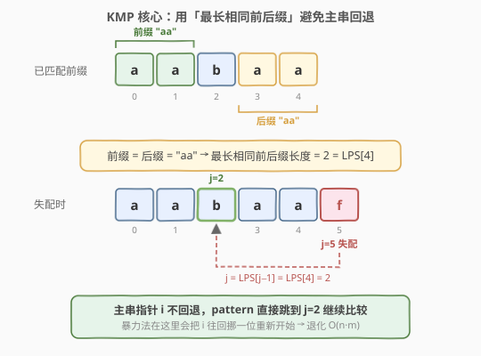
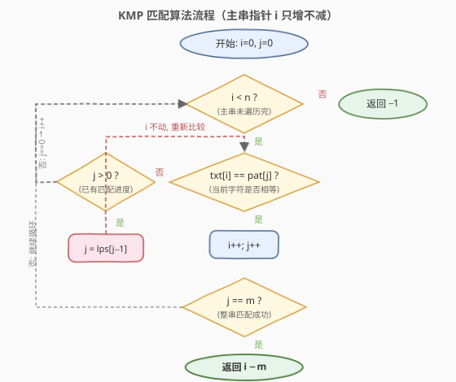
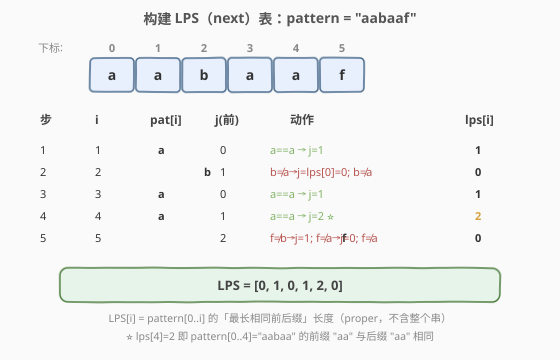
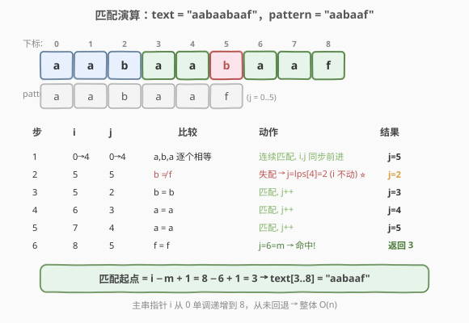

# 找出字符串中第一个匹配项的下标

- **题目名称**：找出字符串中第一个匹配项的下标
- **链接**：[28. 找出字符串中第一个匹配项的下标](https://leetcode.cn/problems/find-the-index-of-the-first-occurrence-in-a-string/)
- **难度**：简单
- **标签**：字符串、字符串匹配、KMP

## 1. 题目概述

给你两个字符串 `haystack` 和 `needle`，请你在 `haystack` 字符串中找出 `needle` 字符串的第一个匹配项的下标（下标从 0 开始）。如果 `needle` 不是 `haystack` 的一部分，则返回 `-1`。

**示例 1**：

```text
输入：haystack = "sadbutsad", needle = "sad"
输出：0
解释："sad" 在下标 0 处匹配。
```

**示例 2**：

```text
输入：haystack = "leetcode", needle = "leeto"
输出：-1
解释："leeto" 没有在 "leetcode" 中出现，所以返回 -1。
```

**约束条件**：

- $1 \leq \text{haystack.length}, \text{needle.length} \leq 10^4$
- `haystack` 和 `needle` 仅由小写英文字符组成。

---

## 2. 解题思路

### 2.1 暴力思路

最直观的做法：主串指针 `i` 从 0 开始，每个位置都尝试与 `needle` 逐字符比对。

- 用 `i` 标记主串起点，`j` 标记模式串当前位置。
- 若 `haystack[i+j] == needle[j]`，`j++` 继续比；若整串比完（`j == m`），返回 `i`。
- 一旦某字符失配，**主串起点回退到 `i+1`**，`j` 归零，重新开始。

```text
i = 0  →  匹配到一半失配 → i 回到 1，j 归零重来
i = 1  →  ...
```

问题在于：**每次失配都把主串指针往回挪一位**。当模式串有大量重复前后缀、主串也高度相似时（如 `text = "aaaaa...ab"`、`pat = "aaaab"`），每个起点都要几乎比到末尾才失败，总比较次数退化为 $O(n \cdot m)$。

> 本题数据范围 $10^4$，暴力 $O(n \cdot m)$ 在 LeetCode 上恰好能过（测试用例较弱），但面试官会追问「能不能做到 $O(n)$」。这正好引出 KMP。

### 2.2 核心观察：KMP 与「最长相同前后缀」

KMP 的关键洞察只有一句：**已经比过的字符别白比**。

暴力法失配后之所以要回退主串，是因为它丢掉了"前半段曾经匹配成功"这个信息。KMP 用一个 **LPS 表**（Longest Proper Prefix which is also Suffix，最长相同前后缀）把这份信息保存下来，让失配时**主串指针 `i` 不动**，只把模式串指针 `j` 跳到合适位置继续比即可。



上图以模式串 `aabaaf` 为例，当 `j=5`（字符 `f`）失配时：

- 此时 `pattern[0..4] = "aabaa"` 已经匹配成功。
- `"aabaa"` 存在长度为 2 的「相同前后缀」：前缀 `"aa"` == 后缀 `"aa"`。
- 这意味着主串当前位置之前的 2 个字符，恰好等于模式串开头的 2 个字符——**它们无需再比**。
- 于是令 `j = LPS[j-1] = LPS[4] = 2`，主串 `i` 原地不动，直接从 `pattern[2]` 接着比。

> 💡 **LPS 的定义**：`lps[i]` 表示 `pattern[0..i]` 这个前缀串里，**最长的、既是真前缀又是真后缀**的长度（"proper" 表示不能等于整个串本身）。所以 `lps[0] = 0` 恒成立。

### 2.3 算法流程图

KMP 分两步：先 **构建 LPS 表**（只看模式串自身，$O(m)$），再 **用 LPS 表匹配**（扫一遍主串，$O(n)$）。两步的指针移动逻辑几乎一模一样——都是 `while 失配则 j 回跳；匹配则 j++`。



**构建 LPS 表**（`j` 既是"当前已匹配的前缀长度"，也是待比较的下标）：

1. `lps[0] = 0`，`j = 0`。
2. 对 `i` 从 1 到 `m-1`：
   - 若 `pattern[i] != pattern[j]` 且 `j > 0`：`j = lps[j-1]`（回跳，不退出循环，继续比）。
   - 若 `pattern[i] == pattern[j]`：`j++`（前缀匹配长度 +1）。
   - `lps[i] = j`。

**匹配主串**（与构建过程同构，只是把"模式串自比"换成"主串比模式串"）：

1. `j = 0`。
2. 对 `i` 从 0 到 `n-1`：
   - 若 `text[i] != pattern[j]` 且 `j > 0`：`j = lps[j-1]`（**`i` 不动**，继续比）。
   - 若 `text[i] == pattern[j]`：`j++`。
   - 若 `j == m`：命中，返回 `i - m + 1`（即 `i - (m - 1)`）。
3. 扫完仍没命中，返回 `-1`。

> ⚠️ 注意两段 `while` 写法的区别：构建时是 `for i in 1..m-1` 带 `while` 回跳；匹配时是 `for i in 0..n-1` 带 `while` 回跳。**回跳时 `i` 永远不减小**，这是 $O(n)$ 的根本保证。

### 2.4 构建 LPS 表示例演算

以 `pattern = "aabaaf"` 为例逐位构建 LPS：



| 步骤 | i | pat[i] | j(前) | 动作 | lps[i] |
|------|---|--------|-------|------|--------|
| 1 | 1 | a | 0 | a==a → j=1 | 1 |
| 2 | 2 | b | 1 | b≠a→j=lps[0]=0; b≠a | 0 |
| 3 | 3 | a | 0 | a==a → j=1 | 1 |
| 4 | 4 | a | 1 | a==a → j=2 ⭐ | 2 |
| 5 | 5 | f | 2 | f≠b→j=1; f≠a→j=0; f≠a | 0 |

最终 `LPS = [0, 1, 0, 1, 2, 0]`。第 4 步 `lps[4]=2` 正是 `2.2` 节里失配时用到的那个值。

> 💡 第 2、5 步展示了"连续回跳"：失配后 `j` 可能要连跳好几层（`j=lps[j-1]` 套娃），直到要么匹配上、要么 `j` 跳到 0。这正是 `while` 而非 `if` 的原因。

### 2.5 匹配过程示例演算

用上面建好的 LPS 表，在 `text = "aabaabaaf"` 里找 `pattern = "aabaaf"`：



| 步骤 | i | j | 比较 | 动作 | 结果 |
|------|---|---|------|------|------|
| 1 | 0→4 | 0→4 | a,b,a 逐个相等 | 连续匹配, i,j 同步前进 | j=5 |
| 2 | 5 | 5 | b ≠ f | 失配 → j=lps[4]=2 (**i 不动**) ⭐ | j=2 |
| 3 | 5 | 2 | b = b | 匹配, j++ | j=3 |
| 4 | 6 | 3 | a = a | 匹配, j++ | j=4 |
| 5 | 7 | 4 | a = a | 匹配, j++ | j=5 |
| 6 | 8 | 5 | f = f | j=6=m → 命中! | 返回 3 |

匹配起点 `= i - m + 1 = 8 - 6 + 1 = 3`，即 `text[3..8] = "aabaaf"`，与示例一致。

> ⚠️ 重点看第 2 步：失配时 `i` 停在 5 没动，只有 `j` 从 5 跳到 2；第 3 步立刻接着比 `text[5]` 与 `pattern[2]`。整个过程中 `i` 从 0 单调递增到 8，**从未回退**——这正是 KMP 比 暴力法快的根源。

---

## 3. 参考代码

### 方法一：KMP（$O(n+m)$，推荐）

### C++

```cpp
class Solution {
  public:
    int strStr(string haystack, string needle) {
        int n = haystack.size(), m = needle.size();

        // 1. 构建 LPS 表（只看模式串自身）
        vector<int> lps(m, 0);
        for (int i = 1, j = 0; i < m; ++i) {
            while (j > 0 && needle[i] != needle[j]) j = lps[j - 1];
            if (needle[i] == needle[j]) ++j;
            lps[i] = j;
        }

        // 2. 用 LPS 表匹配主串（i 永不回退）
        for (int i = 0, j = 0; i < n; ++i) {
            while (j > 0 && haystack[i] != needle[j]) j = lps[j - 1];
            if (haystack[i] == needle[j]) ++j;
            if (j == m) return i - m + 1;
        }
        return -1;
    }
};
```

### Python

```python
class Solution:
    def strStr(self, haystack: str, needle: str) -> int:
        n, m = len(haystack), len(needle)

        # 1. 构建 LPS 表（只看模式串自身）
        lps = [0] * m
        j = 0
        for i in range(1, m):
            while j > 0 and needle[i] != needle[j]:
                j = lps[j - 1]
            if needle[i] == needle[j]:
                j += 1
            lps[i] = j

        # 2. 用 LPS 表匹配主串（i 永不回退）
        j = 0
        for i in range(n):
            while j > 0 and haystack[i] != needle[j]:
                j = lps[j - 1]
            if haystack[i] == needle[j]:
                j += 1
            if j == m:
                return i - m + 1
        return -1
```

> 💡 两段循环长得几乎一样：差别仅在"自比"还是"与主串比"，以及命中后的返回。把这段代码背下来，就等于掌握了 KMP 的全部骨架。

### 方法二：暴力（朴素匹配，$O(n \cdot m)$）

### C++

```cpp
class Solution {
  public:
    int strStr(string haystack, string needle) {
        int n = haystack.size(), m = needle.size();
        for (int i = 0; i + m <= n; ++i) {
            int j = 0;
            while (j < m && haystack[i + j] == needle[j]) ++j;
            if (j == m) return i;
        }
        return -1;
    }
};
```

### Python

```python
class Solution:
    def strStr(self, haystack: str, needle: str) -> int:
        n, m = len(haystack), len(needle)
        for i in range(n - m + 1):
            if haystack[i:i + m] == needle:
                return i
        return -1
```

> 暴力法胜在写法极简，本题数据范围下能直接 AC；但它无法应对「主串与模式串高度相似」的极端用例，面试追问时务必给出 KMP。

---

## 4. 复杂度分析

| 维度 | 方法 | 复杂度 | 说明 |
|------|------|--------|------|
| 时间复杂度 | KMP | $O(n + m)$ | 构建 LPS 扫一遍模式串 $O(m)$；匹配扫一遍主串 $O(n)$，`i` 与 `j` 均摊单调前进 |
| 空间复杂度 | KMP | $O(m)$ | LPS 表长度等于模式串长度 |
| 时间复杂度 | 暴力 | $O(n \cdot m)$ | 每个起点最坏比到模式串末尾才失败 |
| 空间复杂度 | 暴力 | $O(1)$ | 只用常数指针 |

> ⚠️ KMP 的 `while` 嵌在 `for` 里，看似 $O(n \cdot m)$，实则是 $O(n)$：`i` 在主串上单调不减，`j` 每次回跳都会让"已匹配长度"减少，而该长度总共增加不超过 $n$ 次（每次 `i++` 至多让 `j` +1），故 `j` 的回跳总次数 $\leq n$。这是经典的**均摊分析**。

---

## 5. 扩展：Rabin-Karp 滚动哈希

字符串匹配还有另一条思路：**不逐字符比，而是比"哈希值"**。Rabin-Karp 把模式串和主串中每个长度为 $m$ 的窗口都映射成一个整数哈希，匹配就变成"滑动窗口 + 滚动哈希"。

设基数 $b$（常取 26 或 256）、模数 $p$（大素数），窗口哈希为：

$$
H(s[l..l+m-1]) = \left( \sum_{k=0}^{m-1} s[l+k] \cdot b^{\,m-1-k} \right) \bmod p
$$

向右滑动一位时，可在 $O(1)$ 内由旧哈希推出新哈希（去掉最高位、左移、加上新低位），故整体 $O(n + m)$ 平均。哈希冲突时再逐字符校验，最坏 $O(n \cdot m)$。

- 优点：思路直、常数小、天然支持**多模式匹配**和**二维匹配**。
- 缺点：最坏退化、需处理大数取模；而 KMP 是严格的 $O(n+m)$ 最坏保证。

> 💡 单模式精确匹配首选 KMP；需要同时匹配多个模式串（或 AC 自动机场景）时，Rabin-Karp / Trie 系更顺手。

---

## 6. 面试要点

1. **KMP 为什么是 $O(n)$？**
   - 主串指针 `i` 只增不减；`j` 虽有 `while` 回跳，但回跳总次数不超过其增加总次数，而 `j` 的增加随 `i` 至多 $n$ 次。均摊后每个主串位置 $O(1)$。

2. **LPS（next 数组）的含义是什么？**
   - `lps[i]` = `pattern[0..i]` 的「最长相同真前后缀」长度。"真"意味着前后缀都不能等于整个串本身，所以 `lps[0] = 0`。

3. **为什么失配时是 `j = lps[j-1]`？**
   - 失配前已匹配 `pattern[0..j-1]`，它的最长相同前后缀长度为 `lps[j-1]`。这意味着该前缀的最后 `lps[j-1]` 个字符等于开头 `lps[j-1]` 个字符，直接让模式串开头对齐过去即可，主串指针 `i` 无需移动。

4. **KMP 和暴力法的本质区别？**
   - 暴力法失配时丢弃已匹配信息、主串回退，最坏 $O(n \cdot m)$；KMP 用 LPS 表把"已匹配前缀"的信息固化为跳转表，失配时只移动模式串指针，主串不回退，做到严格 $O(n+m)$。

5. **不同教材的 `next` 数组为什么长得不一样？**
   - 常见两种约定：① 本文用的 LPS（不右移，`lps[i]` 即前后缀长度）；② 把 LPS 整体右移一位、`next[0] = -1`，目的是让匹配循环里"失配且 `j==0`"和"失配且 `j>0`"统一成一种写法。两者本质等价，面试讲清自己用的约定即可。

6. **KMP 优势最明显的场景？**
   - 模式串有大量重复前后缀（如 `aaaaab`）且主串高度相似时。此时暴力法每个起点都几乎比到末尾才失败、退化到 $O(n \cdot m)$，而 KMP 仍是 $O(n)$。

---

## 7. 同类练习题

- [459. 重复的子字符串](https://leetcode.cn/problems/repeated-substring-pattern/)：直接复用 KMP 的 LPS 表——若 `n % (n - lps[n-1]) == 0` 则由循环节重复构成
- [1392. 最长快乐前缀](https://leetcode.cn/problems/longest-happy-prefix/)：LPS 表的"开箱即用"——`lps[n-1]` 即为所求最长相同前后缀
- [214. 最短回文串](https://leetcode.cn/problems/shortest-palindrome/)：对 `s + "#" + reverse(s)` 跑 KMP 求 LPS，从而找出 `s` 的最长回文前缀
- [686. 重复叠加字符串匹配](https://leetcode.cn/problems/repeated-string-match/)：用 KMP（或 Rabin-Karp）判断 `A` 重复几次后包含 `B`
- [796. 旋转字符串](https://leetcode.cn/problems/rotate-string/)：等价于判断 `goal` 是否为 `s + s` 的子串，KMP 一趟匹配即可
