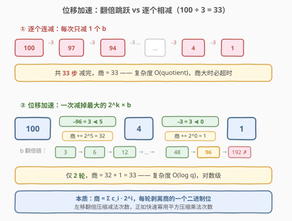
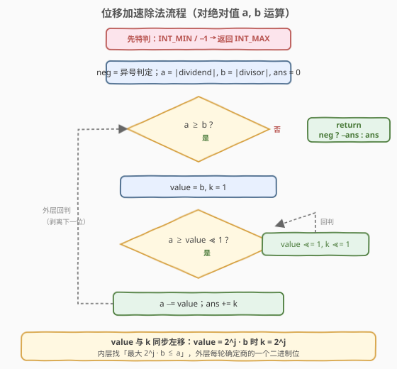
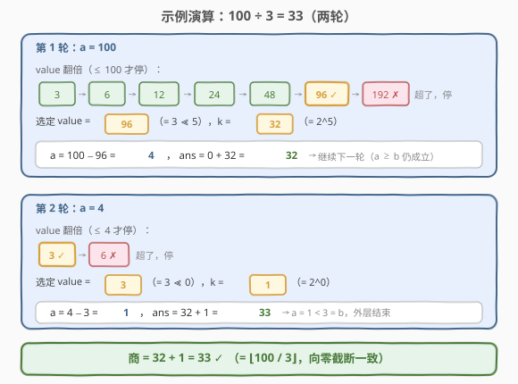

# 两数相除

- **题目名称**：两数相除
- **链接**：[29. 两数相除](https://leetcode.cn/problems/divide-two-integers/)
- **难度**：中等
- **标签**：位运算、数学

## 1. 题目概述

给定两个整数 `dividend` 和 `divisor`，将两数相除，要求**不使用乘法、除法和 mod 运算符**。返回商，且**截断小数部分（向零截断）**。

假设环境只能存储 32 位有符号整数，范围 $[-2^{31},\ 2^{31}-1]$。若结果溢出，返回 $2^{31}-1$。

**示例 1**：

```text
输入：dividend = 10, divisor = 3
输出：3
解释：10 / 3 = 3.333… ，向零截断后为 3。
```

**示例 2**：

```text
输入：dividend = 7, divisor = -3
输出：-2
解释：7 / -3 = -2.333… ，向零截断后为 -2（注意不是 -3）。
```

**示例 3**：

```text
输入：dividend = -2147483648, divisor = -1
输出：2147483647
解释：结果为 2^31，溢出，返回 INT_MAX。
```

**约束条件**：

- $-2^{31} \le$ `dividend, divisor` $\le 2^{31}-1$
- `divisor != 0`

> 💡 **除法的本质是连减**：`a / b` 的商，就是「能从 `a` 中连续减去多少个 `b`」。题目禁用 `*`/`/`/`%`，但**允许加减与位运算**——这就把思路导向「用减法模拟除法，用位移加速减法」。

---

## 2. 解题思路

### 2.1 暴力思路：逐个连减

最直白的做法：每次 `a -= b`，计数器 `+1`，直到 `a < b`。

- 问题：当商很大时（如 `2^31 / 1` 需减 $2^{31}$ 次），直接超时，复杂度 $O(\text{quotient})$。
- 直觉：能不能**一次多减点**？

### 2.2 核心观察：位移加速（成倍减）



关键想法：**与其逐个减 `b`，不如把 `b` 翻倍、再翻倍……一次减掉「最大的 $2^k \times b$」**。

> 💡 **二进制视角**：任何正整数都能写成若干 $2$ 的幂之和（就是它的二进制表示）。因此商 $q$ 也能拆成若干 $2^k$ 之和：
>
> $$q = c_{k} \cdot 2^{k} + c_{k-1} \cdot 2^{k-1} + \dots + c_{0} \cdot 2^{0},\quad c_i \in \{0,1\}$$
>
> 每一轮找出当前余数下「最大的 $2^j \times b \le a$」，减掉它，商就累加 $2^j$。这正是**快速幂**的姊妹思想——快速幂用「平方」把 $O(n)$ 次乘法降到 $O(\log n)$，这里用「左移翻倍」把 $O(q)$ 次减法降到 $O(\log q)$ 轮。

以 $100 / 3$ 为例：

- $b=3$，不断左移：$3, 6, 12, 24, 48, 96$（$\le 100$），下一个 $192 > 100$ 停。
- 一次减掉 $96$，余 $4$，商累加 $2^5 = 32$。
- 余 $4$：$3 \le 4$ 但 $6 > 4$，减掉 $3$，余 $1$，商累加 $2^0 = 1$。
- 余 $1 < 3$，结束。商 $= 32 + 1 = 33$。

逐个连减要 $33$ 步，位移加速只需 **2 轮**。

### 2.3 算法流程图



流程要点：

1. 先处理符号与溢出（见 2.5），统一对**绝对值** `a, b` 运算。
2. 外层 `while a >= b`：每一轮剥离商的一个「最高有效位」。
3. 内层 `while a >= (value << 1)`：把 `value` 和 `k` 同步翻倍，找到**不超过 `a` 的最大 $2^j \times b$**。
4. `a -= value; ans += k`：减掉这块，商累加对应的 $2^j$。
5. `a < b` 时结束，按符号返回 `ans`。

### 2.4 示例演算

以 `dividend = 100, divisor = 3` 完整走一遍：



| 轮次 | 起始 `a` | `value` 翻倍链（≤ a） | 选定 `value` / `k` | `a -= value` | `ans += k` |
|------|---------|----------------------|--------------------|-------------|-----------|
| 1 | 100 | 3 → 6 → 12 → 24 → 48 → 96（下一个 192 > 100 停） | 96 / 32 | 4 | 32 |
| 2 | 4   | 3（下一个 6 > 4 停） | 3 / 1 | 1 | 33 |

第二轮后 `a = 1 < 3 = b`，外层循环结束，`ans = 33`，与 $100 / 3 = 33.\overline{3}$ 向零截断结果一致。

### 2.5 边界与符号处理

> ⚠️ 本题有**三个语言陷阱**，是面试官最爱追问的点：

1. **唯一溢出**：`INT_MIN / -1 = 2^31`，超出 `INT_MAX`。这是 32 位范围内**唯一**的溢出情况，特判返回 `INT_MAX` 即可。
   - 为什么唯一？其余结果的绝对值都 $\le |a| \le 2^{31}$，且只有 `INT_MIN` 除以 `-1` 恰好等于 $2^{31}$（其余要么 $\le 2^{31}-1$，要么符号相反落在负半轴不溢出）。

2. **`INT_MIN` 取绝对值溢出**：`|-2^31| = 2^31` 无法存入 `int`。解决：用 `long`（C++，64 位）或 Python 的任意精度整数规避，对绝对值做运算，最后再套符号。

3. **向零截断 vs 向下取整**：题目要求**向零截断**（`7 / -3 = -2`，不是 `-3`）。对绝对值做除法、最后套符号，天然得到向零截断——因为「绝对值相除向下取整 + 套回原符号」恰好等价于「向零截断」。

   | 真实商 | 向零截断 | 向下取整 |
   |-------|---------|---------|
   | $2.3$ | $2$ | $2$ |
   | $-2.3$ | $-2$ | $-3$ |

符号判定用异或：`neg = (dividend < 0) ^ (divisor < 0)`——两者异号则结果为负。

---

## 3. 参考代码

### C++

```cpp
class Solution {
  public:
    int divide(int dividend, int divisor) {
        // 唯一溢出：INT_MIN / -1 = 2^31 > INT_MAX
        if (dividend == INT_MIN && divisor == -1) return INT_MAX;

        // 异号则结果为负；统一对绝对值运算，规避 INT_MIN 取绝对值溢出
        bool neg = (dividend < 0) ^ (divisor < 0);
        long a = labs((long)dividend);
        long b = labs((long)divisor);

        long ans = 0;
        while (a >= b) {
            long value = b, k = 1;
            // 翻倍找最大的 2^j * b <= a（value 与 k 同步左移）
            while (a >= (value << 1)) {
                value <<= 1;
                k <<= 1;
            }
            a -= value;
            ans += k;
        }
        return neg ? -ans : ans;
    }
};
```

### Python

```python
class Solution:
    def divide(self, dividend: int, divisor: int) -> int:
        # 唯一溢出：INT_MIN / -1
        if dividend == -2**31 and divisor == -1:
            return 2**31 - 1

        neg = (dividend < 0) ^ (divisor < 0)
        a, b = abs(dividend), abs(divisor)

        ans = 0
        while a >= b:
            value, k = b, 1
            # 翻倍找最大的 2^j * b <= a
            while a >= (value << 1):
                value <<= 1
                k <<= 1
            a -= value
            ans += k

        return -ans if neg else ans
```

> 💡 Python 整数无限精度，`abs(-2**31)` 不会溢出，无需 `long` 转换；但**仍需特判溢出**，因为题目要求返回值落在 32 位范围内。

---

## 4. 复杂度分析

| 维度 | 复杂度 | 说明 |
|------|--------|------|
| 时间复杂度 | $O((\log q)^2)$ 最坏，32 位下为常数 | 外层循环轮数 $=$ 商中置位个数 $\le \log q + 1$；每轮内层翻倍至多 $\log q$ 次。$q \le 2^{31}$ 时约 $\le 32^2 \approx 1000$ 次操作 |
| 空间复杂度 | $O(1)$ | 仅用 `a, b, value, k, ans` 等常数个变量 |

> ⚠️ `while` 嵌套看似 $O(q)$，实则**每轮内层翻倍是对数级**。最坏输入（如 $a = 2^{31}-1,\ b = 1$，商为全 1 的 31 位二进制）下外层 $31$ 轮、内层分别 $31, 30, \dots, 1$ 次，总和 $\approx \frac{31 \times 32}{2} \approx 500$，远小于 $2^{31}$。固定 32 位时可视为 $O(1)$。

---

## 5. 扩展：位长度法 —— $O(\log q)$ 的更优写法

上面的「倍增」版每次都要从 $b$ 重新翻倍，最坏 $O((\log q)^2)$。一个更精炼的 Python 写法直接**枚举位移量**，从高到低试每位，做到严格 $O(\log q)$：

```python
class Solution:
    def divide(self, dividend: int, divisor: int) -> int:
        if dividend == -2**31 and divisor == -1:
            return 2**31 - 1
        a, b = abs(dividend), abs(divisor)
        ans = 0
        # 最高可能的位移：a 与 b 的位长度之差
        for shift in range(a.bit_length() - b.bit_length(), -1, -1):
            if a >= (b << shift):
                a -= b << shift
                ans += 1 << shift
        return -ans if (dividend < 0) ^ (divisor < 0) else ans
```

| 版本 | 时间 | 思路 | 适用 |
|------|------|------|------|
| 倍增版（主代码） | $O((\log q)^2)$ | 每轮从 $b$ 重新翻倍找最大块 | C++/Python 通用，直观易懂 |
| 位长度版（扩展） | $O(\log q)$ | 预算最高位移，从高到低逐位「取或不取」 | Python（依赖 `bit_length`），更接近「二进制拆解」直觉 |

> 💡 位长度版本质是把商的**每个二进制位**独立判定：从最高位起，若 `b << shift` 能放进剩余 `a`，就减掉并把该位置 1。这与 [50. Pow(x, n)](../0001-0100/50_Powx_n.md) 的「从低到高取指数二进制位」是同一个套路的两面——快速幂取指数位，快速除取商位。

---

## 6. 面试要点

1. **为什么不能直接连减？**

   - 连减复杂度 $O(q)$，当 `dividend = 2^31, divisor = 1` 时需 $2^{31}$ 次循环，必然超时。必须用位移「成倍减」把轮数压到对数级。

2. **位移加速的本质是什么？和快速幂有什么联系？**

   - 商的二进制表示 $q = \sum c_i 2^i$。每轮找出当前余数下最大的 $2^j \times b$ 减掉，等价于确定商的一个二进制位。快速幂用「平方」压缩乘法次数，本题用「左移翻倍」压缩减法次数，同属「把算术运算翻译成位运算」的套路。

3. **唯一的溢出情况是什么？为什么是唯一？**

   - 仅 `INT_MIN / -1`：结果 $2^{31}$ 超出 `INT_MAX`。其余商的绝对值 $\le |a|/|b| \le 2^{31}$，且只有「最小负数除以 -1」这一组合恰好顶到 $2^{31}$，故特判这一种即可。

4. **为什么用 `long` / 统一取绝对值？**

   - `INT_MIN` 的绝对值 $2^{31}$ 无法存入 32 位 `int`，直接 `abs(INT_MIN)` 在 C++ 中是未定义行为。用 `long` 扩宽到 64 位规避；Python 整数无限精度则天然安全，但仍要特判最终返回值范围。

5. **如何保证「向零截断」而不是「向下取整」？**

   - 对绝对值做除法得到的是「向下取整的非负商」，再套回原符号。正数情况二者一致；负数情况「绝对值向下取整 + 套负号」= 向零截断（如 $|-7|/|3|=2$，套负号得 $-2$，正是向零截断结果）。这比用 `floor` 再修正符号更简洁。

6. **`neg = (dividend < 0) ^ (divisor < 0)` 里的异或为什么对？**

   - 异或语义「两值不同则为真」：两数异号（一正一负）时结果为负，`neg = true`；同号时 `neg = false`。这等价于符号位相乘为负，但用异或避免了一次乘法，契合题目「禁用乘法」的精神。

---

## 7. 同类练习题

- [371. 两整数之和](https://leetcode.cn/problems/sum-of-two-integers/)（[题解](../0301-0400/371_两整数之和.md)）：姊妹题，禁用 `+`/`-`，用位运算模拟加法（异或求和、与移位求进位），与本题同属「位运算模拟算术」
- [50. Pow(x, n)](https://leetcode.cn/problems/powx-n/)（[题解](../0001-0100/50_Powx_n.md)）：快速幂用「平方 + 取指数二进制位」把 $O(n)$ 降到 $O(\log n)$，与本题位移加速同构
- [166. 分数到小数](https://leetcode.cn/problems/fraction-to-recurring-decimal/)（[题解](../0101-0200/166_分数到小数.md)）：长除法模拟 + 哈希检测循环节，是「除法」的另一面——本题求商，那题求小数表示
- [191. 位 1 的个数](https://leetcode.cn/problems/number-of-1-bits/)（[题解](../0001-0100/191_位1的个数.md)）：位运算基础母题，打牢「按位思考」基本功，配合本题理解左移与二进制拆解
- [43. 字符串相乘](https://leetcode.cn/problems/multiply-strings/)（[题解](../0001-0100/43_字符串相乘.md)）：禁用内置运算的模拟算术题，与本题同为「把算术运算手写还原」一类
