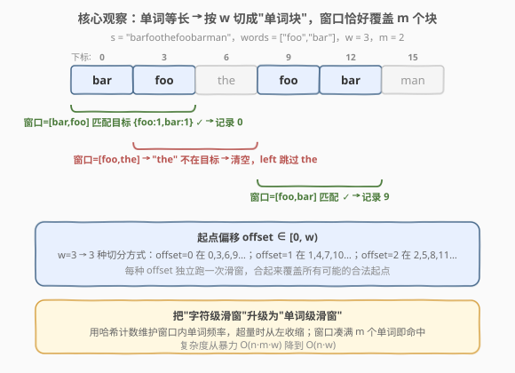
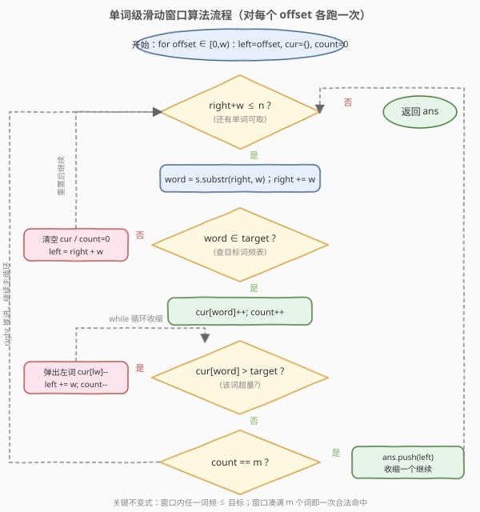
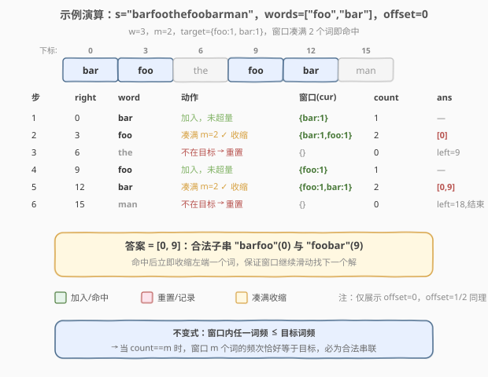

# 串联所有单词的子串

- **题目名称**：串联所有单词的子串
- **链接**：[30. 串联所有单词的子串](https://leetcode.cn/problems/substring-with-concatenation-of-all-words/)
- **难度**：困难
- **标签**：哈希表、字符串、滑动窗口

## 1. 题目概述

给定一个字符串 `s` 和一个字符串数组 `words`。`words` 中所有字符串**长度相同**。返回 `s` 中所有以**任意顺序**串联 `words` 中每个单词恰好一次、且**无任何中间字符**的子串的起始下标。

**示例 1**：

```text
输入：s = "barfoothefoobarman", words = ["foo","bar"]
输出：[0,9]
解释：从 0 开始的子串 "barfoo" 由 ["bar","foo"] 串联而成；从 9 开始的 "foobar" 由 ["foo","bar"] 串联而成。
```

**示例 2**：

```text
输入：s = "wordgoodgoodgoodbestword", words = ["word","good","best","word"]
输出：[]
解释：words 中 "word" 出现两次，需要子串里恰好出现两次 "word"，但 s 中找不到合法串联。
```

**示例 3**：

```text
输入：s = "barfoofoobarthefoobarman", words = ["bar","foo","the"]
输出：[6,9,12]
```

**约束条件**：

- `1 <= s.length <= 10^4`
- `1 <= words.length <= 5000`
- `1 <= words[i].length <= 30`
- `words[i]` 和 `s` 均由小写英文字母组成

---

## 2. 解题思路

### 2.1 暴力思路

合法子串的长度固定为 $\text{total} = m \cdot w$，其中 $m$ 是 `words` 的个数、$w$ 是每个单词的长度。枚举 `s` 中每个起点 $i \in [0, n-\text{total}]$，切出长度为 $\text{total}$ 的子串，再按 $w$ 切成 $m$ 段，判断这 $m$ 段的多重集合是否等于 `words` 的多重集合。

时间复杂度 $O(n \cdot m \cdot w)$（枚举起点 $O(n)$ × 切分+比较 $O(m \cdot w)$），在 $n=10^4$、$m=5000$ 的极端数据下会超时。需要利用「窗口只滑动、不回退」的性质优化。

### 2.2 核心观察：单词级滑动窗口



关键直觉有两点：

1. **等长切分**：`words` 中每个单词长度都是 $w$，所以任何合法子串都自然被切成长度 $w$ 的 $m$ 个单词块。我们可以把"字符级滑窗"升级为"**单词级滑窗**"——每次 `right` 一次性推进 $w$ 个字符，取出一个完整单词。
2. **起点分类**：所有合法起点按对 $w$ 取余分属 $w$ 个"偏移类"。同一偏移类内的单词块边界对齐（如 $w=3$ 时 offset=0 的块在 $0,3,6,\dots$；offset=1 的块在 $1,4,7,\dots$）。对每个 offset **独立跑一次滑窗**即可覆盖全部可能起点。

> 💡 为什么不能只对 offset=0 跑？因为合法子串可能从任意下标开始（例如下标 1）。只有按 $w$ 个偏移类分别扫描，才能让每类内部的单词块边界严格对齐，从而正确切出单词。

### 2.3 算法流程图



对每个 offset，维护一个窗口 $[\text{left}, \text{right})$（以单词为单位）和当前窗口的词频表 `cur`：

- **取词**：`word = s[right:right+w]`，`right += w`。
- **不在目标**：说明 `word` 是"杂质"，任何跨过它的窗口都不合法。清空 `cur`，把 `left` 跳到 `right`（即越过该杂质）。
- **在目标但超量**：`cur[word] > target[word]` 时，从 `left` 端不断弹出单词直到不超量。这保证了一个**关键不变式**：窗口内任一词频 $\le$ 目标词频。
- **凑满 $m$ 个词**：在不变式下，`count == m` 意味着窗口 $m$ 个词的频次**恰好**等于目标（总量相同且无人超额），必为合法串联。记录 `left`，然后收缩左端一个词继续找下一个解。

> ⚠️ 命中后必须**立即收缩一个词**而非清空，否则会漏掉紧邻的下一个合法解（如示例 3 中 9 和 12 紧挨着）。

### 2.4 示例演算



上表逐步展示 offset=0 的完整执行过程：

- 步骤 2 取到 `foo` 后窗口凑满 2 词 `{bar,foo}`，命中起点 0，随即收缩左端 `bar`，`left` 跳到 3。
- 步骤 3 取到 `the`（杂质），清空窗口、`left` 跳到 9。
- 步骤 5 取到 `bar` 后窗口凑满 `{foo,bar}`，命中起点 9。
- 步骤 6 取到 `man`（杂质），`left` 跳到 18 越界，循环结束。

最终 offset=0 得到 $[0,9]$，与示例 1 一致。offset=1、offset=2 同理各跑一次（本题它们无解）。

---

## 3. 参考代码

### C++

```cpp
class Solution {
  public:
    vector<int> findSubstring(string s, vector<string>& words) {
        vector<int> ans;
        if (s.empty() || words.empty()) return ans;
        int w = words[0].size();
        int m = words.size();
        int n = s.size();
        if (n < w * m) return ans;

        unordered_map<string, int> target;
        for (auto& wd : words) target[wd]++;

        for (int offset = 0; offset < w; ++offset) {
            int left = offset;
            int count = 0;
            unordered_map<string, int> cur;
            for (int right = offset; right + w <= n; right += w) {
                string word = s.substr(right, w);
                if (!target.count(word)) {
                    cur.clear();
                    count = 0;
                    left = right + w;
                    continue;
                }
                cur[word]++;
                count++;
                while (cur[word] > target[word]) {
                    string lw = s.substr(left, w);
                    cur[lw]--;
                    left += w;
                    count--;
                }
                if (count == m) {
                    ans.push_back(left);
                    string lw = s.substr(left, w);
                    cur[lw]--;
                    left += w;
                    count--;
                }
            }
        }
        return ans;
    }
};
```

### Python

```python
class Solution:
    def findSubstring(self, s: str, words: List[str]) -> List[int]:
        if not s or not words:
            return []
        w = len(words[0])
        m = len(words)
        n = len(s)
        if n < w * m:
            return []

        from collections import Counter
        target = Counter(words)
        ans = []

        for offset in range(w):
            left = offset
            count = 0
            cur = Counter()
            for right in range(offset, n - w + 1, w):
                word = s[right:right + w]
                if word not in target:
                    cur.clear()
                    count = 0
                    left = right + w
                    continue
                cur[word] += 1
                count += 1
                while cur[word] > target[word]:
                    lw = s[left:left + w]
                    cur[lw] -= 1
                    left += w
                    count -= 1
                if count == m:
                    ans.append(left)
                    lw = s[left:left + w]
                    cur[lw] -= 1
                    left += w
                    count -= 1
        return ans
```

> 💡 **两处收缩的区别**：`while` 收缩是"**修正超量**"——可能连弹多个词直到该词不超量；命中后的单次收缩是"**腾位寻找下一个解**"——只弹最左端一个词。两者都让 `left` 只增不减，从而保证每个 offset 内部是 $O(n)$ 的同向双指针。

---

## 4. 复杂度分析

| 维度 | 复杂度 | 说明 |
|------|--------|------|
| 时间复杂度 | $O(n \cdot w)$ | 共 $w$ 个 offset，每个 offset 内 `left/right` 均只增不减，至多扫描 $n/w$ 个单词；每词切分+哈希代价 $O(w)$ |
| 空间复杂度 | $O(m \cdot w)$ | `target` 与 `cur` 最多存 $m$ 个长度 $w$ 的单词 |

> ⚠️ 时间复杂度不是 $O(n \cdot m)$：虽然 `while` 嵌在 `for` 里，但每个单词至多入窗一次、出窗一次，**均摊** $O(1)$ 次哈希操作；单次操作代价是 $O(w)$（字符串切分与哈希），故总复杂度为 $O(n \cdot w)$。当 $w \ll n$ 时接近线性。

---

## 5. 扩展：单词长度不等时怎么办？

本题能做"单词级滑窗"的前提是**所有单词等长**。若单词长度不等，固定块边界不再成立，需改用 **AC 自动机 / Trie + DP**：把 `words` 建成 Trie，在 `s` 上跑多模式匹配，记录每个位置可结束哪些单词，再用状压 DP 判断能否无重叠拼出完整集合。这超出本题范围，但值得知道滑窗法的适用边界。

---

## 6. 面试要点

1. **为什么按 $w$ 个 offset 分别跑，而不是只跑 offset=0？**

   合法子串可以从任意下标开始。不同 offset 对应不同的单词块边界，只跑一个 offset 会漏掉所有起点对 $w$ 取余不同的解。分 $w$ 类独立扫描才能覆盖全部。

2. **为什么 `count == m` 时窗口一定合法？**

   算法维护了不变式"窗口内任一词频 $\le$ 目标词频"。当窗口恰好含 $m$ 个词时，词频总和等于目标总和 $m$，又没有人超额，故**逐词相等**，必为合法串联。这避免了每次都做一次 $O(m)$ 的全表比对。

3. **遇到不在 `target` 的词为什么要清空整个窗口？**

   杂质词无法属于任何合法串联，且任何跨过它的窗口都会包含它。因此 `left` 必须跳到杂质之后，`cur` 清零重新开始。这是把"杂质当作硬断点"的贪心。

4. **命中后为什么要收缩一个词而不是清空？**

   相邻的合法解可能只差一个词（如示例 3 中 9 和 12）。清空会漏解；收缩最左端一个词后窗口变成 $m-1$ 个词，继续向右推进即可不重不漏地找出所有解。

5. **和 [3. 无重复字符的最长子串](3_无重复字符的最长子串.md) 的滑窗有何异同？**

   同：都是同向双指针 + 哈希计数 + "超量/重复即收缩左端"。异：本题是**定长窗口**（凑满 $m$ 个词才判定）、按**单词**而非字符推进、并需按 $w$ 个 offset 分类。本质是"定长多重集匹配"型滑窗。

---

## 7. 同类练习题

- [3. 无重复字符的最长子串](https://leetcode.cn/problems/longest-substring-without-repeating-characters/)（[题解](3_无重复字符的最长子串.md)）：字符级同向滑窗 + 哈希计数，本题的"低配版"
- [438. 找到字符串中所有字母异位词](https://leetcode.cn/problems/find-all-anagrams-in-a-string/)：定长滑窗 + 字符计数，固定窗口长度匹配异位词，与本题"凑满即命中"思路一致
- [76. 最小覆盖子串](https://leetcode.cn/problems/minimum-window-substring/)（[题解](76_最小覆盖子串.md)）：变长滑窗 + 双哈希计数 + 收缩左端，与本题同骨架但求最小窗口
- [209. 长度最小的子数组](https://leetcode.cn/problems/minimum-size-subarray-sum/)（[题解](209_长度最小的子数组.md)）：正数单调前提下的同向滑窗，收缩判定的入门题
