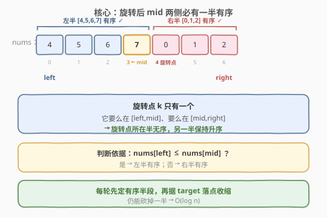
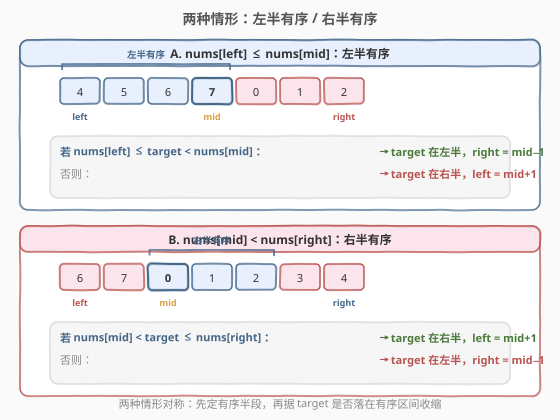
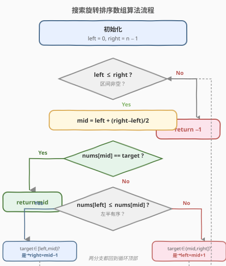
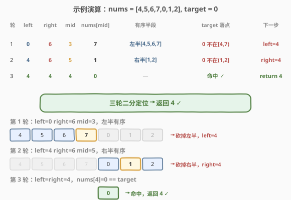

# 搜索旋转排序数组

- **题目名称**：搜索旋转排序数组
- **链接**：[33. 搜索旋转排序数组](https://leetcode.cn/problems/search-in-rotated-sorted-array/)
- **难度**：中等
- **标签**：数组、二分查找

## 1. 题目概述

整数数组 `nums` 按升序排列，数组中的值**互不相同**。在传递给函数之前，`nums` 在预先未知的某个下标 `k`（`0 <= k < nums.length`）上进行了**旋转**，使数组变为 `[nums[k], nums[k+1], ..., nums[n-1], nums[0], nums[1], ..., nums[k-1]]`。

给你旋转后的数组 `nums` 和一个整数 `target`，如果 `nums` 中存在 `target`，返回它的下标，否则返回 `-1`。

你必须设计一个时间复杂度为 `O(log n)` 的算法。

**示例 1**：

```text
输入：nums = [4,5,6,7,0,1,2], target = 0
输出：4
解释：0 在下标 4 处。
```

**示例 2**：

```text
输入：nums = [4,5,6,7,0,1,2], target = 3
输出：-1
解释：3 不在数组中。
```

**约束条件**：

- `1 <= nums.length <= 5000`
- `-10^4 <= nums[i] <= 10^4`
- `nums` 中的每项都**互不相同**
- `nums` 已按升序排列并旋转

> ⚠️ **关键性质**：值互不相同 + `O(log n)` 要求 → 必须二分。旋转后整体虽无序，但对任意 `mid`，其**左右两半中至少有一半是有序的**——这是算法的核心突破口。

---

## 2. 解题思路

### 2.1 暴力思路

**线性扫描**：遍历 `nums` 找 `target`，时间 `O(n)`、空间 `O(1)`。简单但不满足 `O(log n)` 要求，浪费了「原本有序」的性质。

**先找旋转点再二分**：先用二分找到最小值下标（旋转点），再在对应半段做普通二分。两趟二分 `O(log n)`，可行但需要两步，代码略繁。

### 2.2 核心观察：mid 两侧必有一半有序



取 `mid` 后，由于旋转点 `k` 只有一个，它要么落在 `[left, mid]`，要么落在 `[mid, right]`。因此：

- 若 `nums[left] <= nums[mid]`：左半 `[left, mid]` **有序**（旋转点在右半）。
- 否则：右半 `[mid, right]` **有序**（旋转点在左半）。

> 💡 **关键转化**：每次先判断「哪一半有序」，再判断 `target` 是否落在有序的那一半内——若是则在该半继续二分，否则在另一半。这样每轮仍能砍掉一半，保持 `O(log n)`。

### 2.3 判断有序半段并定位 target



**情形 A：`nums[left] <= nums[mid]`（左半有序）**

- 若 `nums[left] <= target < nums[mid]`：`target` 在左半有序段内 → `right = mid − 1`。
- 否则：`target` 在右半 → `left = mid + 1`。

**情形 B：`nums[mid] < nums[right]`（右半有序）**

- 若 `nums[mid] < target <= nums[right]`：`target` 在右半有序段内 → `left = mid + 1`。
- 否则：`target` 在左半 → `right = mid − 1`。

> ⚠️ **值互不相同的作用**：保证 `nums[left]`、`nums[mid]`、`nums[right]` 三者比较能**唯一确定**哪半有序；若有重复值（如 [81 题]），可能出现 `nums[left] == nums[mid] == nums[right]` 无法判断的情况，需额外收缩边界。

### 2.4 算法流程图



### 2.5 示例演算

以 `nums = [4,5,6,7,0,1,2], target = 0` 为例，`n = 7`：



| 轮次 | left | right | mid | nums[mid] | 有序半段 | target 落点 | 下一步 |
|------|------|-------|-----|-----------|----------|--------------|--------|
| 1 | 0 | 6 | 3 | 7 | 左半[4,5,6,7]有序 | 0 不在[4,7) | left = 4 |
| 2 | 4 | 6 | 5 | 1 | 右半[1,2]有序 | 0 不在(1,2] | right = 4 |
| 3 | 4 | 4 | 4 | 0 | — | nums[4]==0 命中 | 返回 4 ✓ |

三轮二分即定位。注意每轮都先判断有序半段，再据 `target` 是否落在有序区间决定收缩方向。

---

## 3. 参考代码

### C++

```cpp
class Solution {
  public:
    int search(vector<int>& nums, int target) {
        int left = 0, right = nums.size() - 1;
        while (left <= right) {
            int mid = left + (right - left) / 2;
            if (nums[mid] == target) return mid;

            if (nums[left] <= nums[mid]) {           // 左半有序
                if (nums[left] <= target && target < nums[mid]) {
                    right = mid - 1;                 // target 在左半
                } else {
                    left = mid + 1;                  // target 在右半
                }
            } else {                                 // 右半有序
                if (nums[mid] < target && target <= nums[right]) {
                    left = mid + 1;                  // target 在右半
                } else {
                    right = mid - 1;                 // target 在左半
                }
            }
        }
        return -1;
    }
};
```

### Python

```python
class Solution:
    def search(self, nums: List[int], target: int) -> int:
        left, right = 0, len(nums) - 1
        while left <= right:
            mid = (left + right) // 2
            if nums[mid] == target:
                return mid

            if nums[left] <= nums[mid]:              # 左半有序
                if nums[left] <= target < nums[mid]:
                    right = mid - 1                  # target 在左半
                else:
                    left = mid + 1                   # target 在右半
            else:                                    # 右半有序
                if nums[mid] < target <= nums[right]:
                    left = mid + 1                   # target 在右半
                else:
                    right = mid - 1                  # target 在左半
        return -1
```

---

## 4. 复杂度分析

| 维度 | 复杂度 | 说明 |
|------|--------|------|
| 时间复杂度 | O(log n) | 每轮通过判断有序半段仍能砍掉一半，经典二分复杂度 |
| 空间复杂度 | O(1) | 仅用 `left`、`right`、`mid` 三个指针 |

> 💡 即使数组被旋转，只要每轮能确定一个有序半段并据此收缩，就能维持 `O(log n)`。旋转并未破坏二分的前提，只是增加了「先判有序」这一步。

---

## 5. 扩展：含重复值的旋转数组（第 81 题）

若数组中**存在重复值**（[81. 搜索旋转排序数组 II]），上述判断可能失效：当 `nums[left] == nums[mid] == nums[right]` 时无法确定哪半有序。此时需额外处理——当 `nums[left] == nums[mid]` 时让 `left++`（收缩左边界）跳过重复，最坏退化为 `O(n)`，但平均仍接近 `O(log n)`。

> 💡 **找最小值下标（第 153 题）**：把本题的「找 target」改为「找旋转点（最小值）」，同样用「判断有序半段」的思路——左半有序时最小值在右半，反之在左半。掌握本题模板后，153、154、81 都是其变体。

---

## 6. 面试要点

1. **为什么 mid 两侧必有一半有序？**
   - 旋转点 `k` 只有一个，它要么在 `[left, mid]` 内、要么在 `[mid, right]` 内。旋转点所在的那半被「切断」故无序，另一半未被触及故保持原升序。这是算法可行的几何基础。

2. **`nums[left] <= nums[mid]` 用 `<=` 还是 `<`？**
   - 用 `<=`：当 `left == mid`（区间只剩两个元素）时二者相等，应判为「左半有序」并正常处理。若用 `<` 会漏掉这种边界，导致死循环或错答。

3. **如何判断 `target` 落在有序半段内？**
   - 对左半有序：检查 `nums[left] <= target < nums[mid]`（左闭右开，因为 `mid` 已单独判断过）。对右半有序：检查 `nums[mid] < target <= nums[right]`。边界处理是本题最易错处。

4. **值互不相同为什么重要？**
   - 保证 `nums[left]`、`nums[mid]`、`nums[right]` 三者比较能唯一确定有序半段。有重复时三者可能相等，需额外收缩边界（见第 81 题），最坏退化为 `O(n)`。

5. **能否先找旋转点再二分？**
   - 可以：先用二分找最小值下标 `k`，再据 `target` 与 `nums[0]` 的关系选择在 `[0, k-1]` 或 `[k, n-1]` 做普通二分。两趟都是 `O(log n)`，总仍 `O(log n)`，但本题一趟二分更简洁。

---

## 7. 同类练习题

- [81. 搜索旋转排序数组 II](https://leetcode.cn/problems/search-in-rotated-sorted-array-ii/)：含重复值的变体，需处理 `nums[left]==nums[mid]` 时收缩边界
- [153. 寻找旋转排序数组中的最小值](https://leetcode.cn/problems/find-minimum-in-rotated-sorted-array/)：找旋转点（最小值），同款「判断有序半段」模板
- [154. 寻找旋转排序数组中的最小值 II](https://leetcode.cn/problems/find-minimum-in-rotated-sorted-array-ii/)：含重复值的最小值，153 + 81 的结合
- [34. 在排序数组中查找元素的第一个和最后一个位置](https://leetcode.cn/problems/find-first-and-last-position-of-element-in-sorted-array/)（[题解](34_在排序数组中查找元素的第一个和最后一个位置.md)）：普通有序数组的二分边界，对比「无旋转」时的简单情形
- [剑指 Offer 11. 旋转数组的最小数字](https://leetcode.cn/problems/xuan-zhuan-shu-zu-de-zui-xiao-shu-zi-lcof/)：153 的中文版，含重复值，二分 + 边界收缩
