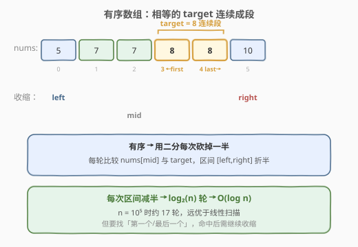
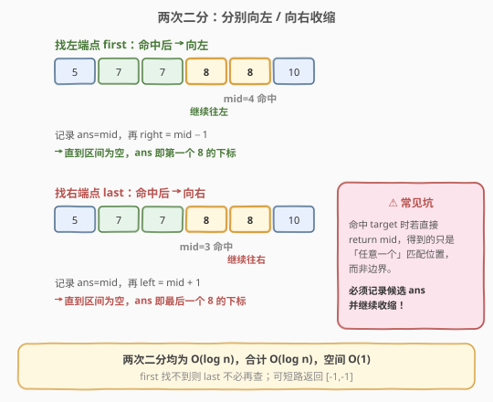
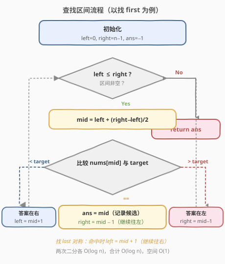
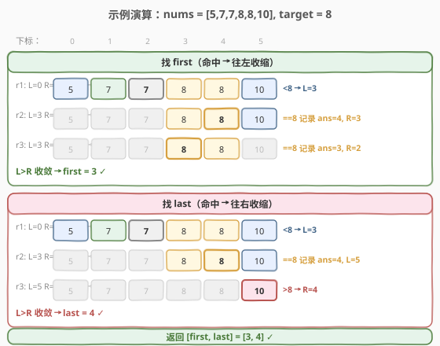

# 在排序数组中查找元素的第一个和最后一个位置

- **题目名称**：在排序数组中查找元素的第一个和最后一个位置
- **链接**：[34. 在排序数组中查找元素的第一个和最后一个位置](https://leetcode.cn/problems/find-first-and-last-position-of-element-in-sorted-array/)
- **难度**：中等
- **标签**：数组、二分查找

## 1. 题目概述

给你一个按照非递减顺序排列的整数数组 `nums`，和一个目标值 `target`。请你找出给定目标值在数组中的**开始位置和结束位置**。

如果数组中不存在目标值 `target`，返回 `[-1, -1]`。

你必须设计并实现时间复杂度为 `O(log n)` 的算法解决此问题。

**示例 1**：

```text
输入：nums = [5,7,7,8,8,10], target = 8
输出：[3,4]
解释：8 第一次出现在下标 3，最后一次出现在下标 4。
```

**示例 2**：

```text
输入：nums = [5,7,7,8,8,10], target = 6
输出：[-1,-1]
解释：数组中不存在 6。
```

**示例 3**：

```text
输入：nums = [], target = 0
输出：[-1,-1]
```

**约束条件**：

- `0 <= nums.length <= 10^5`
- `-10^9 <= nums[i] <= 10^9`
- `nums` 是一个非递减数组
- `-10^9 <= target <= 10^9`

> ⚠️ 进阶要求 `O(log n)`，因此线性扫描虽能过却不符规范；必须用**二分查找**。

---

## 2. 解题思路

### 2.1 暴力思路

线性扫描两遍：第一遍从左找第一个等于 `target` 的下标 `first`，第二遍从右找最后一个等于 `target` 的下标 `last`。时间 `O(n)`、空间 `O(1)`。简单但不满足 `O(log n)` 的进阶要求，且浪费了「数组已排序」这一关键性质。

### 2.2 核心观察：有序 → 二分



数组**非递减**意味着相等的 `target` 必然**连续**出现，形成一个区间 `[first, last]`。我们要分别定位这个区间的**左端点**与**右端点**，而有序数组上「找边界」正是二分查找的拿手好戏。

> 💡 **关键转化**：一次普通的二分只能命中「某个」等于 `target` 的位置；要找「第一个」和「最后一个」，需要在命中 `target` 时**继续往一侧收缩**，而不是立即返回。

### 2.3 找左端点与右端点：两次二分



**找左端点 `first`**（第一个等于 `target` 的下标）：

- `nums[mid] < target`：答案在右半，`left = mid + 1`
- `nums[mid] > target`：答案在左半，`right = mid - 1`
- `nums[mid] == target`：**可能不是第一个，继续往左找**，用 `ans` 记下 `mid`，再 `right = mid - 1`

**找右端点 `last`**（最后一个等于 `target` 的下标）：对称处理——命中时继续往右找，`left = mid + 1`。

> ⚠️ **常见坑**：命中 `target` 时若直接 `return mid`，得到的是「任意一个」匹配位置而非边界；必须**记录候选并继续收缩**，才能锁定端点。

### 2.4 算法流程图



### 2.5 示例演算

以 `nums = [5,7,7,8,8,10], target = 8` 为例，`n = 6`。



**找左端点 first**（命中后继续向左收缩）：

| 轮次 | left | right | mid | nums[mid] | 判断 | ans |
|------|------|-------|-----|-----------|------|-----|
| 1 | 0 | 5 | 2 | 7 | <8 → left=3 | −1 |
| 2 | 3 | 5 | 4 | 8 | ==8 → 记录，right=3 | 4 |
| 3 | 3 | 3 | 3 | 8 | ==8 → 记录，right=2 | 3 |
| 收敛 | 3 | 2 | — | — | left>right，结束 | **first=3** |

**找右端点 last**（命中后继续向右收缩）：

| 轮次 | left | right | mid | nums[mid] | 判断 | ans |
|------|------|-------|-----|-----------|------|-----|
| 1 | 0 | 5 | 2 | 7 | <8 → left=3 | −1 |
| 2 | 3 | 5 | 4 | 8 | ==8 → 记录，left=5 | 4 |
| 3 | 5 | 5 | 5 | 10 | >8 → right=4 | 4 |
| 收敛 | 5 | 4 | — | — | left>right，结束 | **last=4** |

最终返回 `[3, 4]`。两次二分各约 `log₂6 ≈ 3` 轮，远少于线性扫描的 6 次。

---

## 3. 参考代码

### C++

```cpp
class Solution {
  public:
    vector<int> searchRange(vector<int>& nums, int target) {
        int first = findFirst(nums, target);
        int last = findLast(nums, target);
        return {first, last};
    }

  private:
    int findFirst(vector<int>& nums, int target) {
        int left = 0, right = nums.size() - 1, ans = -1;
        while (left <= right) {
            int mid = left + (right - left) / 2;
            if (nums[mid] == target) {
                ans = mid;            // 命中，先记录
                right = mid - 1;      // 继续往左找更早的
            } else if (nums[mid] < target) {
                left = mid + 1;
            } else {
                right = mid - 1;
            }
        }
        return ans;
    }

    int findLast(vector<int>& nums, int target) {
        int left = 0, right = nums.size() - 1, ans = -1;
        while (left <= right) {
            int mid = left + (right - left) / 2;
            if (nums[mid] == target) {
                ans = mid;            // 命中，先记录
                left = mid + 1;       // 继续往右找更晚的
            } else if (nums[mid] < target) {
                left = mid + 1;
            } else {
                right = mid - 1;
            }
        }
        return ans;
    }
};
```

### Python

```python
class Solution:
    def searchRange(self, nums: List[int], target: int) -> List[int]:
        def find_first():
            lo, hi, ans = 0, len(nums) - 1, -1
            while lo <= hi:
                mid = (lo + hi) // 2
                if nums[mid] == target:
                    ans = mid          # 命中，先记录
                    hi = mid - 1       # 继续往左找
                elif nums[mid] < target:
                    lo = mid + 1
                else:
                    hi = mid - 1
            return ans

        def find_last():
            lo, hi, ans = 0, len(nums) - 1, -1
            while lo <= hi:
                mid = (lo + hi) // 2
                if nums[mid] == target:
                    ans = mid          # 命中，先记录
                    lo = mid + 1       # 继续往右找
                elif nums[mid] < target:
                    lo = mid + 1
                else:
                    hi = mid - 1
            return ans

        return [find_first(), find_last()]
```

---

## 4. 复杂度分析

| 维度 | 复杂度 | 说明 |
|------|--------|------|
| 时间复杂度 | O(log n) | 两次二分查找，各为 O(log n)，相加仍为 O(log n) |
| 空间复杂度 | O(1) | 仅使用常数指针与候选变量 |

---

## 5. 扩展：lower_bound / upper_bound 写法

C++ STL 的 `lower_bound` 返回「第一个 ≥ target 的位置」，`upper_bound` 返回「第一个 > target 的位置」。借助它们可一行求解：

```cpp
class Solution {
  public:
    vector<int> searchRange(vector<int>& nums, int target) {
        auto lo = lower_bound(nums.begin(), nums.end(), target);
        auto hi = upper_bound(nums.begin(), nums.end(), target);
        if (lo == hi) return {-1, -1};          // 没找到
        return {(int)(lo - nums.begin()), (int)(hi - nums.begin()) - 1};
    }
};
```

> 💡 **关系**：`first = lower_bound(target)`；`last = upper_bound(target) − 1`。若 `lower_bound == upper_bound`，说明 `target` 不存在。掌握这一对应关系可在面试中快速写出多种等价实现。

Python 中可用 `bisect_left` / `bisect_right` 实现同样效果。

---

## 6. 面试要点

1. **为什么命中 `target` 时不能立即返回？**
   - 普通二分命中任意一处即可返回；但本题要找「第一个/最后一个」，命中处可能只是中间某个位置，必须记录候选并继续向对应一侧收缩，直到区间为空。

2. **`mid = left + (right - left) / 2` 为什么不用 `(left + right) / 2`？**
   - 后者在 `left + right` 很大时会整数溢出。用差值形式可避免溢出，是二分查找的通用安全写法。

3. **循环条件用 `left <= right` 还是 `left < right`？**
   - 本解法用「闭区间 `[left, right]` + 记录候选」模板，配 `left <= right`；STL 的 `lower_bound` 用「左闭右开 `[left, right)`」配 `left < right`。两种都能过，关键是区间与收缩、终止条件保持自洽，不要混用。

4. **数组为空或 `target` 不存在时如何返回？**
   - `ans` 初始化为 `-1`，若整轮未命中则保持 `-1`，自然得到 `[-1, -1]`，无需特判（除空数组需保证循环不进入，闭区间写法下 `left=0, right=-1` 直接跳过）。

5. **如何迁移到「找插入位置」类问题？**
   - 把「记录命中候选」改为「记录 ≥ target 的位置」即得 `lower_bound`，正是 [35. 搜索插入位置] 的解法；本题模板可无缝迁移到 35、69、278 等一系列二分题。

---

## 7. 同类练习题

- [35. 搜索插入位置](https://leetcode.cn/problems/search-insert-position/)：`lower_bound` 的直接应用，本题左端点查找的简化版
- [278. 第一个错误的版本](https://leetcode.cn/problems/first-bad-version/)：二分找「第一个」满足条件的位置，与找左端点同构
- [69. x 的平方根](https://leetcode.cn/problems/sqrtx/)：二分找边界的经典应用，找最大的「平方 ≤ x」的整数
- [162. 寻找峰值](https://leetcode.cn/problems/find-peak-element/)：二分比较中点与邻居决定方向，体会「有序性」的广义含义
- [33. 搜索旋转排序数组](https://leetcode.cn/problems/search-in-rotated-sorted-array/)：旋转后的二分变体，对比「确定哪半有序」的判断差异
