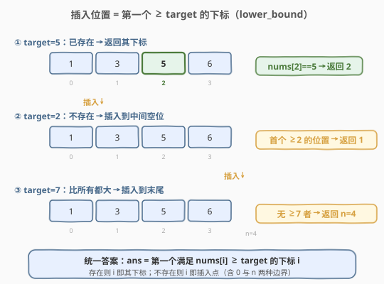
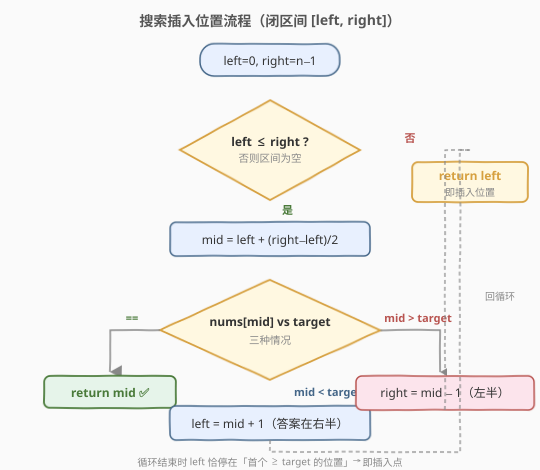
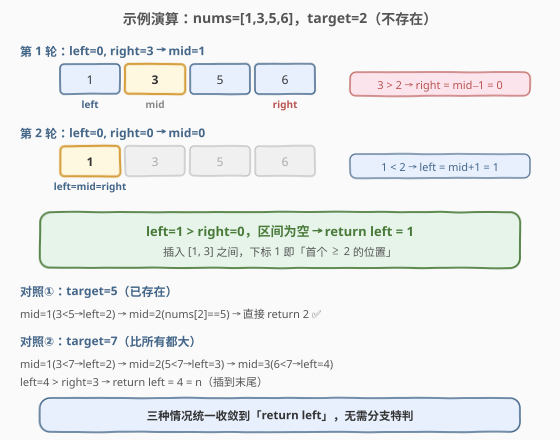

# LeetCode 搜索插入位置 题解

## 1. 题目概述

- **标题 / 题号**：搜索插入位置（#35，easy）
- **链接**：https://leetcode.cn/problems/search-insert-position/
- **难度**：简单
- **标签**：数组、二分查找

**题意**：给定一个**升序排列**且**元素互不相同**的整数数组 `nums`，和一个目标值 `target`。如果在数组中找到 `target`，返回它的**下标**；如果不存在，返回它**按顺序插入的位置**下标。

请务必设计并实现时间复杂度为 `O(log n)` 的算法。

**示例 1**：

```text
输入：nums = [1,3,5,6], target = 5
输出：2
解释：5 出现在下标 2 处，返回 2。
```

**示例 2**：

```text
输入：nums = [1,3,5,6], target = 2
输出：1
解释：2 不存在数组中，插入后数组变为 [1,2,3,5,6]，应放在下标 1。
```

**示例 3**：

```text
输入：nums = [1,3,5,6], target = 7
输出：4
解释：7 比所有元素都大，应插入到末尾，下标 4（即 n）。
```

**约束**：

- `1 <= nums.length <= 10^4`
- `-10^4 < nums[i] < 10^4`
- `nums` 中的元素**互不相同**
- `nums` 已按**升序**排列
- `-10^4 <= target <= 10^4`

> 💡 三条关键约束——**有序、互异、只问插入点**——决定了这是最纯粹的「找下界」二分场景。把 [704. 二分查找](../0701-0800/704_二分查找.md) 的闭区间模板里 `return -1` 改成 `return left`，本题即解。

## 2. 解题思路

### 2.1 暴力思路：线性扫描

从头到尾遍历，找到第一个 `nums[i] >= target` 的位置即返回 `i`；若遍历完都没有，说明 `target` 比所有元素都大，返回 `n`。时间 `O(n)`、空间 `O(1)`。能过提交，但**完全浪费了「数组已升序」这一性质**，且不满足 `O(log n)` 的要求。

> ⚠️ 题目明确要求 `O(log n)`，线性扫描虽对却**不符规范**；面试中给出 `O(n)` 方案几乎一定会被追问「能不能利用有序性做到 log 级」。

### 2.2 核心观察：插入位置 = lower_bound



把「找插入点」换个等价说法：**插入位置就是第一个满足 `nums[i] >= target` 的下标 `i`**。这正是 C++ STL `lower_bound` 的定义，三种情形被统一收编：

- `target` 已存在 → 它就是「第一个 ≥ `target`」的位置，下标即答案（示例 1）。
- `target` 不存在且落在中间 → 第一个比它大的元素位置即插入点（示例 2）。
- `target` 比所有元素都大 → 没有任何元素 ≥ `target`，插入点是数组末尾 `n`（示例 3）。

而有序数组上「找第一个满足某条件的位置」正是二分查找的拿手好戏——每轮比较一次中点，就能丢掉不可能的一半。

> 💡 **关键转化**：不要把「存在」与「不存在」当成两个分支分别处理。统一去寻找「首个 ≥ `target` 的下标」，一个二分即可覆盖所有情形，避免特判边界。

### 2.3 算法流程图



沿用 [704](../0701-0800/704_二分查找.md) 的闭区间 `[left, right]` 模板，循环不变量是：**若答案存在，它一定落在 `[left, right]` 内**。三处收缩严格维护不变量：

- `nums[mid] == target`：恰好命中，直接 `return mid`。
- `nums[mid] < target`：`mid` 及其左侧都更小，丢弃左半，`left = mid + 1`。
- `nums[mid] > target`：`mid` 及其右侧都更大，丢弃右半，`right = mid - 1`。

当 `left > right` 时区间为空，说明 `target` 不在数组中——**此时 `left` 恰好停在「第一个大于 `target` 的位置」**，正是插入点。所以循环外只需 `return left`，无需任何特判。

> ⚠️ **与 704 的唯一区别**：704 找不到时 `return -1`；本题找不到时 `return left`。这一字之差把「判断存在」升级为「定位下界」，整套骨架完全复用。

### 2.4 示例演算

以 `nums = [1,3,5,6], target = 2` 为例，`n = 4`。



| 轮次 | left | right | mid | nums[mid] | 判断 | 动作 |
|------|------|-------|-----|-----------|------|------|
| 1 | 0 | 3 | 1 | 3 | 3 > 2 | right = 0 |
| 2 | 0 | 0 | 0 | 1 | 1 < 2 | left = 1 |
| 收敛 | 1 | 0 | — | — | left > right，结束 | **return left = 1** |

两轮后 `left = 1 > right = 0`，返回 `1`。对照示例 2 正确：`2` 应插入到 `[1, _3_]` 之间，下标 `1`。

对照情形：`target = 5`（已存在）会在 `mid=2` 命中直接返回 `2`；`target = 7`（比所有都大）则一路 `nums[mid] < 7` 把 `left` 推到 `4`，最终 `return left = 4 = n`。三种情况共用同一套代码，无需分支特判。

## 3. 参考代码

### C++（闭区间模板）

```cpp
class Solution {
  public:
    int searchInsert(vector<int>& nums, int target) {
        int left = 0, right = nums.size() - 1;
        while (left <= right) {
            int mid = left + (right - left) / 2; // 防溢出写法
            if (nums[mid] == target) {
                return mid;             // 命中即返回
            } else if (nums[mid] < target) {
                left = mid + 1;         // 去右半找
            } else {
                right = mid - 1;        // 去左半找
            }
        }
        return left; // 未命中：left 即为插入位置（首个 >= target 的下标）
    }
};
```

### Python

```python
class Solution:
    def searchInsert(self, nums: List[int], target: int) -> int:
        left, right = 0, len(nums) - 1
        while left <= right:
            mid = left + (right - left) // 2  # 防溢出，等价于 (left+right)//2
            if nums[mid] == target:
                return mid
            elif nums[mid] < target:
                left = mid + 1
            else:
                right = mid - 1
        return left  # 未命中时 left 即插入点
```

> ⚠️ **三个易错点**：
> 1. **`mid` 用 `left + (right - left) / 2`** 而非 `(left + right) / 2`，后者在 `left + right` 接近 `INT_MAX` 时会整数溢出（C++/Java）。Python 大整数不溢出，但保持同一写法便于跨语言记忆。
> 2. **收缩要越过 `mid`**：`left = mid + 1`、`right = mid - 1`，不能写成 `left = mid` / `right = mid`，否则区间只剩两个元素时 `mid` 恒等于 `left` 会死循环。
> 3. **找不到时返回 `left` 而非 `-1`**：循环结束时 `left` 恰好指向「首个 ≥ `target`」的位置，这正是插入点，是本题相对 [704](../0701-0800/704_二分查找.md) 的唯一改动。

## 4. 复杂度分析

| 维度 | 复杂度 | 说明 |
|------|--------|------|
| 时间复杂度 | $O(\log n)$ | 每轮区间折半，最多 $\lceil \log_2 n \rceil$ 轮；$n=10^4$ 时约 14 轮 |
| 空间复杂度 | $O(1)$ | 仅用 `left`、`right`、`mid` 三个指针变量 |

> 💡 **为什么是 $O(\log n)$ 而非 $O(n)$？** 关键在于「每轮丢弃一半」。区间规模按 $n \to n/2 \to n/4 \to \dots \to 1$ 衰减，缩到 1 最多 $\log_2 n$ 步。即便 `target` 不存在，循环也只多跑一轮就因 `left > right` 退出，仍是 $O(\log n)$。

## 5. 扩展：纯 `lower_bound` 写法与 STL

### 5.1 去掉「命中即返回」的纯下界写法

上面的解法在 `nums[mid] == target` 时提前 `return mid`，对「找下界」而言并非必需——把它并入「≥ target」的右侧收缩，就得到更精简的纯 `lower_bound` 模板：

```cpp
class Solution {
  public:
    int searchInsert(vector<int>& nums, int target) {
        int left = 0, right = nums.size() - 1;
        while (left <= right) {
            int mid = left + (right - left) / 2;
            if (nums[mid] < target) {
                left = mid + 1;   // mid 偏小，答案在右半
            } else {
                right = mid - 1;  // nums[mid] >= target，记为候选，继续往左找更早的
            }
        }
        return left; // left 即第一个 >= target 的位置
    }
};
```

两种写法等价、结果相同。前者更直观（命中即走人、贴近 704 模板），后者把「等于」与「大于」合并、不提前返回、更贴近 STL `lower_bound` 的语义，是写「找边界」类题（如 [34. 查找区间](../0001-0100/34_在排序数组中查找元素的第一个和最后一个位置.md)）的通用范式。

> 💡 **判断技巧**：若收缩时让 `right = mid - 1`（而不是 `right = mid`），对应的是**闭区间 `[left, right]` + `left <= right`** 模板；若让 `right = mid`，对应的是**左闭右开 `[left, right)` + `left < right`** 模板。两种都能写 `lower_bound`，关键是区间定义、收缩、终止条件三者自洽，不要混用。

### 5.2 STL / bisect 一行解法

C++ 可直接调用 `std::lower_bound`，它返回「第一个 ≥ `target`」的迭代器，正合题意：

```cpp
#include <algorithm>
class Solution {
  public:
    int searchInsert(vector<int>& nums, int target) {
        return lower_bound(nums.begin(), nums.end(), target) - nums.begin();
    }
};
```

Python 对应 `bisect` 模块的 `bisect_left`：

```python
import bisect
class Solution:
    def searchInsert(self, nums: List[int], target: int) -> int:
        return bisect.bisect_left(nums, target)
```

面试中手写模板更受青睐，但知道 STL 等价写法有助于快速验证、并在「能调库」的场景下秒杀。

## 6. 面试要点

1. **为什么本题是 `lower_bound` 而不是普通的二分查找？**

   - 普通 [704](../0701-0800/704_二分查找.md) 只问「在不在」，不在就返回 `-1`；本题问「不在该插哪」，答案永远是「首个 ≥ `target` 的下标」。把不在时的 `return -1` 改成 `return left`，就把「判断存在」推广为「定位下界」——这正是 `lower_bound` 的定义。

2. **循环结束时 `left` 为什么就是插入位置？**

   - 每轮收缩都维护不变量「答案在 `[left, right]` 内」。退出时 `left = right + 1`，区间为空，意味着：`left` 左侧的所有元素都 `< target`（被 `left = mid + 1` 排除），`left` 及其右侧都 `>= target`（被 `right = mid - 1` 排除）。因此 `left` 恰是首个 `>= target` 的位置，即插入点。

3. **`mid` 用 `left + (right - left) / 2` 而不是 `(left + right) / 2`？**

   - 后者在 `left + right` 超过 `INT_MAX` 时会整数溢出（C++/Java），得到负数下标越界。差值写法保证中间结果不超过 `right`，安全。Python 不溢出但保持同一写法便于跨语言记忆。

4. **循环条件用 `left <= right` 还是 `left < right`？**

   - 取决于区间定义。闭区间 `[left, right]` 配 `left <= right`（区间为空时 `left > right` 自然退出）；左闭右开 `[left, right)` 配 `left < right`（区间为空时 `left == right`）。关键是**区间定义、收缩、终止条件三者自洽**，绝不能混用，否则要么漏判单元素、要么死循环。

5. **数组为空、`target` 小于所有元素、大于所有元素，三种边界要不要特判？**

   - 都不需要。本题约束 `nums.length >= 1`，但即便为空，闭区间写法下 `left=0, right=-1` 直接跳过循环、`return left = 0` 也正确。`target` 比所有元素小 → 一路 `nums[mid] > target` 把 `right` 推到 `-1`，`return left = 0`；比所有元素大 → 一路 `nums[mid] < target` 把 `left` 推到 `n`，`return left = n`。统一逻辑天然覆盖全部边界，这是「不分支、纯下界」写法的最大收益。

6. **如果数组中有重复元素，模板还成立吗？**

   - 本题约束元素互异，但模板对重复数组同样有效：`lower_bound` 返回的是「第一个 ≥ `target`」的位置，若有多个等于 `target` 的元素，会返回最左那个。若想找「最后一个 ≤ `target`」或「插入到相等元素的右侧」，可改用 `upper_bound`（首个 `> target`），见 [34. 查找区间](../0001-0100/34_在排序数组中查找元素的第一个和最后一个位置.md)。

## 同类练习题

| # | 题目 | 与本题的关联 |
|---|------|-------------|
| 704 | [二分查找](https://leetcode.cn/problems/binary-search/) | 本题的母题，闭区间模板的纯净版，把 `return -1` 改成 `return left` 即迁移到 35 |
| 278 | [第一个错误的版本](https://leetcode.cn/problems/first-bad-version/) | 二分找「第一个」满足条件的位置，与找下界同构 |
| 69 | [x 的平方根](https://leetcode.cn/problems/sqrtx/) | 在答案值域上二分，找最大的「平方 ≤ x」的整数，是 `lower_bound` 的反向变体 |
| 34 | [在排序数组中查找元素的第一个和最后一个位置](https://leetcode.cn/problems/find-first-and-last-position-of-element-in-sorted-array/) | 本题进阶，命中后继续收缩找左右边界，`lower_bound` + `upper_bound` |
| 367 | [有效的完全平方数](https://leetcode.cn/problems/valid-perfect-square/) | 在值域上二分判定，体会「搜索下标」到「搜索答案」的推广 |
