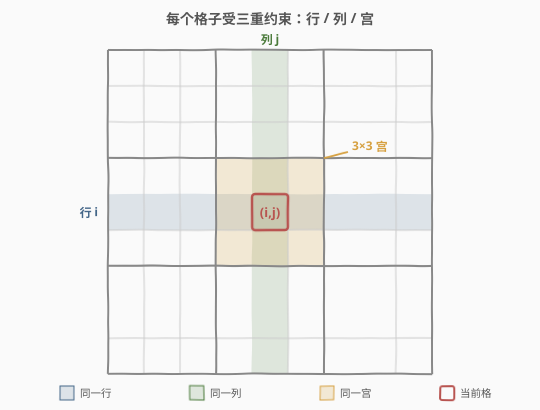
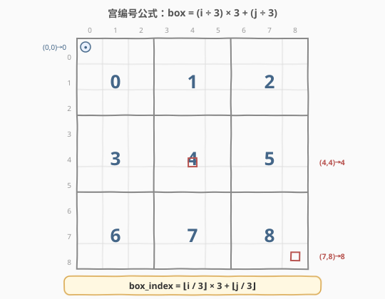
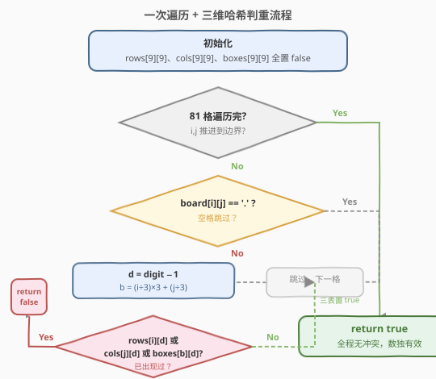
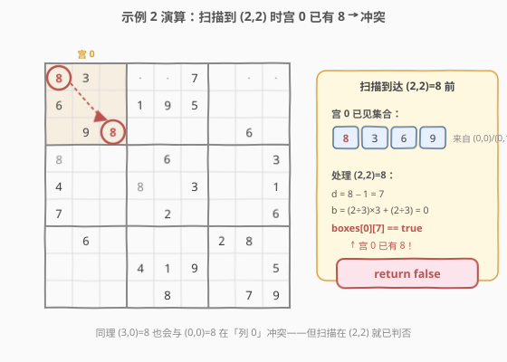

# LeetCode 有效的数独 题解

## 1. 题目概述

- **标题 / 题号**：有效的数独（#36，medium）
- **链接**：https://leetcode.cn/problems/valid-sudoku/
- **难度**：中等
- **标签**：哈希表、矩阵、一次遍历

**题意**：给你一个 $9 \times 9$ 的数独棋盘 `board`，请判断它是否**有效**。只需根据以下三条规则验证**已填入的数字**，空格用 `'.'` 表示：

1. 每一行数字 $1\sim9$ 不能重复；
2. 每一列数字 $1\sim9$ 不能重复；
3. 每一个 $3\times3$ 的子宫格内数字 $1\sim9$ 不能重复。

> ⚠️ 注意：**有效不等于可解**。题目只要求已填数字不违反上述三条规则，不要求棋盘拥有唯一解甚至有解。这把问题从「求解数独」简化成「判重」。

**示例 1**：

```text
输入：board =
[["5","3",".",".","7",".",".",".","."]
,["6",".",".","1","9","5",".",".","."]
,[".","9","8",".",".",".",".","6","."]
,["8",".",".",".","6",".",".",".","3"]
,["4",".",".","8",".","3",".",".","1"]
,["7",".",".",".","2",".",".",".","6"]
,[".","6",".",".",".",".","2","8","."]
,[".",".",".","4","1","9",".",".","5"]
,[".",".",".",".","8",".",".","7","9"]]
输出：true
```

**示例 2**：

```text
输入：board =
[["8","3",".",".","7",".",".",".","."]
,["6",".",".","1","9","5",".",".","."]
,[".","9","8",".",".",".",".","6","."]
,["8",".",".",".","6",".",".",".","3"]
,["4",".",".","8",".","3",".",".","1"]
,["7",".",".",".","2",".",".",".","6"]
,[".","6",".",".",".",".","2","8","."]
,[".",".",".","4","1","9",".",".","5"]
,[".",".",".",".","8",".",".","7","9"]]
输出：false
解释：除左上角由 5 改成 8 外，其余与示例 1 相同。
      左上角 3×3 宫格里出现了两个 8，因此无效。
```

**约束**：

- `board.length == 9`
- `board[i].length == 9`
- `board[i][j]` 是数字 `'1'`–`'9'` 或 `'.'`

> 💡 棋盘尺寸固定为 $9\times9$，因此任何 $O(81)$ 的做法在复杂度上都算「常数」。本题真正考察的是**如何用一次遍历同时检查行、列、宫三重约束**——也就是把「一个格子属于哪一行、哪一列、哪一宫」这三条信息高效地编码下来。

## 2. 解题思路

### 2.1 暴力思路

最直观的做法是**分三轮扫描**：第一轮逐行检查重复，第二轮逐列检查重复，第三轮逐宫检查重复。每轮内部用一个 `HashSet` 记录已见数字，遇到重复即返回 `false`。

- 时间复杂度：三轮各 $O(81)$，合计仍是常数级，但**常数较大**且代码重复。
- 空间复杂度：$O(9)$ 的集合，每轮重建。

> 💡 暴力法能通过，但它把「行、列、宫」割裂成三次独立扫描，没有利用到一个关键事实：**每个格子同时属于某一行、某一列、某一宫**。这三重约束可以在访问该格子的那一瞬间一并检查。

### 2.2 核心观察：一次遍历 + 三维哈希



关键观察：当我们扫描到格子 `(i, j)` 且它填了数字 `d` 时，这个数字同时受到三重约束——

1. **行约束**：`d` 在第 `i` 行不能重复；
2. **列约束**：`d` 在第 `j` 列不能重复；
3. **宫约束**：`d` 在 `(i, j)` 所在的 $3\times3$ 宫格里不能重复。

因此只需维护三张「已见」表，访问每个格子时**一次性查三张表**：

- `rows[i][d]`：数字 `d` 是否已在第 `i` 行出现；
- `cols[j][d]`：数字 `d` 是否已在第 `j` 列出现；
- `boxes[b][d]`：数字 `d` 是否已在第 `b` 个宫里出现。

其中 `d` 用 $0\sim8$ 表示（即 `digit - '1'`），`b` 是格子所在的宫编号。

> 💡 这里用布尔数组而非 `HashSet`：数字范围固定 $1\sim9$，数组下标即数字，查改都是 $O(1)$ 且常数远小于哈希函数。这是「**值域小且稠密时用数组代替哈希表**」的通用优化。

### 2.3 宫编号公式：box_index = (i ÷ 3) × 3 + (j ÷ 3)



把 $9\times9$ 棋盘的 $9$ 个 $3\times3$ 宫按从左到右、从上到下编号为 $0\sim8$。格子 `(i, j)` 落在哪个宫？由于每宫横跨 $3$ 行 $3$ 列：

- 宫的**行块**编号 = $\lfloor i / 3 \rfloor$（取值 $0,1,2$）
- 宫的**列块**编号 = $\lfloor j / 3 \rfloor$（取值 $0,1,2$）

把二维块编号展平成一维：$b = \lfloor i / 3 \rfloor \times 3 + \lfloor j / 3 \rfloor$。

例如 `(4, 4)`：$\lfloor 4/3 \rfloor = 1$，$\lfloor 4/3 \rfloor = 1$，$b = 1\times3+1 = 4$，即正中央的宫。

> ⚠️ 这个公式是本题唯一需要记住的「技巧」，它把二维坐标到宫编号的映射压缩成一行算术。推导方式是「整除取块号 → 乘 3 展平 → 加列块号」。

### 2.4 算法流程图



整体只需**一次双重循环**遍历 $81$ 个格子。对每个非空格：

1. 把字符数字转成 $0\sim8$ 的下标 `d`，并算出宫编号 `b`；
2. 若 `rows[i][d]`、`cols[j][d]`、`boxes[b][d]` 中**任一为真**，说明 `d` 已在该约束域出现过 → `return false`；
3. 否则把三张表对应位置都置真，继续。

全部扫完无冲突 → `return true`。

### 2.5 示例演算

以**示例 2** 为例，左上角被改成 `8`。按行优先顺序扫描，走到 `(2,2)=8` 时发生冲突：



| 步骤 | 格子 | 数字 | 宫 0 已见集合 | 判定 |
|------|------|------|--------------|------|
| ① | (0,0) | 8 | {} → {8} | 三表皆空，标记 8 |
| ② | (0,1) | 3 | {8} → {8,3} | 标记 3 |
| ③ | (1,0) | 6 | {8,3} → {8,3,6} | 标记 6 |
| ④ | (2,1) | 9 | {8,3,6} → {8,3,6,9} | 标记 9 |
| ⑤ | (2,2) | 8 | {8,3,6,9} | **boxes[0][7] 已为 true → return false** |

> 💡 注意 `(2,2)=8` 在它所在的**行 2** 和**列 2** 都没有重复（行 2 此前只有 9，列 2 此前全是空格），冲突**只发生在宫 0**。这正说明必须同时维护三张表——只查行列会漏掉宫内冲突。

## 3. 参考代码

### C++

```cpp
class Solution {
public:
    bool isValidSudoku(vector<vector<char>>& board) {
        bool rows[9][9]   = {false};
        bool cols[9][9]   = {false};
        bool boxes[9][9]  = {false};
        for (int i = 0; i < 9; ++i) {
            for (int j = 0; j < 9; ++j) {
                char c = board[i][j];
                if (c == '.') continue;
                int d = c - '1';            // 0..8
                int b = (i / 3) * 3 + j / 3;
                if (rows[i][d] || cols[j][d] || boxes[b][d])
                    return false;
                rows[i][d] = cols[j][d] = boxes[b][d] = true;
            }
        }
        return true;
    }
};
```

### Python

```python
class Solution:
    def isValidSudoku(self, board: List[List[str]]) -> bool:
        rows  = [[False] * 9 for _ in range(9)]
        cols  = [[False] * 9 for _ in range(9)]
        boxes = [[False] * 9 for _ in range(9)]
        for i in range(9):
            for j in range(9):
                c = board[i][j]
                if c == '.':
                    continue
                d = int(c) - 1            # 0..8
                b = (i // 3) * 3 + j // 3
                if rows[i][d] or cols[j][d] or boxes[b][d]:
                    return False
                rows[i][d] = cols[j][d] = boxes[b][d] = True
        return True
```

## 4. 复杂度分析

| 维度 | 复杂度 | 说明 |
|------|--------|------|
| 时间复杂度 | $O(1)$ | 棋盘固定 $9\times9=81$ 格，每格 $O(1)$ 查改，共常数次操作；若推广到 $n\times n$ 数独则为 $O(n^2)$ |
| 空间复杂度 | $O(1)$ | 三张 $9\times9$ 布尔表共 $243$ 个布尔值，常数级；推广到 $n\times n$ 则为 $O(n^2)$ |

> 💡 由于棋盘尺寸固定，时间和空间都是常数。但不要因此写成「三轮扫描」——一次遍历版本代码更短、常数更小，且展示了「**用多个维度同时编码状态**」的思想，这一思想在 37. 解数独（回溯剪枝）、212. 单词搜索 II 等题里会反复出现。

## 5. 扩展：位运算压缩与一行式写法

### 5.1 位掩码压缩

每行/列/宫的「已见数字」可用一个 `int` 的低 9 位表示：第 `d` 位为 1 表示数字 `d+1` 已见。

- 标记：`mask |= (1 << d)`
- 判重：`mask & (1 << d)` 非零则重复

三张布尔表变成三个长度为 9 的 `int` 数组，空间缩小 8 倍，且位运算常数更小：

```cpp
int row[9] = {0}, col[9] = {0}, box[9] = {0};
for (int i = 0; i < 9; ++i)
    for (int j = 0; j < 9; ++j) {
        char c = board[i][j];
        if (c == '.') continue;
        int d = c - '1', b = (i / 3) * 3 + j / 3, bit = 1 << d;
        if ((row[i] | col[j] | box[b]) & bit) return false;
        row[i] |= bit; col[j] |= bit; box[b] |= bit;
    }
```

### 5.2 用字符串编码 + 单 HashSet

有些面试场景要求「只用一个哈希结构」。可对每个数字构造三条编码字符串，如 `"4 in row 0"`、`"4 in col 1"`、`"4 in box 1"`，塞进一个 `HashSet`，遇到已存在即冲突。代码极短但常数大，适合快速验证、不适合追求性能。

> ⚠️ 字符串编码法的优势是**可读性和泛化性**——把「值 + 约束域」直接拼成 key，省去手动维护多张表。这是「用哈希 key 编码多维状态」的通用技巧，在 36 之外的许多判重题里都好用。

## 6. 面试要点

1. **「有效」和「可解」的区别是什么？为什么本题更简单？**
   - 有效只要求已填数字不违反行列宫三条规则，**不要求棋盘有解**。因此只需判重，不必回溯求解。37. 解数独才是要求解的回溯题。

2. **宫编号公式怎么推？**
   - 每宫横跨 3 行 3 列，所以行块号是 $\lfloor i/3 \rfloor$、列块号是 $\lfloor j/3 \rfloor$，展平成一维就是 $\lfloor i/3 \rfloor \times 3 + \lfloor j/3 \rfloor$。推导路径：先整除取「块号」，再按「行块 × 每行块数 + 列块」线性化。

3. **为什么用布尔数组而不是 HashSet？**
   - 数字值域固定为 $1\sim9$，稠密且小，数组下标即数字，查改 $O(1)$ 且常数远小于哈希函数。**值域小且稠密时优先用数组**，这是通用优化原则。

4. **能否一次遍历完成？为什么比三轮扫描好？**
   - 能。每个格子同时属于一行、一列、一宫，访问时一次性查三张表即可。一次遍历代码更短、常数更小，且体现了「多维度同时编码状态」的思想，是本题的标准写法。

5. **位掩码写法相比布尔数组有何优势？**
   - 把每行/列/宫的 9 个布尔压成一个 `int` 的 9 位，三张表缩成三个 `int[9]`，空间省 8 倍，位运算 `|`、`&` 常数更小。在追求极致性能或需要做集合运算（求交、并）时尤其方便。

## 同类练习题

| # | 题目 | 与本题的关联 |
|---|------|-------------|
| 37 | [解数独](https://leetcode.cn/problems/sudoku-solver/) | 本题的「求解」版本，回溯 + 本题的三维判重做剪枝，是天然的进阶 |
| 212 | [单词搜索 II](https://leetcode.cn/problems/word-search-ii/)（[题解](../0201-0300/212_单词搜索II.md)） | 同样在网格上「一次遍历多维编码状态」，对比 Trie + DFS 的状态管理 |
| 73 | [矩阵置零](https://leetcode.cn/problems/set-matrix-zeroes/)（[题解](./73_矩阵置零.md)） | 矩阵上的另一道招牌题，用首行首列作标记位，对比「原地编码状态」的不同实现 |
| 289 | [生命游戏](https://leetcode.cn/problems/game-of-life/)（[题解](../0201-0300/289_生命游戏.md)） | 矩阵原地更新，用位编码同时保存「旧状态 + 新状态」，思想同源 |
| 54 | [螺旋矩阵](https://leetcode.cn/problems/spiral-matrix/)（[题解](./54_螺旋矩阵.md)） | 矩阵遍历的另一种范式，巩固二维坐标与方向控制 |
