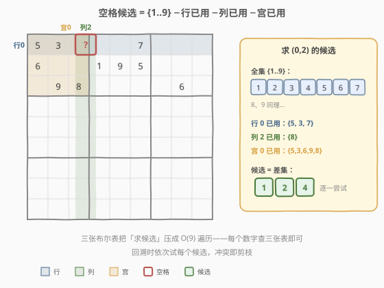
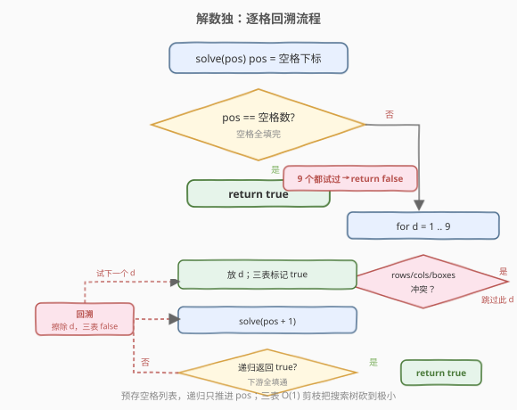
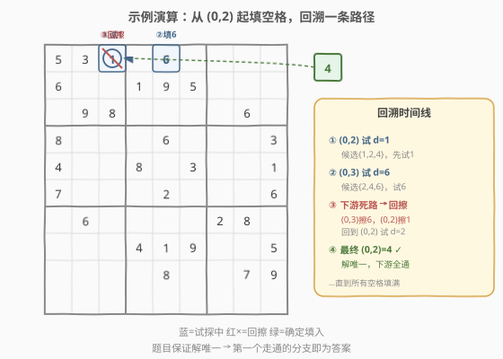

# 解数独

- **题目名称**：解数独
- **链接**：[37. 解数独](https://leetcode.cn/problems/sudoku-solver/)
- **难度**：困难
- **标签**：回溯、数组、矩阵

## 1. 题目概述

编写一个程序，通过填充空格来解决 $9 \times 9$ 的数独。空格用 `'.'` 表示。解必须满足：

1. 每一行数字 $1\sim9$ 不能重复；
2. 每一列数字 $1\sim9$ 不能重复；
3. 每一个 $3\times3$ 的子宫格内数字 $1\sim9$ 不能重复。

> ⚠️ 注意：与 [36. 有效的数独](./36_有效的数独.md) 只判「是否有效」不同，本题要求**真正把空格填满**。题目保证给定棋盘**有且仅有一个唯一解**，因此找到的第一个完整解即为答案，无需枚举所有解。

**示例 1**：

```text
输入：board =
[["5","3",".",".","7",".",".",".","."]
,["6",".",".","1","9","5",".",".","."]
,[".","9","8",".",".",".",".","6","."]
,["8",".",".",".","6",".",".",".","3"]
,["4",".",".","8",".","3",".",".","1"]
,["7",".",".",".","2",".",".",".","6"]
,[".","6",".",".",".",".","2","8","."]
,[".",".",".","4","1","9",".",".","5"]
,[".",".",".",".","8",".",".","7","9"]]

输出：board 原地修改为
[["5","3","4","6","7","8","9","1","2"]
,["6","7","2","1","9","5","3","4","8"]
,["1","9","8","3","4","2","5","6","7"]
,["8","5","9","7","6","1","4","2","3"]
,["4","2","6","8","5","3","7","9","1"]
,["7","1","3","9","2","4","8","5","6"]
,["9","6","1","5","3","7","2","8","4"]
,["2","8","7","4","1","9","6","3","5"]
,["3","4","5","2","8","6","1","7","9"]]
```

**约束条件**：

- `board.length == 9`
- `board[i].length == 9`
- `board[i][j]` 是数字 `'1'`–`'9'` 或 `'.'`
- 题目数据保证输入数独有且仅有一个解

> 💡 棋盘固定 $9\times9$，空格数量有限（至多 81 个）。本题本质是**在一个受约束的搜索空间里找一个完整解**——经典的回溯问题。难点不在于「能不能想到回溯」，而在于「如何高效剪枝，让搜索树小到可接受」。

---

## 2. 解题思路

### 2.1 暴力思路：每个空格试 1-9

把所有空格收集起来，对每个空格依次尝试 `1~9`，无冲突就填入并递归下一个空格，填满即返回。朴素的 DFS 之所以可行，关键在于**剪枝足够狠**——每个空格的候选数受行/列/宫三重约束压缩，分支因子远小于 9。

> 💡 如果不做任何剪枝，最坏情况 $9^{81}$ 显然爆炸。但数独的约束会把每一步的候选压到 2-4 个，加上「一旦下游走不通立刻回溯」，实际搜索树极小。本题的工程重点是**把约束检查做到 O(1)**。

### 2.2 核心观察：三表判重 + 逐格回溯



承接 [36. 有效的数独](./36_有效的数独.md) 的核心技法：维护三张布尔表记录每个数字在每行/列/宫是否已用——

- `rows[i][d]`：数字 `d` 是否已在第 `i` 行出现；
- `cols[j][d]`：数字 `d` 是否在第 `j` 列出现；
- `boxes[b][d]`：数字 `d` 是否在第 `b` 个宫出现（$b = \lfloor i/3 \rfloor \times 3 + \lfloor j/3 \rfloor$）。

对于空格 `(i, j)`，候选数字 `d` 合法当且仅当 `rows[i][d]`、`cols[j][d]`、`boxes[b][d]` **三者全为 false**。三张表把「求候选」从扫描行列宫的 $O(27)$ 压成查三次数组的 $O(1)$。

> 💡 这是「**值域小且稠密时用数组代替哈希表**」的通用优化。数字范围固定 $1\sim9$，布尔数组下标即数字，查改都 $O(1)$ 且常数远小于哈希函数。与 36 题完全同源——36 是「用三表判已有数字是否冲突」，37 是「用三表找出空格能填哪些数字」。

### 2.3 算法流程图



整体流程：

1. **预处理**：遍历棋盘，把已填数字在三张表里标记为 `true`，同时收集所有空格坐标到列表 `spaces`。
2. **DFS**：`solve(pos)` 表示尝试填第 `pos` 个空格。
   - 若 `pos == spaces.size()`，所有空格填完 → 返回 `true`。
   - 否则取出空格 `(i, j)`，遍历 `d = 1..9`：
     - 若 `d` 在行/列/宫任一已用 → 跳过（剪枝）；
     - 否则填入 `board[i][j] = d`，三表标记，递归 `solve(pos+1)`；
     - **若递归返回 `true` → 答案已找到，直接向上传播 `true`**（不回溯，保留填写）；
     - 若递归返回 `false` → 擦除 `board[i][j]`，三表恢复，继续试下一个 `d`。
   - 9 个数字都试过仍无解 → 返回 `false`（触发上层回溯）。

> ⚠️ 与 [51. N 皇后](./51_N皇后.md)「枚举所有方案」不同，数独只要**唯一解**。因此递归一旦成功就立刻 `return true` 层层传播，**不做完整回溯**（不擦除已成功的填写）。只有「走不通」时才回溯擦除。这是「求一个解」与「求所有解」回溯写法的关键区别。

### 2.4 示例演算

以示例 1 为例，第一个空格是 `(0, 2)`：



- `(0,2)` 的候选 = `{1,2,4}`（行 0 已用 `{5,3,7}`，列 2 已用 `{8}`，宫 0 已用 `{5,3,6,9,8}`）。
- 先试 `d=1` → 填入，递归 `(0,3)`… 若下游某格所有数字都冲突 → 回溯，擦除 `1`。
- 试 `d=2` → 同理若下游走不通 → 回溯。
- 试 `d=4` → 下游全部走通 → 传播 `true`，`4` 保留。

> 💡 由于题目保证解唯一，第一个走通的完整分支即为答案。实际运行中，三表剪枝让搜索树极小——大多数空格只有 1-3 个候选，几乎一气呵成填到底，偶尔遇到死路回退几层。

---

## 3. 参考代码

### C++

```cpp
class Solution {
public:
    void solveSudoku(vector<vector<char>>& board) {
        rows.assign(9, vector<bool>(9, false));
        cols.assign(9, vector<bool>(9, false));
        boxes.assign(9, vector<bool>(9, false));
        spaces.clear();
        for (int i = 0; i < 9; ++i)
            for (int j = 0; j < 9; ++j) {
                char c = board[i][j];
                if (c == '.') {
                    spaces.emplace_back(i, j);
                } else {
                    int d = c - '1';
                    int b = (i / 3) * 3 + j / 3;
                    rows[i][d] = cols[j][d] = boxes[b][d] = true;
                }
            }
        dfs(board, 0);
    }

private:
    vector<vector<bool>> rows, cols, boxes;
    vector<pair<int,int>> spaces;

    bool dfs(vector<vector<char>>& board, int pos) {
        if (pos == spaces.size()) return true;
        auto [i, j] = spaces[pos];
        int b = (i / 3) * 3 + j / 3;
        for (int d = 0; d < 9; ++d) {
            if (rows[i][d] || cols[j][d] || boxes[b][d]) continue;
            board[i][j] = '1' + d;
            rows[i][d] = cols[j][d] = boxes[b][d] = true;
            if (dfs(board, pos + 1)) return true;
            rows[i][d] = cols[j][d] = boxes[b][d] = false;
            board[i][j] = '.';
        }
        return false;
    }
};
```

### Python

```python
class Solution:
    def solveSudoku(self, board: List[List[str]]) -> None:
        rows  = [[False] * 9 for _ in range(9)]
        cols  = [[False] * 9 for _ in range(9)]
        boxes = [[False] * 9 for _ in range(9)]
        spaces = []
        for i in range(9):
            for j in range(9):
                c = board[i][j]
                if c == '.':
                    spaces.append((i, j))
                else:
                    d = int(c) - 1
                    b = (i // 3) * 3 + j // 3
                    rows[i][d] = cols[j][d] = boxes[b][d] = True

        def dfs(pos: int) -> bool:
            if pos == len(spaces):
                return True
            i, j = spaces[pos]
            b = (i // 3) * 3 + j // 3
            for d in range(9):
                if rows[i][d] or cols[j][d] or boxes[b][d]:
                    continue
                board[i][j] = str(d + 1)
                rows[i][d] = cols[j][d] = boxes[b][d] = True
                if dfs(pos + 1):
                    return True
                rows[i][d] = cols[j][d] = boxes[b][d] = False
                board[i][j] = '.'
            return False

        dfs(0)
```

> 💡 两个实现细节：① **预存空格列表 `spaces`**，DFS 只推进 `pos` 下标，避免每次从头扫描棋盘找空格（把「找空格」的 $O(81)$ 摊到预处理，递归里只 $O(1)$）；② **成功即返回**——`dfs` 返回 `true` 后不擦除，直接向上传播，保留填好的棋盘。

---

## 4. 复杂度分析

| 维度 | 复杂度 | 说明 |
|------|--------|------|
| 时间复杂度 | $O(9^m)$，实际远小 | $m$ 为空格数（至多 81），每格至多试 9 个数字；三表剪枝 + 唯一解保证让搜索树极小，实测在毫秒级 |
| 空间复杂度 | $O(m)$ | 递归栈深度至多 $m$；三张 $9\times9$ 布尔表共 243 个布尔值为常数级，不计入渐进复杂度 |

> 💡 理论上界 $9^{81}$ 看似恐怖，但数独约束极强：每个空格平均只有 2-3 个合法候选，且填错后几步内必触发死路回溯。实际搜索树规模接近 $O(m)$ 级别。这也是为什么数独是回溯剪枝的**教科书级案例**——剪枝把指数级搜索空间砍到实际可解。

---

## 5. 扩展：位运算压缩与启发式优化

### 5.1 位掩码压缩

与 36 题同理，每行/列/宫的「已用数字」用一个 `int` 的低 9 位表示。三张布尔表缩成三个 `int[9]`，空间省 8 倍，位运算常数更小：

```cpp
int row[9] = {0}, col[9] = {0}, box[9] = {0};
// 标记：mask |= (1 << d)
// 判重：(mask >> d) & 1
```

进一步可用 `~(row[i] | col[j] | box[b]) & 0x1FF` 一次性求出全部可用数字，配合 `x & -x` 逐位提取最低可用位，避免循环 9 次。

### 5.2 启发式：选候选最少的空格

标准回溯按顺序填空格，但若每步**优先填候选数最少的空格**（MRV 启发式，Minimum Remaining Values），可大幅缩小搜索树——候选数为 1 的空格（「唯一候选」）等于白送，先填它能连带减少其他空格的候选。这是人工解数独的「扫数法」自动化版本。

> ⚠️ MRV 启发式会让单步选空格的代价从 $O(1)$ 升到 $O(m)$（需扫描所有未填空格找最小候选数），但换来搜索树深度的骤减，总体是净赚。对竞赛或工业级数独求解器值得引入；面试中标准回溯已足够通过。

---

## 6. 面试要点

1. **数独求解和数独验证（36 题）的关系？**
   - 36 题只需判已有数字是否冲突（一次遍历 + 三表判重）；37 题要填满空格，在 36 的三表基础上加回溯枚举。三表判重是两题共用的核心数据结构，37 是 36 的「求解」进阶版。

2. **为什么用布尔数组而不是 HashSet？**
   - 数字值域固定 $1\sim9$，稠密且小，数组下标即数字，查改 $O(1)$ 且常数远小于哈希函数。**值域小且稠密时优先用数组**，与 36 题同源。

3. **找到解后为什么不擦除直接 return true？**
   - 题目保证解唯一，第一个走通的完整分支即为答案。递归返回 `true` 后层层传播、保留填写即可。只有「走不通」返回 `false` 时才需要擦除回溯。这是「求一个解」与「求所有解」（如 N 皇后）回溯写法的关键区别。

4. **预存空格列表有什么好处？**
   - DFS 用 `pos` 下标推进，每步 $O(1)$ 取到下一个空格，避免每次从头扫描棋盘找空格的 $O(81)$。把找空格的代价摊到预处理，递归里只做填数和判重。

5. **如何进一步优化搜索效率？**
   - 两个方向：① 位掩码把三表压成 `int[9]`，位运算常数更小；② MRV 启发式——每步优先填候选数最少的空格，候选为 1 的「唯一候选」先填，连带缩减其他空格候选，搜索树大幅变浅。

---

## 7. 同类练习题

- [36. 有效的数独](https://leetcode.cn/problems/valid-sudoku/)（[题解](./36_有效的数独.md)）：本题的「验证」版本，三表判重的母题，先做 36 再做 37 水到渠成
- [51. N 皇后](https://leetcode.cn/problems/n-queens/)（[题解](./51_N皇后.md)）：同属回溯 + 约束集合剪枝，对比「求所有解」与「求一个解」的回溯写法差异
- [46. 全排列](https://leetcode.cn/problems/permutations/)（[题解](./46_全排列.md)）：回溯 + 单集合剪枝的基础模板，理解了全排列再上数独更轻松
- [79. 单词搜索](https://leetcode.cn/problems/word-search/)（[题解](./79_单词搜索.md)）：网格上的 DFS 回溯，对比「路径回溯」与「填数回溯」的状态管理
- [52. N 皇后 II](https://leetcode.cn/problems/n-queens-ii/)：只求方案数的回溯，配合位运算优化，思想同源
