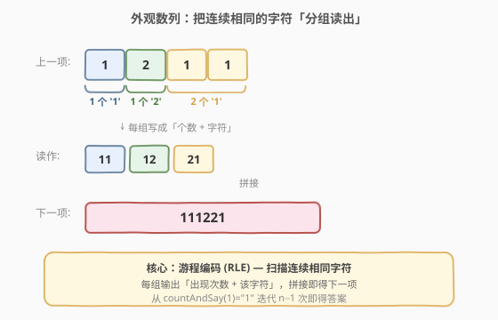
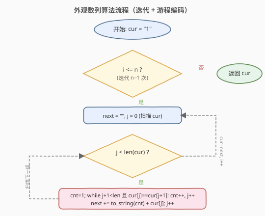
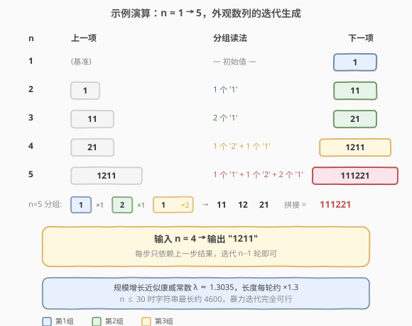

# LeetCode 外观数列 题解

## 1. 题目概述

- **标题 / 题号**：外观数列（#38，medium）
- **链接**：https://leetcode.cn/problems/count-and-say/
- **难度**：中等
- **标签**：字符串、模拟、双指针

**题意**：给定一个正整数 `n`，返回「外观数列」的第 `n` 项。

「外观数列」是一个整数序列，从数字 `1` 开始，序列中的每一项都是对前一项的「描述」：

- `countAndSay(1) = "1"`（基准）
- `countAndSay(n)` 是对 `countAndSay(n-1)` 的**读法**，把连续相同的数字分成一组，每组用「出现次数 + 该数字」拼接而成。

> 💡 直觉上就是「我看着前一项念出来」。例如前一项是 `"1211"`，就念成「一个 1、一个 2、两个 1」，记作 `"111221"`。

**示例 1**：

```text
输入：n = 1
输出："1"
解释：这是一个基本样例。
```

**示例 2**：

```text
输入：n = 4
输出："1211"
解释：
countAndSay(1) = "1"
countAndSay(2) = 读 "1" = 一个 1   = "11"
countAndSay(3) = 读 "11" = 两个 1  = "21"
countAndSay(4) = 读 "21" = 一个 2 + 一个 1 = "1211"
```

**约束**：

- $1 \le n \le 30$

## 2. 解题思路

### 2.1 暴力思路

注意到每一项**只依赖上一项**，且 $n \le 30$ 规模极小。最直接的做法就是从 `countAndSay(1) = "1"` 出发，**迭代 $n-1$ 次**，每次对当前字符串做一遍「读法」即可。

唯一需要想清楚的是：**如何「读」一个字符串**？答案是**游程编码（Run-Length Encoding, RLE）**——线性扫描，把连续相同字符压成 `(个数, 字符)` 数对。

> ⚠️ 不要尝试用递归 + 记忆化或数学公式直接求第 $n$ 项：外观数列没有闭式公式（康威证明其增长服从常数 $\lambda \approx 1.303577$，但这是渐近性质，无法直接拿来生成字符串）。迭代模拟就是本题的最优解。

### 2.2 核心观察：游程编码



把前一项 `"1211"` 按连续相同字符分组：

| 分组 | 字符 | 个数 | 读法 |
|------|------|------|------|
| 第 1 组 | `'1'` | 1 | `"11"` |
| 第 2 组 | `'2'` | 1 | `"12"` |
| 第 3 组 | `'1'` | 2 | `"21"` |

拼接所有读法得到 `"11" + "12" + "21" = "111221"`，即下一项。

> 💡 **关键观察**：分组后每组只有两个信息——**字符值**和**连续个数**，二者拼接即该组贡献。整段读法 = 所有组贡献顺序拼接。这等价于对字符串做一遍 RLE，把 `(count, char)` 对串起来。

### 2.3 算法流程图



两层循环：

- **外层**：`i` 从 `2` 到 `n`，共 $n-1$ 轮，每轮把 `cur` 读成 `next`。
- **内层**：`j` 线性扫描 `cur`，对每个起点 `j` 用一个 `while` 向右吞掉所有与 `cur[j]` 相同的字符，累计 `cnt`，然后向 `next` 追加 `to_string(cnt) + cur[j]`。

### 2.4 示例演算



上表展示了 $n = 1 \to 5$ 的完整迭代过程：

- $n=1$：基准 `"1"`。
- $n=2$：`"1"` 只有 1 个 `'1'` → `"11"`。
- $n=3$：`"11"` 有 2 个 `'1'` → `"21"`。
- $n=4$：`"21"` → 1 个 `'2'` + 1 个 `'1'` → `"1211"`。
- $n=5$：`"1211"` → 1 个 `'1'` + 1 个 `'2'` + 2 个 `'1'` → `"111221"`。

注意字符串长度每轮约增长 $\lambda \approx 1.3$ 倍，$n=30$ 时最长约 4600 个字符，暴力迭代完全在可行范围内。

## 3. 参考代码

### C++（迭代 + 内层 while 吞相同字符）

```cpp
class Solution {
  public:
    string countAndSay(int n) {
        string cur = "1";
        for (int i = 2; i <= n; i++) {
            string next;
            int j = 0, m = cur.size();
            while (j < m) {
                int cnt = 1;
                while (j + 1 < m && cur[j] == cur[j + 1]) {
                    cnt++;
                    j++;
                }
                next += to_string(cnt) + cur[j];
                j++;
            }
            cur = next;
        }
        return cur;
    }
};
```

### Python

```python
class Solution:
    def countAndSay(self, n: int) -> str:
        cur = "1"
        for _ in range(2, n + 1):
            nxt = []
            j = 0
            m = len(cur)
            while j < m:
                cnt = 1
                while j + 1 < m and cur[j] == cur[j + 1]:
                    cnt += 1
                    j += 1
                nxt.append(str(cnt))
                nxt.append(cur[j])
                j += 1
            cur = "".join(nxt)
        return cur
```

> ⚠️ **易错点**：内层 `while` 结束后还要 `j++` 跳到下一组的起点。如果忘了这一步，`j` 会卡在当前组末尾，死循环或读到错误分组。Python 版用列表 `append` 再 `join` 比字符串 `+=` 拼接更高效（避免中间字符串反复拷贝）。

## 4. 复杂度分析

| 维度 | 复杂度 | 说明 |
|------|--------|------|
| 时间复杂度 | $O(|S|)$，约 $O(1.3^n)$ | 每轮扫描上一项全长，总长按康威常数 $\lambda \approx 1.3035$ 几何增长；$n=30$ 时累计约 $10^4$ 量级 |
| 空间复杂度 | $O(|S|)$ | 只需保存当前项与下一项两个字符串 |

> 💡 $n \le 30$ 的约束是本题复杂度分析的关键：第 30 项长度约 4600，即便每轮都做线性扫描，总开销也在 $10^4$ 级别，常数极小，无需任何优化。

## 5. 扩展：用 `itertools.groupby` 一行搞定 RLE

Python 标准库 `itertools.groupby` 天然就是游程编码，可大幅简化代码：

```python
from itertools import groupby

class Solution:
    def countAndSay(self, n: int) -> str:
        cur = "1"
        for _ in range(2, n + 1):
            cur = "".join(str(len(list(g))) + k for k, g in groupby(cur))
        return cur
```

逻辑完全等价：`groupby` 把连续相同字符聚成一组，`k` 是字符、`g` 是该组迭代器，`len(list(g))` 即连续个数。面试中可先写朴素版展示思路，再提此版作为加分项。

## 6. 面试要点

1. **外观数列有闭式公式吗？为什么只能迭代？**

   - 没有可用的闭式公式。康威证明其长度渐近增长服从常数 $\lambda \approx 1.303577$，但这是统计性质，无法据此生成具体字符序列。每一项的内容强依赖上一项的**字符排列**，只能逐轮模拟。

2. **内层 `while` 的时间复杂度会不会退化到 $O(m^2)$？**

   - 不会。内层 `while` 每吞一个字符 `j` 就 `+1`，外层 `while` 也是 `j` 递增，两组循环合起来对每个字符只访问一次，整体仍是 $O(m)$。

3. **为什么不递归而要迭代？**

   - 递归版 `countAndSay(n) = describe(countAndSay(n-1))` 逻辑等价，但递归深度 $n \le 30$ 不算大，两者皆可。迭代更省栈空间、避免重复计算（虽然本题无重复子问题），且更贴合「逐轮生成」的直觉。

4. **如果把约束放大到 $n = 10^9$ 怎么办？**

   - 无法在有限时间内逐轮模拟（字符串长度指数爆炸）。需要改问别的统计量（如「第 $n$ 项中数字 `1` 的占比」），这类问题才有数学方法可解；但求完整字符串则不可行。面试中点出这一边界即可。

5. **`groupby` 版和手写版有何区别？**

   - 逻辑等价，`groupby` 是标准库封装的游程编码。手写版更体现对 RLE 的理解，`groupby` 版更 Pythonic。面试先写手写版，再提 `groupby` 作为简化方案，能展示对语言特性的掌握。

## 同类练习题

| # | 题目 | 与本题的关联 |
|---|------|-------------|
| 271 | [字符串的编码与解码](https://leetcode.cn/problems/encode-and-decode-strings/)（[题解](../0201-0300/271_字符串的编码与解码.md)） | 另一种字符串编码（长度前缀法），对比 RLE 的适用场景 |
| 443 | [压缩字符串](https://leetcode.cn/problems/string-compression/) | 原地进行游程编码，空间 $O(1)$，同一 RLE 套路的进阶版 |
| 604 | [迭代压缩字符串](https://leetcode.cn/problems/design-compressed-string-iterator/) | 设计 RLE 迭代器，按需展开压缩串 |
| 1313 | [解压缩编码列表](https://leetcode.cn/problems/decompress-run-length-encoded-list/) | RLE 的逆向操作（解码），`(freq, val)` 数对还原成数组 |
