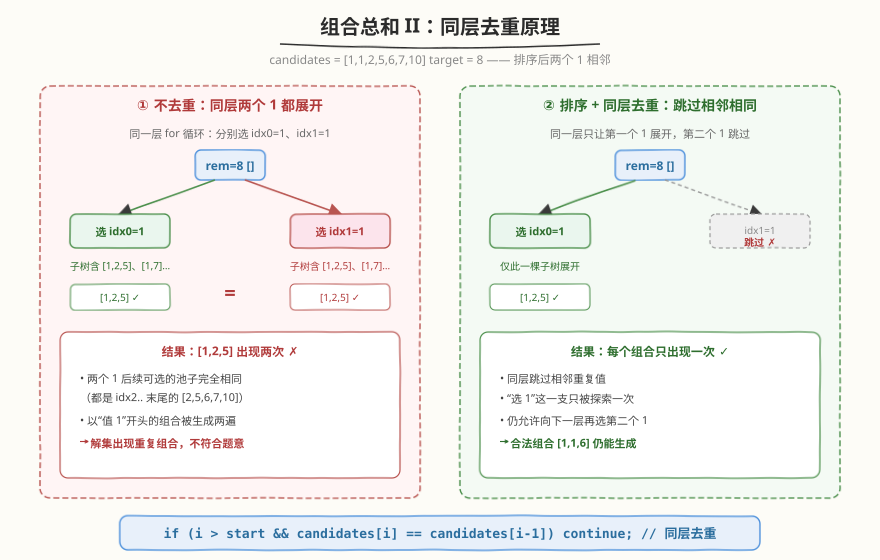
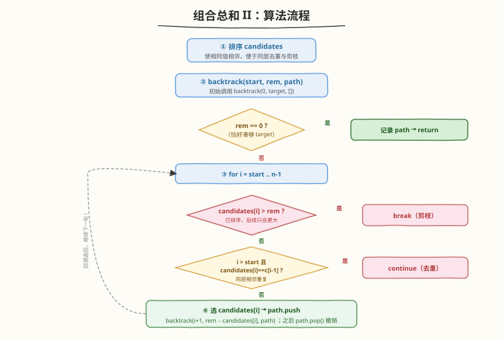
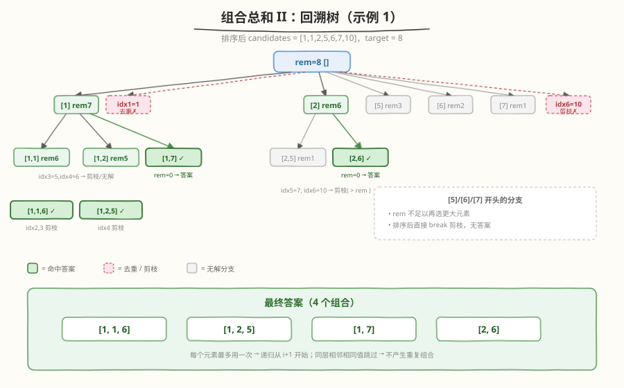

# LeetCode 组合总和 II 题解

## 1. 题目概述

- **标题 / 题号**：组合总和 II（#40，medium）
- **链接**：https://leetcode.cn/problems/combination-sum-ii/
- **难度**：中等
- **标签**：数组、回溯、剪枝

**题意**：给定一个候选人编号集合 `candidates`（**可能包含重复数字**）和一个目标数 `target`，找出 `candidates` 中所有可以使数字和为 `target` 的唯一组合。

`candidates` 中的每个数字在组合中**只能使用一次**。解集不能包含重复的组合。

**示例 1**：

```text
输入：candidates = [10,1,2,7,6,1,5], target = 8
输出：[[1,1,6],[1,2,5],[1,7],[2,6]]
解释：1 和 1 是两个不同的候选人（下标不同），可同时使用；但结果集中不能有重复组合。
```

**示例 2**：

```text
输入：candidates = [2,5,2,1,2], target = 5
输出：[[1,2,2],[5]]
```

**约束**：

- `1 <= candidates.length <= 100`
- `1 <= candidates[i] <= 50`
- `1 <= target <= 30`

> 💡 本题是 [39. 组合总和](39_组合总和.md) 的「进阶版」：39 中元素无重复且可无限复用，本题元素可重复且每个只能用一次。两者共享回溯骨架，区别在**去重**与**下标推进**。先做 39 再做 40，套路迁移最顺。

## 2. 解题思路

### 2.1 暴力思路

枚举 `candidates` 的所有子集（每个元素选/不选），过滤出和为 `target` 的，再去重。子集数 $2^n$，再去重（如排序后用 `set`）成本高，且无法利用「和」的信息提前剪枝，会大量超时。回溯的本质就是**带剪枝的子集枚举**。

### 2.2 核心观察：排序 + 回溯 + 同层去重



两个关键点决定了本题解法：

1. **每个元素只能用一次** → 递归下一层时下标从 `i + 1` 开始（不像 39 从 `i` 开始允许复用）。
2. **`candidates` 有重复值，但解不能重复** → 这是最大的坑。若不做处理，相同值在不同下标会被分别展开，产生完全相同的组合。

**去重的核心思想**：先**排序**使相同值相邻；在回溯的同一层 `for` 循环里，如果当前值与前一个相同，且前一个已经在**本层**被作为分支展开过，则跳过当前值——因为它的子树必然与前一个的子树重复。

判定条件：

```text
if (i > start && candidates[i] == candidates[i - 1]) continue;
```

> ⚠️ **为什么是 `i > start` 而不是 `i > 0`？**
> 去重只针对「同一层」的兄弟分支。`i == start` 表示这是本层选中的第一个元素，即便它与上一层路径里的元素相同也**必须保留**——这样才能生成形如 `[1,1,6]` 的合法组合（第二个 `1` 在更深层作为本层首元素被选中，属于纵向延伸，不是横向重复）。只有 `i > start` 时才属于同层后续分支，才需要跳过。

### 2.3 算法流程图



1. **排序** `candidates`（使重复值相邻、便于剪枝）。
2. `backtrack(start, rem, path)`：`rem` 为剩余目标，`path` 为当前组合。
3. 若 `rem == 0` → 记录 `path`，返回。
4. `for i = start .. n-1`：
   - **剪枝**：若 `candidates[i] > rem`，由于已排序后续只会更大，`break`。
   - **同层去重**：若 `i > start` 且 `candidates[i] == candidates[i-1]`，`continue`。
   - **选择**：`path.push(candidates[i])`。
   - **递归**：`backtrack(i + 1, rem - candidates[i], path)`（下标 `i+1` 保证不复用）。
   - **撤销**：`path.pop()`。

### 2.4 示例演算

以 `candidates = [10,1,2,7,6,1,5], target = 8` 为例，排序后为 `[1,1,2,5,6,7,10]`：



| 步骤 | path | rem | 动作 | 说明 |
|------|------|-----|------|------|
| 进入 | `[]` | 8 | i=0 选 `1` | 第一个 1，纵向延伸 |
| 进入 | `[1]` | 7 | i=1 选 `1` | 第二个 1 作为本层首元素，合法 |
| 进入 | `[1,1]` | 6 | i=4 选 `6` | rem=0，记录 `[1,1,6]` ✓ |
| 回到 `[]` | `[]` | 8 | i=1 遇 `1` | `i>start` 且等于前值 → **去重跳过** |
| 进入 | `[1]` | 7 | i=2 选 `2` | → `[1,2,5]` ✓ |
| 进入 | `[1]` | 7 | i=5 选 `7` | rem=0，记录 `[1,7]` ✓ |
| 回到 `[]` | `[]` | 8 | i=2 选 `2` | → `[2,6]` ✓ |
| 回到 `[]` | `[]` | 8 | i=6 遇 `10` | `10 > 8` → **剪枝 break** |

最终输出 `[[1,1,6],[1,2,5],[1,7],[2,6]]`。

## 3. 参考代码

### C++

```cpp
class Solution {
  public:
    vector<vector<int>> combinationSum2(vector<int>& candidates, int target) {
        vector<vector<int>> ans;
        vector<int> path;
        sort(candidates.begin(), candidates.end());
        backtrack(candidates, target, 0, path, ans);
        return ans;
    }

  private:
    void backtrack(vector<int>& candidates, int target, int start,
                   vector<int>& path, vector<vector<int>>& ans) {
        if (target == 0) {
            ans.push_back(path);
            return;
        }
        for (int i = start; i < (int)candidates.size(); ++i) {
            if (candidates[i] > target) break;                       // 剪枝
            if (i > start && candidates[i] == candidates[i - 1]) continue; // 同层去重
            path.push_back(candidates[i]);
            backtrack(candidates, target - candidates[i], i + 1, path, ans);
            path.pop_back();
        }
    }
};
```

### Python

```python
class Solution:
    def combinationSum2(self, candidates: List[int], target: int) -> List[List[int]]:
        ans = []
        candidates.sort()

        def backtrack(start: int, remaining: int, path: list) -> None:
            if remaining == 0:
                ans.append(path[:])
                return
            for i in range(start, len(candidates)):
                if candidates[i] > remaining:
                    break                       # 剪枝
                if i > start and candidates[i] == candidates[i - 1]:
                    continue                    # 同层去重
                path.append(candidates[i])
                backtrack(i + 1, remaining - candidates[i], path)
                path.pop()

        backtrack(0, target, [])
        return ans
```

## 4. 复杂度分析

| 维度 | 复杂度 | 说明 |
|------|--------|------|
| 时间复杂度 | $O(n \cdot 2^n)$ | 最坏情况每个元素选/不选构成 $2^n$ 个子集，每次复制答案 $O(n)$；排序 $O(n \log n)$ 可忽略。剪枝与去重会大幅降低实际开销 |
| 空间复杂度 | $O(n)$ | 递归栈深度与 `path` 长度均不超过 `n`（不计返回答案所占空间） |

> 💡 本题 `n <= 100`、`target <= 30`，剪枝极强（`rem` 很快被消耗），实际递归节点数远小于理论上限。

## 5. 扩展：用「计数 + 选 k 个」去重

除了「排序 + 同层跳过」，还有一种等价写法：先用哈希表/排序统计每个值的频次，再在回溯中**枚举当前值选 0~cnt 个**。这种写法天然无重复，常用于每个值有数量限制的背包型回溯。

```python
from collections import Counter

class Solution:
    def combinationSum2(self, candidates: List[int], target: int) -> List[List[int]]:
        freq = sorted(Counter(candidates).items())  # [(值, 次数), ...]
        ans = []

        def dfs(idx: int, remaining: int, path: list) -> None:
            if remaining == 0:
                ans.append(path[:])
                return
            if idx == len(freq):
                return
            val, cnt = freq[idx]
            # 选 k 个当前值（k = 0 即跳过该值）
            for k in range(0, min(cnt, remaining // val) + 1):
                path.extend([val] * k)
                dfs(idx + 1, remaining - k * val, path)
                for _ in range(k):
                    path.pop()

        dfs(0, target, [])
        return ans
```

> 💡 两种写法等价。「排序跳过」实现更短、面试更常用；「计数枚举」在「每个值有上限」的变体（如 [90. 子集 II](https://leetcode.cn/problems/subsets-ii/)、含重复元素的背包）里更直观。

## 6. 面试要点

1. **本题和 39 组合总和的区别在哪？**

   - 39：元素**无重复**、**可无限复用** → 递归从 `i` 开始，无需去重。
   - 40：元素**可重复**、**每个只用一次** → 递归从 `i + 1` 开始，且需同层去重。
   - 记忆口诀：**「无限用 → 传 i；用一次 → 传 i+1；有重复 → 排序加去重」**。

2. **同层去重条件 `i > start && candidates[i] == candidates[i-1]` 的两个部分各代表什么？**

   - `candidates[i] == candidates[i-1]`：当前值与前一个相同，子树必然重复。
   - `i > start`：保证只跳过「同层后续分支」，不误伤「纵向延伸」的首元素。去掉它会连 `[1,1,6]` 这种合法组合都生成不了。

3. **为什么要先排序？**

   - 让相同值相邻，去重条件只需比较相邻两个元素即可，无需额外数据结构。
   - 让剪枝 `break` 成立：一旦 `candidates[i] > rem`，后续更大的值都不可能入选，可整体跳出。

4. **剪枝用 `break` 还是 `continue`？**

   - 本题排序后单调递增，`candidates[i] > rem` 时后续必然也 `> rem`，用 **`break`** 跳出整个循环。
   - 若用 `continue` 虽不改变正确性，但会多遍历剩余元素，丧失剪枝意义。注意这与去重的 `continue`（只跳过当前一个）不要混淆。

5. **去重能否用 `set` / 结果去重代替？**

   - 可以但不推荐。结果层去重需先生成全部（含重复）组合再过滤，最坏 $2^n$ 个，无法靠剪枝早退；且对 `list` 去重需先排序转换元组，开销大。**在生成阶段去重**（同层跳过）才是最优解。

## 同类练习题

| # | 题目 | 与本题的关联 |
|---|------|-------------|
| 39 | [组合总和](https://leetcode.cn/problems/combination-sum/)（[题解](39_组合总和.md)） | 元素无重复、可无限复用的回溯模板，本题的前置题 |
| 47 | [全排列 II](https://leetcode.cn/problems/permutations-ii/)（[题解](47_全排列II.md)） | 排列版「同层去重」，同一套 `i > start && nums[i] == nums[i-1]` 套路 |
| 90 | [子集 II](https://leetcode.cn/problems/subsets-ii/) | 含重复元素的子集枚举，去重逻辑与本题完全一致 |
| 216 | [组合总和 III](https://leetcode.cn/problems/combination-sum-iii/) | 限定只用 1-9 且选 k 个，回溯 + 剪枝的练手题 |
| 78 | [子集](https://leetcode.cn/problems/subsets/)（[题解](78_子集.md)） | 无重复元素的子集回溯，对比 90 理解去重的必要性 |
