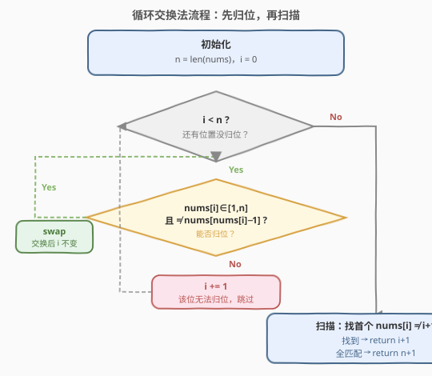

# 缺失的第一个正数

- **题目名称**：缺失的第一个正数
- **链接**：[41. 缺失的第一个正数](https://leetcode.cn/problems/first-missing-positive/)
- **难度**：困难
- **标签**：数组、原地哈希、循环交换

## 1. 题目概述

给定一个**未排序**的整数数组 `nums`，请找出其中**没有出现在数组中的最小的正整数**。

要求算法时间复杂度为 $O(n)$，并且只能使用常数级别的额外空间。

**示例 1**：

```text
输入：nums = [1,2,0]
输出：3
解释：1、2 都在数组中，所以缺失的最小正数是 3。
```

**示例 2**：

```text
输入：nums = [3,4,-1,1]
输出：2
解释：1 在数组中，但 2 不在，所以答案是 2。
```

**示例 3**：

```text
输入：nums = [7,8,9,11,12]
输出：1
解释：最小的正数 1 没有出现，答案是 1。
```

**约束条件**：

- $1 \leq n = \text{nums.length} \leq 5 \times 10^5$
- $-2^{31} \leq \text{nums}[i] \leq 2^{31} - 1$

> ⚠️ 这道题的难点不在「找缺失正数」本身，而在两个硬性约束：**$O(n)$ 时间 + $O(1)$ 额外空间**。排序是 $O(n \log n)$，开哈希表是 $O(n)$ 空间，都不达标。必须利用数组本身当哈希表，即**原地哈希（In-place Hashing）**。

---

## 2. 解题思路

### 2.1 暴力思路

- **排序后扫描**：先排序 $O(n \log n)$，再从 1 开始找第一个不在的位置。时间超标，空间 $O(\log n)$（排序栈）。
- **哈希集合**：把所有数放进 `HashSet`，再从 1 依次递增查询。时间 $O(n)$ 达标，但空间 $O(n)$ 超标。

> 💡 两种朴素做法都败在约束上。突破口是缩小答案范围：长度为 $n$ 的数组，能「装下」的正数最多 $n$ 个，因此**缺失的最小正数一定落在 $[1, n+1]$ 之间**。这把问题从「无穷范围找缺失」压缩成「$n+1$ 个候选里找缺失」。

### 2.2 核心观察：原地哈希，把数字 i 归位到下标 i−1

![核心观察：答案只可能在 [1, n+1]，把数字 i 归位到下标 i−1](../images/first_missing_positive_concept.svg)

关键观察有两点：

1. **答案范围是 $[1, n+1]$**：若 $1 \sim n$ 全部出现在数组中，答案就是 $n+1$；否则答案是 $1 \sim n$ 中第一个缺失的。因此所有 $\leq 0$ 或 $> n$ 的值都**对答案无影响**，可直接忽略。
2. **用数组自身当哈希表**：一个值 $v$ 若满足 $1 \leq v \leq n$，它「本该」出现在下标 $v-1$ 处。我们把每个这样的 $v$ 交换到下标 $v-1$，让 `nums[v-1] == v`。归位完成后，再扫一遍：第一个 `nums[i] != i+1` 的位置，答案就是 $i+1$。

> 💡 这等价于把数组改造成一个「桶」：下标 $i$ 的桶装值 $i+1$。装好后扫一眼哪个桶空着，答案就是那个桶对应的值。

### 2.3 算法流程图



核心是**归位循环**：对每个下标 `i`，只要 `nums[i]` 落在 $[1, n]$ 内、且它还没归位（`nums[i] != nums[nums[i]-1]`），就把 `nums[i]` 交换到它该去的位置 `nums[i]-1`。

> ⚠️ 交换后 **`i` 不自增**——因为换回来的新值可能仍可归位，需要继续处理当前位置。只有当 `nums[i]` 越界（$\leq 0$ 或 $> n$）或目标位置已是正确值时，才 `i += 1` 推进。条件里的 `nums[i] != nums[nums[i]-1]` 是**防死循环**的关键：遇到重复值时直接跳过，避免无限交换。

### 2.4 示例演算

以 `nums = [3,4,-1,1]`，$n=4$ 为例，逐次交换归位：

![示例演算：nums = [3,4,−1,1] 的归位与扫描过程](../images/first_missing_positive_example_walkthrough.svg)

| 步骤 | 操作 | 数组状态 | 说明 |
|------|------|----------|------|
| ① | i=0，交换 0↔2 | [−1,4,**3**,1] | 3 归位到下标 2；nums[0]=−1 越界，i=1 |
| ② | i=1，交换 1↔3 | [−1,1,3,**4**] | 4 归位到下标 3；nums[1]=1 待归位 |
| ③ | i=1，交换 1↔0 | [**1**,−1,3,4] | 1 归位到下标 0；nums[1]=−1 越界，i=1→2 |
| ④ | i=2,3 跳过 | [1,−1,3,4] | 3、4 已归位，无交换 |
| ⑤ | 扫描 | — | i=0：1=1 ✓；i=1：−1≠2 → **返回 2** |

最终答案为 **2**。可逐桶验证：下标 0 装 1 ✓，下标 1 本该装 2 却是 −1，故 2 缺失。

---

## 3. 参考代码

### C++

```cpp
class Solution {
public:
    int firstMissingPositive(vector<int>& nums) {
        int n = nums.size();
        // 归位：把值 v (1<=v<=n) 交换到下标 v-1
        for (int i = 0; i < n; ++i) {
            while (nums[i] >= 1 && nums[i] <= n
                   && nums[i] != nums[nums[i] - 1]) {
                swap(nums[i], nums[nums[i] - 1]);
            }
        }
        // 扫描：首个 nums[i] != i+1 的位置即为答案
        for (int i = 0; i < n; ++i) {
            if (nums[i] != i + 1) return i + 1;
        }
        return n + 1;
    }
};
```

### Python

```python
class Solution:
    def firstMissingPositive(self, nums: List[int]) -> int:
        n = len(nums)
        # 归位：把值 v (1<=v<=n) 交换到下标 v-1
        for i in range(n):
            while 1 <= nums[i] <= n and nums[i] != nums[nums[i] - 1]:
                # 注意：不能写 nums[i], nums[nums[i]-1] = nums[nums[i]-1], nums[i]
                # 因为左值 nums[i] 先变，会影响下标 nums[i]-1 的计算
                j = nums[i] - 1
                nums[i], nums[j] = nums[j], nums[i]
        # 扫描：首个 nums[i] != i+1 的位置即为答案
        for i in range(n):
            if nums[i] != i + 1:
                return i + 1
        return n + 1
```

> ⚠️ **Python 交换陷阱**：`nums[i], nums[nums[i]-1] = ...` 会出错，因为多元赋值从左到右求值左值下标，`nums[i]` 先被改写，导致第二个目标下标 `nums[i]-1` 用到的是新值。务必先用 `j = nums[i] - 1` 缓存目标下标，再 `nums[i], nums[j] = nums[j], nums[i]`。C++ 的 `swap` 不涉及此问题。

---

## 4. 复杂度分析

| 维度 | 复杂度 | 说明 |
|------|--------|------|
| 时间复杂度 | $O(n)$ | 每次交换至少让一个元素归位（且归位后不再移动），总交换次数 $\leq n$；while 内均摊到每步为 $O(1)$，整体线性 |
| 空间复杂度 | $O(1)$ | 仅用常数个变量，原地修改输入数组充当哈希表 |

> 💡 时间复杂度的关键是**摊还分析**：每个元素至多被交换一次（一旦它到达自己的目标位置 `v-1`，后续任何交换都不会再把它挪走，因为换走它会破坏「目标位置已是正确值」的不变量）。故 while 循环体总执行次数以 $n$ 为上界，外层 for 的 $n$ 次加上内层总共 $n$ 次交换，合计 $O(n)$。

---

## 5. 扩展：标记法与正确性不变量

### 5.1 另一种原地写法：负数标记

如果题目允许修改数组但**不要求保留原值**，还有一种「打标记」思路：

1. 先把所有 $\leq 0$ 的数改成 $n+1$（让它们变成「越界值」）；
2. 对每个满足 $1 \leq |v| \leq n$ 的值 $v$，把下标 $|v|-1$ 处的数**取负**（标记「值 $|v|$ 存在」）；
3. 扫描：第一个 `nums[i] > 0` 的下标 $i$，答案为 $i+1$；全为负则答案 $n+1$。

两种写法同构，都是「用下标作 key、用值的存在性/位置作 value」。循环交换法更直观，负数标记法更紧凑。

### 5.2 不变量与正确性

归位循环维持一个不变量：**对任意已满足 `nums[k] == k+1` 的位置 $k$，后续交换不会再破坏它**。因为若 `nums[i]` 要换到位置 $k$，必然 `nums[i]-1 == k` 即 `nums[i] == k+1`，而条件 `nums[i] != nums[nums[i]-1]` 此时为假（两边都等于 $k+1$），不会触发交换。所以归位是**单调累加**的，算法必然终止且结果正确。

---

## 6. 面试要点

1. **为什么答案一定在 $[1, n+1]$？**
   - 长度为 $n$ 的数组最多容纳 $n$ 个不同的正数。若 $1 \sim n$ 全部出现，则前 $n$ 个正数齐全，缺失的最小正数是 $n+1$；否则必有某个 $k \in [1,n]$ 缺失，答案 $\leq n$。综上答案 $\in [1, n+1]$，与数组具体数值无关。

2. **while 条件里 `nums[i] != nums[nums[i]-1]` 的作用是什么？**
   - 两个作用：一是判断当前位置是否已归位（已归位则跳过）；二是**防止重复值导致死循环**。若数组有重复（如两个 1），不加此条件会反复交换相同的两个位置。遇到目标位置已是正确值时直接跳过，保证终止。

3. **为什么交换后 `i` 不自增？**
   - 换回来的新 `nums[i]` 可能仍在 $[1,n]$ 内且未归位，需要继续处理当前位置。只有当当前位置无法归位（越界或已正确）时才推进 `i`。这是「原地归位」算法的标准写法。

4. **时间复杂度为什么是 $O(n)$ 而不是 $O(n^2)$？**
   - 摊还分析：每次 while 交换都让一个新元素到达其最终位置，且永不再移动（不变量保证）。故总交换次数 $\leq n$。外层 for $n$ 次 + 内层累计 $n$ 次交换 = $O(n)$，而非「$n$ 个位置每个最坏 $n$ 次」的 $O(n^2)$ 误判。

5. **能否用排序或哈希表？为什么不行？**
   - 排序 $O(n \log n)$ 不满足 $O(n)$；哈希表 $O(n)$ 空间不满足 $O(1)$。本题考察的就是在双重硬约束下想到「把数组本身当哈希表」的原地技巧，是原地哈希的招牌题。

---

## 7. 同类练习题

- [268. 缺失数字](https://leetcode.cn/problems/missing-number/)：本题的简化版，缺失的数在 $[0,n]$，同样可用「归位 + 扫描」或异或法，适合作为预热
- [287. 寻找重复数](https://leetcode.cn/problems/find-the-duplicate-number/)（[题解](../0201-0300/287_寻找重复数.md)）：同样是 $O(n)$ 时间 $O(1)$ 空间 + 原地修改的招牌题，对比「下标当 key」的两种用法（归位 vs 快慢指针）
- [448. 找到所有数组中消失的数字](https://leetcode.cn/problems/find-all-numbers-disappeared-in-an-array/)：本题的「找全部缺失」版本，直接套用归位或负数标记法
- [442. 数组中重复的数据](https://leetcode.cn/problems/find-all-duplicates-in-an-array/)：与 448 互为对偶，用同样的原地标记找重复，巩固「下标作哈希」套路
- [645. 错误的集合](https://leetcode.cn/problems/set-mismatch/)：找重复 + 找缺失的综合题，归位扫描一次搞定，是本题的进阶应用
