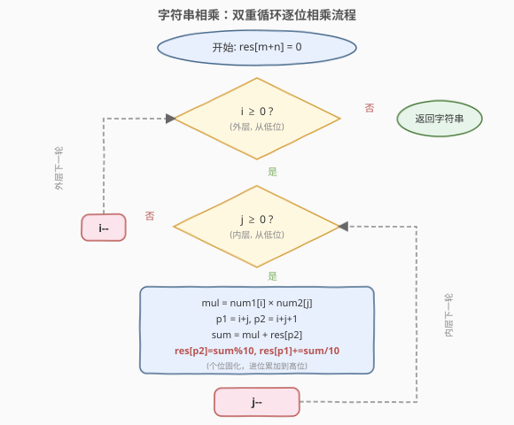
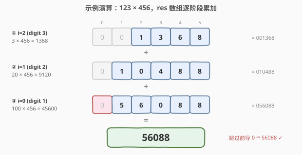

# LeetCode 字符串相乘 题解

## 1. 题目概述

- **标题 / 题号**：字符串相乘（#43，medium）
- **链接**：https://leetcode.cn/problems/multiply-strings/
- **难度**：中等
- **标签**：字符串、数学、模拟

**题意**：给定两个以字符串表示的非负整数 `num1` 和 `num2`，返回 `num1` 和 `num2` 的乘积，**乘积同样以字符串形式表示**。

注意：不能使用任何内建的 BigInteger 库，也不能**直接**将输入字符串转换为整数（如 `stoi` / `int()`）。

**示例 1**：

```text
输入：num1 = "2", num2 = "3"
输出："6"
```

**示例 2**：

```text
输入：num1 = "123", num2 = "456"
输出："56088"
```

**约束**：

- `1 <= num1.length, num2.length <= 200`
- `num1` 和 `num2` 只包含数字 `0-9`。
- `num1` 和 `num2` 均不含前导零，除了数字 `0` 本身。

> 💡 长度可达 `200`，意味着乘积最多约 `400` 位，远超 64 位整数（约 20 位）能表示的范围。因此**不能**依赖内置整数类型，必须像手算乘法那样**逐位模拟**。这也是本题被归为「字符串 / 模拟」而非「数学」技巧题的原因。

## 2. 解题思路

### 2.1 暴力思路

最直觉的做法是「把 `num2` 累加 `num1` 次」：每次做一次字符串加法，循环 `value(num1)` 次。但 `num1` 表示的数值可达 $10^{200}$，循环次数是天文数字，直接超时，不可行。

另一种「偷懒」做法是直接 `stoi` 转整数再相乘——题目明确**禁止**，且会溢出。因此必须回到**小学竖式乘法**：把 `num1` 的每一位与 `num2` 相乘得到「部分积」，再把所有部分积错位相加。

### 2.2 核心观察：竖式乘法 + 位置映射

竖式乘法的关键不是「怎么乘」（单 digit 相乘最多 $9 \times 9 = 81$，可放进一个 `int`），而是「**每一位的乘积该写到结果的哪个位置**」。只要把位置算对，所有部分积就能一次性累加进同一个数组，省去显式的错位相加。

![竖式乘法与位置映射：num1[i]×num2[j] 落到 res[i+j] 与 res[i+j+1]](../images/mulstr_position_mapping.svg)

**位权推导**：设 `num1` 长 $m$、`num2` 长 $n$，结果数组 `res` 开 $m+n$ 位（下标 $0$ 对应最高位，位权 $10^{m+n-1}$）。

- `num1[i]` 的位权是 $10^{m-1-i}$，`num2[j]` 的位权是 $10^{n-1-j}$。
- 两数相乘位权相加：$10^{(m-1-i)+(n-1-j)} = 10^{m+n-2-(i+j)}$。
- 令 $m+n-1-p = m+n-2-(i+j)$，解得 $p = i+j+1$。

所以 `num1[i] × num2[j]` 的**个位**写到 `res[i+j+1]`，**进位（十位）**写到 `res[i+j]`。两个位置都已确定，每个 digit 对的乘积累加进同一个 `res`，最后统一处理前导零即可。

> 💡 **为什么结果最多 $m+n$ 位？** 两个数分别 $< 10^m$、$< 10^n$，乘积 $< 10^{m+n}$，最多 $m+n$ 位；而 $\geq 10^{m-1} \cdot 10^{n-1} = 10^{m+n-2}$，至少 $m+n-1$ 位。所以开 $m+n$ 长度的数组**必然装得下**，多余的至多一个前导零最后去掉。

### 2.3 算法流程图



整体只有两重循环：外层遍历 `num1` 的每一位 `i`（从低位到高位），内层遍历 `num2` 的每一位 `j`。对每个 `(i, j)` 计算 `mul = num1[i] * num2[j]`，把个位和进位分别累加进 `res[i+j+1]` 与 `res[i+j]`。双重循环结束后，跳过前导零、拼成字符串返回。

### 2.4 示例演算

以 `num1 = "123"`、`num2 = "456"`（示例 2）为例，`res` 开 6 位。按 `num1` 的每一位分三个阶段累加：



| 阶段 | 处理的 num1 位 | 对应部分积 | 累加后 res（高位→低位） |
|------|---------------|-----------|------------------------|
| 1 | `i=2`，digit `3` | $3 \times 456 = 1368$ | `[0,0,1,3,6,8]` |
| 2 | `i=1`，digit `2` | $20 \times 456 = 9120$ | `[0,1,0,4,8,8]` |
| 3 | `i=0`，digit `1` | $100 \times 456 = 45600$ | `[0,5,6,0,8,8]` |

三个部分积之和 $1368 + 9120 + 45600 = 56088$，与 `res` 跳过前导零后的 `"56088"` 一致。注意每个阶段内部，`num1[i]` 与 `num2` 的每一位相乘时，进位会沿 `res` 向高位（左侧）传递，这正是 `res[p1] += sum / 10` 在做的事。

> ⚠️ 「按 `num1` 的每一位分阶段」只是便于理解累加过程；代码里其实是一次双重循环把所有 `(i, j)` 对的乘积直接累加进 `res`，并不需要显式保存中间部分积。位置映射 `p1=i+j, p2=i+j+1` 保证了不同阶段、不同位的贡献**互不冲突**地落到正确位置。

## 3. 参考代码

### C++

```cpp
class Solution {
  public:
    string multiply(string num1, string num2) {
        int m = num1.size(), n = num2.size();
        vector<int> res(m + n, 0);              // 结果最多 m + n 位

        for (int i = m - 1; i >= 0; --i) {      // 从低位到高位
            for (int j = n - 1; j >= 0; --j) {
                int mul = (num1[i] - '0') * (num2[j] - '0');
                int p1 = i + j, p2 = i + j + 1; // 进位位 / 个位
                int sum = mul + res[p2];        // 叠加该位已有的值
                res[p2] = sum % 10;
                res[p1] += sum / 10;            // 进位累加到高位
            }
        }

        // 跳过前导 0（至少保留一位，结果为 0 时返回 "0"）
        int k = 0;
        while (k < (int)res.size() - 1 && res[k] == 0) ++k;

        string ans;
        for (; k < (int)res.size(); ++k) ans.push_back('0' + res[k]);
        return ans;
    }
};
```

### Python

```python
class Solution:
    def multiply(self, num1: str, num2: str) -> str:
        m, n = len(num1), len(num2)
        res = [0] * (m + n)                     # 结果最多 m + n 位

        for i in range(m - 1, -1, -1):          # 从低位到高位
            for j in range(n - 1, -1, -1):
                mul = (ord(num1[i]) - 48) * (ord(num2[j]) - 48)
                p1, p2 = i + j, i + j + 1       # 进位位 / 个位
                total = mul + res[p2]           # 叠加该位已有的值
                res[p2] = total % 10
                res[p1] += total // 10          # 进位累加到高位

        # 跳过前导 0（至少保留一位，结果为 0 时返回 "0"）
        k = 0
        while k < len(res) - 1 and res[k] == 0:
            k += 1
        return "".join(str(d) for d in res[k:])
```

> ⚠️ **两个易错点**：
> 1. **`sum = mul + res[p2]` 必须先加上已有值再取模**。同一位置 `p2` 会被多个 `(i, j)` 对反复写入，必须把之前累加的值算进去，否则会丢掉历史贡献。取模后的进位再 `+=` 到高位 `p1`，由后续循环统一处理。
> 2. **前导零要跳过但至少留一位**。条件 `k < len - 1` 保证即使全零也保留最后一个 `0`，使 `0 × 任意数` 正确返回 `"0"`，无需特判。

## 4. 复杂度分析

| 维度 | 复杂度 | 说明 |
|------|--------|------|
| 时间复杂度 | $O(mn)$ | 双重循环遍历所有 digit 对，每对做 $O(1)$ 的乘法与取模 |
| 空间复杂度 | $O(m+n)$ | `res` 数组长度为 $m+n$（输出字符串不计入额外空间） |

> 💡 本题瓶颈在 $O(mn)$ 的乘法次数。对于 $m, n \leq 200$，约 $4 \times 10^4$ 次操作，绰绰有余。当位数达到 $10^5$ 量级（如计算几何 / 大数竞赛题）时，需改用 **FFT 快速乘法**把复杂度降到 $O(n \log n)$，但远超面试要求。

## 5. 扩展：进位顺序为什么正确？

一个常见疑问：`res[p1] += sum / 10` 只是**累加**进位，从不对 `res[p1]` 取模，它会不会超过 9 而溢出？

答案是不会，关键在**遍历顺序**。我们按 `i`、`j` 从大到小遍历，因此 `p2 = i+j+1` 也从大到小处理：

- 当某个位置 `p2` 作为「个位」被处理时，所有会让它收到低位贡献的 `(i, j)` 对都已先处理完（它们的 `p2' = p2`，更早被取模固化）。
- 处理完 `p2` 后，它只会作为更高位的 `p1`（进位目标）被 `+=` 一次进位，而单步进位 `sum / 10 ≤ 9`。
- 唯一从不作为 `p2` 的是最高位 `res[0]`，但它只会在 `(i=0, j=0)` 时收到一次进位，且 `sum ≤ 81 + 9 = 90`，进位 `≤ 9`，所以 `res[0] ≤ 9`，同样安全。

简言之：**从低位到高位处理 + 每步立即取模进位**，保证了任意时刻每个位置已固化的值都不超过 9，无需二次扫一遍进位。

## 6. 面试要点

1. **为什么结果是 $m+n$ 位？**
   - 两个数分别 $< 10^m$、$< 10^n$，乘积 $< 10^{m+n}$，最多 $m+n$ 位；又 $\geq 10^{m+n-2}$，至少 $m+n-1$ 位。所以开 $m+n$ 长度数组必然装得下，多余的至多一个前导零最后去掉。

2. **为什么 `(i, j)` 的乘积写到 `res[i+j]` 和 `res[i+j+1]`？**
   - 由位权推导：`num1[i]` 位权 $10^{m-1-i}$，`num2[j]` 位权 $10^{n-1-j}$，乘积位权 $10^{m+n-2-(i+j)}$，对应 `res` 下标 $p = i+j+1$（个位），进位进到 $p-1 = i+j$。

3. **为什么 `sum = mul + res[p2]` 要先加已有值再取模？**
   - 同一位置 `p2` 会被多个 `(i, j)` 对反复写入，必须把之前累加的值算进 `sum` 再统一取模进位，否则会丢掉历史贡献。从低位到高位遍历保证此时 `res[p2]` 的低位贡献已全部到齐。

4. **`res[p1]` 只累加不取模，会不会溢出？**
   - 不会。遍历顺序保证 `res[p1]` 作为「个位」被处理时已取模固化（$\leq 9$），之后只作为更高位的进位目标被加上 $\leq 9$ 的进位；最高位 `res[0]` 仅在 `(0,0)` 收到一次进位且 $\leq 9$。详见第 5 节。

5. **能不能用内置整数直接转？**
   - 不行。题目明确禁止；且长度可达 200，远超 64 位整数范围，会溢出。必须逐位模拟。

6. **遇到 `num1 = "0"` 怎么办？**
   - 无需特判。所有 `mul` 为 0，`res` 全零，跳过前导零后保留一个 `"0"` 即为正确结果。若想提前返回可在开头加 `if (num1 == "0" || num2 == "0") return "0";` 作为小优化。

## 同类练习题

| # | 题目 | 与本题的关联 |
|---|------|-------------|
| 415 | [字符串相加](https://leetcode.cn/problems/add-strings/) | 「字符串相加」版，同样的逐位模拟 + 进位模板，是本题的加法姊妹题 |
| 67 | [二进制求和](https://leetcode.cn/problems/add-binary/) | 二进制字符串相加，进位基数为 2，换汤不换药的进位模拟 |
| 66 | [加一](https://leetcode.cn/problems/plus-one/) | digit 数组 +1，最简单的进位传播入门 |
| 445 | [两数相加 II](https://leetcode.cn/problems/add-two-numbers-ii/)（[题解](../0401-0500/445_两数相加 II.md)） | 链表版字符串相加，用栈把链表逆序后再做进位加法 |
| 2 | [两数相加](https://leetcode.cn/problems/add-two-numbers/)（[题解](../0001-0100/2_两数相加.md)） | 链表逆序存储的加法模拟，与本题同为「逐位运算 + 进位」核心套路 |
