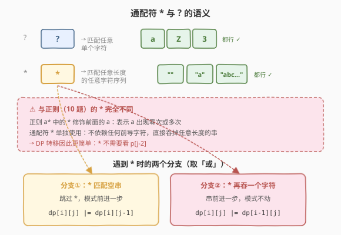
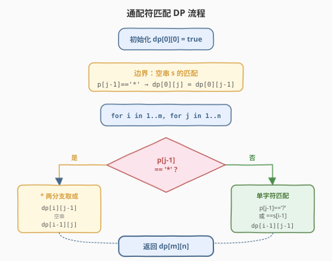
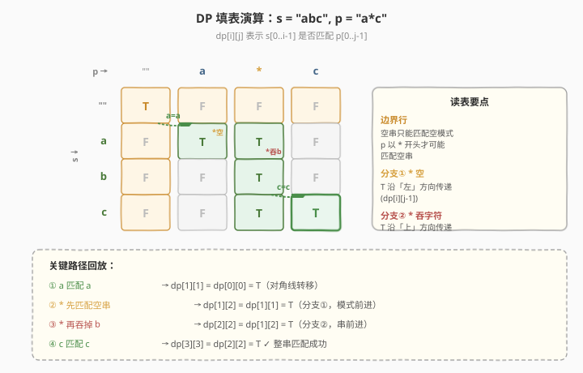

# 通配符匹配

- **题目名称**：通配符匹配
- **链接**：[44. 通配符匹配](https://leetcode.cn/problems/wildcard-matching/)
- **难度**：困难
- **标签**：动态规划、字符串、贪心

## 1. 题目概述

给你一个输入字符串 `s` 和一个字符模式 `p`，请你实现一个支持 `?` 和 `*` 匹配规则的**通配符匹配**：

- `?` 可以匹配**任意单个**字符。
- `*` 可以匹配**任意字符序列**（包括空序列）。

匹配需覆盖**整个**输入字符串 `s`（不能部分匹配）。

**示例 1**：

```text
输入：s = "aa", p = "a"
输出：false
解释："a" 无法匹配整个字符串 "aa"。
```

**示例 2**：

```text
输入：s = "aa", p = "*"
输出：true
解释：'*' 可以匹配任意序列 "aa"。
```

**示例 3**：

```text
输入：s = "cb", p = "?a"
输出：false
解释：'?' 匹配 'c'，但第二个字符 'a' 无法匹配 'b'。
```

**示例 4**：

```text
输入：s = "adceb", p = "*a*b"
输出：true
解释：第一个 '*' 匹配空串，第二个 '*' 匹配 "dce"，于是 "*a*b" 匹配 "adceb"。
```

**约束条件**：

- `0 <= s.length <= 2000`
- `0 <= p.length <= 2000`
- `s` 只包含小写字母。
- `p` 只包含小写字母、`?` 和 `*`。

> ⚠️ **关键提醒**：通配符的 `*` 和正则表达式的 `*` 语义**完全不同**——正则中 `*` 修饰它**前面的一个字符**（如 `a*` 表示零个或多个 `a`），而通配符中 `*` **独立使用**，匹配任意长度的任意字符序列。本题的 `*` 更「自由」也更难贪心，因为它的匹配范围需要全局决策。详见 [10. 正则表达式匹配](10_正则表达式匹配.md) 的对比说明。

---

## 2. 解题思路

### 2.1 暴力思路（递归枚举）

从左到右逐字符尝试匹配：看 `s[i]` 与 `p[j]` 是否相符。遇到 `?` 直接吃掉一个字符；遇到普通字符则要求相等。唯一的难点在 `*`——它可能匹配零个、一个、两个……任意多个字符，每种长度都要试。朴素递归会反复求解相同子问题，最坏 `O(2^{m+n})`，必然超时。

### 2.2 核心观察：`*` 与 `?` 的语义



通配符只有两个特殊符号，语义都比正则更「直白」：

| 符号 | 语义 | 与正则（10 题）对比 |
|------|------|---------------------|
| `?` | 匹配任意**单个**字符 | 等价于正则里的 `.` |
| `*` | 匹配任意长度的**任意字符序列** | 正则里 `*` 修饰前一个字符；通配符里 `*` 独立使用，不依赖任何前导字符 |

`*` 的「任意长度」意味着面对 `*` 时只有两种选择：

| 分支 | 含义 | DP 来源 |
|------|------|---------|
| **① 匹配空串** | 跳过 `*`，模式前进一步 | `dp[i][j-1]` |
| **② 再吞一个字符** | `*` 吞掉 `s[i-1]`，串前进一步、模式不动（`*` 还能继续吞） | `dp[i-1][j]` |

两分支取「或」——任一成功即匹配。

> 💡 **与正则 DP 的核心区别**：正则遇到 `*` 时分支①是 `dp[i][j-2]`（跳过 `x*` 两个字符），分支②需要判断前一个字符 `x` 是否匹配 `s[i-1]`；通配符的 `*` 不依赖前一个字符，分支①只需 `dp[i][j-1]`（跳过一个字符），分支②无条件吸收。转移更简洁，但 `*` 的「贪婪边界」更难把握。

### 2.3 状态定义与转移

定义 `dp[i][j]` 表示 `s[0..i-1]` 是否匹配 `p[0..j-1]`。

**边界**：

```text
dp[0][0] = true                       # 空串匹配空模式
dp[0][j] = dp[0][j-1]  (当 p[j-1]=='*')  # 空串 vs 以 * 开头的模式
```

> 空串 `s` 只能被「能消成空」的模式匹配——即若干个 `*` 串起来，每个 `*` 都选「匹配空串」。注意与正则的区别：正则是 `dp[0][j-2]`（跳两个字符），通配符是 `dp[0][j-1]`（跳一个字符）。

**转移**（`i >= 1, j >= 1`）：

```text
若 p[j-1] == '*':
    dp[i][j] = dp[i][j-1]           # ① * 匹配空串
           OR  dp[i-1][j]            # ② * 再吞一个字符 s[i-1]

否则（普通字符或 '?'）:
    dp[i][j] = (p[j-1]=='?' 或 p[j-1]==s[i-1]) AND dp[i-1][j-1]
```

**答案**：`dp[m][n]`。

### 2.4 算法流程图



### 2.5 示例演算

`s = "abc"`, `p = "a*c"`（`m=3, n=3`，模式字符依次为 `a * c`）：



逐格解读关键路径：

1. **`dp[1][1] = T`**：`p[0]='a'` 与 `s[0]='a'` 相等 → `dp[0][0] = T`（对角线转移）。
2. **`dp[1][2] = T`**：`*` 分支①匹配空串 → `dp[1][1] = T`（向左转移）。`*` 先什么都不吞。
3. **`dp[2][2] = T`**：`*` 分支②再吞 `s[1]='b'` → `dp[1][2] = T`（向上转移）。`*` 吞掉了 `b`。
4. **`dp[3][3] = T`**：`p[2]='c'` 与 `s[2]='c'` 相等 → `dp[2][2] = T` ✓

最终 `dp[3][3] = true`，整串匹配成功。

> 💡 注意 `*` 这一列（`j=2`）的 `T` 是**沿「上」方向**逐行传递的——这正是分支② `dp[i-1][j]` 的作用：`*` 把 `b`、`c` 都吞掉，`T` 一路下传。而 `dp[1][2]` 的 `T` 来自**向左**的分支①（`*` 先匹配空），它是整条 `*` 列传递链的「种子」。

---

## 3. 参考代码

### C++

```cpp
class Solution {
  public:
    bool isMatch(string s, string p) {
        int m = s.size(), n = p.size();
        vector<vector<bool>> dp(m + 1, vector<bool>(n + 1, false));
        dp[0][0] = true;

        // 边界：空串 s 只能匹配以 * 开头的模式（每个 * 选空串）
        for (int j = 1; j <= n; j++)
            if (p[j - 1] == '*')
                dp[0][j] = dp[0][j - 1];

        for (int i = 1; i <= m; i++) {
            for (int j = 1; j <= n; j++) {
                if (p[j - 1] == '*') {
                    // ① * 匹配空串；② * 再吞一个字符
                    dp[i][j] = dp[i][j - 1] || dp[i - 1][j];
                } else {
                    // 普通字符或 '?'
                    if (p[j - 1] == '?' || p[j - 1] == s[i - 1])
                        dp[i][j] = dp[i - 1][j - 1];
                }
            }
        }
        return dp[m][n];
    }
};
```

### Python

```python
class Solution:
    def isMatch(self, s: str, p: str) -> bool:
        m, n = len(s), len(p)
        dp = [[False] * (n + 1) for _ in range(m + 1)]
        dp[0][0] = True

        # 边界：* 可匹配空串
        for j in range(1, n + 1):
            if p[j - 1] == '*':
                dp[0][j] = dp[0][j - 1]

        for i in range(1, m + 1):
            for j in range(1, n + 1):
                if p[j - 1] == '*':
                    dp[i][j] = dp[i][j - 1] or dp[i - 1][j]   # ①空 ②吞
                elif p[j - 1] == '?' or p[j - 1] == s[i - 1]:
                    dp[i][j] = dp[i - 1][j - 1]
        return dp[m][n]
```

---

## 4. 复杂度分析

| 维度 | 复杂度 | 说明 |
|------|--------|------|
| 时间复杂度 | `O(m × n)` | 填 `(m+1)×(n+1)` 表，每格 `O(1)` 转移 |
| 空间复杂度 | `O(m × n)` | 二维 dp 表；可滚动数组压到 `O(n)` |

> ⚠️ 本题数据规模 `m, n ≤ 2000`，`O(m×n) = 4×10^6`，DP 表内存约 `2000×2000 = 4MB`（bool），可接受。但若用 `int` 或更高维则需注意空间。空间优化见下方扩展。

---

## 5. 扩展：贪心双指针 O(1) 空间

DP 虽然通用，但空间 `O(m×n)`。利用通配符 `*` **不依赖前导字符**的特性，可用**双指针 + 回溯**做到 `O(1)` 空间：

**核心思想**：遇到 `*` 时先假设它匹配**空串**（贪心），记录 `*` 位置和当前串指针；若后续失配且存在已记录的 `*`，则回溯——让那个 `*` **多吞一个字符**再重试。

```cpp
class Solution {
  public:
    bool isMatch(string s, string p) {
        int i = 0, j = 0;          // s 和 p 的指针
        int star = -1;              // 最近一个 * 的位置
        int match = 0;              // * 开始匹配 s 的位置
        while (i < s.size()) {
            if (j < p.size() && (p[j] == '?' || p[j] == s[i])) {
                i++; j++;           // 单字符匹配，齐头并进
            } else if (j < p.size() && p[j] == '*') {
                star = j;           // 记录 * 位置
                match = i;          // * 先匹配空串
                j++;                // 模式跳过 *
            } else if (star != -1) {
                j = star + 1;       // 回溯：模式回到 * 之后
                match++;            // * 多吞一个字符
                i = match;
            } else {
                return false;       // 无 * 可救，失配
            }
        }
        // 串用完，模式剩余必须全是 *
        while (j < p.size() && p[j] == '*') j++;
        return j == p.size();
    }
};
```

**复杂度**：

| 维度 | 复杂度 | 说明 |
|------|--------|------|
| 时间 | `O(m × n)` 最坏 | 多个 `*` 交替回溯时仍可能退化；但平均接近 `O(m+n)` |
| 空间 | `O(1)` | 仅用 4 个指针变量 |

> 💡 **最坏用例**：`s = "aaaaaaaaab"`, `p = "*a*a*a*a*"` 之类，反复回溯导致 `O(m×n)`。但空间恒定 `O(1)`，面试中若被追问「能不能不用 DP 表」即可出此解。

---

## 6. 面试要点

1. **通配符的 `*` 和正则的 `*` 有什么区别？**

   - 通配符 `*` 独立使用，匹配**任意长度的任意字符序列**（含空串）
   - 正则 `*` 修饰**前一个字符**，表示该字符出现零次或多次（如 `a*` 匹配 `""`、`"a"`、`"aa"`…）
   - DP 转移因此不同：通配符 `*` 分支①是 `dp[i][j-1]`（跳一个字符），正则 `*` 分支①是 `dp[i][j-2]`（跳 `x*` 两个字符）；通配符 `*` 分支②无条件吸收，正则 `*` 分支②需判断前导字符 `x` 是否匹配

2. **遇到 `*` 时两个分支分别对应什么？为什么取「或」？**

   - 分支① `dp[i][j-1]`：`*` 匹配空串，跳过 `*`，模式前进一步
   - 分支② `dp[i-1][j]`：`*` 吞掉 `s[i-1]`，串前进一步、模式不动（`*` 还能继续吞）
   - 取「或」：两种选择只要有一种能让剩余部分匹配即可

3. **为什么分支② 用的是 `dp[i-1][j]` 而不是 `dp[i-1][j-1]`？**

   - 吞掉一个 `s[i-1]` 后，`*` 仍未耗尽——它还能再吞零个或多个
   - 所以模式指针停在 `j`（仍指向 `*`），让后续状态继续决定 `*` 吞几个
   - 若用 `dp[i-1][j-1]` 则相当于「`*` 只吞一个就停」，丢失了「吞多个」的能力

4. **边界 `dp[0][j]` 为什么要单独处理？**

   - 空串 `s` 非空模式时仍可能匹配——当模式以 `*` 开头或连续 `*` 时，每个 `*` 都选空串即可
   - 所以 `dp[0][j]` 在 `p[j-1]=='*'` 时取 `dp[0][j-1]`
   - 漏掉这步会导致 `s=""`、`p="*"` 这类用例判错

5. **贪心双指针为什么能省掉 DP 表？**

   - 通配符 `*` 不依赖前导字符，回溯时只需让 `*` 多吞一个字符即可，不需要二维状态
   - 记录最近一个 `*` 的位置和匹配起点，失配时回溯——本质上是对 DP 中「`*` 列」的惰性展开
   - 代价：最坏时间仍 `O(m×n)`，但空间降到 `O(1)`

---

## 7. 同类练习题

- [10. 正则表达式匹配](https://leetcode.cn/problems/regular-expression-matching/)（[题解](10_正则表达式匹配.md)）：`*` 修饰前一个字符，DP 转移更复杂（需看 `p[j-2]`），与本题互为对照
- [1143. 最长公共子序列](https://leetcode.cn/problems/longest-common-subsequence/)（[题解](../1101-1200/1143_最长公共子序列.md)）：二维 DP 母题，字符相等/不等两分支
- [72. 编辑距离](https://leetcode.cn/problems/edit-distance/)（[题解](72_编辑距离.md)）：二维 DP，三种操作转移取 min
- [97. 交错字符串](https://leetcode.cn/problems/interleaving-string/)（[题解](97_交错字符串.md)）：二维布尔 DP，OR 二选一转移
