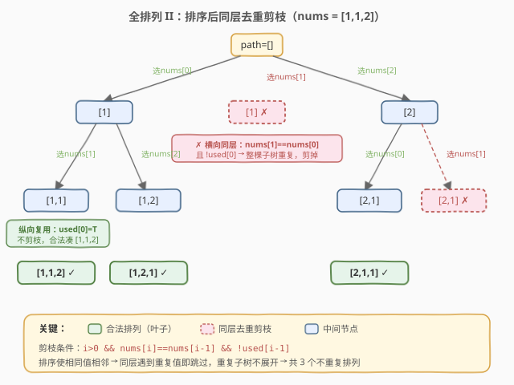
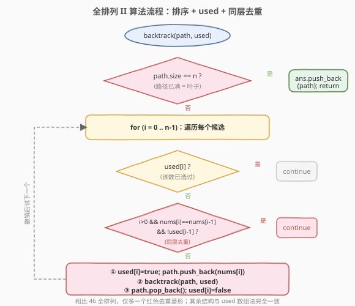

# 全排列 II

- **题目名称**：全排列 II
- **链接**：[47. 全排列 II](https://leetcode.cn/problems/permutations-ii/)
- **难度**：中等
- **标签**：数组、回溯

## 1. 题目概述

给定一个**可能包含重复数字**的序列 `nums`，按任意顺序返回所有**不重复**的全排列。

**示例 1**：

```text
输入：nums = [1,1,2]
输出：[[1,1,2],[1,2,1],[2,1,1]]
解释：注意两个 1 视为不同位置的元素，但产生的排列不能重复。
```

**示例 2**：

```text
输入：nums = [0,1]
输出：[[0,1],[1,0]]
```

**约束条件**：

- `1 <= nums.length <= 8`
- `-10 <= nums[i] <= 10`

---

## 2. 解题思路

### 2.1 暴力思路：先全排列再去重

直接套用 [46. 全排列](46_全排列.md) 的 `used` 数组模板生成所有排列，再用 `set` 去重。

- **缺点**：会生成大量重复排列再丢弃，最坏情况 `n!` 个排列里几乎全是重复（如 `nums = [1,1,1,1]` 理论上 `4! = 24` 个排列，实际只有 `1` 个）。时间和空间都浪费在「生产 → 丢弃」上，且 `set` 比较每个排列需 `O(n)`。

更优的做法是在**搜索过程中就剪掉重复分支**，根本不生成它们。

### 2.2 核心观察：排序 + 同层去重剪枝



关键两步：

1. **先排序**，让相同元素相邻。只有这样，才能用「和前一个相同」来识别重复。
2. **在同一层循环里剪枝**：若 `nums[i] == nums[i-1]` 且前一个相同元素**在本层未被选用**（`!used[i-1]`），则跳过 `nums[i]`。

> 💡 **理解「同层」**：回溯的 `for` 循环枚举的是**同一个位置**的候选，这些候选处于决策树的**同一层**（横向、广度方向）。同一层里若已经选过值为 `v` 的候选并完整探索了它的子树，再选另一个值也为 `v` 的候选必然得到完全相同的子树 → 产生重复排列。所以「同一层不选重复值」。

#### 最易混淆的点：为什么是 `!used[i-1]` 而不是 `used[i-1]`？

`used[i-1]` 区分了两种「相同元素」的场景，方向不同：

| 条件 | 含义 | 处理 |
|------|------|------|
| `used[i-1] == true` | 前一个相同值在**当前正在构造的路径里**（纵向、深度方向）已被选 | **合法**，不剪枝。例：`[1,1,2]` 中第一个 `1` 已选，第二个 `1` 是接着它构造 `[1,1,...]`，必须保留 |
| `used[i-1] == false` | 前一个相同值在**本层已被撤销 / 还没选**（横向、广度方向） | **剪枝**。说明值为 `v` 的候选在本层已探索过整棵子树，再选会重复 |

所以剪枝条件是 `i > 0 && nums[i] == nums[i-1] && !used[i-1]`。**`!used[i-1]` 恰好对应「横向同层」**，这是这道题的灵魂。

> ⚠️ **常见误区**：写成 `used[i-1]` 会把合法的纵向复用也剪掉。例如 `nums=[1,1,2]`，选了第一个 `1` 后想接着选第二个 `1` 凑 `[1,1,2]`，此时 `used[i-1]=true`，若按 `used[i-1]` 剪枝就会错误地跳过，导致漏解。

### 2.3 算法流程图



相比 46 全排列，只多了一个**去重剪枝判断**（红色菱形），插在 `used[i]` 判断之后、选-递归-撤销之前。其余结构与 46 完全一致。

### 2.4 示例演算

![示例演算 nums=[1,1,2]](../images/permute2_walkthrough.svg)

以 `nums=[1,1,2]`（已排序）为例，重点看两类节点的对比：

- **纵向复用（不剪枝）**：`path=[1]` 后再选第二个 `1` → `[1,1]`。此时 `used[0]=true`，不满足 `!used[i-1]`，**保留**，最终凑出 `[1,1,2]`。
- **横向同层（剪枝）**：根层选 `nums[0]=1` 已探索完整棵子树后，回到根层试 `nums[1]=1` → 此时 `used[0]=false`，满足剪枝条件，**跳过**，避免生成与「首位选 `nums[0]`」完全相同的排列。

最终只生成 `3` 个不重复排列：`[1,1,2]`、`[1,2,1]`、`[2,1,1]`，没有任何重复被生成后再丢弃。

---

## 3. 参考代码

### C++

```cpp
class Solution {
  public:
    vector<vector<int>> permuteUnique(vector<int>& nums) {
        vector<vector<int>> ans;
        vector<int> path;
        vector<bool> used(nums.size(), false);
        sort(nums.begin(), nums.end()); // ① 排序，让相同元素相邻
        backtrack(nums, path, used, ans);
        return ans;
    }

  private:
    void backtrack(vector<int>& nums, vector<int>& path,
                   vector<bool>& used, vector<vector<int>>& ans) {
        if (path.size() == nums.size()) {
            ans.push_back(path);
            return;
        }
        for (int i = 0; i < nums.size(); i++) {
            if (used[i]) continue; // 已选过
            // ② 同层去重：与前一个相同，且前一个在本层未选用
            if (i > 0 && nums[i] == nums[i - 1] && !used[i - 1]) continue;
            used[i] = true;
            path.push_back(nums[i]);
            backtrack(nums, path, used, ans);
            path.pop_back();
            used[i] = false;
        }
    }
};
```

### Python

```python
class Solution:
    def permuteUnique(self, nums: List[int]) -> List[List[int]]:
        ans = []
        nums.sort()                       # ① 排序
        used = [False] * len(nums)

        def backtrack(path: List[int]) -> None:
            if len(path) == len(nums):
                ans.append(path[:])       # 拷贝快照
                return
            for i in range(len(nums)):
                if used[i]:
                    continue
                # ② 同层去重
                if i > 0 and nums[i] == nums[i - 1] and not used[i - 1]:
                    continue
                used[i] = True
                path.append(nums[i])
                backtrack(path)
                path.pop()
                used[i] = False

        backtrack([])
        return ans
```

> 💡 **为什么必须先排序？** 去重条件依赖 `nums[i] == nums[i-1]`，即「相同值相邻」。若不排序，相同的 `1` 可能分散在 `nums[0]` 和 `nums[3]`，`i-1` 处的邻居并非相同值，剪枝条件失效。**「排序 + 相邻判等」是回溯同层去重的统一前提**，可迁移到 40、90、491 等题（491 因要求保持原顺序不能排序，需改用哈希去重）。

---

## 4. 复杂度分析

| 维度 | 复杂度 | 说明 |
|------|--------|------|
| 时间复杂度 | $O(n \cdot \frac{n!}{\prod c_k!})$ | 不同排列数为 $\frac{n!}{\prod c_k!}$（$c_k$ 为值 $k$ 的重复次数），每个排列构造需 $O(n)$；最坏无重复时退化为 $O(n \cdot n!)$ |
| 空间复杂度 | $O(n)$ | 递归栈深 $n$ + `path` / `used` 各 $O(n)$（不计结果数组） |

---

## 5. 扩展：用 `used[i-1]` 还是 `!used[i-1]`？两种写法都成立

有趣的是，剪枝条件写成 `used[i-1]`（纵向剪枝）也能得到正确答案，只是**剪枝时机不同、效率略低**：

- **`!used[i-1]`（横向剪枝，推荐）**：在「同层」第二个重复值刚要被选时就跳过，整棵重复子树不展开。剪枝更早、更快。
- **`used[i-1]`（纵向剪枝）**：允许同层选第二个重复值，但要求「只有在前一个相同值已被选（在路径中）时才选当前」，从而保证相同值的相对顺序固定（即相同值按出现顺序被选）。等价于「相同值只按一种顺序使用」，同样去重，但会展开更多中间节点。

两者结果集相同，面试中写 `!used[i-1]` 并能讲清「横向同层」语义最佳。

---

## 6. 面试要点

1. **为什么必须先排序？**
   - 去重条件 `nums[i] == nums[i-1]` 依赖相同值相邻，排序后才能用「与前一个相等」识别重复。不排序则相同值可能分散，条件失效。

2. **剪枝条件 `!used[i-1]` 中的 `!` 为什么不能去掉？**
   - `used[i-1]=true` 表示前一个相同值在**当前路径**中（纵向复用），是构造 `[1,1,2]` 这类合法排列必需的，不能剪。只有 `!used[i-1]`（前一个相同值在本层未选用，即横向同层）才代表「这棵子树已探索过」，才剪枝。去掉 `!` 会把合法纵向复用也剪掉，导致漏解。

3. **横向剪枝和纵向剪枝的区别？**
   - 横向（`!used[i-1]`，推荐）：在决策树**同一层**遇到重复值即跳过，重复子树根本不展开，效率高。纵向（`used[i-1]`）：允许同层选重复值，但强制相同值按顺序使用，仍能去重，只是展开的中间节点更多。

4. **和 46 全排列的核心区别是什么？**
   - 46 的元素互不相同，无需去重；47 有重复元素，需排序 + 同层剪枝。模板仅多一个 `if (i>0 && nums[i]==nums[i-1] && !used[i-1]) continue;`。

5. **能否不排序、用 `set` 在叶子去重？**
   - 可以但低效：会生成所有 `n!` 个排列（含重复）再丢弃，最坏空间 $O(n \cdot n!)$，且每个排列比较需 $O(n)$。搜索中剪枝（本题做法）从源头不生成重复，远优于「先生产再过滤」。

---

## 7. 同类练习题

- [46. 全排列](https://leetcode.cn/problems/permutations/)（[题解](46_全排列.md)）：不含重复元素的基础模板，先掌握再来看 47
- [40. 组合总和 II](https://leetcode.cn/problems/combination-sum-ii/)：每个数只能用一次 + 同层去重，剪枝条件几乎一致
- [90. 子集 II](https://leetcode.cn/problems/subsets-ii/)：含重复元素的子集，同样的「排序 + 同层去重」套路
- [491. 递增子序列](https://leetcode.cn/problems/non-decreasing-subsequences/)：不能排序的场景，改用「每层哈希集合」做同层去重
- [473. 火柴拼正方形](https://leetcode.cn/problems/matchsticks-to-square/)：回溯去重 + 剪枝优化的综合应用
