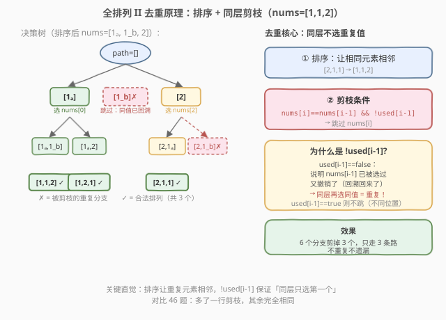
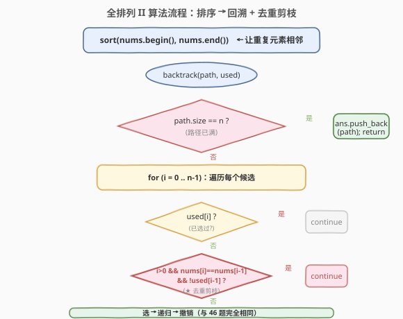

# 全排列 II

- **题目名称**：全排列 II
- **链接**：[47. 全排列 II](https://leetcode.cn/problems/permutations-ii/)
- **难度**：中等
- **标签**：数组、回溯、排序

## 1. 题目概述

给定一个**可能包含重复数字**的整数数组 `nums`，返回其所有**不重复**的全排列。可以按任意顺序返回答案。

**示例 1**：

```text
输入：nums = [1,1,2]
输出：[[1,1,2],[1,2,1],[2,1,1]]
解释：虽然有 3! = 6 种排列方式，但其中一半是重复的，最终只有 3 个唯一排列。
```

**示例 2**：

```text
输入：nums = [1,2,3]
输出：[[1,2,3],[1,3,2],[2,1,3],[2,3,1],[3,1,2],[3,2,1]]
解释：无重复元素时，与 46 题完全相同，共 3! = 6 个排列。
```

**约束条件**：

- `1 <= nums.length <= 8`
- `-10 <= nums[i] <= 10`

---

## 2. 解题思路

### 2.1 暴力思路：回溯 + 去重集合

直接套用 [46. 全排列](46_全排列.md) 的回溯模板生成所有排列，然后用 `HashSet` 过滤重复。时间复杂度 `O(n · n!)`，但额外承受集合的哈希开销，且无法避免「先生成重复排列再过滤」的浪费。

> ⚠️ 这种做法在面试中只能拿「能做对」的评价——面试官会追问：「能不能在生成阶段就跳过重复分支？」这就引出了下面的**剪枝去重**方案。

### 2.2 核心观察：排序 + 同层剪枝去重



关键直觉：**重复排列的根源在于「同一层递归中，选了值相同的不同元素」**。

以 `nums=[1, 1, 2]` 为例（排序后，下标 0 和 1 的值都是 1）：

- 在根节点这一层，先选 `nums[0]=1` 走完整个子树，收集到 `[1,1,2]`、`[1,2,1]`。
- 回溯回来后，如果再选 `nums[1]=1` 作为首元素，它产生的排列与 `nums[0]=1` **完全相同**——因为两者值一样，剩余候选也一样。

因此去重的核心原则是：**同一层中，值相同的元素只选第一个**。

实现方法：

1. **排序**：先对 `nums` 排序，让相同值的元素相邻。
2. **剪枝条件**：在循环遍历候选时，如果 `nums[i] == nums[i-1]` 且 `nums[i-1]` **未被使用**（`!used[i-1]`），则跳过 `nums[i]`。

> 💡 **为什么是 `!used[i-1]` 而不是 `used[i-1]`？** 这是最容易混淆的点：
>
> - `!used[i-1]` 为真（即 `used[i-1] == false`）：说明 `nums[i-1]` 在本层被选过又**已回溯撤销**了。这意味着以 `nums[i-1]` 为首的分支已经完整探索完毕，再选同值的 `nums[i]` 只会重复——**剪！**
> - `used[i-1]` 为真（即 `used[i-1] == true`）：说明 `nums[i-1]` 正在当前路径中（排在 `nums[i]` 前面的位置）。此时 `nums[i]` 是排列的**另一个位置**，选它不会重复——**不剪！**

### 2.3 算法流程图



与 46 题的流程几乎一致，唯一的区别是在 `used[i]` 检查之后多了一步**去重剪枝判断**（图中红色菱形）。通过这一步，重复分支在进入递归前就被跳过，避免了无效搜索。

### 2.4 示例演算

![示例演算：nums=[1,1,2] 的回溯过程](../images/permutations2_walkthrough.svg)

以 `nums=[1ₐ, 1_b, 2]`（排序后）为例，追踪关键的 8 步：

- **步骤 ①-④**：以 `1ₐ` 为首元素，依次探索 `[1,1,2]` 和 `[1,2,1]` 两条路径，收集到 2 个排列。
- **步骤 ⑤**（关键剪枝）：回溯到根后尝试 `i=1`。此时 `used[0]=false`（1ₐ 已撤销），`nums[1]==nums[0]` 且 `!used[0]` → **剪枝！** 避免了以 `1_b` 为首元素的重复分支。
- **步骤 ⑥-⑧**：以 `2` 为首元素，探索 `[2,1,1]`。注意步骤 ⑧ 中 `nums[1]==nums[0]` 但 `used[0]=true`（1ₐ 在路径中）→ **不剪**，正确地选入 `1_b` 得到第三个排列。

最终结果 `[[1,1,2], [1,2,1], [2,1,1]]`，共 3 个，无重复无遗漏。

---

## 3. 参考代码

### C++（排序 + used 数组 + 剪枝）

```cpp
class Solution {
  public:
    vector<vector<int>> permuteUnique(vector<int>& nums) {
        sort(nums.begin(), nums.end()); // ① 排序：让相同元素相邻
        vector<vector<int>> ans;
        vector<int> path;
        vector<bool> used(nums.size(), false);
        backtrack(nums, path, used, ans);
        return ans;
    }

  private:
    void backtrack(vector<int>& nums, vector<int>& path,
                   vector<bool>& used, vector<vector<int>>& ans) {
        if (path.size() == nums.size()) {
            ans.push_back(path);
            return;
        }
        for (int i = 0; i < nums.size(); i++) {
            if (used[i])
                continue; // 已选过，跳过
            // ② 去重剪枝：同值元素且前一个未使用（已回溯），跳过
            if (i > 0 && nums[i] == nums[i - 1] && !used[i - 1])
                continue;
            // 选 → 递归 → 撤销
            used[i] = true;
            path.push_back(nums[i]);
            backtrack(nums, path, used, ans);
            path.pop_back();
            used[i] = false;
        }
    }
};
```

### Python

```python
class Solution:
    def permuteUnique(self, nums: List[int]) -> List[List[int]]:
        nums.sort()  # ① 排序：让相同元素相邻
        ans = []
        used = [False] * len(nums)

        def backtrack(path: List[int]) -> None:
            if len(path) == len(nums):
                ans.append(path[:])
                return
            for i in range(len(nums)):
                if used[i]:
                    continue
                # ② 去重剪枝：同值元素且前一个未使用（已回溯），跳过
                if i > 0 and nums[i] == nums[i - 1] and not used[i - 1]:
                    continue
                # 选 → 递归 → 撤销
                used[i] = True
                path.append(nums[i])
                backtrack(path)
                path.pop()
                used[i] = False

        backtrack([])
        return ans
```

> ⚠️ **Python 收集结果必须用** `path[:]` **拷贝**，原因同 [46. 全排列](46_全排列.md)：直接 `append(path)` 存的是引用，后续 `pop()` 会改坏已存入的结果。

---

## 4. 复杂度分析

| 维度 | 复杂度 | 说明 |
|------|--------|------|
| 时间复杂度 | $O(n \cdot n!)$ | 最坏情况（无重复）与 46 题相同；有重复时剪枝会显著减少实际搜索量 |
| 空间复杂度 | $O(n)$ | 递归调用栈深度 $n$ + `path` / `used` 各 $O(n)$（不计结果数组） |

> 💡 排序的 $O(n \log n)$ 相比 $O(n!)$ 可忽略不计。当数组有大量重复元素时，剪枝效果非常显著——例如 `nums=[1,1,1,1]` 只会产生 1 个排列而非 $4!=24$ 个。

---

## 5. 扩展：`!used[i-1]` vs `used[i-1]`

细心的读者可能发现，有些题解使用 `used[i-1]`（而非 `!used[i-1]`）也能通过。两者的区别在于剪枝时机：

| 条件 | 行为 | 效率 |
|------|------|------|
| `!used[i-1]` | 同层重复且前一个**已回溯**时跳过 | 剪枝更早，在进入递归前就跳过 |
| `used[i-1]` | 同层重复且前一个**在路径中**时才允许选 | 也会去重，但会多进入一层递归再剪 |

**两种写法都能产生正确结果**，但 `!used[i-1]` 效率更高，是面试中的标准写法。理解了「为什么是 `!used[i-1]`」就真正掌握了回溯去重的精髓。

---

## 6. 面试要点

1. **回溯去重的核心原则是什么？**

   - **同一层中，值相同的元素只选第一个**。排序让相同值相邻，剪枝条件 `nums[i] == nums[i-1] && !used[i-1]` 保证不重复探索等价分支。

2. **为什么必须先排序？**

   - 剪枝条件依赖 `nums[i] == nums[i-1]`，即相邻元素值相同。如果不排序，相同值的元素可能不相邻，条件无法正确触发。

3. **`!used[i-1]` 和 `used[i-1]` 有什么区别？**

   - `!used[i-1]`：前一个同值元素已被回溯（同层已探索完毕），再选会重复 → 剪枝，效率更高。
   - `used[i-1]`：前一个同值元素在路径中才允许选 → 也能去重，但剪枝更晚。两者结果相同，面试推荐 `!used[i-1]`。

4. **这道题和 46 题的区别在哪里？**

   - 仅多了**一行排序**和**一行剪枝条件**。回溯的三步模板（选-递归-撤销）完全不变。这说明回溯框架的扩展性——加一个剪枝条件就能处理新约束。

5. **如果不用排序+剪枝，还有什么去重方案？**

   - 用 `HashSet` 存储已生成的排列，在收集时去重。但这是「先生成再过滤」，无法避免无效搜索，效率差。面试中作为引出剪枝方案的对比过渡即可。

---

## 7. 同类练习题

- [46. 全排列](https://leetcode.cn/problems/permutations/)（[题解](46_全排列.md)）：不含重复元素的全排列，本题的基础模板
- [40. 组合总和 II](https://leetcode.cn/problems/combination-sum-ii/)：每个数字只能用一次 + 含重复元素，同样的排序 + 同层剪枝套路
- [90. 子集 II](https://leetcode.cn/problems/subsets-ii/)（[题解](90_子集II.md)）：含重复元素的子集枚举，去重逻辑与本题完全一致
- [39. 组合总和](https://leetcode.cn/problems/combination-sum/)（[题解](39_组合总和.md)）：无重复元素 + 可无限复用，对比理解去重场景的差异
