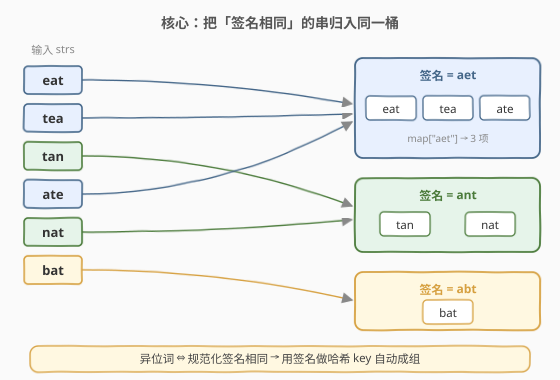
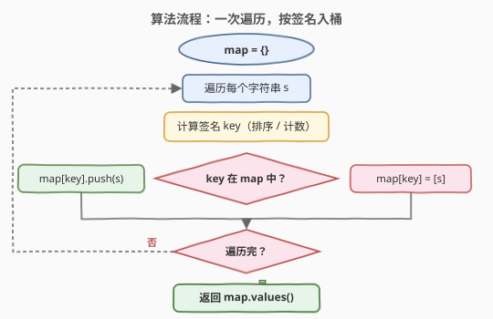
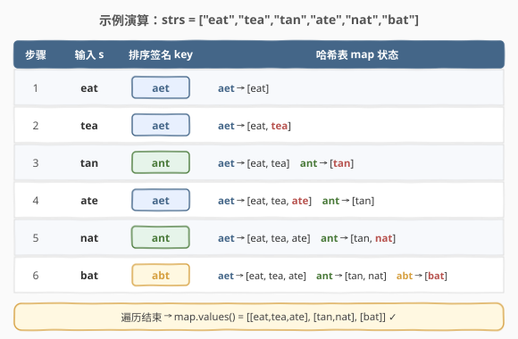

# LeetCode 字母异位词分组 题解

## 1. 题目概述

- **标题 / 题号**：字母异位词分组（#49，medium）
- **链接**：https://leetcode.cn/problems/group-anagrams/
- **难度**：中等
- **标签**：数组、哈希表、字符串、排序

**题意**：给你一个字符串数组，请你将**字母异位词**组合在一起。可以按任意顺序返回结果列表。

**字母异位词**：由重新排列源单词的所有字母得到的新单词，源单词中的所有字母都恰好使用一次。

**示例 1**：

```text
输入：strs = ["eat","tea","tan","ate","nat","bat"]
输出：[["bat"],["nat","tan"],["ate","eat","tea"]]
解释：eat/tea/ate 互为异位词，tan/nat 互为异位词，bat 单独一组。
```

**示例 2**：

```text
输入：strs = [""]
输出：[[""]]
```

**示例 3**：

```text
输入：strs = ["a"]
输出：[["a"]]
```

**约束**：

- `1 <= strs.length <= 10^4`
- `0 <= strs[i].length <= 100`
- `strs[i]` 仅包含小写英文字母

> ⚠️ **关键性质**：互为异位词的两个字符串，**字符多重集合完全相同**（每个字母出现次数一致）。这意味只要为每个串算出一个**规范化「签名」**，签名相同者必为异位词——这正是用哈希表自动成组的切入点。

## 2. 解题思路

### 2.1 暴力思路

对每个字符串，与其后所有字符串两两比较是否为异位词（排序后判等，或逐字符计数判等），把同组者标记归并。时间 `O(n^2 · k log k)`，`n` 为串数、`k` 为串长。`n` 可达 `10^4`，平方比较必然超时。

> 💡 **优化方向**：与其两两比较，不如给每个串算一个**「指纹」**，让指纹相同者自动落入同一桶——一次遍历即可完成分组。

### 2.2 核心观察：用「签名」做哈希 key 自动成组



把每个字符串映射成一个**规范化的签名**，互为异位词的串签名必然相同。于是用 `签名 → 字符串列表` 的哈希表，遍历一次即可把所有串送进对应的桶里，最后输出各桶即可。

> 💡 **关键转化**：异位词判定从「两两比较」变成「各自规范化后查表」，时间从 `O(n^2)` 降到 `O(n)` 趟（每趟算签名）。

### 2.3 两种签名构造方式

签名的构造决定了每趟的代价，常见两种：

| 方式 | 构造 | 单串代价 | 适用场景 |
|------|------|----------|----------|
| **排序法** | 将 `s` 字符排序得到 `key` | `O(k log k)` | 写法极简，`k` 较小时常数小，最常用 |
| **计数法** | 统计 26 个字母频次，拼成元组/带分隔符字符串作 `key` | `O(k)` | `k` 很大、字符集固定且小时更优 |

> ⚠️ **计数法的 key 形式**：数组/列表不可哈希，需转成 `tuple`（Python）或拼成带分隔符的字符串如 `"1#0#2#..."`（C++）。直接拼接数字 `"102"` 会与 `"10","2"` 产生歧义，**分隔符不可省**。

### 2.4 算法流程图



### 2.5 示例演算

以 `strs = ["eat","tea","tan","ate","nat","bat"]` 为例（用排序法算签名）：



| 步骤 | 输入 `s` | 排序签名 `key` | 哈希表 `map` 状态 |
|------|----------|----------------|-------------------|
| 1 | eat | aet | aet → [eat] |
| 2 | tea | aet | aet → [eat, tea] |
| 3 | tan | ant | aet → [eat, tea]　ant → [tan] |
| 4 | ate | aet | aet → [eat, tea, **ate**]　ant → [tan] |
| 5 | nat | ant | aet → [eat, tea, ate]　ant → [tan, **nat**] |
| 6 | bat | abt | aet → [eat, tea, ate]　ant → [tan, nat]　abt → [bat] |

遍历结束，`map.values()` 即为三组答案。注意 `eat/tea/ate` 三者签名都是 `aet`，被自动并入同一桶，无需任何两两比较。

## 3. 参考代码

### C++（排序法，首选）

```cpp
class Solution {
  public:
    vector<vector<string>> groupAnagrams(vector<string>& strs) {
        unordered_map<string, vector<string>> mp;
        for (string& s : strs) {
            string key = s;
            sort(key.begin(), key.end());
            mp[key].push_back(s);
        }
        vector<vector<string>> ans;
        for (auto& [k, v] : mp) {
            ans.push_back(std::move(v));
        }
        return ans;
    }
};
```

### Python（排序法）

```python
class Solution:
    def groupAnagrams(self, strs: List[str]) -> List[List[str]]:
        mp = collections.defaultdict(list)
        for s in strs:
            key = "".join(sorted(s))
            mp[key].append(s)
        return list(mp.values())
```

### Python（计数法，`k` 很大时更优）

```python
class Solution:
    def groupAnagrams(self, strs: List[str]) -> List[List[str]]:
        mp = collections.defaultdict(list)
        for s in strs:
            cnt = [0] * 26
            for c in s:
                cnt[ord(c) - ord('a')] += 1
            mp[tuple(cnt)].append(s)   # 元组可哈希，直接做 key
        return list(mp.values())
```

## 4. 复杂度分析

设 `n = strs.length`，`k = max(strs[i].length)`。

| 维度 | 排序法 | 计数法 | 说明 |
|------|--------|--------|------|
| 时间复杂度 | $O(n \, k \log k)$ | $O(n \, k)$ | 每个串算签名一次：排序需 $k\log k$，计数仅需 $k$；哈希插入均摊 $O(1)$（签名长度 `k`） |
| 空间复杂度 | $O(n \, k)$ | $O(n \, k)$ | 哈希表存储所有字符串及其签名，输出本身占 $O(nk)$ |

> 💡 本题 `k <= 100`，排序法 `k log k` 很小、写法最简，是面试首选；计数法把单串代价压到 $O(k)$，在 `k` 上万、字符集仍为 26 时优势才明显。

## 5. 扩展：签名思想的更多构造

「规范化签名 + 哈希」是一类通用模式，签名的选择因题而异：

- **排序签名**：本题、[242. 有效的字母异位词](https://leetcode.cn/problems/valid-anagram/)；
- **频次元组签名**：字符集固定时优于排序，等价于把多重集合「规范」成固定 26 维向量；
- **最小表示签名**：如 [890. 查找和替换模式](https://leetcode.cn/problems/find-and-replace-pattern/) 用双射规范化把同构字符串归为一类；
- **质数乘积签名**：给 26 个字母各配一个质数，签名 = 各字母质数之积。异位词乘积相等，单串 $O(k)$ 且 key 为整数。但 `k` 较大时乘积易溢出，需大整数或取模（取模有哈希冲突风险），工程上不如计数法稳妥。

## 6. 面试要点

1. **为什么排序后的串能当异位词的签名？**
   - 异位词 ⇔ 字母多重集合相同 ⇔ 排序后得到的规范化串相同。排序把所有同构串映射到唯一代表元，故可作哈希 key。

2. **排序法与计数法如何取舍？**
   - `k` 小（如本题 `k <= 100`）选排序法，写法短、常数小；`k` 很大且字符集固定（26）选计数法，单串 $O(k)$ 优于 $O(k\log k)$。两者空间相同。

3. **计数法为何 key 要用 tuple 或带分隔符字符串？**
   - 可变列表不可哈希；直接拼接数字会歧义（`"12"+"3"` 与 `"1"+"23"`）。Python 用 `tuple(cnt)`，C++ 拼成 `"1#0#2#..."`，分隔符保证一一对应。

4. **能否做到原地分组、不用额外哈希表？**
   - 难。分组本质需按 key 聚集，输出就占 $O(nk)$；哈希表是本题最自然的 $O(n)$ 趟解法，省不掉索引结构。

5. **若字符串含 Unicode / 大小写 / 大字符集怎么办？**
   - 排序法仍通用（比较开销随字符变大）；计数法需改用 `dict`/`Counter`（键不再是 0..25），key 取 `frozenset(Counter.items())` 或排序后的 `tuple`。先与面试官确认字符集再选方案。

## 同类练习题

| # | 题目 | 与本题的关联 |
|---|------|-------------|
| 242 | [有效的字母异位词](https://leetcode.cn/problems/valid-anagram/) | 判定两串是否互为异位词，本题「单对」退化版，排序或计数均可 |
| 438 | [找到字符串中所有字母异位词](https://leetcode.cn/problems/find-all-anagrams-in-a-string/)（[题解](../0401-0500/438_找到字符串中所有字母异位词.md)） | 定长滑动窗口 + 频次比对，异位词判定的滑动窗口应用 |
| 451 | [根据字符出现频率排序](https://leetcode.cn/problems/sort-characters-by-frequency/) | 频次统计 + 排序，反向运用字符计数 |
| 890 | [查找和替换模式](https://leetcode.cn/problems/find-and-replace-pattern/) | 另一种「规范化签名」分组——双射规范化把同模式串归为一类 |
| — | [剑指 Offer II 033. 变位词组](https://leetcode.cn/problems/sfvd7V/) | 本题同款，中文版经典变体 |
