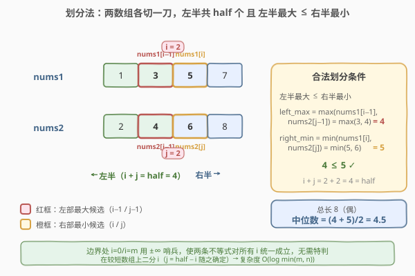
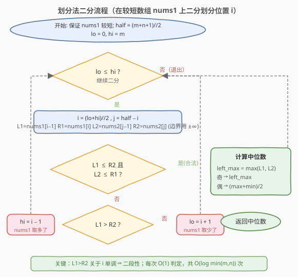

# LeetCode 寻找两个正序数组的中位数 题解

## 1. 题目概述

- **标题 / 题号**：寻找两个正序数组的中位数（#4，hard）
- **链接**：https://leetcode.cn/problems/median-of-two-sorted-arrays/
- **难度**：困难
- **标签**：数组、二分查找、分治

**题意**：给定两个**分别**有序的整数数组 `nums1` 和 `nums2`，大小分别为 `m` 和 `n`。请你找出并返回这两个正序数组的**中位数**。要求算法的时间复杂度为 $O(\log (m+n))$。

**示例 1**：

```text
输入：nums1 = [1,3], nums2 = [2]
输出：2.00000
解释：合并数组 = [1,2,3]，中位数为 2
```

**示例 2**：

```text
输入：nums1 = [1,2], nums2 = [3,4]
输出：2.50000
解释：合并数组 = [1,2,3,4]，中位数为 (2 + 3) / 2 = 2.5
```

**约束**：

- `nums1.length == m`，`nums2.length == n`
- $0 \le m \le 1000$，$0 \le n \le 1000$
- $1 \le m + n \le 2000$
- $-10^6 \le \text{nums1}[i],\ \text{nums2}[i] \le 10^6$

## 2. 解题思路

### 2.1 暴力思路：归并后取中

最直观的做法是 [合并两个有序数组](88_合并两个有序数组.md)：用双指针把两个数组合并成一个长度 $m+n$ 的有序数组，再按下标取中位数：

- 总长为奇数：中位数 = 合并后第 $\lfloor (m+n)/2 \rfloor$ 个元素；
- 总长为偶数：中位数 = 第 $(m+n)/2 - 1$ 与第 $(m+n)/2$ 个元素的平均。

时间 $O(m+n)$、空间 $O(m+n)$（也可只数到中位数位置把空间降到 $O(1)$）。但题目要求 $O(\log(m+n))$，归并法不达标。

> 💡 **关键转化**：中位数本质是「**第 k 小**」——奇数长取第 $\lceil (m+n)/2 \rceil$ 小，偶数长取第 $(m+n)/2$ 与第 $(m+n)/2+1$ 小的平均。「在有序结构里找第 k 小」且要求对数复杂度，几乎一定指向**二分**。

### 2.2 核心观察：划分法（partition）

中位数把有序数组分成「左半」和「右半」两堆，满足：**左半任意元素 ≤ 右半任意元素**，且左半元素个数等于右半（或恰好多一个）。把这个性质搬到两个**未合并**的数组上：

- 在 `nums1` 上切一刀，位置 `i`：左部 `nums1[0..i-1]`，右部 `nums1[i..]`；
- 在 `nums2` 上切一刀，位置 `j`：左部 `nums2[0..j-1]`，右部 `nums2[j..]`；
- 让两边的「左部」合起来恰好是全局前 `half` 小的元素，即 $i + j = \text{half}$，其中 $\text{half} = \lfloor (m+n+1)/2 \rfloor$（这样奇数长时左半多一个，中位数直接取左半最大）。



只要再保证**跨数组有序**——左半最大值 ≤ 右半最小值——这堆元素究竟来自哪个数组就无所谓了。左半最大值只可能出现在两处：`nums1[i-1]` 或 `nums2[j-1]`；右半最小值同理出现在 `nums1[i]` 或 `nums2[j]`。于是**合法划分**只需满足两条：

$$\text{nums1}[i-1] \le \text{nums2}[j] \quad \text{且} \quad \text{nums2}[j-1] \le \text{nums1}[i]$$

> ⚠️ **边界哨兵**：当 `i = 0` 时 `nums1` 没贡献左部，`nums1[i-1]` 视作 $-\infty$；`i = m` 时 `nums1` 没贡献右部，`nums1[i]` 视作 $+\infty$。`j` 同理。引入 $\pm\infty$ 后，上面的不等式对任意边界都成立，无需特判。

找到合法划分后，中位数唾手可得：

- 总长奇数：$\text{median} = \max(\text{nums1}[i-1],\ \text{nums2}[j-1])$（左半最大）；
- 总长偶数：$\text{median} = \dfrac{\max(\text{左部}) + \min(\text{右部})}{2}$。

### 2.3 为什么能二分？——单调性

固定 `nums1` 的划分 `i`，则 `j = half - i` 随之确定。考察 `i` 增大时：

- `i` 增大 → `j` 减小 → `nums1[i-1]` 增大、`nums2[j]` 减小 → `nums1[i-1] > nums2[j]` 越容易成立。

也就是说「`nums1[i-1] > nums2[j]`」关于 `i` **单调**：`i` 太大时必然违反左不等式（nums1 取太多），`i` 太小时则会违反右不等式（`nums2[j-1] > nums1[i]`，nums1 取太少）。这给出清晰的**二段性**，可在 $i \in [0, m]$ 上二分：

- 若 `nums1[i-1] > nums2[j]`：`i` 偏大，去左半 `hi = i - 1`；
- 若 `nums2[j-1] > nums1[i]`：`i` 偏小，去右半 `lo = i + 1`；
- 否则两条都满足，找到合法划分。

> 💡 **始终在较短数组上二分**：把 `nums1` 选成较短的那个（必要时交换），可保证 `j = half - i` 落在 $[0, n]$ 内不越界。复杂度也因此是 $O(\log \min(m,n))$。

### 2.4 算法流程图



### 2.5 示例演算

![示例演算：nums1 = [1,2], nums2 = [3,4]](../images/mtsa_example_walkthrough.svg)

以示例 2 `nums1 = [1,2]`、`nums2 = [3,4]` 为例（$m=n=2$，`half = (4+1)//2 = 2`，结果应为 $2.5$）：

| 轮次 | `[lo, hi]` | `i` | `j=half−i` | 左部 | 右部 | 判定 | 动作 |
|------|-----------|-----|-----------|------|------|------|------|
| 1 | `[0, 2]` | 1 | 1 | `{1, 3}` | `{2, 4}` | `nums2[j-1]=3 > nums1[i]=2`，`i` 偏小 | `lo = 2` |
| 2 | `[2, 2]` | 2 | 0 | `{1, 2}` | `{3, 4}` | `nums1[i-1]=2 ≤ nums2[j]=3` 且 `nums2[j-1]=−∞ ≤ nums1[i]=+∞` ✓ | 合法，停止 |

第 2 轮得到合法划分：左部 `{1, 2}`、右部 `{3, 4}`。总长偶数，`left_max = max(2, −∞) = 2`，`right_min = min(+∞, 3) = 3`，中位数 $= (2+3)/2 = 2.5$，与示例一致。

> 💡 第 1 轮 `i=1` 时左部含 `nums2[0]=3` 而右部含 `nums1[1]=2`，跨数组无序（$3 > 2$），说明 `nums1` 给左部太少、`nums2` 给太多，于是增大 `i`（让 `nums1` 多给一个到左部、`nums2` 少给一个）。

## 3. 参考代码

### 方法一：划分法二分（推荐，$O(\log\min(m,n))$）

### C++

```cpp
#include <vector>
#include <algorithm>
#include <climits>
using namespace std;

class Solution {
  public:
    double findMedianSortedArrays(vector<int>& nums1, vector<int>& nums2) {
        // 始终在较短的数组上二分，保证 j = half - i 不越界
        if (nums1.size() > nums2.size()) swap(nums1, nums2);
        int m = nums1.size(), n = nums2.size();
        int half = (m + n + 1) / 2;          // 左半元素总数（奇数长时左半多一）
        int lo = 0, hi = m;
        int i = 0, j = 0;
        int left1, right1, left2, right2;
        while (lo <= hi) {
            i = (lo + hi) / 2;
            j = half - i;
            left1  = (i == 0) ? INT_MIN : nums1[i - 1];
            right1 = (i == m) ? INT_MAX : nums1[i];
            left2  = (j == 0) ? INT_MIN : nums2[j - 1];
            right2 = (j == n) ? INT_MAX : nums2[j];
            if (left1 <= right2 && left2 <= right1) break;   // 合法划分
            else if (left1 > right2) hi = i - 1;             // nums1 取多了
            else                      lo = i + 1;             // nums1 取少了
        }
        int left_max  = max(left1, left2);
        if ((m + n) % 2) return left_max;                    // 奇数长：左半最大
        int right_min = min(right1, right2);
        return (left_max + right_min) / 2.0;                  // 偶数长：左右均值
    }
};
```

### Python

```python
from typing import List


class Solution:
    def findMedianSortedArrays(self, nums1: List[int], nums2: List[int]) -> float:
        # 始终在较短的数组上二分，保证 j = half - i 不越界
        if len(nums1) > len(nums2):
            nums1, nums2 = nums2, nums1
        m, n = len(nums1), len(nums2)
        half = (m + n + 1) // 2            # 左半元素总数（奇数长时左半多一）
        lo, hi = 0, m
        i = j = 0
        while lo <= hi:
            i = (lo + hi) // 2
            j = half - i
            left1  = float("-inf") if i == 0 else nums1[i - 1]
            right1 = float("inf")  if i == m else nums1[i]
            left2  = float("-inf") if j == 0 else nums2[j - 1]
            right2 = float("inf")  if j == n else nums2[j]
            if left1 <= right2 and left2 <= right1:
                break                     # 合法划分
            elif left1 > right2:
                hi = i - 1                # nums1 取多了
            else:
                lo = i + 1                # nums1 取少了
        left_max = max(left1, left2)
        if (m + n) % 2:
            return left_max               # 奇数长：左半最大
        right_min = min(right1, right2)
        return (left_max + right_min) / 2  # 偶数长：左右均值
```

> ⚠️ **三个易错点**：
> 1. **`half` 用 `(m+n+1)//2`**：让奇数长时左半多放一个元素，这样奇数长的中位数就是左半最大，分支最少。
> 2. **边界用 $\pm\infty$ 哨兵**：`i=0`/`i=m`/`j=0`/`j=n` 时对应位置取 $\pm\infty$，使两条不等式始终可比较，免去一堆 `if` 特判。
> 3. **必须保证 `nums1` 较短**：否则 `j = half - i` 可能为负（`half` 较小而 `i` 较大时）。交换后 `m ≤ n`，可证 $j \in [0, n]$。

## 4. 复杂度分析

| 维度 | 复杂度 | 说明 |
|------|--------|------|
| 时间复杂度 | $O(\log \min(m,n))$ | 二分区间长度为较短数组长度 $\min(m,n)$，每次 $O(1)$ 判定 |
| 空间复杂度 | $O(1)$ | 只用常数个变量，无额外数组 |

> ⚠️ 暴力归并是 $O(m+n)$，划分法把「合并后线性扫描」换成「在划分位置上对数二分」，是本题从「不达标」到「达标」的关键一跳。题目给的 $m+n \le 2000$ 看似不大，但 $O(\log(m+n))$ 的要求是为了逼出划分法这一思想。

## 5. 扩展：找两个有序数组第 k 小

中位数是「第 k 小」的特例。更一般地，可用**递归二分 k**：每轮比较两数组第 $\lfloor k/2 \rfloor$ 个元素，较小那一侧的前 $\lfloor k/2 \rfloor$ 个元素必不可能是第 k 小，整体砍掉，`k` 减半。复杂度 $O(\log(m+n))$。划分法（固定 `half` 二分 `i`）与「二分 k」是同一思想的两种实现：前者对**划分位置**二分，后者对**排名 k** 二分。面试中划分法代码更短、边界更少，更推荐。

## 6. 面试要点

1. **为什么能二分？二段性体现在哪？**

   - 固定 `i` 则 `j = half - i` 确定。`i` 增大时 `nums1[i-1]` 增大而 `nums2[j]` 减小，故 `nums1[i-1] > nums2[j]` 关于 `i` 单调。存在分界点：`i` 偏大时违反左不等式、`i` 偏小时违反右不等式、中间一段合法。这种「左偏大 / 右偏小 / 中间合法」的结构即可二分。

2. **为什么要在较短数组上二分？**

   - 保证 `j = half - i` 落在 $[0, n]$ 内。若 `nums1` 更长，`i` 较小时 `j` 可能超过 `n`；交换使 `m ≤ n` 后，`half ≤ n`（因 $\text{half} = \lfloor(m+n+1)/2\rfloor \le \lfloor(n+n+1)/2\rfloor = n$），且 `i ≤ m ≤ half` 保证 `j ≥ 0`。同时复杂度优化为 $O(\log\min(m,n))$。

3. **`half = (m+n+1)//2` 里的 `+1` 是干什么的？**

   - 让总长为奇数时左半比右半多一个元素，于是奇数长的中位数 = 左半最大值，无需再算右半最小值。偶数长时 `+1` 被 `//2` 取整抹掉，不影响。这样奇偶分支最少。

4. **边界 `i=0`/`i=m` 为什么要用 $\pm\infty$？**

   - `i=0` 表示 `nums1` 一个元素都不放左部，此时不存在 `nums1[i-1]` 这一「左部最大」候选，用 $-\infty$ 表示「它不可能成为左部最大」，使 `max(left1, left2)` 自然取到 `left2`；右侧 `i=m` 同理用 $+\infty$。这让两条比较不等式对所有 `i` 统一成立，省去特判。

5. **和「二分 k」递归法相比优劣？**

   - 都是 $O(\log)$。划分法迭代、无递归栈、边界用哨兵统一，代码更短更不易错；「二分 k」更直观地推广到任意第 k 小（不只是中位数），但递归与边界处理略繁。面试推荐划分法。

## 同类练习题

| # | 题目 | 与本题的关联 |
|---|------|-------------|
| 88 | [合并两个有序数组](https://leetcode.cn/problems/merge-sorted-array/)（[题解](88_合并两个有序数组.md)） | 双指针归并 $O(m+n)$，即本题暴力解法的核心操作 |
| 295 | [数据流的中位数](https://leetcode.cn/problems/find-median-from-data-stream/)（[题解](../0201-0300/295_数据流的中位数.md)） | 动态维护中位数，用大/小顶堆各管一半 |
| 378 | [有序矩阵中第 K 小的元素](https://leetcode.cn/problems/kth-smallest-element-in-a-sorted-matrix/) | 二分值域 + 计数，"有序结构找第 k 小"的另一范式 |
| 668 | [乘法表中第 K 小的数](https://leetcode.cn/problems/kth-smallest-number-in-multiplication-table/) | 二分值域 + 计数，与 378 同骨架 |
| 240 | [搜索二维矩阵 II](https://leetcode.cn/problems/search-a-2d-matrix-ii/)（[题解](../0201-0300/240_搜索二维矩阵II.md)） | 利用行列单调性在有序结构中搜索 |
