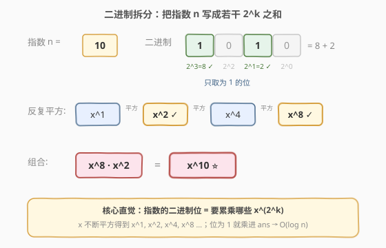
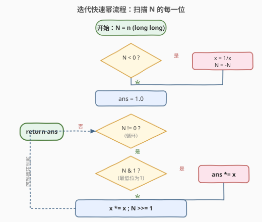
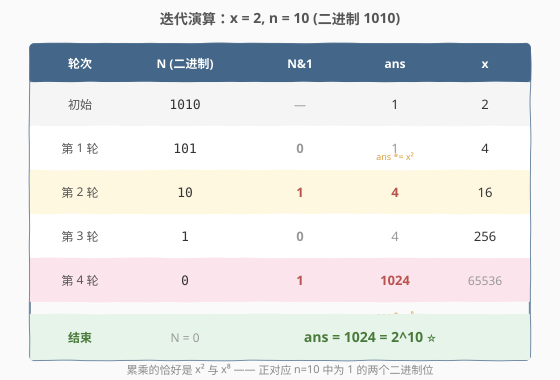
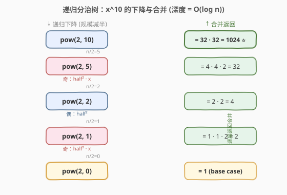

# LeetCode Pow(x, n) 题解

## 1. 题目概述

- **标题 / 题号**：Pow(x, n)（#50，medium）
- **链接**：https://leetcode.cn/problems/powx-n/
- **难度**：中等
- **标签**：数学、递归、分治、位运算

**题意**：实现 `pow(x, n)`，即计算 $x$ 的 $n$ 次幂函数 $x^n$。

**示例 1**：

```text
输入：x = 2.00000, n = 10
输出：1024.00000
```

**示例 2**：

```text
输入：x = 2.10000, n = 3
输出：9.26100
```

**示例 3**：

```text
输入：x = 2.00000, n = -2
输出：0.25000
解释：2^(−2) = 1/(2^2) = 1/4 = 0.25
```

**约束**：

- $-100.0 < x < 100.0$
- $-2^{31} \le n \le 2^{31}-1$，`n` 为 32 位有符号整数
- $-10^4 \le x^n \le 10^4$（结果在范围内）
- 当 $n < 0$ 时保证 $x \ne 0$

> ⚠️ 注意 `n` 可能为负，且最小可达 `INT_MIN`（即 $-2^{31}$），直接对 `n` 取 `-n` 会发生 32 位整数溢出。

## 2. 解题思路

### 2.1 暴力思路

把 $x$ 连乘 $|n|$ 次，$n < 0$ 时再取倒数。但 $|n|$ 最大约 $2.1 \times 10^9$，$O(n)$ 必然超时。需要把「线性连乘」优化成「对数级」。

### 2.2 核心观察：二进制拆分（快速幂）



快速幂的核心是：**任意指数 $n$ 都能写成若干个 $2^k$ 之和**（也就是它的二进制表示）。以 $n=10$ 为例：

$$n = 10 = 1010_2 = 1\cdot 2^3 + 0\cdot 2^2 + 1\cdot 2^1 + 0\cdot 2^0 = 8 + 2$$

于是：

$$x^{10} = x^{8+2} = x^8 \cdot x^2$$

而 $x^1, x^2, x^4, x^8, \dots$ 可以通过**反复平方**在 $O(\log n)$ 步内依次得到。只需从低到高扫描 $n$ 的每一位：每一步把 `x` 自身平方（得到下一个 $x^{2^k}$），若该位为 1，就把对应的 $x^{2^k}$ 累乘进答案。

> 💡 **一句话直觉**：从右往左扫描 $n$ 的二进制位，`x` 不断平方得到 $x^1, x^2, x^4, x^8 \dots$；哪一位是 1，就把对应的那个累乘进 `ans`。

### 2.3 算法流程图



迭代版只需一个循环：每轮先判断 `N` 最低位是否为 1（决定是否累乘），再把 `x` 平方、`N` 右移一位，直到 `N = 0`。循环次数等于 $n$ 的二进制位数，故为 $O(\log n)$。负指数只需在最开头翻转一次（取倒数），后续完全复用正指数逻辑。

### 2.4 示例演算



以 $x=2,\ n=10$（二进制 $1010_2$）为例，逐步跟踪 `ans` 与 `x`：

```text
初始:  N = 1010,  ans = 1,         x = 2
第1轮: N&1 = 0 → ans 不变;         x = 2*2 = 4;      N = 101
第2轮: N&1 = 1 → ans *= 4  → 4;    x = 4*4 = 16;     N = 10
第3轮: N&1 = 0 → ans 不变;         x = 16*16 = 256;  N = 1
第4轮: N&1 = 1 → ans *= 256 → 1024; x = 256*256;      N = 0  → 结束
结果:  ans = 1024 = 2^10 ✓
```

可以看到，累乘进 `ans` 的恰好是 $x^2$（第 2 轮）和 $x^8$（第 4 轮），正对应 $n=10$ 中为 1 的两个二进制位，完美对应 2.2 节的拆分 $x^{10} = x^8 \cdot x^2$。

## 3. 参考代码

### C++（迭代快速幂）

```cpp
class Solution {
  public:
    double myPow(double x, int n) {
        long long N = n;            // 用 long long 承接，避免对 INT_MIN 取相反数时溢出
        if (N < 0) {
            x = 1.0 / x;
            N = -N;
        }
        double ans = 1.0;
        while (N) {
            if (N & 1) ans *= x;    // 当前二进制位为 1，累乘
            x *= x;                 // 平方，准备下一位
            N >>= 1;
        }
        return ans;
    }
};
```

### Python

```python
class Solution:
    def myPow(self, x: float, n: int) -> float:
        N = n
        if N < 0:
            x = 1.0 / x
            N = -N
        ans = 1.0
        while N:
            if N & 1:
                ans *= x
            x *= x
            N >>= 1
        return ans
```

> ⚠️ **为什么 C++ 要用 `long long N`？** `n` 最小是 `INT_MIN`（$-2^{31}$），而 `INT_MAX` 只有 $2^{31}-1$，直接执行 `-n` 会超出 `int` 范围而溢出（仍是负数），导致死循环或答案错误。用 64 位整数承接即可。Python 的整数无此限制。

## 4. 复杂度分析

| 维度 | 复杂度 | 说明 |
|------|--------|------|
| 时间复杂度 | $O(\log n)$ | 循环次数等于 $n$ 的二进制位数 $\lfloor \log_2 n \rfloor + 1$ |
| 空间复杂度 | $O(1)$ | 迭代版只用常数额外变量 |

## 5. 扩展：递归快速幂

快速幂也可以写成递归分治形式，思路更直观：把 $x^n$ 拆成两个 $x^{n/2}$ 的乘积。

$$x^n = \begin{cases} 1 & n = 0 \\ (x^{n/2})^2 & n \text{ 为偶} \\ (x^{n/2})^2 \cdot x & n \text{ 为奇} \end{cases}$$



每次把规模减半，递归深度为 $O(\log n)$；每一层只做常数次乘法，总时间仍为 $O(\log n)$。

### 递归 C++ 代码

```cpp
class Solution {
  public:
    double myPow(double x, int n) {
        long long N = n;
        if (N < 0) {
            x = 1.0 / x;
            N = -N;
        }
        return dfs(x, N);
    }
  private:
    double dfs(double x, long long n) {
        if (n == 0) return 1.0;
        double half = dfs(x, n / 2);
        return n % 2 == 0 ? half * half : half * half * x;
    }
};
```

递归版空间复杂度为 $O(\log n)$（调用栈），迭代版更省空间，面试推荐写迭代版。

> 💡 **快速幂的迁移价值**：快速幂是**模意义下求幂**（如 $a^b \bmod p$、费马小定理求逆元）和**矩阵快速幂**（用 $O(\log k)$ 求斐波那契第 $k$ 项）的基础模板，掌握后可迁移到一大批数论与 DP 优化题。

## 6. 面试要点

1. **为什么时间复杂度是 $O(\log n)$ 而不是 $O(n)$？**
   - 每轮循环 $n$ 右移一位（除以 2），$n$ 的二进制位数为 $\lfloor \log_2 n \rfloor + 1$，故至多循环 $O(\log n)$ 次，每次做常数次乘法。

2. **如何处理 `n` 为负数？**
   - 先翻转一次：`x = 1/x; N = -N;`，再对正指数套用快速幂。注意用 64 位整数承接 `N`，避免 `n = INT_MIN` 时 `-n` 溢出。

3. **`n = INT_MIN` 时直接 `-n` 会怎样？**
   - 32 位 `int` 下 `-(-2^{31})` 仍是 $-2^{31}$（溢出），会陷入死循环或返回错误结果。改用 `long long`，或在递归中通过 `n/2` 间接规避。

4. **递归和迭代两种写法如何取舍？**
   - 思路等价，时间同为 $O(\log n)$。迭代版空间 $O(1)$，递归版空间 $O(\log n)$（调用栈）。工程与面试一般优先迭代；递归版更适合现场解释分治思想。

5. **能否用 `n % 2` / `n / 2` 代替位运算 `n & 1` / `n >> 1`？**
   - 可以，二者完全等价。位运算常数更小，`% /` 可读性更好，按个人习惯选择即可，面试中不必纠结。

## 同类练习题

| # | 题目 | 与本题的关联 |
|---|------|-------------|
| 372 | [超级次方](https://leetcode.cn/problems/super-pow/) | 快速幂 + 模运算，指数以数组形式给出，需逐位降幂 |
| 1922 | [统计好数字的数目](https://leetcode.cn/problems/count-good-numbers/) | 快速幂取模，求 $5^n \cdot 4^n \bmod (10^9+7)$ |
| 70 | [爬楼梯](https://leetcode.cn/problems/climbing-stairs/)（[题解](70_爬楼梯.md)） | 可用矩阵快速幂将 $O(n)$ 递推优化到 $O(\log n)$ |
| 50 | [Pow(x, n)](https://leetcode.cn/problems/powx-n/)（题解） | 快速幂浮点版基础模板 |
