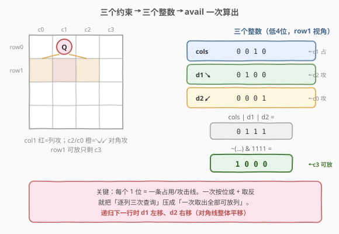
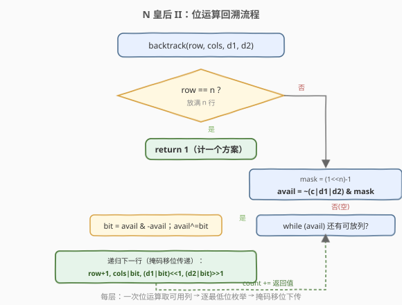
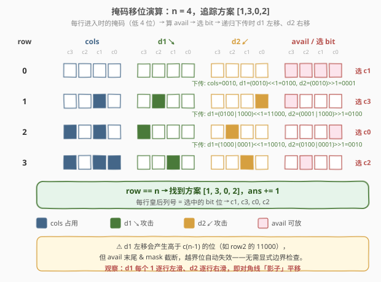

# N 皇后 II

- **题目名称**：N 皇后 II
- **链接**：[52. N 皇后 II](https://leetcode.cn/problems/n-queens-ii/)
- **难度**：困难
- **标签**：回溯、位运算

## 1. 题目概述

与 [51. N 皇后](./51_N皇后.md) 规则完全相同：在 `n × n` 的棋盘上摆放 `n` 个皇后，使其互不攻击（任意两个皇后不在同一**行**、同一**列**、同一**对角线**）。区别是——本题**只返回不同摆法的总数**，不需要输出棋盘方案。

**示例 1**：

```text
输入：n = 4
输出：2
解释：4 皇后问题有 2 种摆法。
```

**示例 2**：

```text
输入：n = 1
输出：1
```

**约束条件**：

- `1 <= n <= 9`

> 💡 **与 51 题的关系**：搜索骨架完全一致（逐行放置 + 三约束剪枝）。只是终态动作从「记录棋盘」变成「计数 +1」。正因为**不需要构造方案**，本题可以放手用**位运算**把三个约束集合压成三个整数，常数极小、代码极简——这是 52 题的招牌写法。

---

## 2. 解题思路

### 2.1 暴力思路：复用 51 的集合版

直接套用 51 题的 `cols / diag1 / diag2` 三集合回溯，到 `row == n` 时 `++ans` 而非 `buildBoard`。完全正确，但 `n ≤ 9` 时集合的哈希开销和逐列 `O(n)` 扫描显得浪费：每层都要 `for col in 0..n-1` 再三次集合查询。

能否把「逐列扫描 + 三次查询」压成「一次位运算取出所有可用列」？可以——这就是位运算版。

### 2.2 核心观察：三个整数掩码 + 移位传递



把棋盘的每一列、每一条对角线的占用情况编码进**整数的二进制位**：

- **`cols`**：第 `c` 位为 `1` 表示第 `c` 列已被占用。
- **`diag1`**（主对角线 ↘，`row-col` 为常数）：第 `c` 位为 `1` 表示「当前行」第 `c` 列被某条 ↘ 对角线攻击。
- **`diag2`**（副对角线 ↙，`row+col` 为常数）：第 `c` 位为 `1` 表示「当前行」第 `c` 列被某条 ↙ 对角线攻击。

**关键一步——可用列一次性算出**：

$$
\text{avail} = \sim(\text{cols} \mid \text{diag1} \mid \text{diag2}) \ \&\ \text{mask}, \quad \text{mask} = (1 \ll n) - 1
$$

`avail` 中每个 `1` 位就是一个**当下可放**的列。无需循环 `n` 次逐列判断，一次按位或 + 取反 + 截断即可。

**更关键一步——递归时掩码整体移位**。放完当前行、进入下一行时，对角线的攻击列会**整体平移一格**：

- 主对角线 ↘：上一行 `c` 列的皇后，在下一行攻击 `c+1` 列（因为 `(row+1)-(c+1) = row-c`，同一对角线）。所以 `diag1` 整体**左移 1 位**：`diag1' = (diag1 | bit) << 1`。
- 副对角线 ↙：上一行 `c` 列的皇后，在下一行攻击 `c-1` 列（因为 `(row+1)+(c-1) = row+c`）。所以 `diag2` 整体**右移 1 位**：`diag2' = (diag2 | bit) >> 1`。
- `cols` 与行无关，直接 `cols | bit` 原样传递。

> ⚠️ **移位方向是本题最易错的点**。记法：↘ 对角线随行递增、列也递增 → 位向高位移（`<<1`）；↙ 对角线随行递增、列递减 → 位向低位移（`>>1`）。把「对角线攻击列」理解成一道**随行下滑/上滑的影子**，掩码移位就是在搬这道影子。

### 2.3 算法流程图



### 2.4 示例演算：n = 4，掩码如何随行演变

以 `n = 4` 为例，追踪一条成功路径（最终得到方案 `[1, 3, 0, 2]`）。每行展示：进入该行时的 `cols / diag1 / diag2`、算出的 `avail`、选中的 `bit`，以及递归下一行前掩码如何移位（仅显示低 4 位）。



```text
row=0: cols=0000 d1=0000 d2=0000
       avail = ~(0000) & 1111 = 1111 → 取 col=1 (bit=0010)
       递归: cols=0010, d1=(0010)<<1=0100, d2=(0010)>>1=0001
row=1: cols=0010 d1=0100 d2=0001
       avail = ~(0010|0100|0001) & 1111 = ~0111 & 1111 = 1000 → col=3 (bit=1000)
       递归: cols=1010, d1=(0100|1000)<<1=11000, d2=(0001|1000)>>1=0100
row=2: cols=1010 d1=...1000 d2=0100
       avail = ~(1010|1000|0100) & 1111 = ~1110 & 1111 = 0001 → col=0 (bit=0001)
       递归: cols=1011, d1=(1000|0001)<<1=10010, d2=(0100|0001)>>1=0010
row=3: cols=1011 d1=...0010 d2=0010
       avail = ~(1011|0010|0010) & 1111 = ~1011 & 1111 = 0100 → col=2 (bit=0100)
       row==n → 找到方案 [1,3,0,2]，ans++
```

注意 `diag1` 会出现高于第 `n-1` 位的 `1`（如 `11000`），这没关系——`avail` 最后用 `mask = (1<<n)-1` 截断，越界位自然被屏蔽。这正是位运算版「无需显式边界检查」的便利之处。

---

## 3. 参考代码

### C++

```cpp
class Solution {
  public:
    int totalNQueens(int n) {
        return backtrack(n, 0, 0, 0, 0);
    }

  private:
    // cols/d1/d2：列、主对角↘、副对角↙ 的占用掩码
    int backtrack(int n, int row, int cols, int d1, int d2) {
        if (row == n) return 1;                       // 放满 n 行，计 1 个方案
        int mask = (1 << n) - 1;
        int avail = (~(cols | d1 | d2)) & mask;       // 当前行所有可放列
        int count = 0;
        while (avail) {
            int bit = avail & (-avail);               // 取最低可用位
            avail ^= bit;                             // 从可用集移除
            count += backtrack(n, row + 1,
                               cols | bit,            // 列占用累加
                               (d1 | bit) << 1,       // ↘ 对角线左移
                               (d2 | bit) >> 1);      // ↙ 对角线右移
        }
        return count;
    }
};
```

### Python

```python
class Solution:
    def totalNQueens(self, n: int) -> int:
        def backtrack(row: int, cols: int, d1: int, d2: int) -> int:
            if row == n:
                return 1
            mask = (1 << n) - 1
            avail = (~(cols | d1 | d2)) & mask        # 当前行所有可放列
            count = 0
            while avail:
                bit = avail & (-avail)                # 取最低可用位
                avail ^= bit
                count += backtrack(row + 1,
                                   cols | bit,
                                   (d1 | bit) << 1,
                                   (d2 | bit) >> 1)
            return count
        return backtrack(0, 0, 0, 0)
```

> 💡 三个关键位运算技巧：
> - `x & -x`：取出 `x` 的最低位 `1`（最低可用列）。
> - `x ^= bit`（或 `x &= x - 1`）：清除最低位 `1`，遍历所有可用列。
> - 递归参数里 `(d1 | bit) << 1`：先**把当前皇后并入对角线占用**，再整体移位传给下一行——一行代码同时完成「标记 + 平移」。

---

## 4. 复杂度分析

| 维度 | 复杂度 | 说明 |
|------|--------|------|
| 时间复杂度 | $O(n!)$ | 上界同 51 题；剪枝后实际搜索节点远小于 $n!$，位运算把每层常数压到极小 |
| 空间复杂度 | $O(n)$ | 仅递归栈深度 `n`；状态用三个整数传递，**无额外集合/数组** |

> 💡 相比 51 题的集合版，位运算版**空间常数更小**（三个 `int` 替代三个 `set`），且每层「找可用列」从 $O(n)$ 降到「按 `1` 的个数」枚举。`n ≤ 9` 时两者都极快，但位运算版是 N 皇后计数问题的**理论最优写法**。

---

## 5. 扩展：对称性剪枝

棋盘**左右对称**：任一方案的镜像（每行皇后列号 `c → n-1-c`）也是合法方案。利用这点可把搜索量减半：

- 第 0 行只在左半侧 `col ∈ [0, n/2 - 1]` 放皇后，统计方案数 `left`，则 `total = 2 * left`。
- 若 `n` 为奇数，需额外统计第 0 行放在**正中列** `col = n/2` 的方案数 `mid`（这类方案的镜像仍在中间列，**不翻倍**，单独计入）。即 `total = 2 * left + mid`。

```cpp
// 利用左右对称剪枝（第 0 行只放左半 + 可能的正中列）
// row 为 1-based：处理到 row == n+1 表示 n 行全部放完
int solve(int row, int n, int avail0, int cols, int d1, int d2, int mask) {
    if (row == n + 1) return 1;
    int avail = (row == 1) ? avail0          // 第 0 行用受限集合（左半 / 正中）
                           : (~(cols | d1 | d2)) & mask;
    int count = 0;
    while (avail) {
        int bit = avail & -avail; avail ^= bit;
        count += solve(row + 1, n, 0,
                       cols | bit,
                       (d1 | bit) << 1,
                       (d2 | bit) >> 1, mask);
    }
    return count;
}
int totalNQueensSym(int n) {
    int mask = (1 << n) - 1;
    int halfCols = (1 << (n / 2)) - 1;        // 第 0 行可用：列 0 .. n/2-1
    int left = solve(1, n, halfCols, 0, 0, 0, mask);
    if (n % 2 == 0) return 2 * left;
    int midBit = 1 << (n / 2);                // n 奇数时正中列单独算
    int mid = solve(1, n, midBit, 0, 0, 0, mask);
    return 2 * left + mid;
}
```

对应的 Python 版只需把 `solve` 改成闭包、`mask` 由外层捕获即可，逻辑一致。

> ⚠️ 对称剪枝把常数再降一半，但代码复杂度上升、易错。面试中**位运算基础版**已是优秀答案；对称剪枝可作为「能否进一步优化」的加分回答，口头说明思路即可。

---

## 6. 面试要点

1. **为什么位运算版用三个整数就够？**
   - 列约束是「跨行不变」的，直接 `cols | bit` 累加；两条对角线约束是「随行平移」的，递归时左移/右移即可在下一行重新对齐到「当前行视角」。三个整数各自维护一类约束，互不干扰。

2. **`avail & -avail` 为什么能取出最低位 1？**
   - `-x` 在补码下等于 `~x + 1`，最低位 `1` 及以下保持不变、以上全部取反，所以 `x & -x` 只剩最低位 `1`。这是「遍历一个整数的所有 1 位」的标准技巧，比逐位测试快。

3. **为什么 `diag1` 左移、`diag2` 右移？**
   - ↘ 对角线 `row-col` 为常数：行 `+1` 时列也 `+1` 才在同一对角线，所以占用位向高位移（`<<1`）。↙ 对角线 `row+col` 为常数：行 `+1` 时列 `-1`，占用位向低位移（`>>1`）。方向记错是最常见的 bug。

4. **掩码高位溢出（如 `diag1` 出现 `1<<n` 之外的位）会有问题吗？**
   - 不会。`avail` 计算末尾用 `& ((1<<n)-1)` 截断到 `n` 位，任何超出棋盘宽度的占用位都被屏蔽。这也省去了显式的边界判断。

5. **52 题和 51 题在写法上最该切换的是什么？**
   - 51 题要**记录方案**，所以必须维护 `queens[row]=col` 数组、集合版更直观；52 题只计数，没有构造方案的开销，正适合用**纯整数位运算**，把状态压到极致。同一道 N 皇后，目标不同（枚举 vs 计数）→ 选不同最优写法，这是面试中体现「因地制宜」的好例子。

---

## 7. 同类练习题

- [51. N 皇后](https://leetcode.cn/problems/n-queens/)（[题解](./51_N皇后.md)）：枚举所有棋盘方案，集合版回溯；52 的「母题」
- [37. 解数独](https://leetcode.cn/problems/sudoku-solver/)（[题解](./37_解数独.md)）：同样回溯 + 约束剪枝，可用位运算加速行/列/宫判定
- [46. 全排列](https://leetcode.cn/problems/permutations/)（[题解](./46_全排列.md)）：回溯 + 单集合剪枝的基础版，对照 N 皇后的「三集合」维度升级
- [191. 位 1 的个数](https://leetcode.cn/problems/number-of-1-bits/)（[题解](./191_位1的个数.md)）：`n & (n-1)` 消最低位 1，与本文 `x & -x` 取最低位 1 互为对照的位运算基本功
