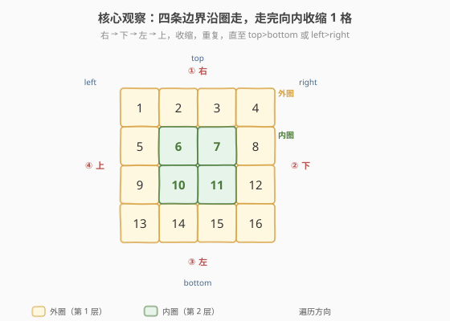
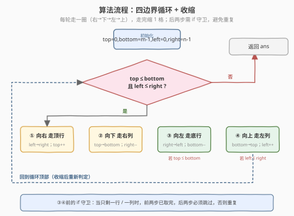
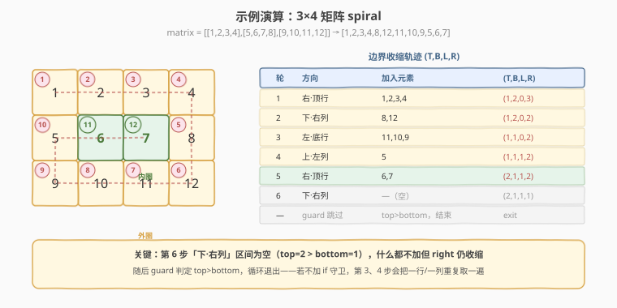

# 螺旋矩阵

- **题目名称**：螺旋矩阵
- **链接**：[54. 螺旋矩阵](https://leetcode.cn/problems/spiral-matrix/)
- **难度**：中等
- **标签**：数组、矩阵、模拟

## 1. 题目概述

给你一个 `m × n` 的矩阵 `matrix`，请按**顺时针螺旋顺序**返回矩阵中的所有元素。从左上角 `(0,0)` 出发，方向依次是 **右 → 下 → 左 → 上 → 右 → …**，逐层向内，直到取完所有元素。

**示例 1**：

```text
输入：matrix = [[1,2,3],[4,5,6],[7,8,9]]
输出：[1,2,3,6,9,8,7,4,5]
```

**示例 2**：

```text
输入：matrix = [[1,2,3,4],[5,6,7,8],[9,10,11,12]]
输出：[1,2,3,4,8,12,11,10,9,5,6,7]
```

**约束条件**：

- `m == matrix.length`
- `n == matrix[i].length`
- `1 <= n, m <= 10`
- `-100 <= matrix[i][j] <= 100`

> 💡 这是一道**纯模拟**题，没有花哨的算法，难点全在「边界控制」：怎么把"绕一圈、缩一格"写得**不漏不重**。招牌套路是维护 **四条边界** `top/bottom/left/right`，每走完一条边就让对应边界向内收缩 1，再配两个 `if` 守卫处理「只剩一行/一列」的退化情形。和 [48. 旋转图像](https://leetcode.cn/problems/rotate-image/)（[题解](48_旋转图像.md)）一样，是矩阵原地/边界操作的必修课。

---

## 2. 解题思路

### 2.1 暴力思路：方向转向 + 已访问标记

维护当前位置 `(i,j)` 和方向向量 `d`（右、下、左、上循环），每次尝试沿 `d` 走一步；若下一步越界或已访问，就顺时针换下一个方向。用一个 `visited` 矩阵或**原地把取出后的格子置为特殊值**来标记。

时间复杂度 `O(m·n)`，但需要一个 `O(m·n)` 的标记矩阵（或修改原矩阵，面试通常不允许）。代码虽短，但「方向数组 + 转向」对**生成类**问题（如 [59. 螺旋矩阵 II](https://leetcode.cn/problems/spiral-matrix-ii/)）更通用，对**读取类**问题略显啰嗦。

### 2.2 核心观察：四条边界，走完即收缩



把矩阵看作一层层「洋葱皮」，每一层由四条边组成。我们用四个变量圈出**当前未取区域**：

- `top`：当前最上面一行
- `bottom`：当前最下面一行
- `left`：当前最左边一列
- `right`：当前最右边一列

每一轮（一层）按固定顺序走四条边：

1. **向右**走 `top` 行（`left → right`），走完 `top++`
2. **向下**走 `right` 列（`top → bottom`），走完 `right--`
3. **向左**走 `bottom` 行（`right → left`），走完 `bottom--`
4. **向上**走 `left` 列（`bottom → top`），走完 `left++`

> 💡 **关键转化**：四条边走完后边界各收缩 1，相当于「剥掉一层皮」，里层变成了一个规模更小的同构子问题。循环终止条件是 `top > bottom` 或 `left > right`——边界相交说明没东西可取了。

### 2.3 算法流程图



> ⚠️ **必须加 `if` 守卫**：第 3、4 步（向左、向上）执行前要重新检查 `top <= bottom` 和 `left <= right`。原因是当矩阵**只剩一行或一列**时，第 1、2 步已经把这一行/列取完了，第 3、4 步若不加守卫会把同样的元素**反向再取一遍**。这是本题最经典的坑。

### 2.4 示例演算



以 `matrix = [[1,2,3,4],[5,6,7,8],[9,10,11,12]]`（3 行 4 列）为例，初始 `(top,bottom,left,right) = (0,2,0,3)`：

- **第 1 轮**：右走顶行 `1,2,3,4`（top→1）；下走右列 `8,12`（right→2）；守卫 `top(1)≤bottom(2)` 成立，左走底行 `11,10,9`（bottom→1）；守卫 `left(0)≤right(2)` 成立，上走左列 `5`（left→1）。
- **第 2 轮**：右走顶行 `6,7`（top→2）；下走右列区间为 `top=2..bottom=1`，**空**，什么都不加但 `right` 仍收缩（right→1）；守卫 `top(2)≤bottom(1)` 不成立，跳过左走；随后循环条件 `top>bottom` 不满足，退出。

最终 `[1,2,3,4,8,12,11,10,9,5,6,7]`，共 12 个元素。注意第 2 轮「下走右列」产生空区间——这正是 `if` 守卫存在的意义。

---

## 3. 参考代码

### C++

```cpp
// 螺旋矩阵.cpp —— 四边界 + 收缩
// 编译: g++ -O2 -std=c++17 螺旋矩阵.cpp -o spiral
#include <vector>
using namespace std;

class Solution {
  public:
    vector<int> spiralOrder(vector<vector<int>>& matrix) {
        vector<int> ans;
        int m = matrix.size(), n = matrix[0].size();
        int top = 0, bottom = m - 1, left = 0, right = n - 1;
        while (top <= bottom && left <= right) {
            // ① 向右走顶行
            for (int j = left; j <= right; ++j) ans.push_back(matrix[top][j]);
            ++top;
            // ② 向下走右列
            for (int i = top; i <= bottom; ++i) ans.push_back(matrix[i][right]);
            --right;
            // ③ 向左走底行（守卫：还有行可走）
            if (top <= bottom) {
                for (int j = right; j >= left; --j) ans.push_back(matrix[bottom][j]);
                --bottom;
            }
            // ④ 向上走左列（守卫：还有列可走）
            if (left <= right) {
                for (int i = bottom; i >= top; --i) ans.push_back(matrix[i][left]);
                ++left;
            }
        }
        return ans;
    }
};
```

### Python

```python
class Solution:
    def spiralOrder(self, matrix: list[list[int]]) -> list[int]:
        ans = []
        top, bottom = 0, len(matrix) - 1
        left, right = 0, len(matrix[0]) - 1
        while top <= bottom and left <= right:
            # ① 向右走顶行
            for j in range(left, right + 1):
                ans.append(matrix[top][j])
            top += 1
            # ② 向下走右列
            for i in range(top, bottom + 1):
                ans.append(matrix[i][right])
            right -= 1
            # ③ 向左走底行（守卫）
            if top <= bottom:
                for j in range(right, left - 1, -1):
                    ans.append(matrix[bottom][j])
                bottom -= 1
            # ④ 向上走左列（守卫）
            if left <= right:
                for i in range(bottom, top - 1, -1):
                    ans.append(matrix[i][left])
                left += 1
        return ans
```

> ⚠️ 第 3 步循环是 `for j in range(right, left - 1, -1)`（含 `left`），第 4 步是 `for i in range(bottom, top - 1, -1)`（含 `top`）。`range` 右端是开区间，漏写 `-1` 会少取一格；写错方向会越界。守卫 `if` 不可省，否则单行/单列情形重复取。

---

## 4. 复杂度分析

| 维度 | 复杂度 | 说明 |
|------|--------|------|
| **时间复杂度** | `O(m·n)` | 每个元素恰好被访问一次，四条边合计覆盖全部 `m·n` 个格子 |
| **空间复杂度** | `O(1)` | 仅用 `top/bottom/left/right` 四个变量；返回数组不计入 |

> 💡 `O(m·n)` 已是渐近下界——要输出全部元素，至少得读一遍。常数因子的优化空间极小，重心应放在**边界正确性**上。

---

## 5. 扩展：方向向量法（更通用的螺旋模板）

四边界法专为「读取」设计，简洁但不易直接改成「生成」。若题目要求**按螺旋顺序填数**（如 [59. 螺旋矩阵 II](https://leetcode.cn/problems/spiral-matrix-ii/)、[885. 螺旋矩阵 III](https://leetcode.cn/problems/spiral-matrix-iii/)），用**方向向量 + 转向**更通用：

```python
def spiralOrder(self, matrix: list[list[int]]) -> list[int]:
    m, n = len(matrix), len(matrix[0])
    dirs = [(0, 1), (1, 0), (0, -1), (-1, 0)]  # 右、下、左、上
    ans = []
    i = j = d = 0
    for _ in range(m * n):
        ans.append(matrix[i][j])
        matrix[i][j] = None  # 原地标记已访问（若不能改原数组则用 visited 矩阵）
        ni, nj = i + dirs[d][0], j + dirs[d][1]
        if ni < 0 or ni >= m or nj < 0 or nj >= n or matrix[ni][nj] is None:
            d = (d + 1) % 4   # 撞墙/已访问 → 顺时针转向
            ni, nj = i + dirs[d][0], j + dirs[d][1]
        i, j = ni, nj
    return ans
```

仍是 `O(m·n)` 时间，但需要 `O(m·n)` 标记空间（或修改原矩阵）。两种写法对照记忆：

| 写法 | 适用 | 空间 | 特点 |
|------|------|------|------|
| **四边界** | 读取（本题） | `O(1)` | 无需标记，但需 `if` 守卫 |
| **方向向量** | 读取 / 生成 | `O(m·n)` 标记 | 通用，转向逻辑统一，填数题首选 |

> 💡 面试若被追问「能不能不修改原数组且 `O(1)` 空间」，答：四边界法就是答案——它天然不碰原矩阵。

---

## 6. 面试要点

1. **为什么第 3、4 步必须加 `if` 守卫？去掉会怎样？**

   - 当剩余区域**只剩一行**时，第 1 步（向右走顶行）已把这一行全取走，第 3 步（向左走底行）此时 `top == bottom`，会反向把同一行再取一遍。只剩一列时第 2、4 步同理。守卫 `top <= bottom` / `left <= right` 确保「真正还有一条独立的边」时才走。

2. **循环条件 `top <= bottom && left <= right` 和守卫的 `if` 重复吗？**

   - 不重复。循环条件控制**还有没有下一层**；守卫控制**当前层后两步是否有效**。一轮内四步是连续执行的，循环条件只在进入新一轮时检查，无法拦截本轮内「前两步已耗尽一行/一列」的情形，所以仍需 `if`。

3. **方向向量法和四边界法各自适合什么场景？**

   - 四边界法 `O(1)` 空间、不修改原矩阵，适合**读取**类（54）；方向向量法逻辑统一、易改成填数，适合**生成**类（59、885）或形状不规则（885 从任意起点螺旋外扩）的场景，代价是要标记空间。

4. **非方阵（`m ≠ n`）会出问题吗？**

   - 不会。四边界法对 `m × n` 通用，终止条件 `top > bottom` 或 `left > right` 谁先触发都行。如 `1 × n` 矩阵：第 1 步取完整行后 `top++` 使 `top > bottom`，第 3 步守卫直接跳过，正确返回一行。

5. **能否做到 `O(1)` 空间且不修改原矩阵？**

   - 能，四边界法就是。它只靠四个下标变量描述「当前未取区域」，既不申请 `visited`，也不动 `matrix`，是本题的最优解。

> 💡 **一句话总结**：螺旋矩阵是矩阵模拟的招牌题——四条边界 `top/bottom/left/right` 圈出未取区域，每轮「右→下→左→上」走一圈再各收缩 1，后两步配 `if` 守卫防重复。掌握这个模板，54 / 59 / 885 / 2326 一类螺旋题都能套用。

---

## 7. 同类练习题

- [48. 旋转图像](https://leetcode.cn/problems/rotate-image/)（[题解](48_旋转图像.md)）：同属矩阵边界/原地操作，练「转置 + 翻转」拆解
- [59. 螺旋矩阵 II](https://leetcode.cn/problems/spiral-matrix-ii/)：本题的镜像——按螺旋顺序**填数**，建议用方向向量法
- [885. 螺旋矩阵 III](https://leetcode.cn/problems/spiral-matrix-iii/)：从任意起点向外螺旋，方向向量法的最佳练习
- [73. 矩阵置零](https://leetcode.cn/problems/set-matrix-zeroes/)：矩阵原地标记题，用首行首列做哨兵
- [2326. 螺旋矩阵 IV](https://leetcode.cn/problems/spiral-matrix-iv/)：链表 + 螺旋填数，把 54 和 59 的套路合在一起
