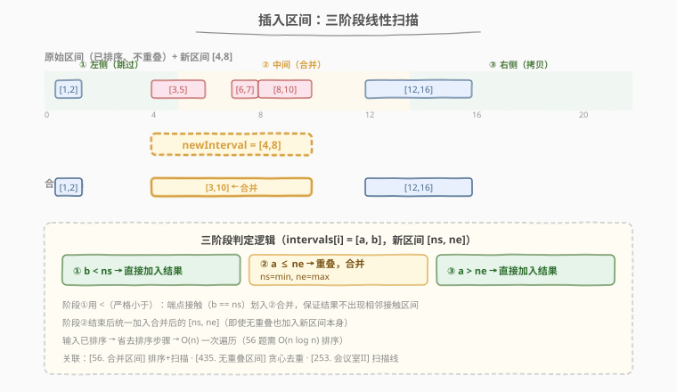
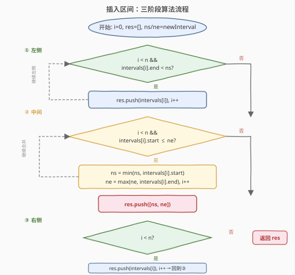
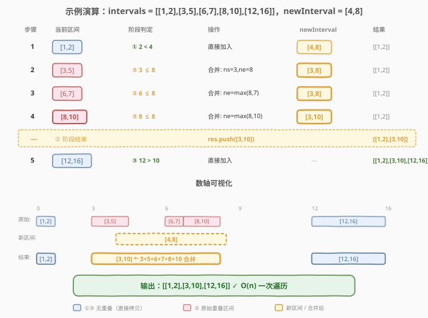

# 插入区间

- **题目名称**：插入区间
- **链接**：[57. 插入区间](https://leetcode.cn/problems/insert-interval/)
- **难度**：中等
- **标签**：数组、区间、贪心

## 1. 题目概述

给定一个**无重叠**的、按起始端点升序排列的区间列表 `intervals`，以及一个新区间 `newInterval`，将 `newInterval` 插入 `intervals` 并按需合并重叠区间，返回最终的不重叠区间列表。

**示例 1**：

```text
输入：intervals = [[1,3],[6,9]], newInterval = [2,5]
输出：[[1,5],[6,9]]
解释：[2,5] 与 [1,3] 重叠，合并为 [1,5]；[6,9] 不重叠，保留。
```

**示例 2**：

```text
输入：intervals = [[1,2],[3,5],[6,7],[8,10],[12,16]], newInterval = [4,8]
输出：[[1,2],[3,10],[12,16]]
解释：[4,8] 与 [3,5]、[6,7]、[8,10] 重叠，合并为 [3,10]；[1,2] 和 [12,16] 不重叠，保留。
```

**约束条件**：

- `0 <= intervals.length <= 10^4`
- `intervals[i].length == 2`
- `0 <= start_i <= end_i <= 10^5`
- `intervals` 按起始端点升序排列，且区间互不重叠
- `newInterval.length == 2`

---

## 2. 解题思路

### 2.1 暴力思路：插入后排序合并

把 `newInterval` 追加到 `intervals` 末尾，然后调用 [56. 合并区间](56_合并区间.md) 的排序 + 线性扫描即可。时间 `O(n log n)`，但**浪费了输入已排序且不重叠的性质**——可以做到 `O(n)`。

### 2.2 核心观察：三阶段线性扫描



关键洞察：`intervals` 已排序且不重叠，`newInterval` 插入后只会与**一段连续区间**重叠。因此一次遍历即可，按位置分三个阶段：

| 阶段 | 条件 | 操作 |
|------|------|------|
| **① 跳过左侧** | `intervals[i].end < newInterval.start` | 无重叠，直接加入结果 |
| **② 合并中间** | `intervals[i].start <= newInterval.end` | 有重叠，合并：`start = min`，`end = max` |
| **③ 拷贝右侧** | 其余（`intervals[i].start > newInterval.end`） | 无重叠，直接加入结果 |

> 💡 与 [56. 合并区间](56_合并区间.md) 的关系：56 输入无序需排序 `O(n log n)`；57 输入已排序且不重叠，省去排序直接 `O(n)` 扫描。两题的合并逻辑完全一致——重叠时取 `end = max(end1, end2)`。57 是 56 的"增量版"：在已合并的结果上插入一个新区间。

### 2.3 算法流程图



### 2.4 示例演算



以 `intervals = [[1,2],[3,5],[6,7],[8,10],[12,16]]`，`newInterval = [4,8]` 为例：

| 步骤 | 当前区间 | 阶段判定 | 操作 | newInterval | 结果 |
|------|----------|----------|------|-------------|------|
| 1 | [1,2] | `2 < 4` → ①左侧 | 直接加入 | [4,8] | [[1,2]] |
| 2 | [3,5] | `3 ≤ 8` → ②重叠 | 合并 | [3,8] | [[1,2]] |
| 3 | [6,7] | `6 ≤ 8` → ②重叠 | 合并 | [3,8] | [[1,2]] |
| 4 | [8,10] | `8 ≤ 8` → ②重叠 | 合并 | [3,10] | [[1,2]] |
| — | — | ②结束 | 加入合并后的新区间 | — | [[1,2],[3,10]] |
| 5 | [12,16] | `12 > 10` → ③右侧 | 直接加入 | — | [[1,2],[3,10],[12,16]] |

输出 `[[1,2],[3,10],[12,16]]`。

---

## 3. 参考代码

### C++

```cpp
class Solution {
  public:
    vector<vector<int>> insert(vector<vector<int>>& intervals, vector<int>& newInterval) {
        vector<vector<int>> res;
        int i = 0, n = intervals.size();
        int ns = newInterval[0], ne = newInterval[1];

        // ① 左侧：结束早于新区间开始，无重叠
        while (i < n && intervals[i][1] < ns) {
            res.push_back(intervals[i++]);
        }

        // ② 中间：与新区间重叠，合并
        while (i < n && intervals[i][0] <= ne) {
            ns = min(ns, intervals[i][0]);
            ne = max(ne, intervals[i][1]);
            i++;
        }
        res.push_back({ns, ne}); // 加入合并后的新区间

        // ③ 右侧：剩余区间无重叠
        while (i < n) {
            res.push_back(intervals[i++]);
        }

        return res;
    }
};
```

### Python

```python
class Solution:
    def insert(self, intervals: List[List[int]], newInterval: List[int]) -> List[List[int]]:
        res = []
        i, n = 0, len(intervals)
        ns, ne = newInterval

        # ① 左侧：结束早于新区间开始，无重叠
        while i < n and intervals[i][1] < ns:
            res.append(intervals[i])
            i += 1

        # ② 中间：与新区间重叠，合并
        while i < n and intervals[i][0] <= ne:
            ns = min(ns, intervals[i][0])
            ne = max(ne, intervals[i][1])
            i += 1
        res.append([ns, ne])  # 加入合并后的新区间

        # ③ 右侧：剩余区间无重叠
        while i < n:
            res.append(intervals[i])
            i += 1

        return res
```

---

## 4. 复杂度分析

| 维度 | 复杂度 | 说明 |
|------|--------|------|
| 时间复杂度 | `O(n)` | 一次遍历，每个区间最多访问一次 |
| 空间复杂度 | `O(n)` | 结果数组（不计返回值则为 `O(1)`） |

---

## 5. 扩展：端点接触与边界情形

- **端点接触**：`intervals[i].end == newInterval.start` 算重叠（如 `[1,2]` 与 `[2,5]` 合并为 `[1,5]`）。阶段①用 `<` 而非 `<=`，保证接触的区间进入合并阶段②。
- **空输入**：`intervals = []` 时三个 while 都不执行，直接加入 `newInterval`，结果为 `[newInterval]`。
- **新区间在最左**：`newInterval` 完全在所有区间左侧时，阶段①不执行，阶段②条件 `intervals[0].start <= ne` 不满足（因 `ne < intervals[0].start`），直接加入新区间再拷贝所有原区间。
- **新区间在最右**：阶段①、②扫完所有区间后加入新区间，阶段③为空。

> ⚠️ 阶段①的条件是 `intervals[i][1] < ns`（**严格小于**），阶段②的条件是 `intervals[i][0] <= ne`（**小于等于**）。两个条件配合，恰好把"端点接触"的区间划入合并阶段，保证结果不出现相邻接触区间。

---

## 6. 面试要点

1. **为什么不需要排序？**

   - 输入 `intervals` 已按起始端点升序排列且不重叠，这是题目保证的前置条件
   - `newInterval` 插入后只会与一段连续区间重叠，一次扫描即可定位
   - 省去排序是 `O(n)` vs `O(n log n)` 的关键

2. **阶段①为什么用 `<` 而不是 `<=`？**

   - 用 `<`（`intervals[i].end < ns`）保证端点接触（`end == ns`）的区间进入阶段②合并
   - 若用 `<=`，`[1,2]` 与 `[2,5]` 不会合并，结果出现 `[1,2],[2,5]` 两个接触区间，违反"不重叠"要求

3. **和 56. 合并区间有什么异同？**

   - 相同：合并逻辑一致——重叠时 `end = max(end1, end2)`，端点接触算重叠
   - 不同：56 输入无序需排序 `O(n log n)`；57 输入有序，三阶段扫描 `O(n)`
   - 57 是 56 的"增量版"——在已合并的结果上插入一个新区间

4. **新区间不与任何区间重叠时怎么办？**

   - 阶段②的 while 条件 `intervals[i].start <= ne` 不满足，跳过合并
   - 新区间被直接加入结果，前后区间原样保留
   - 如 `intervals = [[1,2],[6,7]]`, `newInterval = [3,4]` → `[[1,2],[3,4],[6,7]]`

5. **能否原地修改 intervals？**

   - 可以但复杂：需要在中间删除被合并的区间并替换为新区间，涉及元素搬移
   - 用独立结果数组更清晰，空间 `O(n)` 可接受（返回值本就需要新数组）

---

## 7. 同类练习题
- [56. 合并区间](https://leetcode.cn/problems/merge-intervals/)（[题解](56_合并区间.md)）：无序区间的排序 + 合并，本题的前置题
- [435. 无重叠区间](https://leetcode.cn/problems/non-overlapping-intervals/)（[题解](../0401-0500/435_无重叠区间.md)）：贪心移除最少区间使无重叠
- [452. 用最少数量的箭引爆气球](https://leetcode.cn/problems/minimum-number-of-arrows-to-burst-balloons/)（[题解](../0401-0500/452_用最少数量的箭引爆气球.md)）：区间交集贪心
- [253. 会议室 II](https://leetcode.cn/problems/meeting-rooms-ii/)（[题解](../0201-0300/253_会议室II.md)）：扫描线求最大重叠数
- [1288. 删除被覆盖区间](https://leetcode.cn/problems/remove-covered-intervals/)：排序 + 区间包含判定
