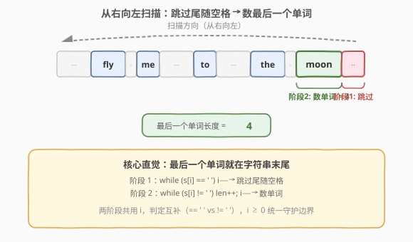
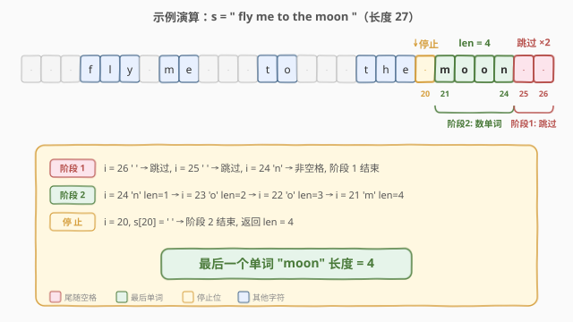

# 最后一个单词的长度

- **题目名称**：最后一个单词的长度
- **链接**：[58. 最后一个单词的长度](https://leetcode.cn/problems/length-of-last-word/)
- **难度**：简单
- **标签**：字符串

## 1. 题目概述

给你一个字符串 `s`，由若干单词组成，单词前后用一些空格字符隔开。返回字符串中**最后一个**单词的长度。

**单词**是指只包含非空格字符的**最大子串**。

**示例 1**：

```text
输入：s = "Hello World"
输出：5
解释：最后一个单词是 "World"，长度为 5。
```

**示例 2**：

```text
输入：s = "   fly me   to   the moon  "
输出：4
解释：最后一个单词是 "moon"，长度为 4。
```

**示例 3**：

```text
输入：s = "luffy is still joyboy"
输出：6
解释：最后一个单词是 "joyboy"，长度为 6。
```

**约束条件**：

- `1 <= s.length <= 10^4`
- `s` 仅有英文字母和空格 `' '` 组成
- `s` 中至少存在一个单词

> 💡 本题的关键陷阱在于：字符串**末尾可能有多余空格**（如示例 2 的 `"  "`）。若直接按空格切分取最后一个元素，需确保切分逻辑能正确处理连续空格；而**从右向左扫描**则能天然跳过尾随空格，一步到位。

---

## 2. 解题思路

### 2.1 暴力思路

最直觉的做法是「按空格切分字符串，取最后一个单词的长度」：

- **Python**：`s.split()` 会自动合并连续空格并去除首尾空格，`s.split()[-1]` 直接得到最后一个单词，`len()` 即答案。
- **C++**：可用 `istringstream >> word` 逐词读取，最后一个 `word` 的长度即答案；或手动按空格切分存入 `vector`。

这种写法正确且简洁，但会**创建中间字符串列表**，空间复杂度为 $O(n)$（存储所有单词）。此外，切分会遍历整个字符串，而最后一个单词只在末尾——**前面的字符完全不需要处理**。

### 2.2 核心观察：从右向左扫描



最后一个单词一定在字符串**末尾**（可能后面有若干空格）。因此只需**从右向左**扫描，分两阶段完成：

1. **跳过尾随空格**：从末尾开始，跳过所有连续的空格字符，定位到最后一个单词的末尾。
2. **数单词长度**：从该位置继续向左，数连续的非空格字符，直到遇到空格或到达字符串开头。

> 💡 关键直觉：**最后一个单词只与字符串的尾部有关**。从右向左扫描只需触及尾部的一小段字符，前面的所有单词和空格都不必关心。同时，两阶段的判定条件互补——先用 `s[i] == ' '` 跳过空格，再用 `s[i] != ' '` 数单词，**边界条件统一**由 `i >= 0` 守护，无需特判。

**时间复杂度**：$O(n)$（最坏情况遍历整个字符串）；**空间复杂度**：$O(1)$（仅用索引和计数变量）。

### 2.3 算法流程图


流程包含两个 `while` 循环：第一个跳过尾随空格，第二个数单词长度。两个循环共享同一索引 `i`，顺序执行，互不干扰。

### 2.4 示例演算



以 `s = "   fly me   to   the moon  "`（长度 27）为例：

- **阶段 1**（跳过尾随空格）：`i = 26`，`s[26] = ' '` → `i--`；`i = 25`，`s[25] = ' '` → `i--`；`i = 24`，`s[24] = 'n' ≠ ' '` → 阶段 1 结束。
- **阶段 2**（数单词）：`i = 24`，`len = 1`；`i = 23`，`len = 2`；`i = 22`，`len = 3`；`i = 21`，`len = 4`；`i = 20`，`s[20] = ' '` → 阶段 2 结束。
- **返回** `len = 4`。

> 💡 注意阶段 1 和阶段 2 的衔接：阶段 1 结束时 `i` 恰好指向最后一个单词的末尾字符，阶段 2 从此处开始数，无需调整。两个循环的判定条件互斥（`== ' '` vs `!= ' '`），不会重复计数。

---

## 3. 参考代码

### C++（从右向左扫描）

```cpp
class Solution {
  public:
    int lengthOfLastWord(string s) {
        int i = s.size() - 1;
        while (i >= 0 && s[i] == ' ') i--;   // 阶段 1：跳过尾随空格
        int len = 0;
        while (i >= 0 && s[i] != ' ') {       // 阶段 2：数最后一个单词
            len++;
            i--;
        }
        return len;
    }
};
```

### Python（从右向左扫描）

```python
class Solution:
    def lengthOfLastWord(self, s: str) -> int:
        i = len(s) - 1
        while i >= 0 and s[i] == ' ':
            i -= 1
        length = 0
        while i >= 0 and s[i] != ' ':
            length += 1
            i -= 1
        return length
```

### Python（API 一行流，对比用）

```python
class Solution:
    def lengthOfLastWord(self, s: str) -> int:
        return len(s.split()[-1])
```

> ⚠️ **两种写法的对比**：`split()` 写法简洁且不易出错，适合工程脚本；但从右向左扫描是面试中期望的「原地 $O(1)$ 空间」解法，且能展示对字符串边界的精确控制。面试时建议先写从右向左扫描，再提及 `split()` 作为对照。

---

## 4. 复杂度分析

| 维度 | 复杂度 | 说明 |
|------|--------|------|
| 时间复杂度 | $O(n)$ | 最坏情况遍历整个字符串（如只有一个单词且很长，或末尾全是空格） |
| 空间复杂度 | $O(1)$ | 仅使用索引 `i` 和计数 `len` 两个变量，原地扫描 |

> 与 `split()` 写法的对比：`split()` 时间同为 $O(n)$，但空间为 $O(n)$（存储单词列表）；从右向左扫描空间为 $O(1)$，且实际只访问字符串尾部的一小段。

---

## 5. 扩展：其他实现方式

### 5.1 利用标准库 API

C++ 有多种方式定位最后一个单词：

- **`rfind`**：`s.rfind(' ', n-1)` 从末尾向前找空格，但需先跳过尾随空格，逻辑与手写扫描等价。
- **`find_last_not_of` + `find_last_of`**：先用 `find_last_not_of(' ')` 定位最后一个非空格字符，再用 `find_last_of(' ', pos)` 从该位置向前找空格，二者之差即单词长度。一行即可：

```cpp
class Solution {
  public:
    int lengthOfLastWord(string s) {
        int end = s.find_last_not_of(' ');        // 最后一个非空格字符
        int start = s.find_last_of(' ', end);     // 它前面的空格（或 -1）
        return end - start;
    }
};
```

> ⚠️ 当不存在空格时 `find_last_of` 返回 `string::npos`（即 `-1`），`end - (-1) = end + 1` 恰好是整个字符串的长度，无需特判。

### 5.2 与 151. 反转字符串中的单词 的关系

[151. 反转字符串中的单词](https://leetcode.cn/problems/reverse-words-in-a-string/)（[站内题解](../0101-0200/151_反转字符串中的单词.md)）是本题的「升级版」：不仅需要定位每个单词，还要**反转所有单词的顺序**并去除多余空格。本题的「跳过空格 → 定位单词边界」是 151 题的核心子操作——151 题需要对每个单词重复执行这一过程，而本题只需对最后一个单词做一次。

---

## 6. 面试要点

1. **为什么要从右向左扫描？从左向右不行吗？**

   - 从左向右也能做（逐词计数，记录最后一个），但需要遍历整个字符串。从右向左只需触及字符串尾部，最后一个单词就在末尾，前面的字符完全不必处理。虽然最坏时间复杂度同为 $O(n)$，但实际访问的字符数远少于 $n$。

2. **字符串末尾有空格怎么办？**

   - 阶段 1 专门跳过尾随空格：`while (i >= 0 && s[i] == ' ') i--;`。跳完后 `i` 指向最后一个单词的末尾字符，阶段 2 从此处开始计数。这是本题最核心的边界处理。

3. **字符串只有一个单词（无空格）怎么办？**

   - 阶段 1 不执行（`s[n-1] != ' '`），阶段 2 从末尾一直数到 `i = -1`（`i >= 0` 失败），返回整个字符串长度。无需特判。

4. **`split()` 写法有什么问题？**

   - 功能完全正确，Python 的 `s.split()` 会自动处理连续空格和首尾空格。但它创建了单词列表，空间 $O(n)$；且遍历了整个字符串。面试中如果只写 `split()` 可能会被追问「能否 $O(1)$ 空间」，因此建议先写从右向左扫描。

5. **两个 `while` 循环的条件为什么是 `i >= 0`？**

   - 防止索引越界。当字符串只有一个单词且没有空格时，阶段 2 会一直数到 `i = -1`，此时 `i >= 0` 为假，循环自然终止。C++ 中 `string::operator[]` 不做边界检查，越界访问是未定义行为，因此 `i >= 0` 是必须的守护条件。

---

## 7. 同类练习题

- [151. 反转字符串中的单词](https://leetcode.cn/problems/reverse-words-in-a-string/)（[站内题解](../0101-0200/151_反转字符串中的单词.md)）：本题升级版——反转所有单词顺序并去除多余空格，核心子操作就是「跳过空格 → 定位单词」
- [14. 最长公共前缀](https://leetcode.cn/problems/longest-common-prefix/)（[站内题解](14_最长公共前缀.md)）：字符串纵向 / 横向扫描，同属字符串基础扫描题
- [415. 字符串相加](https://leetcode.cn/problems/add-strings/)（[站内题解](../0401-0500/415_字符串相加.md)）：从右向左逐位处理字符串，扫描方向与本题一致
- [165. 比较版本号](https://leetcode.cn/problems/compare-version-numbers/)（[站内题解](../0101-0200/165_比较版本号.md)）：字符串切分 + 逐段比较，字符串处理家族的另一形态
- [8. 字符串转换整数 (atoi)](https://leetcode.cn/problems/string-to-integer-atoi/)（[站内题解](8_字符串转换整数atoi.md)）：字符串模拟 + 边界处理，更复杂的字符串扫描题
