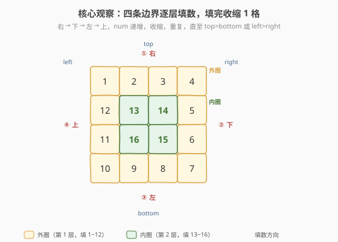
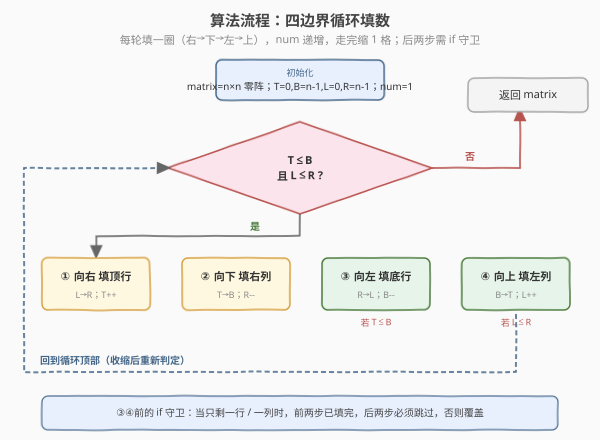
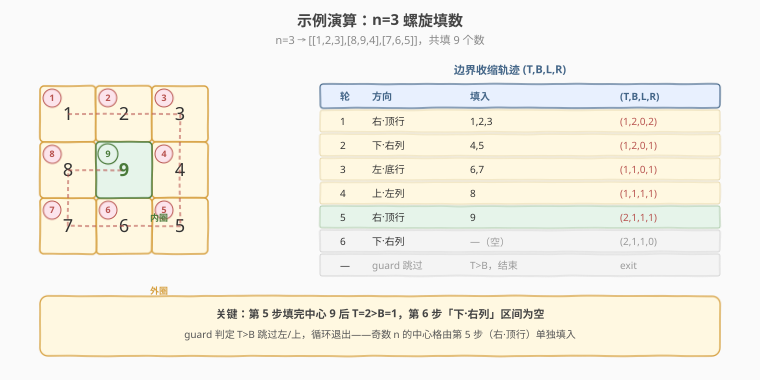

# LeetCode 螺旋矩阵 II 题解

## 1. 题目概述

- **标题 / 题号**：螺旋矩阵 II（#59，medium）
- **链接**：https://leetcode.cn/problems/spiral-matrix-ii/
- **难度**：中等
- **标签**：数组、矩阵、模拟

**题意**：给你一个正整数 `n`，生成一个包含 `1` 到 $n^2$ 所有元素，且元素按**顺时针螺旋顺序**排列的 $n \times n$ 正方形矩阵 `matrix`。从左上角 `(0,0)` 出发，方向依次是 **右 → 下 → 左 → 上 → 右 → …**，逐层向内填数，直到填满 $n^2$ 个格子。

**示例 1**：

```text
输入：n = 3
输出：[[1,2,3],[8,9,4],[7,6,5]]
```

**示例 2**：

```text
输入：n = 1
输出：[[1]]
```

**约束**：

- `1 <= n <= 20`

> 💡 这是 [54. 螺旋矩阵](https://leetcode.cn/problems/spiral-matrix/)（[题解](54_螺旋矩阵.md)）的**镜像题**：54 是按螺旋顺序**读取**矩阵，59 是按螺旋顺序**填入**矩阵。两题共用同一套「四边界」模板——把 54 的 `ans.push_back(matrix[i][j])` 换成 `matrix[i][j] = num++` 就是 59 的解。和 48. 旋转图像一样，是矩阵边界操作的必修课。

## 2. 解题思路

### 2.1 暴力思路：方向转向 + 撞墙检测

维护当前位置 `(i,j)` 和方向向量 `d`（右、下、左、上循环），每次在当前格填入 `num`，然后尝试沿 `d` 前进一步；若下一步越界或**已填过**（非 0），就顺时针换方向。

> 💡 与 54 不同，59 **不需要额外标记矩阵**——初始矩阵全为 0，填过的格子天然非 0，矩阵本身就是「已访问」标记。因此方向向量法在 59 上的额外空间也是 `O(1)`，与四边界法持平。

时间复杂度 `O(n^2)`，空间 `O(1)`。代码不长且逻辑直观，但「方向数组 + 转向」对 $n \times n$ 方阵略显啰嗦——四边界法更简洁。

### 2.2 核心观察：四边界，填完即收缩



把 $n \times n$ 方阵看作一层层「洋葱皮」，每一层由四条边组成。用四个变量圈出**当前待填区域**：

- `top`：当前最上面一行
- `bottom`：当前最下面一行
- `left`：当前最左边一列
- `right`：当前最右边一列

每一轮（一层）按固定顺序填四条边：

1. **向右**填 `top` 行（`left → right`），填完 `top++`
2. **向下**填 `right` 列（`top → bottom`），填完 `right--`
3. **向左**填 `bottom` 行（`right → left`），填完 `bottom--`
4. **向上**填 `left` 列（`bottom → top`），填完 `left++`

> 💡 **关键转化**：四条边填完后边界各收缩 1，相当于「剥掉一层皮」，里层变成了一个规模更小的同构子问题。循环终止条件是 `top > bottom` 或 `left > right`——边界相交说明没格子可填了。一共填 $\lceil n/2 \rceil$ 层。

### 2.3 算法流程图



> ⚠️ **必须加 `if` 守卫**：第 3、4 步（向左、向上）执行前要重新检查 `top <= bottom` 和 `left <= right`。原因是当矩阵**只剩一行或一列**（奇数 $n$ 的最后一层中心格）时，第 1 步已经把这一行填完了，第 3 步若不加守卫会把同一个格子**反向覆盖**。这与 54 的坑完全一致——只是后果从「重复读取」变成「覆盖错误」。

### 2.4 示例演算



以 `n = 3` 为例，初始 `(top,bottom,left,right) = (0,2,0,2)`，`num = 1`：

- **第 1 轮**：右填顶行 `1,2,3`（top→1）；下填右列 `4,5`（right→1）；守卫 `top(1)≤bottom(2)` 成立，左填底行 `6,7`（bottom→1）；守卫 `left(0)≤right(1)` 成立，上填左列 `8`（left→1）。
- **第 2 轮**：`top=bottom=left=right=1`，只剩中心格。右填顶行 `9`（top→2）；下填右列区间 `top=2..bottom=1`，**空**，什么都不填但 `right` 仍收缩（right→0）；守卫 `top(2)≤bottom(1)` 不成立，跳过左填；循环条件 `top>bottom` 不满足，退出。

最终 `[[1,2,3],[8,9,4],[7,6,5]]`，共 9 个数。注意第 2 轮「下填右列」产生空区间——这正是 `if` 守卫存在的意义，奇数 $n$ 的中心格由第 1 步（右填顶行）单独填入。

## 3. 参考代码

### C++

```cpp
// 螺旋矩阵II.cpp —— 四边界 + 收缩填数
// 编译: g++ -O2 -std=c++17 螺旋矩阵II.cpp -o spiral2
#include <vector>
using namespace std;

class Solution {
  public:
    vector<vector<int>> generateMatrix(int n) {
        vector<vector<int>> matrix(n, vector<int>(n));
        int top = 0, bottom = n - 1, left = 0, right = n - 1;
        int num = 1;
        while (top <= bottom && left <= right) {
            // ① 向右填顶行
            for (int j = left; j <= right; ++j) matrix[top][j] = num++;
            ++top;
            // ② 向下填右列
            for (int i = top; i <= bottom; ++i) matrix[i][right] = num++;
            --right;
            // ③ 向左填底行（守卫：还有行可填）
            if (top <= bottom) {
                for (int j = right; j >= left; --j) matrix[bottom][j] = num++;
                --bottom;
            }
            // ④ 向上填左列（守卫：还有列可填）
            if (left <= right) {
                for (int i = bottom; i >= top; --i) matrix[i][left] = num++;
                ++left;
            }
        }
        return matrix;
    }
};
```

### Python

```python
class Solution:
    def generateMatrix(self, n: int) -> list[list[int]]:
        matrix = [[0] * n for _ in range(n)]
        top, bottom = 0, n - 1
        left, right = 0, n - 1
        num = 1
        while top <= bottom and left <= right:
            # ① 向右填顶行
            for j in range(left, right + 1):
                matrix[top][j] = num
                num += 1
            top += 1
            # ② 向下填右列
            for i in range(top, bottom + 1):
                matrix[i][right] = num
                num += 1
            right -= 1
            # ③ 向左填底行（守卫）
            if top <= bottom:
                for j in range(right, left - 1, -1):
                    matrix[bottom][j] = num
                    num += 1
                bottom -= 1
            # ④ 向上填左列（守卫）
            if left <= right:
                for i in range(bottom, top - 1, -1):
                    matrix[i][left] = num
                    num += 1
                left += 1
        return matrix
```

> ⚠️ 第 3 步循环是 `for j in range(right, left - 1, -1)`（含 `left`），第 4 步是 `for i in range(bottom, top - 1, -1)`（含 `top`）。`range` 右端是开区间，漏写 `-1` 会少填一格；写错方向会越界。守卫 `if` 不可省，否则奇数 $n$ 中心格会被覆盖。

## 4. 复杂度分析

| 维度 | 复杂度 | 说明 |
|------|--------|------|
| **时间复杂度** | `O(n^2)` | 每个格子恰好被填一次，四条边合计覆盖全部 $n^2$ 个格子 |
| **空间复杂度** | `O(1)` | 仅用 `top/bottom/left/right/num` 五个变量；返回矩阵不计入 |

> 💡 `O(n^2)` 已是渐近下界——要填满 $n^2$ 个格子，至少得写 $n^2$ 次。常数因子的优化空间极小，重心应放在**边界正确性**上。

## 5. 扩展：方向向量法（更通用的螺旋填数模板）

四边界法对 $n \times n$ 方阵极为简洁，但遇到**不规则形状**（如 [885. 螺旋矩阵 III](https://leetcode.cn/problems/spiral-matrix-iii/) 从任意起点向外螺旋）就不便套用。此时用**方向向量 + 撞墙转向**更通用：

```python
class Solution:
    def generateMatrix(self, n: int) -> list[list[int]]:
        matrix = [[0] * n for _ in range(n)]
        dirs = [(0, 1), (1, 0), (0, -1), (-1, 0)]  # 右、下、左、上
        i = j = d = 0
        for num in range(1, n * n + 1):
            matrix[i][j] = num
            ni, nj = i + dirs[d][0], j + dirs[d][1]
            # 撞墙或已填 → 顺时针转向
            if ni < 0 or ni >= n or nj < 0 or nj >= n or matrix[ni][nj] != 0:
                d = (d + 1) % 4
                ni, nj = i + dirs[d][0], j + dirs[d][1]
            i, j = ni, nj
        return matrix
```

同样是 `O(n^2)` 时间、`O(1)` 额外空间——因为填数题中**矩阵本身就是已访问标记**（0 = 未填），无需额外 `visited` 数组。两种写法对照记忆：

| 写法 | 适用 | 额外空间 | 特点 |
|------|------|----------|------|
| **四边界** | 方阵填数（本题） | `O(1)` | 无需标记，但需 `if` 守卫 |
| **方向向量** | 任意形状螺旋填数 | `O(1)`（用矩阵当标记） | 通用，转向逻辑统一，885/2326 首选 |

> 💡 对比 54：在**读取**场景下，方向向量法需要 `O(m·n)` 的 `visited` 标记空间（或修改原矩阵）；而在**填数**场景下，矩阵天然充当标记，两种写法的空间复杂度持平。这也是 59 比做 54 更「舒服」的原因。

## 6. 面试要点

1. **为什么第 3、4 步必须加 `if` 守卫？去掉会怎样？**

   - 当剩余区域**只剩一行**时（奇数 $n$ 的最后一层），第 1 步（向右填顶行）已把这一行填完，第 3 步（向左填底行）此时 `top == bottom`，会反向把同一行的格子**覆盖**成更大的错误值。只剩一列时第 2、4 步同理。守卫确保「真正还有一条独立的边」时才填。

2. **59 和 54 的四边界法有什么本质区别？**

   - **操作**：59 是**写**（`matrix[i][j] = num++`），54 是**读**（`ans.push_back(matrix[i][j])`）。
   - **形状**：59 恒为 $n \times n$ **方阵**，54 是 $m \times n$ 任意矩阵。
   - **守卫后果**：59 不加守卫会**覆盖**（数据错误），54 不加守卫会**重复读取**（数据冗余）。
   - 两者模板完全同构，掌握一个即可互推。

3. **奇数 $n$ 的中心格是怎么填的？**

   - 中心格是第 $\lceil n/2 \rceil$ 层（最后一层）的唯一格子，此时 `top == bottom == left == right`。它在第 1 步「向右填顶行」时被填入（区间只有一个元素）。随后 `top++` 使 `top > bottom`，第 3、4 步被守卫跳过，循环退出。

4. **四边界法和方向向量法，填数题选哪个？**

   - 对 $n \times n$ 方阵，四边界法更简洁、边界收缩逻辑清晰，面试首选。对不规则螺旋（885 从任意起点向外扩、2326 按链表顺序填），方向向量法更通用。两法在 59 上都是 `O(1)` 额外空间（填数题矩阵本身即标记），不像 54 读取题中方向向量需要 `O(m·n)` 标记。

5. **一共要填几层？能提前算出来吗？**

   - $\lceil n/2 \rceil$ 层。偶数 $n$ 每层都是完整四边；奇数 $n$ 最后一层退化为单个中心格。面试中可以提一句「层数 $\lceil n/2 \rceil$」展示对结构的理解，但实现仍用 `while` 循环 + 边界判定更稳妥。

> 💡 **一句话总结**：螺旋矩阵 II 是螺旋矩阵的填数镜像——四条边界 `top/bottom/left/right` 圈出待填区域，每轮「右→下→左→上」填一圈再各收缩 1，后两步配 `if` 守卫防覆盖。掌握这个模板，54 / 59 / 885 / 2326 一类螺旋题都能套用。

## 同类练习题

| # | 题目 | 与本题的关联 |
|---|------|-------------|
| 54 | [螺旋矩阵](https://leetcode.cn/problems/spiral-matrix/)（[题解](54_螺旋矩阵.md)） | 本题的镜像——按螺旋顺序**读取**矩阵，同一套四边界模板 |
| 885 | [螺旋矩阵 III](https://leetcode.cn/problems/spiral-matrix-iii/) | 从任意起点向外螺旋填数，方向向量法的最佳练习 |
| 2326 | [螺旋矩阵 IV](https://leetcode.cn/problems/spiral-matrix-iv/) | 按链表顺序螺旋填入矩阵，把 54 和 59 的套路合在一起 |
| 48 | [旋转图像](https://leetcode.cn/problems/rotate-image/) | 同属矩阵边界/原地操作，练「转置 + 翻转」拆解 |
| 73 | [矩阵置零](https://leetcode.cn/problems/set-matrix-zeroes/) | 矩阵原地标记题，用首行首列做哨兵 |
