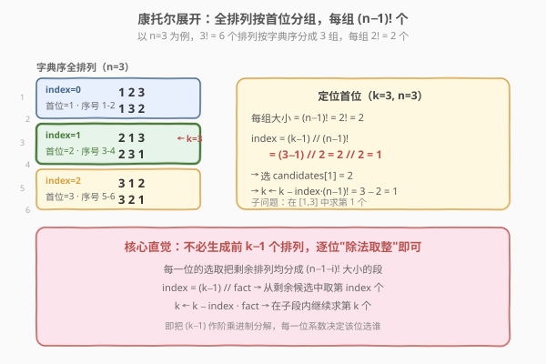
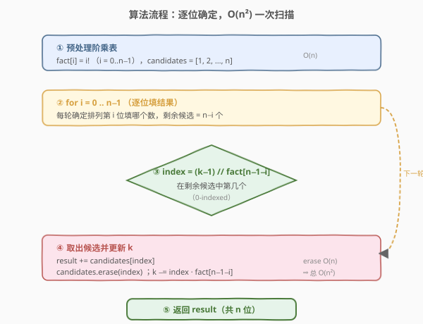
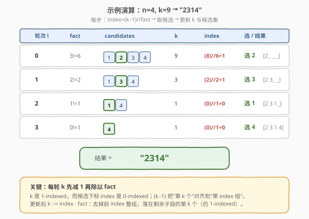

# 第k个排列

- **题目名称**：第k个排列
- **链接**：[60. 第k个排列](https://leetcode.cn/problems/permutation-sequence/)
- **难度**：困难
- **标签**：数学、递归、阶乘进制（康托尔展开）

## 1. 题目概述

给出集合 `[1, 2, 3, ..., n]` 的所有排列，按**字典序**排列，返回第 `k` 个排列。

**示例 1**：

```text
输入：n = 3, k = 3
输出："213"
```

**示例 2**：

```text
输入：n = 4, k = 9
输出："2314"
```

**示例 3**：

```text
输入：n = 3, k = 1
输出："123"
```

**约束条件**：

- `1 <= n <= 9`
- `1 <= k <= n!`

> 💡 本题的关键在于：`n` 最大为 9，`n!` 最大约 36 万，理论上可以暴力枚举；但题目要求**直接定位第 k 个**，而不生成前 `k−1` 个。难点是把"第 k 个"这个序号翻译成"每一位选谁"的逐位决策——这正是**康托尔展开（Cantor expansion）**的招牌应用。

---

## 2. 解题思路

### 2.1 暴力思路：生成全排列再取第 k 个

最直觉的做法有两种：

1. **回溯生成全部**：套用 [46. 全排列](46_全排列.md) 的回溯模板，生成所有 `n!` 个排列后排序，取第 `k−1` 个。
2. **调用 next_permutation**：从最小的 `"123...n"` 出发，调用 `k−1` 次 `next_permutation`（参见 [31. 下一个排列](31_下一个排列.md)），得到第 `k` 个。

两种做法都正确，但都**做了大量无用功**：

- 回溯法要生成 `n!` 个排列，每个排列 `O(n)`，总时间 $O(n \cdot n!)$，且空间 $O(n \cdot n!)$ 存所有结果——`n=9` 时约 36 万个排列，开销巨大。
- `next_permutation` 法每次 $O(n)$，调用 `k−1` 次，最坏 $O(k \cdot n)$，`k` 可达 `n!`，同样是 $O(n \cdot n!)$。

> ⚠️ **核心浪费**：我们**只要第 k 个**，却把前 `k−1` 个全部构造了出来。能否像"二分查找"那样，根据 `k` 直接算出每一位填什么？这正是康托尔展开做的事——把序号 `k` 当作一个"阶乘进制数"，每一位系数直接决定该位选谁。

### 2.2 核心观察：康托尔展开（阶乘进制）



**关键观察**：`n!` 个全排列按字典序排列时，**首位相同的排列连续成段，每段恰好 `(n−1)!` 个**。

- 首位是 `candidates[0]` 的：第 `1` 到 `(n−1)!` 个
- 首位是 `candidates[1]` 的：第 `(n−1)!+1` 到 `2·(n−1)!` 个
- ……
- 首位是 `candidates[idx]` 的：第 `idx·(n−1)!+1` 到 `(idx+1)·(n−1)!` 个

因此，给定 `k`（1-indexed），**首位选谁**可以一步算出：

$$\text{idx} = \left\lfloor \frac{k-1}{(n-1)!} \right\rfloor$$

> 💡 **为什么是 `k−1` 而不是 `k`？** 因为 `k` 是 1-indexed（第 1 个、第 2 个……），而候选下标 `idx` 是 0-indexed。`k−1` 把"第 k 个"对齐到"前 `k−1` 个排列"的计数，除以段大小 `(n−1)!` 向下取整，就得到目标所在的段号。例如 `n=3, k=3`：`(3−1)//2! = 2//2 = 1` → 选 `candidates[1] = 2`，即 `"213"` 和 `"231"` 这一段。

确定首位后，问题**规模缩小**：在剩余 `n−1` 个候选中，求第 `k'` 个排列，其中：

$$k' = k - \text{idx} \cdot (n-1)!$$

这就是一个**规模为 `n−1` 的同型子问题**。逐位重复 `n` 次，即可确定整个排列。

> 💡 **本质**：这相当于把 `k−1` 写成**阶乘进制**（factoradic）——一个形如 $\sum_{i=0}^{n-1} d_i \cdot i!$ 的数，其中每位系数 $d_i \in [0, i]$。$d_i$ 就是第 `i` 轮要取的候选下标。康托尔展开建立了"全排列序号 ↔ 排列本身"的双射，本题是它的**解码**方向（序号 → 排列）。

**时间复杂度**：$O(n^2)$（外层 `n` 轮，每轮从候选列表删除一个元素 $O(n)$）；**空间复杂度**：$O(n)$（存候选与阶乘表）。

### 2.3 算法流程图



流程分五步：

1. **预处理阶乘表**：`fact[i] = i!`，`i = 0..n−1`，并初始化候选列表 `[1, 2, ..., n]`。
2. **外层循环** `i = 0 .. n−1`：每轮确定排列第 `i` 位。
3. **算下标**：`idx = (k−1) // fact[n−1−i]`，即目标在当前候选中第几个（0-indexed）。
4. **取候选并更新**：把 `candidates[idx]` 追加到结果；从候选列表删除该项；`k -= idx · fact[n−1−i]`（去掉跳过的整段，`k` 落到剩余子段内，仍 1-indexed）。
5. **返回**拼接好的 `n` 位字符串。

### 2.4 示例演算



以 `n=4, k=9` 为例（`fact = [1, 1, 2, 6]`，即 `0!=1, 1!=1, 2!=2, 3!=6`），逐步追踪 `candidates`、`k`、`idx`：

| 轮次 `i` | `fact[n−1−i]` | `candidates` | `k` | `idx = (k−1)//fact` | 选 | 结果 |
|----------|---------------|--------------|-----|---------------------|----|----|
| 0 | `3!=6` | `[1, 2, 3, 4]` | 9 | `(8)//6 = 1` | 2 | `2 _ _ _` |
| 1 | `2!=2` | `[1, 3, 4]` | 3 | `(2)//2 = 1` | 3 | `2 3 _ _` |
| 2 | `1!=1` | `[1, 4]` | 1 | `(0)//1 = 0` | 1 | `2 3 1 _` |
| 3 | `0!=1` | `[4]` | 1 | `(0)//1 = 0` | 4 | `2 3 1 4` |

- **轮 0**：`(9−1)//6 = 1` → 选 `candidates[1] = 2`；`k = 9 − 1·6 = 3`；删除 2，候选变 `[1,3,4]`。
- **轮 1**：`(3−1)//2 = 1` → 选 `candidates[1] = 3`；`k = 3 − 1·2 = 1`；删除 3，候选变 `[1,4]`。
- **轮 2**：`(1−1)//1 = 0` → 选 `candidates[0] = 1`；`k = 1 − 0 = 1`；删除 1，候选变 `[4]`。
- **轮 3**：`(1−1)//1 = 0` → 选 `candidates[0] = 4`。

最终结果 `"2314"`，与示例 2 一致。

> 💡 **小技巧**：由于每轮 `k` 始终 1-indexed，`(k−1)//fact` 这个减 1 操作会重复出现。若在循环开始前**先做一次 `k--`**（转为 0-indexed，表示"目标前有多少个排列"），循环内就变成干净的 `idx = k // fact`、`k %= fact`，与上方演算完全等价但更简洁。参考代码采用这一写法。

---

## 3. 参考代码

### C++（康托尔展开，预减一次 k）

```cpp
class Solution {
  public:
    string getPermutation(int n, int k) {
        // 预处理阶乘 fact[i] = i!
        vector<int> fact(n);
        fact[0] = 1;
        for (int i = 1; i < n; i++) fact[i] = fact[i - 1] * i;

        // 候选数字 1..n
        vector<int> candidates(n);
        iota(candidates.begin(), candidates.end(), 1);

        k--;  // 1-indexed → 0-indexed，循环内无需重复减 1
        string ans;
        for (int i = 0; i < n; i++) {
            int f = fact[n - 1 - i];       // 当前段大小
            int idx = k / f;               // 目标所在段号
            ans.push_back('0' + candidates[idx]);
            candidates.erase(candidates.begin() + idx);
            k %= f;                        // 落到子段内，等价于 k -= idx * f
        }
        return ans;
    }
};
```

### Python（康托尔展开，预减一次 k）

```python
class Solution:
    def getPermutation(self, n: int, k: int) -> str:
        # 预处理阶乘 fact[i] = i!
        fact = [1] * n
        for i in range(1, n):
            fact[i] = fact[i - 1] * i

        candidates = list(range(1, n + 1))

        k -= 1  # 1-indexed → 0-indexed
        ans = []
        for i in range(n):
            f = fact[n - 1 - i]
            idx = k // f
            ans.append(str(candidates[idx]))
            candidates.pop(idx)
            k %= f
        return "".join(ans)
```

> ⚠️ **`k %= f` 与 `k -= idx * f` 等价**：因为 `idx = k // f`，由整除性质 `k = idx * f + r`（`r = k % f`），故 `k - idx * f = k % f`。预减一次 `k` 后，每轮的 `k` 始终是"子段内 0-indexed 偏移"，直接取模即可滚动到下一轮，无需再做 `k−1`。

---

## 4. 复杂度分析

| 维度 | 复杂度 | 说明 |
|------|--------|------|
| 时间复杂度 | $O(n^2)$ | 外层 `n` 轮，每轮 `candidates.erase` / `pop` 需 $O(n)$ 移动元素；阶乘预处理 $O(n)$ 可忽略 |
| 空间复杂度 | $O(n)$ | 候选列表 $O(n)$ + 阶乘表 $O(n)$ + 结果字符串 $O(n)$，不计返回值则为 $O(n)$ |

> 与暴力法的对比：回溯法 $O(n \cdot n!)$，`n=9` 时约 $3.3 \times 10^6$ 次操作且要存 36 万个排列；康托尔展开 $O(n^2) = 81$ 次操作，**提速约 4 万倍**，且几乎不占额外空间。这正是"数学建模把指数级搜索降为多项式"的典型范例。

---

## 5. 扩展：O(n log n) 与康托尔逆展开

### 5.1 用 Fenwick 树把删除降到 O(log n)

瓶颈在于 `candidates.erase(idx)` 的 $O(n)$ 移动。若用**有序集合 + 二分**维护"第 idx 个仍存在的候选"，可把单轮降到 $O(\log n)$，总体 $O(n \log n)$：

- C++ 用 `std::set<int>` 存"已被删除的元素"，每轮二分找第 `idx+1` 个未删除的数（在已删集合里查 `lower_bound` 计数）；
- 或用**树状数组**（Fenwick tree）维护每个位置是否存活，前缀和二分定位第 `idx+1` 个存活位，单点更新 $O(\log n)$。

不过 `n ≤ 9` 时 $O(n^2)$ 已极快（81 次基本操作），优化仅具理论意义，面试中写出 $O(n^2)$ 版本即可，再口头提及 Fenwick 优化作为加分。

### 5.2 康托尔展开的对称性

康托尔展开是**双射**：

- **本题（解码）**：给定序号 `k`，还原排列。即把 `k−1` 作阶乘进制分解，逐位取候选。
- **编码（逆操作）**：给定一个排列，求它的字典序排名。对每一位数 `a[i]`，统计它右边比它小的元素个数 `c[i]`（即它是当前候选中第几个，0-indexed），则排名 $= 1 + \sum_{i=0}^{n-1} c[i] \cdot (n-1-i)!$。

编码方向对应 [剑指 Offer 51 / LCR 170. 数组中的逆序对](../0101-0200/LCOF51_数组中的逆序对.md) 的同类计数技巧（归并/树状数组统计右侧更小元素个数）。理解了这一双向映射，就掌握了"排列 ↔ 整数序号"的完整互转工具。

### 5.3 与 next_permutation 的关系

[31. 下一个排列](31_下一个排列.md) 求"字典序下一个"，本质是康托尔展开上的"+1"操作：从右找第一个升位置，把它换成稍大的候选，再把右侧翻成最小。本题的康托尔展开相当于**一次跳到第 k 个**，跳过了 `k−1` 次 "+1" 的累积。二者是同一棵字典序排列树上的"步进"与"瞬移"。

---

## 6. 面试要点

1. **为什么是 `(k−1) // fact` 而不是 `k // fact`？**

   - `k` 是 1-indexed（第 1 个排列对应首位候选下标 0），而候选下标是 0-indexed。若直接用 `k // fact`，当 `k` 恰好是段边界时会错位：例如 `n=3, k=2`（应是 `"132"`），`2//2 = 1` 会选 `candidates[1]=2`（错），而 `(2−1)//2 = 0` 选 `candidates[0]=1`（对）。`k−1` 把"第 k 个"对齐到"前 k−1 个的计数"，再除以段大小取整得段号。

2. **为什么代码里只减一次 `k--`，循环内却不用再减？**

   - 循环外 `k--` 把 `k` 转成 0-indexed（语义变为"目标排列之前有多少个排列"）。此后每轮 `idx = k // f`、`k %= f`，`k` 始终保持 0-indexed 语义滚动到子段。这与"循环内每轮 `(k−1)//f`、`k -= idx*f`"两种写法完全等价，只是把重复的减 1 提到循环外做一次，循环体更干净。

3. **删除候选为什么是 $O(n)$？能否更快？**

   - `vector::erase` / `list.pop` 需把后续元素前移，单次 $O(n)$，总计 $O(n^2)$。用**树状数组**维护"每个位置是否存活"，前缀和二分定位第 `idx+1` 个存活位，单轮 $O(\log n)$，总计 $O(n \log n)$。但 `n ≤ 9` 时优化无实际收益，写出 $O(n^2)$ 即可，口头提及优化作为加分。

4. **`n=1` 的边界情况如何处理？**

   - `fact = [1]`（`0!=1`），`candidates = [1]`，`k--` 后 `k=0`；循环仅一轮：`f = fact[0] = 1`，`idx = 0//1 = 0`，选 `"1"`，返回 `"1"`。无需特判，模板天然兼容。同理 `k=1`（求最小排列）和 `k=n!`（求最大排列）也由通用逻辑覆盖。

5. **康托尔展开和全排列编号有什么关系？面试怎么讲清楚？**

   - 一句话：康托尔展开建立了"全排列 ↔ $[0, n!-1]$ 整数"的双射，把排列按字典序编号。**解码**（本题）：把整数 `k−1` 写成阶乘进制 $\sum d_i \cdot i!$，每位系数 $d_i$ 决定第 `i` 位从剩余候选中取第几个。**编码**（逆）：给定排列，逐位统计"右侧比它小的个数"作 $d_i$，加权求和得排名。讲题时先点出"首位把 `n!` 个排列均分成 `n` 段每段 `(n−1)!`"这一分组观察，再推广到每一位，听众就能顺理成章接受 `idx = (k−1)//fact` 的公式。

---

## 7. 同类练习题

- [31. 下一个排列](https://leetcode.cn/problems/next-permutation/)（[站内题解](31_下一个排列.md)）：字典序"步进 +1"，是康托尔展开上的增量操作；本题是"瞬移到第 k 个"，二者共享同一棵字典序排列树
- [46. 全排列](https://leetcode.cn/problems/permutations/)（[站内题解](46_全排列.md)）：回溯生成全部排列的母题；本题是其"只要第 k 个"的优化版，从 $O(n \cdot n!)$ 降到 $O(n^2)$
- [47. 全排列 II](https://leetcode.cn/problems/permutations-ii/)（[站内题解](47_全排列II.md)）：含重复元素的全排列去重，对比本题元素互异、可直接用下标定位的简洁性
- [LCR 170 / 剑指 Offer 51. 数组中的逆序对](https://leetcode.cn/problems/shu-zu-zhong-de-ni-xu-dui-lcof/)（[站内题解](../0101-0200/LCOF51_数组中的逆序对.md)）：归并/树状数组统计"右侧更小元素个数"，正是康托尔**编码**方向所需的核心计数操作
- [164. 最大间隙](https://leetcode.cn/problems/maximum-gap/)：同为"数学观察把朴素 $O(n^2)$ 降为 $O(n)$"的思路，体会"用数学结构换搜索成本"的通用范式
