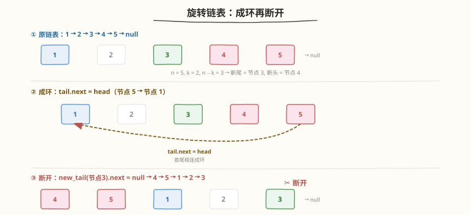
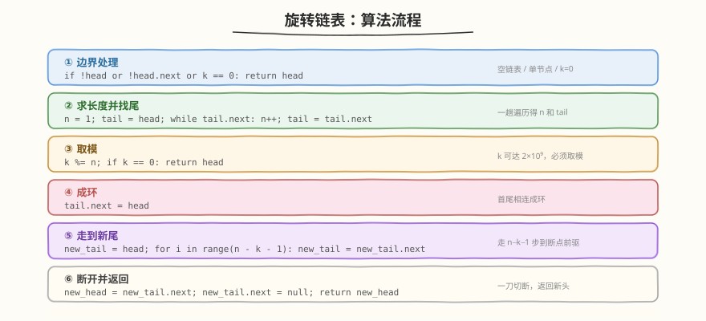
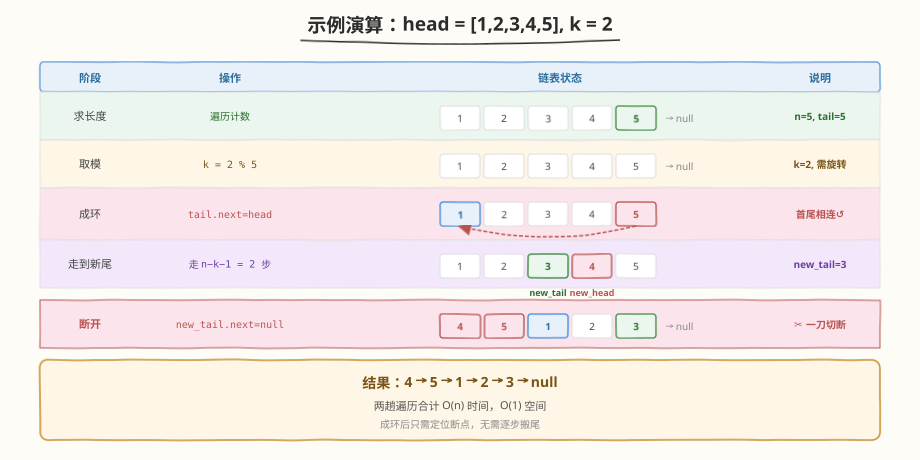

# LeetCode 旋转链表 题解

## 1. 题目概述

- **标题 / 题号**：旋转链表（#61，medium）
- **链接**：https://leetcode.cn/problems/rotate-list/
- **难度**：中等
- **标签**：链表、双指针

**题意**：给你一个链表的头节点 `head`，旋转链表，将链表每个节点向右移动 `k` 个位置。

**示例 1**：

```text
输入：head = [1,2,3,4,5], k = 2
输出：[4,5,1,2,3]
解释：将链表向右旋转 2 步：1→2→3→4→5 → 5→1→2→3→4 → 4→5→1→2→3
```

**示例 2**：

```text
输入：head = [0,1,2], k = 4
输出：[2,0,1]
解释：k = 4 等价于 k = 4 % 3 = 1，向右旋转 1 步：0→1→2 → 2→0→1
```

**约束**：

- 链表中节点数目在范围 `[0, 500]` 内
- `-100 <= Node.val <= 100`
- `0 <= k <= 2 * 10^9`

> 💡 这道题是链表题中"接线手法"的招牌题。核心技巧是**先成环再断开**——把链表首尾相连变成环形，再在正确位置一刀切断，就能实现 `O(n)` 一次遍历的右旋。与 [189. 轮转数组](../0101-0200/189_轮转数组.md) 的"三次翻转"思路完全不同，链表的优势在于 `O(1)` 改指针即可完成"搬运"。

## 2. 解题思路

### 2.1 暴力思路：逐步右移

每一步将最后一个节点搬到链表头部，重复 `k` 次。每次"搬尾"需要遍历到链表末尾找到尾节点及其前驱。

```text
for _ in range(k):
    tail = find_last(head)
    prev_of_tail.next = null
    tail.next = head
    head = tail
```

时间复杂度 `O(k × n)`，当 `k` 很大时（最大 `2 * 10^9`）必然超时。

> ⚠️ 暴力法的两个痛点：一是 `k` 可以远大于链表长度，必须取模 `k % n`；二是逐步搬尾每步都遍历整条链表，效率太低。能否一次性定位"断点"？

### 2.2 核心观察：先成环再断开



**关键观察**：向右旋转 `k` 步，等价于把链表末尾的 `k` 个节点搬到头部。更精确地说：

- 设链表长度为 `n`，有效旋转步数 `k = k % n`
- 旋转后，原链表的第 `n - k` 个节点（0 下标）成为新的**尾节点**
- 原链表的第 `n - k + 1` 个节点成为新的**头节点**

以 `head = [1,2,3,4,5]`，`k = 2` 为例：

```text
原链表：1 → 2 → 3 → 4 → 5 → null
n = 5, k = 2, n - k = 3
新尾 = 第 3 个节点（0 下标 = 节点 3）
新头 = 第 4 个节点（0 下标 = 节点 4）
结果：4 → 5 → 1 → 2 → 3 → null
```

**成环再断开**的妙处在于：

1. **先首尾相连**：`tail.next = head`，链表变成环形。此时从任意节点出发都能绕一圈回来。
2. **走 `n - k - 1` 步**：从 `head` 出发走 `n - k - 1` 步，到达新尾节点。
3. **一刀切断**：`new_tail.next = null`，环断开后即为旋转后的链表。

> 💡 **核心洞察**：成环把"末尾搬头部"这个需要断开两处、重连两处的操作，简化为"只断一处"。环上任意位置都能绕回，因此只需找到唯一的断点。这是链表题"接线思维"的经典体现——**先连后断，一步到位**。

### 2.3 算法流程图



**完整步骤**：

1. **边界处理**：`head` 为空、单节点或 `k == 0`，直接返回 `head`
2. **求长度并找尾**：遍历链表，计数 `n`，记录 `tail`（最后一个节点）
3. **取模**：`k = k % n`；若 `k == 0`，无需旋转，返回 `head`
4. **成环**：`tail.next = head`（首尾相连）
5. **走到新尾**：从 `head` 出发，走 `n - k - 1` 步，到达 `new_tail`
6. **断开**：`new_head = new_tail.next`，`new_tail.next = null`
7. **返回**：`new_head`

> ⚠️ 第 5 步走 `n - k - 1` 步而非 `n - k` 步——因为从 `head`（第 0 个节点）出发走 `n - k - 1` 步恰好到达第 `n - k - 1` 个节点（新尾），其 `next` 即为新头。多走一步就到新头了，但我们需要的是前驱（新尾）来执行断开。

### 2.4 示例演算

以 `head = [1,2,3,4,5]`，`k = 2` 为例：



| 阶段 | 操作 | 链表状态 | 说明 |
|------|------|----------|------|
| 求长度 | 遍历 | 1→2→3→4→5→null | `n = 5`，`tail = 节点 5` |
| 取模 | `k = 2 % 5` | 1→2→3→4→5→null | `k = 2`，需要旋转 |
| 成环 | `tail.next = head` | 1→2→3→4→5↺ | 首尾相连成环 |
| 走到新尾 | 走 `5-2-1=2` 步 | 1→2→3↺ | `new_tail = 节点 3` |
| 断开 | `new_tail.next = null` | 4→5→1→2→3→null | `new_head = 节点 4` |

最终结果：`4 → 5 → 1 → 2 → 3`。

> 💡 注意 `k = 0`（即 `k % n == 0`）的情况：链表旋转一整圈后回到原位，无需任何操作，直接返回 `head`。如果不提前返回，成环后会走到 `head` 本身作为新尾，`new_tail.next = null` 会断掉 `head` 后面的所有节点——这是常见 bug。

## 3. 参考代码

### C++

```cpp
struct ListNode {
    int val;
    ListNode* next;
    ListNode() : val(0), next(nullptr) {}
    ListNode(int x) : val(x), next(nullptr) {}
    ListNode(int x, ListNode* n) : val(x), next(n) {}
};

class Solution {
public:
    ListNode* rotateRight(ListNode* head, int k) {
        if (!head || !head->next || k == 0) return head;

        // 1. 求长度并找尾节点
        int n = 1;
        ListNode* tail = head;
        while (tail->next) {
            ++n;
            tail = tail->next;
        }

        // 2. 取模
        k %= n;
        if (k == 0) return head;

        // 3. 成环
        tail->next = head;

        // 4. 走到新尾（走 n - k - 1 步）
        ListNode* new_tail = head;
        for (int i = 0; i < n - k - 1; ++i) {
            new_tail = new_tail->next;
        }

        // 5. 断开
        ListNode* new_head = new_tail->next;
        new_tail->next = nullptr;

        return new_head;
    }
};
```

### Python

```python
from typing import Optional

class ListNode:
    def __init__(self, val=0, next=None):
        self.val = val
        self.next = next

class Solution:
    def rotateRight(self, head: Optional[ListNode], k: int) -> Optional[ListNode]:
        if not head or not head.next or k == 0:
            return head

        # 1. 求长度并找尾节点
        n = 1
        tail = head
        while tail.next:
            n += 1
            tail = tail.next

        # 2. 取模
        k %= n
        if k == 0:
            return head

        # 3. 成环
        tail.next = head

        # 4. 走到新尾（走 n - k - 1 步）
        new_tail = head
        for _ in range(n - k - 1):
            new_tail = new_tail.next

        # 5. 断开
        new_head = new_tail.next
        new_tail.next = None

        return new_head
```

> 💡 注意三处边界：(1) 空链表或单节点直接返回；(2) `k % n == 0` 时无需旋转；(3) 成环后必须走 `n - k - 1` 步而非 `n - k` 步，因为要定位新尾（断点的前驱）。

## 4. 复杂度分析

| 维度 | 复杂度 | 说明 |
|------|--------|------|
| 时间复杂度 | `O(n)` | 第一趟遍历求长度 `n` 步，第二趟走到新尾 `n - k - 1` 步，合计不超过 `2n` |
| 空间复杂度 | `O(1)` | 只使用 `tail`、`new_tail`、`new_head` 三个指针 |

> ⚠️ 虽然 `k` 可以大到 `2 * 10^9`，但取模 `k % n` 后有效步数不超过 `n`，因此时间复杂度与 `k` 无关，只取决于链表长度 `n`。

## 5. 扩展：快慢指针变体

除了"成环再断开"，还可以用**快慢指针**实现一次遍历定位断点：

1. `fast` 先走 `k` 步（取模后的 `k`）
2. `fast` 和 `slow` 同速推进，当 `fast` 到达尾节点时，`slow` 恰在新尾位置
3. `new_head = slow.next`，`slow.next = null`

这与 [19. 删除倒数第 N 个节点](19_删除链表的倒数第N个节点.md) 的"快指针先发制造间距"完全同源——都是用先发优势把"后向参照"转化为"前向间距"。

不过"成环法"更简洁直观，且天然处理了 `k > n` 的取模问题，是面试中的首选写法。

### 快慢指针 C++ 代码

```cpp
class Solution {
public:
    ListNode* rotateRight(ListNode* head, int k) {
        if (!head || !head->next || k == 0) return head;

        // 求长度
        int n = 1;
        ListNode* cur = head;
        while (cur->next) { ++n; cur = cur->next; }
        k %= n;
        if (k == 0) return head;

        // fast 先走 k 步
        ListNode *fast = head, *slow = head;
        for (int i = 0; i < k; ++i) fast = fast->next;

        // 同速推进，fast 到尾时 slow 在新尾
        while (fast->next) {
            fast = fast->next;
            slow = slow->next;
        }

        // 断开
        ListNode* new_head = slow->next;
        slow->next = nullptr;
        fast->next = head;  // 尾巴接回头部

        return new_head;
    }
};
```

> 💡 两种方法本质相同，区别在于"成环法"先连后断（操作更少），"快慢法"先断后连（更接近 19 题的模板）。面试时选一种讲清楚即可，面试官追问时再展示另一种作为扩展。

## 6. 面试要点

1. **为什么 `k` 要对 `n` 取模？**
   - 旋转 `n` 步等于转一圈回到原位，因此有效步数是 `k % n`。`k` 最大可达 `2 * 10^9`，不取模会直接超时。

2. **成环再断开的核心优势是什么？**
   - 把"末尾 `k` 个节点搬到头部"简化为"找断点、切一刀"。成环后链表没有首尾之分，任意位置都能绕回，因此只需定位唯一的断点（新尾），无需多次断开重连。

3. **为什么走 `n - k - 1` 步而不是 `n - k` 步？**
   - 从 `head`（第 0 个节点）出发，走 `n - k - 1` 步到达第 `n - k - 1` 个节点，即新尾。其 `next` 是新头。如果走 `n - k` 步就到了新头本身，无法执行断开（断开需要前驱的 `next` 指针）。

4. **`k % n == 0` 时为什么要提前返回？**
   - 此时链表旋转整数圈，不变。若不提前返回，成环后走 `n - 0 - 1 = n - 1` 步到达原尾节点，`new_tail.next = null` 会断掉整个链表只剩一个节点——这是最常见的边界 bug。

5. **成环法和快慢指针法有什么区别？**
   - 成环法先 `tail.next = head` 连成环，再走到新尾断开，操作步骤更少。快慢指针法先让 `fast` 走 `k` 步制造间距，同速推进后 `slow` 在新尾，先断开再把尾节点连回头部。两者时间空间复杂度相同，成环法代码更简洁。

> 💡 **一句话总结**：旋转链表是"成环再断开"的招牌题——求长度取模、首尾相连成环、走 `n - k - 1` 步到新尾、一刀切断。`O(n)` 时间、`O(1)` 空间。核心思想是"先连后断，一步到位"，用环形结构消除首尾之分，把搬运问题转化为定位问题。

## 同类练习题

| # | 题目 | 与本题的关联 |
|---|------|-------------|
| 189 | [轮转数组](https://leetcode.cn/problems/rotate-array/) | 数组版右移 k 位，三次翻转法，与链表成环法思路对比 |
| 19 | [删除链表的倒数第 N 个节点](https://leetcode.cn/problems/remove-nth-node-from-end-of-list/) | 快慢双指针制造间距，与本文快慢指针变体同源 |
| 328 | [奇偶链表](https://leetcode.cn/problems/odd-even-linked-list/) | 拆成两段后重连，接线手法可对照 |
| 206 | [反转链表](https://leetcode.cn/problems/reverse-linked-list/) | 链表指针操作基础，接线思维入门 |
