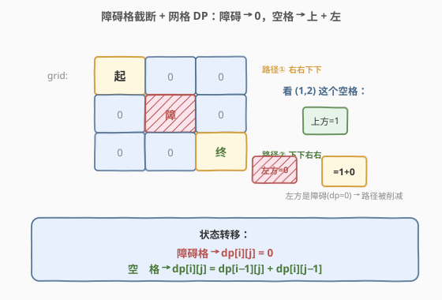
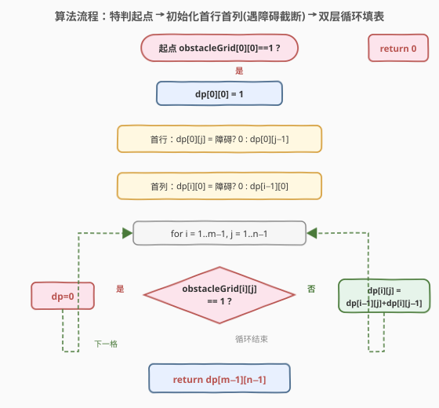
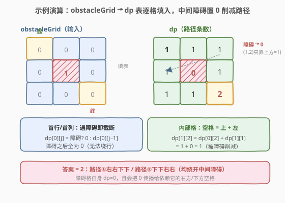

# LeetCode 不同路径 II 题解

## 1. 题目概述

- **标题 / 题号**：不同路径 II（#63，medium）
- **链接**：https://leetcode.cn/problems/unique-paths-ii/
- **难度**：中等
- **标签**：数组、动态规划、网格 DP

**题意**：一个机器人位于一个 `m x n` 网格的左上角（起始点标记为 "Start"）。机器人每次只能**向下**或者**向右**移动一步。机器人试图达到网格的右下角（标记为 "Finish"）。

现在考虑网格中有**障碍物**。那么从左上角到右下角将会有多少条不同的路径？

网格中的障碍物和空位置分别用 `1` 和 `0` 来表示。

**示例 1**：

```text
输入：obstacleGrid = [[0,0,0],[0,1,0],[0,0,0]]
输出：2
解释：
3x3 网格的正中间有一个障碍物。
从左上角到右下角一共有 2 条不同的路径：
1. 向右 -> 向右 -> 向下 -> 向下
2. 向下 -> 向下 -> 向右 -> 向右
```

**示例 2**：

```text
输入：obstacleGrid = [[0,1],[0,0]]
输出：1
解释：第一行第二列是障碍物，只能走 下 -> 右 一条路径。
```

**约束**：

- $m = \text{obstacleGrid.length}$
- $n = \text{obstacleGrid}[i].\text{length}$
- $1 \leq m, n \leq 100$
- $\text{obstacleGrid}[i][j]$ 为 `0` 或 `1`

> 💡 这是 [62. 不同路径](62_不同路径.md) 的「障碍版」：62 求无障碍时的路径条数，本题在网格中加入了障碍格。骨架仍是「网格 DP」，但**障碍格的路径数直接置 0**，且**首行/首列的初始化必须遇到障碍即截断**——这是与 62 最容易出错的两处差异。

## 2. 解题思路

### 2.1 暴力思路

从左上角出发 DFS 枚举所有「向右/向下」走法，遇到障碍格则该分支剪枝，走到右下角计数加一。最坏情况下（无障碍）路径数约 $\binom{m+n-2}{m-1}$，$m=n=100$ 时是天文数字，必然超时。

> 💡 暴力会反复计算「从某格子到终点的路径数」，存在大量**重叠子问题** → 上 DP。和 62 一样，只是多了一个「障碍格置 0」的判定。

### 2.2 核心观察：障碍格截断 + 网格 DP



由于**只能向右或向下**走，到达任一非障碍格 `(i,j)` 的最后一步只可能来自**上方** `(i-1,j)` 或**左方** `(i,j-1)`。设 $dp[i][j]$ 表示从 `(0,0)` 走到 `(i,j)` 的不同路径数，则：

- **障碍格**：$\text{obstacleGrid}[i][j] = 1$ 时，该格不可达，$dp[i][j] = 0$（无论上/左有多少路径都进不来）；
- **空格**：$dp[i][j] = dp[i-1][j] + dp[i][j-1]$（上 + 左，与 62 完全一致）。

> ⚠️ **两处易错点**：
> 1. **起点可能是障碍**：若 `obstacleGrid[0][0] == 1`，直接返回 `0`；
> 2. **首行/首列遇障碍即截断**：首行只能从左来、首列只能从上来，一旦途中出现障碍，**该行/列障碍之后的所有格子都不可达**（路径数全为 0），不能像 62 那样无脑填 1。

状态转移写成分段形式：

$$
dp[i][j] = \begin{cases}
0, & \text{obstacleGrid}[i][j] = 1 \\
1, & i=0,\ j=0 \quad(\text{起点且非障碍}) \\
dp[i][j-1], & i=0,\ j>0 \quad(\text{首行只能从左来}) \\
dp[i-1][j], & j=0,\ i>0 \quad(\text{首列只能从上来}) \\
dp[i-1][j] + dp[i][j-1], & i>0,\ j>0 \quad(\text{内部格：上 + 左})
\end{cases}
$$

答案即 $dp[m-1][n-1]$。

### 2.3 算法流程图



**主流程**：

1. 特判：若起点 `obstacleGrid[0][0] == 1`，返回 `0`。
2. 初始化 `dp[0][0] = 1`（起点非障碍）。
3. **首行**：`for j=1..n-1`：若当前格是障碍，`dp[0][j] = 0`；否则 `dp[0][j] = dp[0][j-1]`（继承左方，遇障碍自然后续全 0）。
4. **首列**：`for i=1..m-1`：若当前格是障碍，`dp[i][0] = 0`；否则 `dp[i][0] = dp[i-1][0]`（继承上方）。
5. **内部格**：`for i=1..m-1, for j=1..n-1`：若障碍，`dp[i][j] = 0`；否则 `dp[i][j] = dp[i-1][j] + dp[i][j-1]`。
6. 返回 `dp[m-1][n-1]`。

> 💡 **统一写法**：其实不必把首行/首列单独写——只要统一用 `dp[i][j] = (obstacleGrid[i][j]==1) ? 0 : (dp[i-1][j] + dp[i][j-1])`，并在访问 `dp[i-1][j]`/`dp[i][j-1]` 时把越界当作 0 即可。但显式处理首行首列更直观、不易出错，也是面试推荐的写法。

> 💡 **空间优化**：每个 `dp[i][j]` 只依赖**上一行同列**和**本行前一列**，可压成一维 `dp[j]`：障碍格置 `dp[j] = 0`；非障碍格 `dp[j] = dp[j] + dp[j-1]`（更新前 `dp[j]` 是上一行值即「上方」，`dp[j-1]` 已是本行值即「左方」）。首列 `dp[0]` 遇障碍直接置 0 并会自动「截断」后续。

### 2.4 示例演算

以 `obstacleGrid = [[0,0,0],[0,1,0],[0,0,0]]` 为例（中间 `(1,1)` 是障碍），按行优先填 `dp` 表：



逐格计算过程：

| 格子 (i,j) | 是否障碍 | 来源 | 计算 | dp[i][j] |
|------------|----------|------|------|----------|
| (0,0) | 否 | 起点 | = 1 | 1 |
| (0,1) | 否 | 左 | dp[0][0] = 1 | 1 |
| (0,2) | 否 | 左 | dp[0][1] = 1 | 1 |
| (1,0) | 否 | 上 | dp[0][0] = 1 | 1 |
| (1,1) | **是** | — | 障碍 → 置 0 | **0** |
| (1,2) | 否 | 上 + 左 | dp[0][2] + dp[1][1] = 1 + 0 | 1 |
| (2,0) | 否 | 上 | dp[1][0] = 1 | 1 |
| (2,1) | 否 | 上 + 左 | dp[1][1] + dp[2][0] = 0 + 1 | 1 |
| (2,2) | 否 | 上 + 左 | dp[1][2] + dp[2][1] = 1 + 1 | **2** |

最终 `dp[2][2] = 2`，对应两条路径：`右→右→下→下` 和 `下→下→右→右`（均绕开中间障碍）。

> ⚠️ 注意 `(1,2)` 和 `(2,1)` 虽然自身不是障碍，但因为「上方/左方」之一是障碍格（dp=0），路径数被削减——这正是障碍「截断」作用的体现。

## 3. 参考代码

### C++（二维 DP）

```cpp
class Solution {
  public:
    int uniquePathsWithObstacles(vector<vector<int>>& obstacleGrid) {
        int m = obstacleGrid.size(), n = obstacleGrid[0].size();
        if (obstacleGrid[0][0] == 1) return 0;          // 起点即障碍，无解

        vector<vector<long long>> dp(m, vector<long long>(n, 0));
        dp[0][0] = 1;
        for (int j = 1; j < n; ++j)                     // 首行：遇障碍截断
            dp[0][j] = obstacleGrid[0][j] ? 0 : dp[0][j - 1];
        for (int i = 1; i < m; ++i)                     // 首列：遇障碍截断
            dp[i][0] = obstacleGrid[i][0] ? 0 : dp[i - 1][0];
        for (int i = 1; i < m; ++i) {
            for (int j = 1; j < n; ++j) {
                dp[i][j] = obstacleGrid[i][j] ? 0 : dp[i - 1][j] + dp[i][j - 1];
            }
        }
        return dp[m - 1][n - 1];
    }
};
```

### C++（一维滚动数组，$O(n)$ 空间）

```cpp
class Solution {
  public:
    int uniquePathsWithObstacles(vector<vector<int>>& obstacleGrid) {
        int m = obstacleGrid.size(), n = obstacleGrid[0].size();
        if (obstacleGrid[0][0] == 1) return 0;

        vector<long long> dp(n, 0);
        dp[0] = 1;                                       // 起点
        for (int j = 1; j < n; ++j)                      // 首行：遇障碍截断
            dp[j] = obstacleGrid[0][j] ? 0 : dp[j - 1];
        for (int i = 1; i < m; ++i) {
            dp[0] = obstacleGrid[i][0] ? 0 : dp[0];      // 首列：遇障碍截断
            for (int j = 1; j < n; ++j) {
                dp[j] = obstacleGrid[i][j] ? 0 : dp[j] + dp[j - 1];
            }
        }
        return dp[n - 1];
    }
};
```

### Python

```python
class Solution:
    def uniquePathsWithObstacles(self, obstacleGrid: List[List[int]]) -> int:
        m, n = len(obstacleGrid), len(obstacleGrid[0])
        if obstacleGrid[0][0] == 1:           # 起点即障碍
            return 0

        dp = [0] * n
        dp[0] = 1
        for j in range(1, n):                 # 首行：遇障碍截断
            dp[j] = 0 if obstacleGrid[0][j] else dp[j - 1]
        for i in range(1, m):
            dp[0] = 0 if obstacleGrid[i][0] else dp[0]   # 首列
            for j in range(1, n):
                dp[j] = 0 if obstacleGrid[i][j] else dp[j] + dp[j - 1]
        return dp[-1]
```

> ⚠️ **溢出陷阱**：虽然答案保证 $\leq 2 \times 10^9$（在 `int` 范围内），但中间格的 `dp` 值在「无障碍大网格」下可能短暂超过 `int` 上限再被障碍削减；C++ 中用 `long long` 存 dp 更稳妥。Python 无此问题。

## 4. 复杂度分析

| 维度 | 复杂度 | 说明 |
|------|--------|------|
| 时间复杂度 | $O(m \cdot n)$ | 每个格子恰好计算一次，共 $m \times n$ 个格子 |
| 空间复杂度（二维） | $O(m \cdot n)$ | 显式维护整张 dp 表 |
| 空间复杂度（滚动） | $O(n)$ | 只保留一行 `dp[j]`，$n$ 为列数；取 $\min(m,n)$ 可压到更小 |

## 5. 扩展：原地修改

若允许修改输入，可直接在 `obstacleGrid` 上原地累加（把空格改成路径数），空间降为 $O(1)$：

```cpp
int uniquePathsWithObstacles(vector<vector<int>>& obstacleGrid) {
    int m = obstacleGrid.size(), n = obstacleGrid[0].size();
    if (obstacleGrid[0][0] == 1) return 0;
    obstacleGrid[0][0] = 1;
    for (int j = 1; j < n; ++j)
        obstacleGrid[0][j] = obstacleGrid[0][j] ? 0 : obstacleGrid[0][j - 1];
    for (int i = 1; i < m; ++i) {
        obstacleGrid[i][0] = obstacleGrid[i][0] ? 0 : obstacleGrid[i - 1][0];
        for (int j = 1; j < n; ++j)
            obstacleGrid[i][j] = obstacleGrid[i][j] ? 0 : obstacleGrid[i - 1][j] + obstacleGrid[i][j - 1];
    }
    return obstacleGrid[m - 1][n - 1];
}
```

> ⚠️ 原地法会破坏原始数据，且因为输入是 `int` 可能溢出（无障碍时值可达 $\binom{198}{99}$ 远超 `int`）。面试中**滚动数组是更稳妥的折中**——既省空间又不破坏输入、还能用 `long long` 规避溢出。

## 6. 面试要点

1. **和 [62. 不同路径](62_不同路径.md) 的核心区别是什么？**
   - 骨架相同（都是「上 + 左」的网格 DP 计数），区别全在**障碍处理**：障碍格 `dp=0`；首行/首列遇障碍即截断（后续全 0）；起点为障碍直接返回 0。62 的「全 1 初始化」在这里是错的。

2. **为什么首行/首列不能像 62 那样直接填 1？**
   - 首行只能从左方来、首列只能从上方来，是**单一路径**。一旦途中出现障碍，障碍之后的格子**无法绕行**（不能往回走上/左），路径数必须归 0。62 无障碍所以全程填 1；本题要用 `dp = 障碍 ? 0 : 前驱` 继承，让 0 自动向后传播。

3. **滚动数组里 `dp[0] = obstacleGrid[i][0] ? 0 : dp[0]` 这一句为什么不能省？**
   - 首列 `dp[0]` 只能从「上方」（即上一行的 `dp[0]`）继承，没有「左方」。若当前格是障碍，必须显式置 0；否则保持上一行的值。漏掉会导致障碍格下方仍残留旧路径数。

4. **起点或终点是障碍怎么办？**
   - 起点为障碍：直接返回 0（机器人无处可起）；终点为障碍：自然得出 `dp[m-1][n-1] = 0`（终格被置 0），无需特判，但**起点必须特判**（否则 `dp[0][0]=1` 会与障碍矛盾）。

5. **为什么用 `long long` 而不是 `int`？**
   - 答案虽保证 $\leq 2 \times 10^9$（`int` 可容），但**中间格**在无障碍区域可能累加到更大的值（如 $100 \times 100$ 全空时中间格约 $\binom{100}{50} \approx 10^{29}$），即便后续被障碍削减，瞬时值已溢出 `int`。`long long` 更安全；Python 无此问题。

## 同类练习题

| # | 题目 | 与本题的关联 |
|---|------|-------------|
| 62 | [不同路径](https://leetcode.cn/problems/unique-paths/)（[题解](62_不同路径.md)） | 无障碍版网格 DP 计数，对比「全 1 初始化」与本题「截断初始化」的差异 |
| 64 | [最小路径和](https://leetcode.cn/problems/minimum-path-sum/)（[题解](64_最小路径和.md)） | 网格 DP 求最小权，同为「上/左」转移，对比「计数相加」与「取 min」 |
| 980 | [不同路径 III](https://leetcode.cn/problems/unique-paths-iii/) | 四方向行走 + 必经点 + 状态压缩，网格 DP 的进阶形态 |
| 2304 | [网格中的最小路径代价](https://leetcode.cn/problems/minimum-path-fall-cost/) | 网格 DP + 逐列代价函数，巩固「上/左」转移的变体 |
| 174 | [地下城游戏](https://leetcode.cn/problems/dungeon-game/) | 网格 DP 反向（从终点推起点），强化的「网格 DP」练习 |
