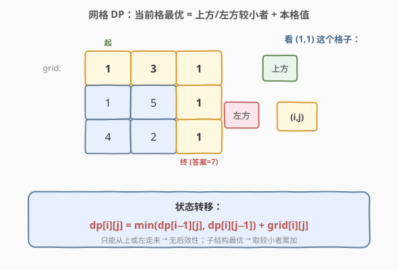
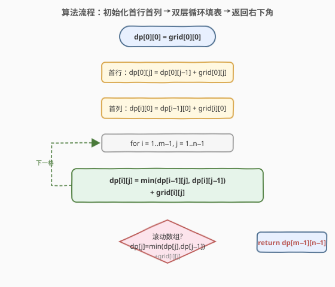
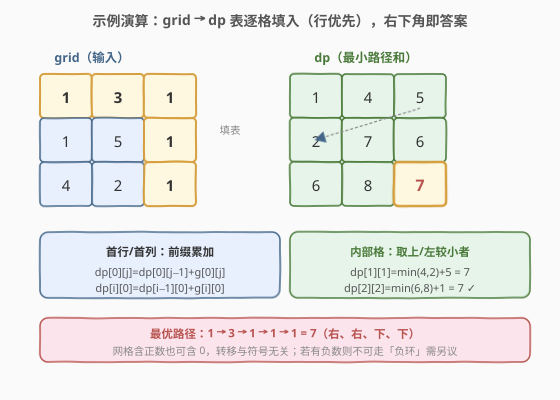

# 最小路径和

- **题目名称**：最小路径和
- **链接**：[64. 最小路径和](https://leetcode.cn/problems/minimum-path-sum/)
- **难度**：中等
- **标签**：数组、动态规划、网格 DP

## 1. 题目概述

给定一个包含非负整数的 `m x n` 网格 `grid`，请找出一条从左上角到右下角的路径，使得路径上的数字总和**最小**。

> ⚠️ 每次只能**向下**或者**向右**移动一步。

**示例 1**：

```text
输入：grid = [[1,3,1],[1,5,1],[4,2,1]]
输出：7
解释：因为路径 1→3→1→1→1 的总和最小。
路径为：(0,0)→(0,1)→(0,2)→(1,2)→(2,2)
```

**示例 2**：

```text
输入：grid = [[1,2,3],[4,5,6]]
输出：12
解释：路径 1→2→3→6 总和最小为 12。
```

**约束条件**：

- $m = \text{grid.length}$
- $n = \text{grid}[i].\text{length}$
- $1 \leq m, n \leq 200$
- $0 \leq \text{grid}[i][j] \leq 200$

> 💡 这是 [62. 不同路径](62_不同路径.md) 的「加权版」：62 求路径**条数**，本题求路径**最小权和**。两者共享同一套「网格 DP」骨架，只是把「相加计数」换成了「取 min 累加」。

---

## 2. 解题思路

### 2.1 暴力思路

从左上角出发 DFS 枚举所有「向右/向下」的走法，每走到右下角记录一次路径和取最小。从 `(0,0)` 到 `(m-1,n-1)` 共需走 $m+n-2$ 步，其中选 $m-1$ 步向下，路径数约 $\binom{m+n-2}{m-1}$，最坏指数级，$m=n=200$ 时直接超时。

> 💡 暴力会大量重复计算「从某个格子到右下角的最小和」，这正是**重叠子问题**的信号 → 上 DP。

### 2.2 核心观察：网格 DP（无后效性 + 最优子结构）



由于**只能向右或向下**走，到达任一格子 `(i,j)` 的最后一步只可能来自**上方** `(i-1,j)` 或**左方** `(i,j-1)`。这带来两个关键性质：

- **无后效性**：到 `(i,j)` 的最优路径与「之前是怎么到上/左格的」无关，只需关心上/左格的最优和；
- **最优子结构**：到 `(i,j)` 的最小和 = `min(上方最小和, 左方最小和) + grid[i][j]`。

> ⚠️ 注意：本题 `grid` 全为**非负**数，因此每多走一步路径和只会**增加**，不存在「绕远反而更小」的情况；但即便含负数，该转移方程在「只能右/下」的限制下依然成立（因为不存在环，无需担心负环）。

设 $dp[i][j]$ 表示从 `(0,0)` 走到 `(i,j)` 的最小路径和，则：

$$
dp[i][j] = \begin{cases}
\text{grid}[0][0], & i=0,\ j=0 \\
dp[0][j-1] + \text{grid}[0][j], & i=0,\ j>0 \quad(\text{首行只能从左来}) \\
dp[i-1][0] + \text{grid}[i][0], & j=0,\ i>0 \quad(\text{首列只能从上来}) \\
\min(dp[i-1][j],\ dp[i][j-1]) + \text{grid}[i][j], & i>0,\ j>0
\end{cases}
$$

答案即 $dp[m-1][n-1]$。

### 2.3 算法流程图



维护变量：

- `dp`：大小 $m \times n$ 的表（或一维滚动数组），`dp[i][j]` 为到 `(i,j)` 的最小和；
- 先填**首行**与**首列**（都是唯一方向的前缀累加），再用双层循环按**行优先**顺序填内部格子。

**主流程**：

1. `dp[0][0] = grid[0][0]`。
2. 首行：`dp[0][j] = dp[0][j-1] + grid[0][j]`（`j` 从 `1` 到 `n-1`）。
3. 首列：`dp[i][0] = dp[i-1][0] + grid[i][0]`（`i` 从 `1` 到 `m-1`）。
4. 内部：`for i=1..m-1, for j=1..n-1`：`dp[i][j] = min(dp[i-1][j], dp[i][j-1]) + grid[i][j]`。
5. 返回 `dp[m-1][n-1]`。

> 💡 **空间优化**：每个 `dp[i][j]` 只依赖**上一行同列**和**本行前一列**，故可把二维压成一维 `dp[j]`：更新前 `dp[j]` 是上一行值、`dp[j-1]` 已是本行值，于是 `dp[j] = min(dp[j], dp[j-1]) + grid[i][j]`。

### 2.4 示例演算

以 `grid = [[1,3,1],[1,5,1],[4,2,1]]` 为例，按行优先填表：



逐格计算过程：

| 格子 (i,j) | 来源 | 计算 | dp[i][j] |
|------------|------|------|----------|
| (0,0) | 起点 | = grid[0][0] | 1 |
| (0,1) | 左 | 1 + 3 | 4 |
| (0,2) | 左 | 4 + 1 | 5 |
| (1,0) | 上 | 1 + 1 | 2 |
| (1,1) | min(上 4, 左 2) + 5 | min(4,2)+5 | 7 |
| (1,2) | min(上 5, 左 7) + 1 | min(5,7)+1 | 6 |
| (2,0) | 上 | 2 + 4 | 6 |
| (2,1) | min(上 7, 左 6) + 2 | min(7,6)+2 | 8 |
| (2,2) | min(上 6, 左 8) + 1 | min(6,8)+1 | **7** |

最终 `dp[2][2] = 7`，回溯最优路径为 `1→3→1→1→1`（右、右、下、下）。

---

## 3. 参考代码

### C++（二维 DP）

```cpp
class Solution {
  public:
    int minPathSum(vector<vector<int>>& grid) {
        int m = grid.size(), n = grid[0].size();
        vector<vector<int>> dp(m, vector<int>(n, 0));
        dp[0][0] = grid[0][0];
        for (int j = 1; j < n; ++j) dp[0][j] = dp[0][j - 1] + grid[0][j];   // 首行
        for (int i = 1; i < m; ++i) dp[i][0] = dp[i - 1][0] + grid[i][0];   // 首列
        for (int i = 1; i < m; ++i) {
            for (int j = 1; j < n; ++j) {
                dp[i][j] = min(dp[i - 1][j], dp[i][j - 1]) + grid[i][j];    // 取上/左较小者
            }
        }
        return dp[m - 1][n - 1];
    }
};
```

### C++（一维滚动数组，$O(n)$ 空间）

```cpp
class Solution {
  public:
    int minPathSum(vector<vector<int>>& grid) {
        int m = grid.size(), n = grid[0].size();
        vector<int> dp(n, 0);
        dp[0] = grid[0][0];
        for (int j = 1; j < n; ++j) dp[j] = dp[j - 1] + grid[0][j];         // 首行
        for (int i = 1; i < m; ++i) {
            dp[0] += grid[i][0];                                            // 首列：本行只依赖上一行
            for (int j = 1; j < n; ++j) {
                dp[j] = min(dp[j], dp[j - 1]) + grid[i][j];                 // dp[j]=上, dp[j-1]=左
            }
        }
        return dp[n - 1];
    }
};
```

### Python

```python
class Solution:
    def minPathSum(self, grid: List[List[int]]) -> int:
        m, n = len(grid), len(grid[0])
        dp = [0] * n
        dp[0] = grid[0][0]
        for j in range(1, n):
            dp[j] = dp[j - 1] + grid[0][j]          # 首行
        for i in range(1, m):
            dp[0] += grid[i][0]                      # 首列
            for j in range(1, n):
                dp[j] = min(dp[j], dp[j - 1]) + grid[i][j]   # 上 / 左 取小
        return dp[-1]
```

---

## 4. 复杂度分析

| 维度 | 复杂度 | 说明 |
|------|--------|------|
| 时间复杂度 | $O(m \cdot n)$ | 每个格子恰好计算一次，共 $m \times n$ 个格子 |
| 空间复杂度（二维） | $O(m \cdot n)$ | 显式维护整张 dp 表 |
| 空间复杂度（滚动） | $O(n)$ | 只保留一行（即一维 `dp[j]`），$n$ 为列数；若取 `min(m,n)` 可压到更小 |

---

## 5. 扩展：原地修改

若允许修改输入，可直接在 `grid` 上原地累加，省去 dp 数组、空间降为 $O(1)$：

```cpp
int minPathSum(vector<vector<int>>& grid) {
    int m = grid.size(), n = grid[0].size();
    for (int j = 1; j < n; ++j) grid[0][j] += grid[0][j - 1];
    for (int i = 1; i < m; ++i) {
        grid[i][0] += grid[i - 1][0];
        for (int j = 1; j < n; ++j)
            grid[i][j] += min(grid[i - 1][j], grid[i][j - 1]);
    }
    return grid[m - 1][n - 1];
}
```

> ⚠️ 面试中需主动询问「能否修改输入」。原地法虽省空间但破坏了原始数据，若调用方后续仍需 `grid` 则不可用，**滚动数组是更稳妥的折中**。

---

## 6. 面试要点

1. **为什么网格 DP 在这里成立？**
   - 「只能右/下」保证了**无后效性**：到 `(i,j)` 的最优只取决于上/左两格，不依赖具体走法；且**最优子结构**成立：子路径必为到上/左格的最优。两者齐备即可 DP。

2. **和 [62. 不同路径](62_不同路径.md) 的本质区别？**
   - 62 是**计数**（路径条数相加 `+`），本题是**求最小权**（取 `min` 后累加）。骨架相同，仅聚合方式不同。把「加法群」换成「取 min 的半格」就是同一模板的迁移。

3. **滚动数组中 `dp[j] = min(dp[j], dp[j-1]) + grid[i][j]` 为什么对？**
   - 更新前 `dp[j]` 还存着**上一行第 j 列**（即「上方」），`dp[j-1]` 在本轮已更新为**本行第 j-1 列**（即「左方」），两者取 min 再加本格即正确转移。注意**首列 `dp[0]` 要单独用 `+=` 处理**（它只能从上方来）。

4. **初始化首行首列为什么要单独做？**
   - 首行没有「上方」、首列没有「左方」，转移公式 `min(上,左)` 不适用，需用前缀累加单独赋值。漏掉会导致内部格引用越界或错误初值。

5. **若允许向四个方向走，还能用这个 DP 吗？**
   - 不能。四方向会形成**环**（可绕回），无后效性被破坏，需改用**最短路算法**（如 Dijkstra）。这正是「只能右/下」这一约束的价值所在。

---

## 7. 同类练习题

- [62. 不同路径](https://leetcode.cn/problems/unique-paths/)（[题解](62_不同路径.md)）：网格 DP 计数版，对比「相加」与「取 min」的聚合差异
- [63. 不同路径 II](https://leetcode.cn/problems/unique-paths-ii/)：带障碍格的网格 DP，转移时跳过障碍、注意边界与初值
- [980. 不同路径 III](https://leetcode.cn/problems/unique-paths-iii/)：四方向 + 状态压缩的进阶网格 DP，对比为何需更多状态
- [174. 地下城游戏](https://leetcode.cn/problems/dungeon-game/)：网格 DP 反向（从终点推起点）+ 负数，强化的「网格 DP + 最值」练习
- [120. 三角形最小路径和](https://leetcode.cn/problems/triangle/)：变体网格（三角形）求最小路径和，巩固「上/左」转移的边界处理
