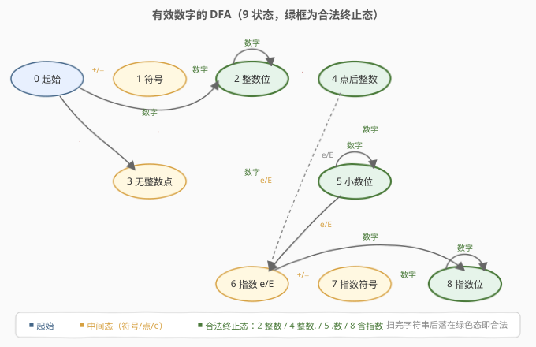
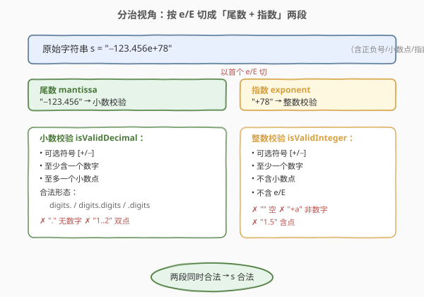
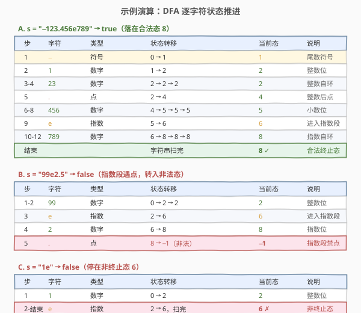

# LeetCode 有效数字 题解

## 1. 题目概述

- **标题 / 题号**：有效数字（#65，hard）
- **链接**：https://leetcode.cn/problems/valid-number/
- **难度**：困难
- **标签**：字符串、自动机、模拟

**题意**：给定一个字符串 `s`，判断它是否表示一个**合法的十进制数**（可含科学计数法）。一个合法数字可拆成两部分（顺序固定）：

1. **尾数**：一个**小数**或**整数**；
2. **（可选）指数**：`'e'` 或 `'E'` 后跟一个**整数**。

**小数**的组成（顺序固定）：

1. （可选）符号 `'+'` / `'-'`；
2. 下列三种格式之一：
   - 至少一位数字 + `'.'`（如 `"4."`）；
   - 至少一位数字 + `'.'` + 至少一位数字（如 `"1.5"`）；
   - `'.'` + 至少一位数字（如 `".5"`）。

**整数**的组成（顺序固定）：

1. （可选）符号 `'+'` / `'-'`；
2. 至少一位数字。

**示例 1**：

```text
输入：s = "0"
输出：true
```

**示例 2**：

```text
输入：s = "e"
输出：false
```

**示例 3**：

```text
输入：s = "."
输出：false
```

**合法示例**：`"2"`、`"0089"`、`"-0.1"`、`"+3.14"`、`"4."`、`"-.9"`、`"2e10"`、`"-90E3"`、`"3e+7"`、`"+6e-1"`、`"53.5e93"`、`"-123.456e789"`。

**非法示例**：`"abc"`、`"1a"`、`"1e"`、`"e3"`、`"99e2.5"`、`"--6"`、`"-+3"`、`"95a54e53"`、`"."`、`".."`、`"+"`、`"6+1"`。

**约束**：

- `1 <= s.length <= 20`
- `s` 仅由英文字母（大小写）、数字（`0-9`）、`'+'`、`'-'`、`'.'` 组成。

> 💡 本题没有算法上的「难」，只有规则上的「烦」：合法形态多、边界多、且互相牵制（如 `"4."` 合法但 `"."` 不合法；指数后必须是无小数点的整数）。**用一堆 `if-else` 硬写极容易漏边界**，最稳妥的做法是把它建模成一个**确定性有限状态机（DFA）**——把所有规则一次性编码进转移表，主循环只做「读字符→查表跳状态」。

## 2. 解题思路

### 2.1 暴力思路

最直接的念头是「用一堆布尔标志位边扫边判」：`seenDigit`、`seenDot`、`seenExp`、`seenSign`…… 但很快会陷入细节泥潭：

- 符号在指数前后**各允许一次**，标志位要分两段管理；
- 小数点在**指数之后不允许**出现，但尾数段允许一次；
- `"."` 单独不合法、`"4."` 合法、`".5"` 合法——「点」是否合法取决于**前后有没有数字**，单凭 `seenDot` 判不出来；
- 多个 `e`（`"1e5e3"`）要拒，但 `e` 和 `E` 等价。

这种写法**测试用例一跑就漏**，调试成本极高。本质问题是：规则是「**当前状态 × 字符类型 → 下一状态**」的组合，用线性标志位没法把二维约束表达清楚。

### 2.2 核心观察：确定性有限状态机（DFA）



把整个判定过程看作一个自动机在字符流上推进：任一时刻处于某个**状态**，读入一个字符后依据「字符类型」跳到下一状态，落入非法态则直接判负。先把字符归成 5 类：

| 字符类型 | 代表 | 编号 |
|----------|------|------|
| 数字 | `0-9` | 0 |
| 符号 | `+` / `-` | 1 |
| 点 | `.` | 2 |
| 指数 | `e` / `E` | 3 |
| 其他 | 字母（非 e/E）等 | 4（直接非法） |

本题只需 **9 个状态**：

| 状态 | 含义 | 是否合法终止态 |
|------|------|----------------|
| `0` 起始 | 还没读任何有效字符 | ✗ |
| `1` 尾数符号 | 刚读完尾数前的 `+`/`-` | ✗ |
| `2` 整数位 | 正在读小数点前的整数部分 | ✓ |
| `3` 无整数点 | 读到一个点，但前面无整数（需后接数字，如 `".5"`） | ✗ |
| `4` 整数后点 | 整数读完遇到点（`"1."` 此刻已合法） | ✓ |
| `5` 小数位 | 正在读小数点后的数字 | ✓ |
| `6` 指数 | 刚读到 `e`/`E`，等指数部分 | ✗ |
| `7` 指数符号 | 刚读完指数后的 `+`/`-` | ✗ |
| `8` 指数位 | 正在读指数的数字 | ✓ |

**转移表**（行=当前状态，列=字符类型，值=下一状态，`-1` 表示非法）：

| 状态 \ 字符 | 数字 | 符号 | 点 | e/E | 其他 |
|-------------|------|------|----|-----|------|
| `0` 起始 | `2` | `1` | `3` | `-1` | `-1` |
| `1` 尾数符号 | `2` | `-1` | `3` | `-1` | `-1` |
| `2` 整数位 | `2` | `-1` | `4` | `6` | `-1` |
| `3` 无整数点 | `5` | `-1` | `-1` | `-1` | `-1` |
| `4` 整数后点 | `5` | `-1` | `-1` | `6` | `-1` |
| `5` 小数位 | `5` | `-1` | `-1` | `6` | `-1` |
| `6` 指数 | `8` | `7` | `-1` | `-1` | `-1` |
| `7` 指数符号 | `8` | `-1` | `-1` | `-1` | `-1` |
| `8` 指数位 | `8` | `-1` | `-1` | `-1` | `-1` |

> 💡 这张表把所有边界规则**一次性编码**到位，几条关键性质都自然落出：
> - **点的合法与否取决于「前后有没有数字」**：从 `0`/`1` 经点只能到 `3`（无整数点，**非终止态**，必须后接数字到 `5` 才合法），而从 `2`（已有整数）经点到 `4`（**终止态**，`"4."` 直接合法）。于是 `"."` 落在 `3` 判负、`"4."` 落在 `4` 判正，**无需额外标志位**。
> - **指数后禁点**：从 `6`/`7`/`8` 经点一律 `-1`，所以 `"99e2.5"` 在指数段遇点直接非法。
> - **符号各段只允许一次**：`1` 经符号到 `-1`（`"-+3"` 非法），`7` 经符号到 `-1`（`"1e++5"` 非法），但 `0→1` 和 `6→7` 各允许一次。
> - **`e` 不能开头、不能重复**：`0` 经 `e` 到 `-1`（`"e3"` 非法）；`6`/`7`/`8` 经 `e` 到 `-1`（`"1e5e3"` 非法）。

### 2.3 算法流程图



DFA 的主循环极其简洁：**初始化 `state=0` → 逐字符查表转移 → 落入 `-1` 即返回 `false` → 扫完判断是否落在合法终止态**。代码里没有嵌套 `if-else`，所有规则都集中在转移表里，**新增规则只改表不改循环**。

> ⚠️ **终止态判定是最后一道关**：即便全程没落入 `-1`，也未必合法。例如 `"1e"` 全程合法转移（`0→2→6`），但停在 `6`（非终止态），仍判负；`"+"` 停在 `1`、`"."` 停在 `3` 同理。合法终止态只有 `2`、`4`、`5`、`8` 四个——分别对应「纯整数」「整数.」「含小数」「含指数」四种合法落点。

### 2.4 示例演算



- **A. `"−123.456e789"` → true**：`−` 让 `0→1`；数字串推到 `2` 并自环；`.` 让 `2→4`；小数位推到 `5` 并自环；`e` 让 `5→6` 进入指数段；指数数字推到 `8` 并自环。扫完落在 `8`（合法终止态）。
- **B. `"99e2.5"` → false**：`99` 到 `2`，`e` 到 `6`，`2` 到 `8`，**指数段遇 `.` 时 `8→-1`**（指数禁点），立即判负。
- **C. `"1e"` → false**：`1` 到 `2`，`e` 到 `6`，扫完**停在 `6`**（非终止态，指数后无数字），判负。

> 💡 三例分别代表两类非法：「**转移中途落入非法态**」（B）和「**全程合法但停在非终止态**」（C）。DFA 用「转移表 + 终止态集合」两道关卡同时覆盖这两类。

## 3. 参考代码

### C++（表驱动 DFA）

```cpp
class Solution {
  public:
    bool isNumber(string s) {
        // 字符分类: 0=数字 1=符号 2=点 3=e/E 4=其他(非法)
        auto col = [](char c) {
            if (c >= '0' && c <= '9') return 0;
            if (c == '+' || c == '-') return 1;
            if (c == '.') return 2;
            if (c == 'e' || c == 'E') return 3;
            return 4;
        };
        // 转移表: table[状态][字符类] = 下一状态, -1 表示非法
        const int table[9][5] = {
          /* 数字  符号   点    e/E   其他 */
            {  2,    1,    3,   -1,   -1},   // 0 起始
            {  2,   -1,    3,   -1,   -1},   // 1 尾数符号
            {  2,   -1,    4,    6,   -1},   // 2 整数位
            {  5,   -1,   -1,   -1,   -1},   // 3 无整数点
            {  5,   -1,   -1,    6,   -1},   // 4 整数后点
            {  5,   -1,   -1,    6,   -1},   // 5 小数位
            {  8,    7,   -1,   -1,   -1},   // 6 指数
            {  8,   -1,   -1,   -1,   -1},   // 7 指数符号
            {  8,   -1,   -1,   -1,   -1}    // 8 指数位
        };
        int state = 0;
        for (char c : s) {
            int k = col(c);
            if (k == 4) return false;          // 非法字符直接拒
            state = table[state][k];
            if (state == -1) return false;     // 转移非法直接拒
        }
        // 落在合法终止态才算合法
        return state == 2 || state == 4 || state == 5 || state == 8;
    }
};
```

### Python

```python
class Solution:
    def isNumber(self, s: str) -> bool:
        def col(c: str) -> int:
            if '0' <= c <= '9': return 0
            if c in '+-':       return 1
            if c == '.':        return 2
            if c in 'eE':       return 3
            return 4
        table = [
          # 数字  符号  点   e/E  其他
            [  2,   1,   3,  -1,  -1],   # 0 起始
            [  2,  -1,   3,  -1,  -1],   # 1 尾数符号
            [  2,  -1,   4,   6,  -1],   # 2 整数位
            [  5,  -1,  -1,  -1,  -1],   # 3 无整数点
            [  5,  -1,  -1,   6,  -1],   # 4 整数后点
            [  5,  -1,  -1,   6,  -1],   # 5 小数位
            [  8,   7,  -1,  -1,  -1],   # 6 指数
            [  8,  -1,  -1,  -1,  -1],   # 7 指数符号
            [  8,  -1,  -1,  -1,  -1],   # 8 指数位
        ]
        state = 0
        for c in s:
            k = col(c)
            if k == 4: return False
            state = table[state][k]
            if state == -1: return False
        return state in {2, 4, 5, 8}
```

> ⚠️ **Python 别用 `c.isdigit()`**：它会接受 Unicode 数字（如 `'٣'`），虽然本题约束下不会出现，但用 `'0' <= c <= '9'` 更精确地表达「ASCII 数字」语义，避免隐式陷阱。

## 4. 复杂度分析

| 维度 | 复杂度 | 说明 |
|------|--------|------|
| 时间复杂度 | $O(n)$ | 至多扫一遍字符串，每个字符做 $O(1)$ 的分类与查表 |
| 空间复杂度 | $O(1)$ | 转移表 $9 \times 5$ 为常数大小，仅用 `state` 一个变量 |

> 💡 $n \leq 20$，性能毫无压力。本题考点完全在**规则覆盖的完备性**：能否想到 DFA、能否把 9 个状态与转移表设计得不重不漏、能否想清楚哪些是合法终止态。

## 5. 扩展：分治法（按 e/E 切两段）

除了 DFA，还有一种**更易口述**的写法：按 `e`/`E` 把串切成「尾数 + 指数」两段，分别用独立函数校验。尾数是小数或整数、指数必须是整数，两段同时合法则整体合法。


```python
class Solution:
    def isNumber(self, s: str) -> bool:
        def is_integer(t: str) -> bool:
            if not t: return False
            if t[0] in '+-': t = t[1:]
            return len(t) > 0 and all('0' <= c <= '9' for c in t)

        def is_decimal(t: str) -> bool:
            if not t: return False
            if t[0] in '+-': t = t[1:]
            if t.count('.') != 1: return False
            left, right = t.split('.')
            if not left and not right: return False      # "." 单独非法
            for part in (left, right):
                if part and not all('0' <= c <= '9' for c in part):
                    return False
            return True                                   # 至少一边有数字

        # 找首个 e/E 切分（多于一个 e 时指数段校验自然失败）
        epos = next((i for i, c in enumerate(s) if c in 'eE'), -1)
        if epos == -1:
            return is_decimal(s) or is_integer(s)
        mant, exp = s[:epos], s[epos + 1:]
        return (is_decimal(mant) or is_integer(mant)) and is_integer(exp)
```

> 💡 **DFA vs 分治，怎么选？**
> - **DFA**：规则集中、扩展只改表、不易漏边界；缺点是状态设计本身需要想清楚，口述不直观。
> - **分治**：思路贴近题目自然语言（「尾数 + 指数」），`is_decimal`/`is_integer` 各自独立可单测；缺点是两段函数内部仍有边界（点的位置、符号），且切分逻辑要处理「无 e」「多个 e」。
>
> 面试推荐：**先讲分治**（好理解、快速 AC），**再升华到 DFA**（展示工程意识与可扩展性）。

## 6. 面试要点

1. **为什么用 DFA 而不是堆 `if-else` 和标志位？**

   规则是「当前状态 × 字符类型」的二维组合，线性标志位（`seenDot`/`seenSign`/...）无法表达「同一个字符在不同位置合法性不同」。例如点在尾数段允许一次、在指数段禁止；符号在尾数前和指数前各允许一次。DFA 用转移表把二维约束**一次性编码**，主循环只查表，新增规则只改表不改循环，不易漏边界。

2. **合法终止态为什么是 `2/4/5/8`？`1/3/6/7` 为什么不行？**

   - `2`（整数位）、`5`（小数位）、`8`（指数位）表示**正读到数字**，停在这里说明串以数字结尾，合法。
   - `4`（整数后点）表示「整数 + 点」刚结束（`"4."`），题目明确允许这种格式，合法。
   - `1`/`7` 停在符号后（`"+"`、`"1e+"`），后面没数字；`3` 停在孤立点上（`"."`），前后都无数字；`6` 停在 `e` 后（`"1e"`），指数没值——都不构成完整数字，非法。

3. **`"4."` 合法、`".5"` 合法、但 `"."` 不合法，DFA 怎么区分？**

   点的合法性取决于**前后有没有数字**。DFA 用两条不同转移区分：从已有整数的状态 `2` 经点到 `4`（终止态，合法）；从无整数的状态 `0`/`1` 经点到 `3`（**非终止态**，必须再读数字到 `5` 才合法）。所以 `"."` 落在 `3` 判负，`"4."` 落在 `4` 判正，`".5"` 经 `3→5` 落在 `5` 判正——无需额外标志位。

4. **指数部分为什么必须是整数（不能含小数点）？**

   科学计数法 $a \times 10^b$ 中指数 $b$ 是整数（如 $1.5 \times 10^3$），不存在 $10^{2.5}$ 这种工程写法。转移表里 `6`/`7`/`8` 经点一律 `-1`，所以 `"99e2.5"` 在指数段遇点直接非法。

5. **`"1e5e3"` 这种多个 `e` 怎么处理？**

   DFA 里 `6`/`7`/`8` 经 `e` 都到 `-1`（指数段不能再出现 `e`），第二个 `e` 一出现就非法。分治法里按首个 `e` 切后，指数段 `"5e3"` 经 `is_integer` 校验会因含 `e` 失败——殊途同归。

## 同类练习题

| # | 题目 | 与本题的关联 |
|---|------|-------------|
| 8 | [字符串转换整数 (atoi)](https://leetcode.cn/problems/string-to-integer-atoi/)（[题解](../0001-0100/8_字符串转换整数atoi.md)） | 同为字符串解析 DFA，本题思路的直接前身（4 状态简化版） |
| 468 | [验证 IP 地址](https://leetcode.cn/problems/validate-ip-address/)（[题解](../0401-0500/468_验证IP地址.md)） | 分段 + 规则校验，字符串合法性判定的另一形态 |
| 13 | [罗马数字转整数](https://leetcode.cn/problems/roman-to-integer/)（[题解](../0001-0100/13_罗马数字转整数.md)） | 按规则逐字符解析累加，另一类「规则驱动」模拟 |
| 12 | [整数转罗马数字](https://leetcode.cn/problems/integer-to-roman/)（[题解](../0001-0100/12_整数转罗马数字.md)） | 贪心配面值表，规则表驱动的反向问题 |
| 166 | [分数到小数](https://leetcode.cn/problems/fraction-to-recurring-decimal/)（[题解](../0101-0200/166_分数到小数.md)） | 长除法模拟 + 哈希检测循环节，字符串构造型模拟 |
