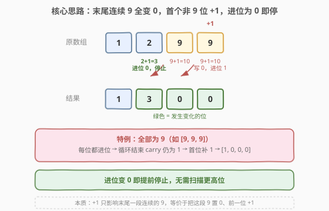

# 加一

- **题目名称**：加一
- **链接**：[66. 加一](https://leetcode.cn/problems/plus-one/)
- **难度**：简单
- **标签**：数组、数学、模拟

## 1. 题目概述

给定一个由**整数组成的非空数组**所表示的非负整数，在该数的基础上**加一**，返回一个新的数组。

最高位数字存放在数组的首位， 数组中每个元素只存储**单个数字**（即 $0 \sim 9$）。除整数 `0` 之外，这个整数不会以零开头。

**示例 1**：

```text
输入：digits = [1,2,3]
输出：[1,2,4]
解释：输入数组表示数字 123，加一后得到 124。
```

**示例 2**：

```text
输入：digits = [4,3,2,1]
输出：[4,3,2,2]
解释：输入数组表示数字 4321，加一后得到 4322。
```

**示例 3**：

```text
输入：digits = [9]
输出：[1,0]
解释：输入数组表示数字 9，加一后得到 10。
```

**示例 4**：

```text
输入：digits = [9,9,9]
输出：[1,0,0,0]
解释：输入数组表示数字 999，加一后得到 1000。
```

**约束条件**：

- $1 \le \text{digits.length} \le 100$
- $0 \le \text{digits[i]} \le 9$
- `digits` 不包含任何前导零（除了数字 `0` 本身）

> 💡 数组长度可达 100，意味着表示的整数可达 $10^{100}$，远超 64 位整型（约 20 位）能容纳的范围。因此**不能**依赖内置整数类型做 `+1` 再拆位，必须像手算加法那样**逐位模拟进位**。

---

## 2. 解题思路

### 2.1 暴力思路：转整数再转回

最直觉的做法是把数组拼成整数 `num`，执行 `num + 1`，再拆回数组。但当长度达到 100 时，`num` 高达 $10^{100}$，任何内置整型都会**溢出**。即便用大整数库（Python 原生支持），也违背了「逐位模拟」的考察意图，且在大数场景下逐位操作反而更高效（无需构造整个大整数对象）。

因此必须回到**小学竖式加法**的思路：从最低位（数组末尾）起，加 1（初始进位），满十置 0 进位，逐位向左传播。

### 2.2 核心观察：逐位进位 + 提前终止



加 1 的本质是**一次最低位加法 + 进位链传播**。关键观察：

- **进位只在「连续的 9」上传播**：某位为 9 时，$9 + 1 = 10$，该位置 0、进位 1 继续向左；某位 $< 9$ 时，加 1 后 $< 10$，**不会产生进位**，可立即停止。
- 因此只需**从右向左扫描**：遇到 9 就置 0 继续走，遇到 $< 9$ 的位直接 `+1` 返回——后面的高位完全不受影响，无需再扫。
- **特例（全 9）**：若所有位都是 9（如 `[9,9,9]`），循环走完整个数组仍未出现 $< 9$ 的位，说明每一位都产生了进位。此时结果比原数多一位，**首位需要补一个 1**，后面全是 0（如 `[1,0,0,0]`）。

> 💡 **为什么「遇到 $<9$ 即停」是对的**：加 1 只可能影响**末尾一段连续的 9**。一旦碰到一个 $<9$ 的位，它 $+1$ 后必 $<10$，进位随即归零，更高位不可能再变化。这个性质让平均情况下的循环次数远小于 $n$——只有全 9 数组才需要扫满 $n$ 位。

### 2.3 算法流程图


流程只有一个从右向左的循环：每轮判断当前位加进位后是否为 10。是则置 0、进位保持 1、继续左移；否则写入结果、进位归 0、立即返回。若循环正常结束（说明全程进位），在首位插入 1 后返回。

### 2.4 示例演算

以 `digits = [9, 9, 9]`（全 9 的最坏情况）为例，逐位进位过程如下：

![示例演算：[9, 9, 9] + 1，逐位进位最终首位补 1](../images/plus_one_walkthrough.svg)

| 步骤 | 下标 i | 操作 | 数组状态 | carry |
|------|--------|------|----------|-------|
| 初始 | 2 | 从末位开始 | `[9, 9, 9]` | 1 |
| 1 | 2 | $9+1=10$，写 0 | `[9, 9, 0]` | 1 |
| 2 | 1 | $9+1=10$，写 0 | `[9, 0, 0]` | 1 |
| 3 | 0 | $9+1=10$，写 0 | `[0, 0, 0]` | 1 |
| 结束 | — | `i < 0`，carry 仍为 1，首位补 1 | `[1, 0, 0, 0]` | 0 |

对照非全 9 的情况 `digits = [1, 2, 9, 9]`：末位 $9 \to 0$（进位），次位 $9 \to 0$（进位），第三位 $2 < 9$ 直接 $+1 \to 3$，**进位归零立即停止**，首位 1 完全不动，结果 `[1, 3, 0, 0]`。两种情况的差异正是「提前终止」带来的效率体现。

---

## 3. 参考代码

### C++

```cpp
class Solution {
  public:
    vector<int> plusOne(vector<int>& digits) {
        for (int i = digits.size() - 1; i >= 0; i--) {
            if (digits[i] < 9) {
                digits[i]++;          // 该位 +1 后必 <10，无进位，直接返回
                return digits;
            }
            digits[i] = 0;            // 为 9 则置 0，进位 1 隐含在“继续循环”中
        }
        // 走到这里说明所有位都是 9，首位补 1
        digits.insert(digits.begin(), 1);
        return digits;
    }
};
```

### Python

```python
class Solution:
    def plusOne(self, digits: List[int]) -> List[int]:
        for i in range(len(digits) - 1, -1, -1):
            if digits[i] < 9:
                digits[i] += 1        # 该位 +1 后必 <10，无进位，直接返回
                return digits
            digits[i] = 0             # 为 9 则置 0，进位 1 隐含在“继续循环”中
        # 走到这里说明所有位都是 9，首位补 1
        return [1] + digits
```

> 💡 **写法要点**：进位 `carry` 并未显式出现——它被「循环是否继续」隐式表达。某位为 9 时置 0 后**继续循环**等价于「向左传播进位 1」；某位 $<9$ 时 `+1` 后**立即 return** 等价于「进位归零、停止传播」。这种把进位融进控制流的写法比显式维护 `carry` 变量更简洁，也更直白地体现了「遇 9 进位、遇非 9 即停」的核心逻辑。

> ⚠️ 全 9 时 Python 用 `[1] + digits` 构造新列表（`digits` 此时已全是 0），C++ 用 `insert` 在头部插入。两者都是 $O(n)$ 操作，与循环同级，不改变整体复杂度。

---

## 4. 复杂度分析

| 维度 | 复杂度 | 说明 |
|------|--------|------|
| 时间复杂度 | $O(n)$ | 最坏情况（全 9）需遍历全部 $n$ 位；平均情况遇首位非 9 即停，远小于 $n$。整体以最坏计为 $O(n)$ |
| 空间复杂度 | $O(1)$ | 原地修改数组，仅用常数额外变量；全 9 时插入操作在原数组上进行（C++ `insert` / Python 列表拼接），输出本身不计入额外空间 |

> 💡 严格地说，全 9 时首部插入可能触发数组元素的搬移（C++ `vector::insert`）或新建列表（Python `[1] + digits`），瞬时空间为 $O(n)$，但这属于输出构造的固有开销，不视为算法的额外空间。

---

## 5. 扩展：显式进位写法与任意进制加法

### 5.1 显式 carry 写法

上面代码把进位隐式融入控制流。若要显式维护进位变量（更贴近 [415. 字符串相加](https://leetcode.cn/problems/add-strings/) 的通用加法模板），可写成：

```cpp
vector<int> plusOne(vector<int>& digits) {
    int carry = 1;
    for (int i = digits.size() - 1; i >= 0 && carry; i--) {
        int sum = digits[i] + carry;
        digits[i] = sum % 10;
        carry = sum / 10;
    }
    if (carry) digits.insert(digits.begin(), 1);
    return digits;
}
```

循环条件 `i >= 0 && carry` 一旦 `carry` 归 0 就停止，同样实现提前终止。这种写法更容易推广到「加任意数」而非「加一」的场景。

### 5.2 推广：大数加法

本题是 [415. 字符串相加](https://leetcode.cn/problems/add-strings/) 的退化版——把「两个大数相加」简化为「一个大数 +1」。掌握通用模板后，加一只是 `num2 = 1` 的特例：双指针从右扫、`sum = d1 + d2 + carry`、`sum % 10` 写入、`sum / 10` 进位。二进制版 [67. 二进制求和](https://leetcode.cn/problems/add-binary/) 则把 `% 10` / `/ 10` 换成 `& 1` / `>> 1`，结构完全一致。

---

## 6. 面试要点

1. **为什么不能直接把数组转成整数加一再转回？**

   - 数组长度可达 100，表示的整数可达 $10^{100}$，远超 64 位整型上界（约 $2 \times 10^{19}$），直接转换会溢出。即便语言支持大整数（如 Python），逐位模拟在面试中更能体现对「进位」机制的理解，且避免了构造大整数对象的开销。

2. **为什么遇到 $<9$ 的位可以直接返回？**

   - 加 1 的进位只在末尾连续的 9 上传播。一旦遇到 $<9$ 的位，它 $+1$ 后必 $<10$，进位随即归零，更高位不可能再受影响。所以「遇到 $<9$」就是进位链终止的充要条件，可立即返回。

3. **全 9 的情况为什么要单独处理？**

   - 全 9 时每一位都 $9+1=10$ 置 0 进位，循环走完整个数组后进位仍为 1，说明结果比原数多一位。此时数组已全是 0，只需在首位补一个 1（如 `[9,9,9]` → `[1,0,0,0]`）。这一步无法在循环内完成，因为循环只处理已有位，新增的位需在循环外插入。

4. **进位最多传播多少位？时间复杂度如何？**

   - 进位最多传播 $n$ 位（全 9 数组），所以最坏时间 $O(n)$。但平均情况下，末尾连续 9 的长度期望很小（每位为 9 的概率 $1/10$，连续 $k$ 个 9 的概率 $1/10^k$），绝大多数输入在常数步内即停。以最坏情况计仍为 $O(n)$。

5. **能否做到 $O(1)$ 额外空间？**

   - 可以。代码原地修改 `digits` 数组，仅用下标 `i` 等常数变量。全 9 时首部插入虽需搬移元素，但那属于输出的固有构造开销，不算额外空间。若要求严格不修改输入，则需 $O(n)$ 空间复制一份再操作。

---

## 7. 同类练习题

- [415. 字符串相加](https://leetcode.cn/problems/add-strings/)（[题解](../0401-0500/415_字符串相加.md)）：大数加法通用模板，双指针从右逐位相加 + 进位传递，本题是其退化版
- [67. 二进制求和](https://leetcode.cn/problems/add-binary/)：二进制字符串相加，进位基数为 2，换汤不换药的进位模拟
- [2. 两数相加](https://leetcode.cn/problems/add-two-numbers/)（[题解](2_两数相加.md)）：链表逆序存储的加法模拟，与本题同为「逐位运算 + 进位」核心套路
- [43. 字符串相乘](https://leetcode.cn/problems/multiply-strings/)（[题解](43_字符串相乘.md)）：大数乘法版，逐位相乘 + 位置映射累加，是加法的乘法进阶姊妹题
- [369. 给单链表加一](https://leetcode.cn/problems/plus-one-linked-list/)：链表版「加一」，思路与本题一致——从末位进位、遇 9 置 0、首位补 1，考察链表逆序处理
