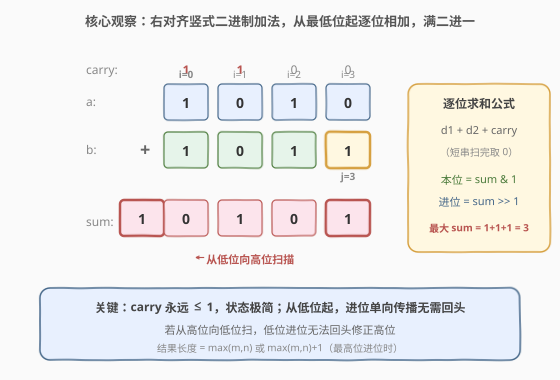
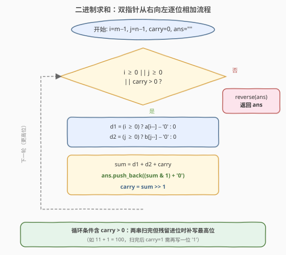
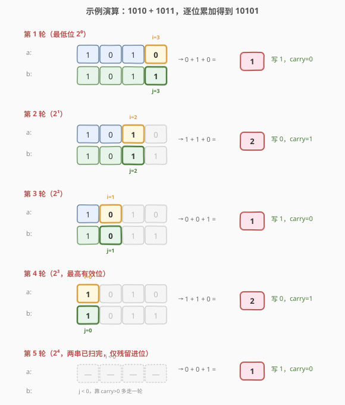

# LeetCode 二进制求和 题解

## 1. 题目概述

- **标题 / 题号**：二进制求和（#67，easy）
- **链接**：https://leetcode.cn/problems/add-binary/
- **难度**：简单
- **标签**：数学、字符串、位运算、模拟

**题意**：给你两个二进制字符串 `a` 和 `b`，以二进制字符串的形式返回它们的和。

**示例 1**：

```text
输入：a = "11", b = "1"
输出："100"
解释：3 + 1 = 4，二进制即 "100"。
```

**示例 2**：

```text
输入：a = "1010", b = "1011"
输出："10101"
解释：10 + 11 = 21，二进制即 "10101"。
```

**约束**：

- $1 \le \text{a.length}, \text{b.length} \le 10^4$
- `a` 和 `b` 仅由字符 `'0'` 和 `'1'` 组成
- 除 `"0"` 之外，`a`、`b` 都不以 `'0`' 开头

> 💡 字符串长度可达 $10^4$，意味着表示的二进制数可达 $2^{10000}$，对应的十进制值远超任何内置整型（64 位整型上界约 $2 \times 10^{19}$，仅约 64 位二进制）。因此**不能**依赖内置整数类型做 `int(a, 2) + int(b, 2)` 再转回——即便 Python 的大整数不溢出，也违背了「逐位模拟」的考察意图，且字符串↔大整数的转换本身就有不可忽视的开销。正确做法是回到**竖式加法**：从最低位起逐位相加，满二进一。

## 2. 解题思路

### 2.1 暴力思路：转整数相加再转回

最直觉的做法是 `int(a, 2) + int(b, 2)` 再 `bin()` 转回字符串。但当长度达到 $10^4$ 时，构造如此巨大的整数对象既低效（大整数运算开销）又偏离题意——本题考察的正是**进位模拟**本身。在 C++/Java 这类没有原生大整数的语言里，此路更是直接不通。

因此必须回到**小学竖式加法**的思路：两个数右对齐，从最低位（字符串末尾）起，逐位取 `d1 + d2 + carry`，本位写 `sum % 2`（即 `sum & 1`），向高位进 `sum / 2`（即 `sum >> 1`）。这与 [415. 字符串相加](https://leetcode.cn/problems/add-strings/) 十进制版完全同构，只是基数从 10 换成了 2。

### 2.2 核心观察：逐位模拟 + 满二进一



二进制加法的本质是**基数为 2 的列竖式**。关键观察：

- **每位最大和为 3**：两个相加位都为 1、且低位进上来的 carry 也为 1 时，$1 + 1 + 1 = 3$。此时本位写 $3 \bmod 2 = 1$，向高位进 $3 / 2 = 1$。因此 **carry 永远只能是 0 或 1**，不会出现「进位 2」的情况，这让状态极其简单。
- **本位与进位的提取**：本位 `sum & 1`（取最低位）、进位 `sum >> 1`（右移一位即除以 2）。用位运算替代 `% 2` / `/ 2` 更贴合二进制语境，也更直白地表达了「满二进一」。
- **循环条件含 `carry > 0`**：当两串都已扫完但还残留进位时，需要再补写一个最高位 `1`（如 `"11" + "1"` → 扫完后 carry=1，需补 `"1"` 得 `"100"`）。把 `carry > 0` 写进循环条件可优雅地覆盖这一情况，无需循环外特判。
- **短串补零**：位数不对齐时，短串的高位按 `0` 处理——这等价于「右对齐」，由循环中 `i >= 0` / `j >= 0` 的判断天然实现。

> 💡 **为什么从低位向高位扫**：加法的进位是**由低位向高位单向传播**的。低位算完后才知道向高位进多少，因此必须从最低位开始；若从高位向低位扫，低位产生的进位无法回头修正已经写下的高位，逻辑根本走不通。

### 2.3 算法流程图



流程只有一个从右向左的循环：每轮取两位 `d1`、`d2`（越界取 0），与 `carry` 求和，本位写 `sum & 1` 追加到结果尾部，进位更新为 `sum >> 1`。循环结束时把结果反转即为答案。循环条件 `i >= 0 || j >= 0 || carry > 0` 保证两串扫完且进位归零后才退出，自动处理「最高位补 1」的边界。

### 2.4 示例演算

以 `a = "1010"`, `b = "1011"`（即 $10 + 11 = 21$）为例，逐位相加过程如下：



| 轮次 | 位权 | d1 (a) | d2 (b) | carry 入 | sum | 本位写出 | carry 出 |
|------|------|--------|--------|----------|-----|----------|----------|
| 1 | $2^0$ | 0 | 1 | 0 | 1 | 1 | 0 |
| 2 | $2^1$ | 1 | 1 | 0 | 2 | 0 | 1 |
| 3 | $2^2$ | 0 | 0 | 1 | 1 | 1 | 0 |
| 4 | $2^3$ | 1 | 1 | 0 | 2 | 0 | 1 |
| 5 | $2^4$ | — (0) | — (0) | 1 | 1 | 1 | 0 |

写入顺序（从低位到高位）：`1, 0, 1, 0, 1` → 反转 → `"10101"` ✓

注意第 5 轮：两串都已扫完（`i < 0` 且 `j < 0`），但 `carry` 仍为 1，靠循环条件里的 `carry > 0` 多走一轮，补写出最高位的 `1`。这正是「循环条件含 carry」带来的简洁性——无需循环外特判首尾进位。

## 3. 参考代码

### C++

```cpp
class Solution {
  public:
    string addBinary(string a, string b) {
        string ans;
        int i = a.size() - 1, j = b.size() - 1, carry = 0;
        while (i >= 0 || j >= 0 || carry) {
            int d1 = (i >= 0) ? a[i--] - '0' : 0;
            int d2 = (j >= 0) ? b[j--] - '0' : 0;
            int sum = d1 + d2 + carry;
            ans.push_back((sum & 1) + '0');   // 本位 = sum % 2
            carry = sum >> 1;                  // 进位 = sum / 2
        }
        reverse(ans.begin(), ans.end());
        return ans;
    }
};
```

### Python

```python
class Solution:
    def addBinary(self, a: str, b: str) -> str:
        i, j, carry = len(a) - 1, len(b) - 1, 0
        ans = []
        while i >= 0 or j >= 0 or carry:
            d1 = int(a[i]) if i >= 0 else 0
            d2 = int(b[j]) if j >= 0 else 0
            i -= 1
            j -= 1
            s = d1 + d2 + carry
            ans.append(str(s & 1))             # 本位 = s % 2
            carry = s >> 1                     # 进位 = s / 2
        return ''.join(reversed(ans))
```

> 💡 **写法要点**：本位与进位用位运算 `sum & 1` / `sum >> 1` 提取，比 `sum % 2` / `sum / 2` 更贴合二进制语义。由于每位写入结果是「从低位到高位」追加的，最后需 `reverse` 一次得到正常顺序。结果用 `string`（C++）/ `list`（Python）边算边追加，避免反复头部插入的 $O(n^2)$ 开销。

> ⚠️ **字符与数值的转换**：C++ 中 `a[i] - '0'` 把字符 `'0'`/`'1'` 转成数值 0/1；写回时 `(sum & 1) + '0'` 把数值转回字符。Python 中 `int(a[i])` 更直白。两处转换不可省略——直接对字符做算术会得到错误的 ASCII 值。

## 4. 复杂度分析

| 维度 | 复杂度 | 说明 |
|------|--------|------|
| 时间复杂度 | $O(\max(m, n))$ | 循环次数 = 两串中较长者的长度，至多多走 1 轮（处理最高位进位）。每轮做常数次运算，整体线性 |
| 空间复杂度 | $O(\max(m, n))$ | 结果字符串长度至多 $\max(m, n) + 1$（最高位进位时多一位）。此为输出本身固有开销；若不计输出，仅用 `i/j/carry` 等常数额外变量即 $O(1)$ |

> 💡 本题时间复杂度的下界就是 $\Omega(\max(m, n))$——无论如何都必须至少读一遍两个串才能确定结果，因此模拟法已是最优。

## 5. 扩展：位运算加速与任意进制加法

### 5.1 位运算批量加速（无进位加法 + 进位传播）

当字符串特别长（远超 $10^4$）时，逐位模拟虽是线性但常数较大。可以利用「**无进位加法 = XOR，进位 = AND 左移**」的性质，把整块位串打包成大整数做批量运算（类似 CPU 内部加法器的思路）：

- `sum_without_carry = a XOR b`（本位结果，不考虑进位）
- `carry = (a AND b) << 1`（同时为 1 的位会产生进位）
- 把 `carry` 当作新的 `b`，与 `sum_without_carry` 重复上述过程，直到 `carry == 0`

在支持大整数的语言（Python）里，可把二进制串转成大整数后用此法一次性算完，最后再转回字符串。但当串长 $\le 10^4$ 时，逐位模拟的常数开销与「字符串↔大整数转换」的开销相当，且逐位法不依赖大整数库，可移植性更好。本题数据规模下**逐位模拟是首选**。

### 5.2 推广：任意进制加法模板

本题与 [415. 字符串相加](https://leetcode.cn/problems/add-strings/) 是同一套模板的两种实例——只需把「本位」与「进位」的提取换成对应基数：

- 十进制（415）：`bit = sum % 10`，`carry = sum / 10`，最大 sum = 19
- 二进制（67，本题）：`bit = sum & 1`，`carry = sum >> 1`，最大 sum = 3
- $k$ 进制通用：`bit = sum % k`，`carry = sum / k`

掌握这个模板后，任何进制的「字符串大数加法」都是换汤不换药。

## 6. 面试要点

1. **为什么不能直接 `int(a, 2) + int(b, 2)`？**

   - 串长可达 $10^4$，对应二进制数高达 $2^{10000}$，C++/Java 无原生大整数会直接溢出；即便 Python 支持大整数，构造如此大的整数对象开销可观，且偏离了「逐位进位模拟」的考察意图。面试官期待看到的是模拟法，而非调用库函数。

2. **进位 carry 最大能到多少？为什么只用一位就能存？**

   - 每位求和 `d1 + d2 + carry`，三个量都 $\le 1$，最大 sum = 3。$3 / 2 = 1$，所以新 carry 永远 $\le 1$，一个 bool/0-1 变量即可。这与十进制加法（最大 sum=19，carry $\le 1$）同理——任何进制下加法的进位都不超过 1。

3. **循环条件为什么要带 `carry > 0`？**

   - 两串扫完后可能仍残留进位（如 `"11" + "1"`，第 2 轮后两指针都越界但 carry=1）。把 `carry > 0` 写进条件，让循环多走一轮补写最高位 `1`，避免了循环外特判。少写这一个条件就会漏掉「结果比最长串多一位」的情况。

4. **为什么结果要 `reverse`？**

   - 进位从低位向高位传播，我们只能从最低位开始算，于是最先算出的是结果的最低位。为避免每轮在字符串头部插入（$O(n)$ 单次、$O(n^2)$ 总计），统一追加到尾部，最后整体反转一次（$O(n)$）。这是「后进先出」结果收集的通用技巧。

5. **位运算 `sum & 1` / `sum >> 1` 相比 `sum % 2` / `sum / 2` 有优势吗？**

   - 语义上等价，都正确。位运算更贴合二进制语境、可读性更直观（「取最低位」「右移即除以 2」），在现代编译器/JIT 下性能也无差异。选哪种主要看团队风格，二进制题里用位运算更能体现「满二进一」的直觉。

## 同类练习题

| # | 题目 | 与本题的关联 |
|---|------|-------------|
| 415 | [字符串相加](https://leetcode.cn/problems/add-strings/)（[题解](../0401-0500/415_字符串相加.md)） | 十进制版大数加法通用模板，逐位 `sum = d1+d2+carry`、`% 10` 写位、`/ 10` 进位，本题是其二进制实例 |
| 66 | [加一](https://leetcode.cn/problems/plus-one/)（[题解](66_加一.md)） | 大数「+1」的退化版，逐位进位 + 遇非 9 即停，本题可看作「+1」推广到「+任意二进制串」 |
| 2 | [两数相加](https://leetcode.cn/problems/add-two-numbers/)（[题解](2_两数相加.md)） | 链表逆序存储的加法模拟，与本题同为「逐位运算 + 进位」核心套路，只是数据载体从字符串换成链表 |
| 43 | [字符串相乘](https://leetcode.cn/problems/multiply-strings/)（[题解](43_字符串相乘.md)） | 大数乘法版，逐位相乘 + 位置映射累加，是加法的乘法进阶姊妹题 |
| 369 | [给单链表加一](https://leetcode.cn/problems/plus-one-linked-list/) | 链表版「加一」，思路与逐位进位一致，考察链表逆序处理进位传播 |
