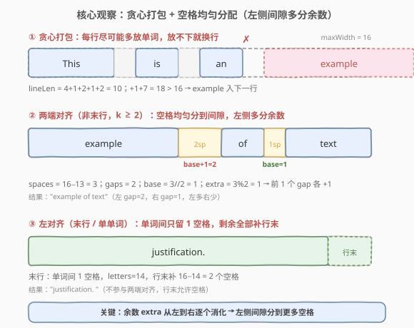
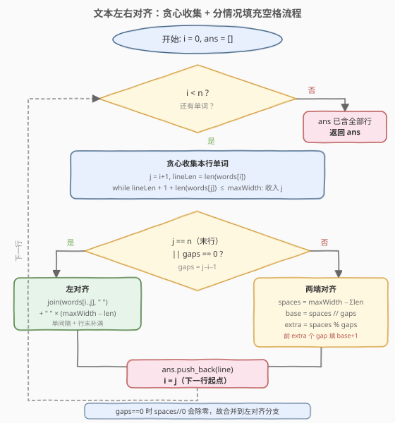
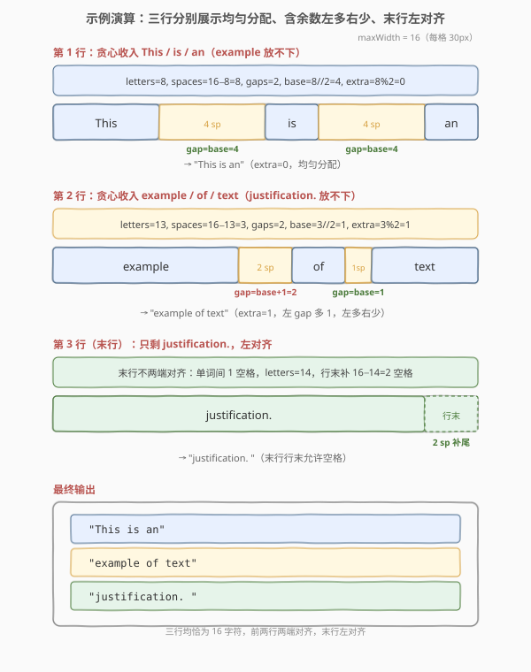

# LeetCode 文本左右对齐 题解

## 1. 题目概述

- **标题 / 题号**：文本左右对齐（#68，hard）
- **链接**：https://leetcode.cn/problems/text-justification/
- **难度**：困难
- **标签**：字符串、数组、模拟、贪心

**题意**：给定一个单词数组 `words` 和一个宽度 `maxWidth`，重新排版单词，使其成为每行恰好有 `maxWidth` 个字符、且**左右两端都对齐**的文本。要求：

1. **贪心打包**：每一行尽可能多地放入单词，单词之间至少用一个空格分隔；当放入下一个单词会超出 `maxWidth` 时，结束本行。
2. **均匀分配空格**：行内多余的空格要尽可能均匀地分布在单词之间的间隙中。若空格数不能均分，则**左侧的间隙分到更多空格**。
3. **最后一行特殊**：最后一行**左对齐**，单词间只留一个空格，剩余空格全部补在行末。
4. **单单词行**：若某行只有一个单词，则左对齐，行末补满空格。

**示例 1**：

```text
输入：words = ["This", "is", "an", "example", "of", "text", "justification."], maxWidth = 16
输出：
[
   "This    is    an",
   "example  of text",
   "justification.  "
]
```

**示例 2**：

```text
输入：words = ["What","must","be","acknowledgment","shall","be"], maxWidth = 16
输出：
[
  "What   must   be",
  "acknowledgment  ",
  "shall be        "
]
```

**约束**：

- $1 \le \text{words.length} \le 300$
- $1 \le \text{words[i].length} \le \text{maxWidth}$
- `words[i]` 由小写英文字母和问号组成
- $\text{maxWidth} \ge \text{words[i].length}$
- $\sum \text{words[i].length} \le 2000$

> 💡 本题没有复杂的算法，难点在于**边界条件繁多**与**空格分配的精确规则**。核心只有两件事：① 贪心地决定每行放哪些单词；② 按规则把空格填进去。把这两步拆清楚，剩下的就是耐心处理「最后一行」「单单词」「间隙不均分」等特例。

## 2. 解题思路

### 2.1 暴力思路：枚举换行点

最朴素的想法是枚举所有可能的换行位置组合，找出满足每行不超过 `maxWidth` 的方案。但单词数可达 300，换行点的组合数是指数级，完全不可行。而且题目明确要求「贪心打包」——能放就放，不枚举。因此暴力枚举既不必要也不符合题意。

### 2.2 核心观察：贪心打包 + 空格均匀分配



整道题可以拆成两个独立的子问题：

**子问题 A：每行放哪些单词？（贪心）**

从左到右扫单词，维护当前行已选单词的最小占用长度 `lineLen`（= 单词字母总数 + 单词间的单个空格）。尝试加入下一个单词 `w` 时，新长度为 `lineLen + 1 + len(w)`（多一个间隔空格 + 新单词长度），若仍 $\le \text{maxWidth}$ 就加入；否则结束本行，从 `w` 开始新的一行。

> 💡 这里 `lineLen` 把「单词字母 + 单个间隔空格」打包计算，是关键简化：判定能否加入只需 `lineLen + 1 + len(w) <= maxWidth` 一次比较，无需单独数空格。

**子问题 B：空格怎么填？（三种情况）**

设本行有 `k` 个单词，单词字母总长 `letters`，则**需要分配的总空格数** `spaces = maxWidth − letters`，**间隙数** `gaps = k − 1`：

| 情况 | 条件 | 填法 |
|------|------|------|
| 左对齐 | 最后一行 **或** `k == 1` | 每个间隙填 1 个空格，剩余空格全部补到行末 |
| 两端对齐 | 非最后一行 且 `k ≥ 2` | 每个 gap 至少填 `spaces // gaps` 个空格，前 `spaces % gaps` 个 gap 各多填 1 个 |

> ⚠️ **左多右少的关键**：`spaces % gaps` 是均分后的余数。把余数逐个加到**左侧**前 `extra` 个间隙，就实现了「左侧间隙分到更多空格」。例如 `spaces=3, gaps=2` 时，`3 // 2 = 1`、`3 % 2 = 1`，第一个 gap 填 `1+1=2`，第二个 gap 填 `1`。

> ⚠️ **行末不能有多余空格（除最后一行/单单词行）**：两端对齐的行，最后一个单词后**不接空格**，所有空格都分布在单词之间的间隙里。这是与「最后一行」的根本区别——最后一行才允许（且必须）在行末补空格。

### 2.3 算法流程图



流程分两层循环：外层 `while i < n` 推进到下一行的起点；内层 `while` 贪心地把尽可能多的单词收入当前行。收集完单词后，按「最后一行 / 单单词 / 多单词」三分支填充空格，拼成一行，加入结果。

### 2.4 示例演算

以 `words = ["This","is","an","example","of","text","justification."]`，`maxWidth = 16` 为例：



**第 1 行**：贪心收入 `This / is / an`（`example` 加入后 `4+2+2+1+1+7=17 > 16`，截断）。

| 项 | 值 |
|----|----|
| 字母总长 `letters` | $4+2+2 = 8$ |
| `spaces` | $16 − 8 = 8$ |
| `gaps` | $3 − 1 = 2$ |
| `spaces // gaps` | $4$ |
| `spaces % gaps` | $0$（无余数，均匀） |
| 结果 | `"This    is    an"`（每 gap 4 空格） |

**第 2 行**：贪心收入 `example / of / text`（`justification.` 加入后超宽，截断）。

| 项 | 值 |
|----|----|
| `letters` | $7+2+4 = 13$ |
| `spaces` | $16 − 13 = 3$ |
| `gaps` | $2$ |
| `spaces // gaps` | $1$ |
| `spaces % gaps` | $1$（余数 1，左侧第 1 个 gap 多 1） |
| 结果 | `"example  of text"`（gap1=2，gap2=1） |

**第 3 行（最后一行）**：只剩 `justification.`，左对齐。

| 项 | 值 |
|----|----|
| `letters` | $14$ |
| 行末补空格 | $16 − 14 = 2$ |
| 结果 | `"justification.  "`（行末 2 空格） |

最终输出：

```text
[
  "This    is    an",
  "example  of text",
  "justification.  "
]
```

## 3. 参考代码

### C++

```cpp
class Solution {
  public:
    vector<string> fullJustify(vector<string>& words, int maxWidth) {
        vector<string> ans;
        int n = words.size();
        for (int i = 0; i < n;) {
            // 贪心收集本行单词：j 从 i+1 起，lineLen 含单词字母 + 单间隔空格
            int j = i + 1, lineLen = words[i].size();
            while (j < n && lineLen + 1 + (int)words[j].size() <= maxWidth) {
                lineLen += 1 + words[j].size();
                j++;
            }
            // 本行单词 = words[i..j-1]，共 j-i 个
            int gaps = j - i - 1;        // 间隙数
            string line;
            if (j == n || gaps == 0) {
                // 最后一行 或 单单词行：左对齐，单词间 1 空格，行末补满
                for (int k = i; k < j; k++) {
                    line += words[k];
                    if (k < j - 1) line += ' ';
                }
                line.append(maxWidth - line.size(), ' ');
            } else {
                // 两端对齐：spaces 均分到 gaps，前 extra 个 gap 各 +1
                int letters = 0;
                for (int k = i; k < j; k++) letters += words[k].size();
                int spaces = maxWidth - letters;
                int base = spaces / gaps, extra = spaces % gaps;
                for (int k = 0; k < gaps; k++) {
                    line += words[i + k];
                    line.append(base + (k < extra ? 1 : 0), ' ');
                }
                line += words[j - 1];   // 最后一个单词后不加空格
            }
            ans.push_back(line);
            i = j;                       // 下一行从 j 开始
        }
        return ans;
    }
};
```

### Python

```python
class Solution:
    def fullJustify(self, words: list[str], maxWidth: int) -> list[str]:
        ans = []
        n = len(words)
        i = 0
        while i < n:
            # 贪心收集本行单词
            j = i + 1
            line_len = len(words[i])
            while j < n and line_len + 1 + len(words[j]) <= maxWidth:
                line_len += 1 + len(words[j])
                j += 1
            gaps = j - i - 1
            if j == n or gaps == 0:
                # 最后一行 或 单单词行：左对齐
                line = ' '.join(words[i:j])
                line += ' ' * (maxWidth - len(line))
            else:
                # 两端对齐
                letters = sum(len(words[k]) for k in range(i, j))
                spaces = maxWidth - letters
                base, extra = divmod(spaces, gaps)
                parts = []
                for k in range(gaps):
                    parts.append(words[i + k])
                    parts.append(' ' * (base + (1 if k < extra else 0)))
                parts.append(words[j - 1])
                line = ''.join(parts)
            ans.append(line)
            i = j
        return ans
```

> 💡 **写法要点**：判定能否加入下一个单词用 `lineLen + 1 + len(w) <= maxWidth`——这里的 `+1` 是新间隙的空格，`lineLen` 已含此前所有间隙。两端对齐时，`gaps` 个间隙各放 `base` 个空格、前 `extra` 个再多放 1，最后单独追加末单词（其后不加空格）。`i = j` 让外层循环天然推进到下一行起点，无需额外索引维护。

> ⚠️ **C++ 中的整数类型**：`words[j].size()` 返回 `size_t`（无符号），与负数比较可能误判。`(int)words[j].size()` 显式转换避免 `lineLen + 1 + size_t` 溢出后绕回的隐患，是 C++ 字符串题的常见防御写法。

## 4. 复杂度分析

| 维度 | 复杂度 | 说明 |
|------|--------|------|
| 时间复杂度 | $O(\sum \text{len(words[i])})$ | 每个单词仅在收集阶段被访问常数次（参与长度计算与判定），在拼行阶段被复制一次。总工作量正比于所有单词字符总数，上限 $2000$ |
| 空间复杂度 | $O(\sum \text{len(words[i])})$ | 输出结果存储所有行的字符串，总字符数 = 所有单词字符 + 分配的空格。空格总数 $\le$ 行数 $\times \text{maxWidth}$，但由题意 $\sum \text{len} \le 2000$ 且每单词 $\le \text{maxWidth}$，输出规模与输入同阶。不计输出则 $O(\text{maxWidth})$ 临时行缓冲 |

> 💡 本题不存在「更优算法」——必须逐字处理每个单词，输出也必须逐字符生成，因此上述复杂度已是下界。

## 5. 扩展：两端对齐 vs 左对齐的现实背景

「文本左右对齐」是排版软件（Word、LaTeX、印刷排版）的基本功能。本题的「贪心打包 + 均匀分配」对应的是最简单的**优先填充（first-fit）**策略。真实排版中还有更精细的做法：

- **最佳填充（best-fit / Knuth-Plass 算法）**：不只看当前行，而是动态规划整段文本，允许某行稍宽以换取整体更均匀的间距，LaTeX 默认采用。本题贪心策略可能产生某行间隙过大的情况（如末行前一行），最佳填充能缓解。
- **连字符（hyphenation）**：当单词放不下时，按音节断词加连字符，减少大片空白。本题明确不允许断词。
- **微调字距（kerning）**：不靠空格而靠调整字符间距来对齐，常见于窄列排版。本题只允许空格。

掌握本题的贪心 + 均匀分配，就理解了「文本对齐」的最小可用版本；进阶的 Knuth-Plass 是带坏格子惩罚的网格 DP，可作为后续学习方向。

## 6. 面试要点

1. **为什么是「贪心打包」而不是动态规划？**

   - 题目**明确要求**「每一行尽可能多地放入单词」，这本身就是贪心的定义——能放就放，不考虑为后续行留空间。DP（如 Knuth-Plass）是优化整体美观度，本题不要求，因此贪心是题意规定，不是算法选择。

2. **空格分配时「左侧多分」是怎么实现的？为什么这样分？**

   - `spaces % gaps` 得到均分后的余数 `extra`。把余数逐个加到**前 `extra` 个间隙**，就实现了左侧多分。题目规定「若空格数不能均分，左侧间隙获得更多空格」，所以余数必须从左往右消化。实现上 `base + (k < extra ? 1 : 0)` 一行搞定。

3. **最后一行和单单词行为什么要特殊处理？**

   - 最后一行**左对齐**是排版惯例——末行不需要右端对齐，单词间只留 1 空格，剩余补到行末。单单词行没有间隙可分空格（`gaps == 0`），也只能左对齐。两者合并为同一分支：`j == n || gaps == 0`。漏掉这个分支会导致对单单词行做 `spaces / 0` 除零错误。

4. **为什么两端对齐的行末不能有空格？**

   - 两端对齐的目标是让**最右单词紧贴右边界**，空格只分布在单词之间。若行末也有空格，右边界就会内缩，达不到 `maxWidth`。只有左对齐行（最后一行/单单词行）才在行末补空格——因为它们不需要右端对齐。

5. **`lineLen` 为什么要把「单间隔空格」打包进去？**

   - 把单词字母长度和「至少 1 个间隔空格」合并成 `lineLen`，判定条件简化为 `lineLen + 1 + len(w) <= maxWidth`（`+1` 是新间隙）。若分开维护「字母总长」和「单词数」，每次判定要算 `letters + len(w) + words_count`，容易漏掉间隙数。打包后语义更清晰，是减少 off-by-one 的关键。

## 同类练习题

| # | 题目 | 与本题的关联 |
|---|------|-------------|
| 6 | [Z 字形变换](https://leetcode.cn/problems/zigzag-conversion/)（[题解](6_N字形变换.md)） | 同样是字符串按几何规则重排的模拟题，考察下标映射与边界处理，本题侧重空格分配，两者都是「耐心模拟」类 |
| 38 | [外观数列](https://leetcode.cn/problems/count-and-say/)（[题解](38_外观数列.md)） | 字符串生成模拟，按规则逐字符扫描生成新串，与本题的「逐单词扫描 + 按规则拼行」同属字符串模拟套路 |
| 58 | [最后一个单词的长度](https://leetcode.cn/problems/length-of-last-word/)（[题解](58_最后一个单词的长度.md)） | 从右向左扫描字符串定位单词边界，本题贪心收集单词时也需精确处理单词边界，是字符串切分的基础功 |
| 415 | [字符串相加](https://leetcode.cn/problems/add-strings/)（[题解](../0401-0500/415_字符串相加.md)） | 逐字符模拟 + 边界条件处理，虽是数学模拟，但「分情况处理末位/进位」的细心与本题「分情况填空格」一脉相承 |
| 1592 | [重新排列单词间的空格](https://leetcode.cn/problems/rearrange-spaces-between-words/) | 本题的简化版——给定一个字符串，把其中的空格重新均匀分配到单词间（末行规则略不同），是练手空格分配的好题 |
