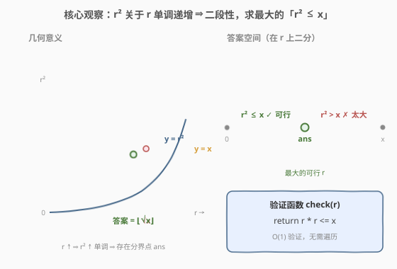
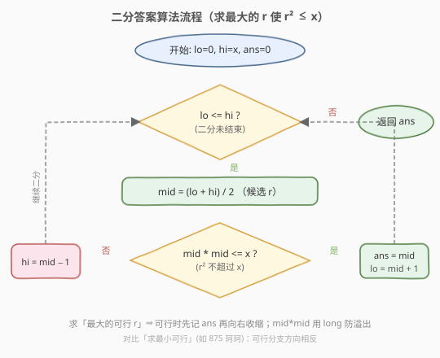
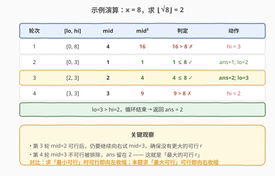

# x 的平方根

- **题目名称**：x 的平方根
- **链接**：[69. x 的平方根](https://leetcode.cn/problems/sqrtx/)
- **难度**：简单
- **标签**：数学、二分查找

## 1. 题目概述

给你一个非负整数 `x`，计算并返回 `x` 的**算术平方根的整数部分**（即 $\lfloor \sqrt{x} \rfloor$，向下取整）。

> ⚠️ **注意**：返回类型是整数，结果只保留**整数部分**，小数部分直接舍去。**不允许**使用任何内置的指数函数与运算符（如 `pow(x, 0.5)` 或 `x ** 0.5`）。

**示例 1**：

```text
输入：x = 4
输出：2
解释：√4 = 2，整数部分即 2。
```

**示例 2**：

```text
输入：x = 8
输出：2
解释：√8 = 2.82842...，小数部分舍去，返回 2。
```

**约束条件**：

- `0 <= x <= 2^31 - 1`

---

## 2. 解题思路

### 2.1 暴力思路

从 `r = 0` 开始逐一递增，找到**第一个**使 $(r+1)^2 > x$ 的 `r`，则 `r` 就是 $\lfloor \sqrt{x} \rfloor$。最坏情况下 `x = 2^31 - 1` 时 $\sqrt{x} \approx 46340$，要枚举四万多轮，虽不至于超时，但效率低、且不够通用（换更大的数据范围就崩）。

> 💡 暴力法之所以慢，是因为它在「线性地」扫描答案空间。注意到答案满足单调性后，可用二分把 `O(√x)` 降到 `O(log x)`。

### 2.2 核心观察：二分答案



关键直觉是：**函数 $f(r) = r^2$ 关于 $r$ 单调递增**。

- `r` 越大，`r * r` 越大。
- 当 `r` 小到一定程度时 `r * r <= x`（**可行**）；当 `r` 大到一定程度时 `r * r > x`（**太大**）。

于是存在一个**分界点** `ans`：

```text
r <= ans → r * r <= x   (可行：平方不超过 x)
r >  ans → r * r >  x   (太大：平方超过 x)
```

这正是二分查找所需的**二段性**。所求 $\lfloor \sqrt{x} \rfloor$ 就是「**最大的可行 `r`**」——可行区间的右端点。把问题转化为：在有序区间 `[0, x]` 上二分，每次 `O(1)` 验证 `mid * mid <= x` 是否成立，可行则记下 `ans = mid` 并向右继续找更大的，不可行则向左收缩。

> 💡 **识别信号**：题目求「最大的满足某单调条件的值」，且能 `O(1)` 验证候选值是否合法 → 想「二分答案」。这是与「在有序数组里二分找下标」不同的另一类二分：**二分的是答案本身**。

> ⚠️ **方向对比**：本系列 [875. 爱吃香蕉的珂珂](875_爱吃香蕉的珂珂.md) 求的是「**最小**的可行速度」——可行时向左收缩；**本题求「最大」的可行 `r`**——可行时向**右**收缩（`ans = mid; lo = mid + 1`）。方向相反，是二分答案的两种基本变体。

> ⚠️ **溢出**：`x` 可达 $2^{31}-1$，$\sqrt{x} \approx 46341$，而 $46341^2 \approx 2.15 \times 10^9$ **超过 32 位 `int` 上界**（约 $2.1 \times 10^9$）。C++ 中 `mid * mid` 必须用 `long long`，否则溢出后会变成负数，导致 `mid * mid <= x` 误判为 `true`，答案偏大。

### 2.3 算法流程图



注意判定为「可行」时**先记录 `ans = mid` 再收缩左界**（`lo = mid + 1`），保证最终保留的是「最大的可行值」——这是与「求最小可行」相反的收缩方向。

### 2.4 示例演算



以 `x = 8` 为例（初始 `lo=0, hi=8, ans=0`）：

- **第 1 轮** `[0,8]`，`mid=4`，`4²=16 > 8` ✗ → 太大，`hi=3`。
- **第 2 轮** `[0,3]`，`mid=1`，`1²=1 ≤ 8` ✓ → 可行，记 `ans=1`，`lo=2`。
- **第 3 轮** `[2,3]`，`mid=2`，`2²=4 ≤ 8` ✓ → 可行，记 `ans=2`，`lo=3`。
- **第 4 轮** `[3,3]`，`mid=3`，`3²=9 > 8` ✗ → 太大，`hi=2`。
- `lo=3 > hi=2`，循环结束，返回 `ans=2`。

> 💡 第 3 轮已经得到 `ans=2`，但仍需第 4 轮验证 `mid=3` 不可行——这正是「求最大可行」必须向右试探的原因，确保没有更大的合法 `r` 被遗漏。

---

## 3. 参考代码

### C++

```cpp
class Solution {
  public:
    int mySqrt(int x) {
        int lo = 0, hi = x, ans = 0;
        while (lo <= hi) {
            int mid = lo + (hi - lo) / 2;
            if ((long long)mid * mid <= x) { // long long 防 mid*mid 溢出
                ans = mid;      // 可行，尝试更大的 r
                lo = mid + 1;
            } else {
                hi = mid - 1;   // 太大，向左收缩
            }
        }
        return ans;
    }
};
```

### Python

```python
class Solution:
    def mySqrt(self, x: int) -> int:
        lo, hi, ans = 0, x, 0
        while lo <= hi:
            mid = (lo + hi) // 2
            if mid * mid <= x:   # Python 大整数无溢出问题
                ans = mid        # 可行，尝试更大的 r
                lo = mid + 1
            else:
                hi = mid - 1     # 太大，向左收缩
        return ans
```

> ⚠️ **两个易错点**：
> 1. **溢出**：C++ 中 `mid * mid` 在 `mid ≈ 46341` 时溢出 32 位 `int`。解法是用 `(long long)mid * mid` 提升类型；也可改用除法 `mid <= x / mid` 规避（但 `mid = 0` 时除零需单独处理，不如乘法直观）。
> 2. **收缩方向**：求「最大可行」时，可行分支要 `ans = mid; lo = mid + 1`（向右收缩），写反会得到「最小的可行值」`0`。

---

## 4. 复杂度分析

| 维度 | 复杂度 | 说明 |
|------|--------|------|
| 时间复杂度 | O(log x) | 在 `[0, x]` 上二分，每次 `O(1)` 验证 `mid * mid <= x` |
| 空间复杂度 | O(1) | 仅用常数额外变量 |

---

## 5. 扩展：牛顿迭代法（更快的近似）

二分答案已足够通过本题，但求平方根还有一种经典数值方法——**牛顿迭代法**（Newton's method），收敛速度为二次收敛，通常只需几次迭代即可达到整数精度。

**思路**：求 $\sqrt{x}$ 等价于求方程 $g(t) = t^2 - x = 0$ 的正根。从初始猜测 $t_0 = x$ 出发，按切线迭代：

$$
t_{n+1} = t_n - \frac{g(t_n)}{g'(t_n)} = t_n - \frac{t_n^2 - x}{2 t_n} = \frac{1}{2}\left(t_n + \frac{x}{t_n}\right)
$$

迭代直到 $t_{n+1} \ge t_n$（此时已向下越过真实平方根，整数部分稳定），返回 $\lfloor t_{n+1} \rfloor$。

```cpp
class Solution {
  public:
    int mySqrt(int x) {
        if (x == 0) return 0;
        long long t = x; // long long 防中间溢出
        while (t * t > x) {
            t = (t + x / t) / 2; // 牛顿迭代
        }
        return (int)t;
    }
};
```

> 💡 牛顿法每次迭代把误差大致平方缩小，约 `O(log log x)` 次即可收敛，比二分的 `O(log x)` 更快；但二分答案逻辑更直观、更易在面试中写对，是本题的首选。

---

## 6. 面试要点

1. **为什么能二分？二段性体现在哪？**

   - $f(r) = r^2$ 关于 $r$ 单调递增。存在分界点 `ans`，使 `r <= ans` 时 `r² ≤ x`（可行）、`r > ans` 时 `r² > x`（太大）。这种「左可行 / 右太大」的结构就是二段性，可用二分定位 `ans`。

2. **本题求「最大可行」，与求「最小可行」的二分写法有何不同？**

   - 求最大可行时，可行分支要**向右收缩**：`ans = mid; lo = mid + 1`，继续试探更大的 `r`；求最小可行（如 875 珂珂）则相反，可行分支 `ans = mid; hi = mid - 1` 向左收缩。两者只是收缩方向不同，模板一致。

3. **`mid * mid` 为什么会溢出？怎么处理？**

   - `x` 可达 $2^{31}-1$，$\sqrt{x} \approx 46341$，而 $46341^2 \approx 2.15 \times 10^9$ 超过 32 位 `int` 上界。C++ 用 `(long long)mid * mid` 提升类型；或用 `mid <= x / mid` 规避（注意 `mid = 0` 除零）。Python 整数无上限无此问题。

4. **上界为什么取 `x` 而不是 `x/2`？**

   - 对 `x >= 1`，$\sqrt{x} \le x$ 恒成立，`hi = x` 是合法上界，逻辑最简单不易错。进一步可优化为 `hi = x / 2 + 1`（对 `x >= 2`，$\sqrt{x} \le x/2$），减少约一次二分，但属锦上添花，面试中写出正确版即可。

5. **如果面试官追问「不能乘法怎么验证 `r² ≤ x`」？**

   - 用除法：`r <= x / r`（整数除法向下取整，等价验证 $r^2 \le x$），单独处理 `r = 0` 的除零情况即可。这是规避溢出的常用技巧。

---

## 7. 同类练习题

- [875. 爱吃香蕉的珂珂](https://leetcode.cn/problems/koko-eating-bananas/)：同属「二分答案」，但求**最小**可行速度，可行时向左收缩——与本题方向相反，对照练习
- [367. 有效的完全平方数](https://leetcode.cn/problems/valid-perfect-square/)：同模板判断 `num` 是否为完全平方数，二分找 `r` 使 `r² == num`
- [1011. 在 D 天内送达包裹的能力](https://leetcode.cn/problems/capacity-to-ship-packages-within-d-days/)：二分答案求最小可行，`check` 用贪心按天装货，进阶练习
- [50. Pow(x, n)](https://leetcode.cn/problems/powx-n/)：快速幂递归 / 迭代，另一类「数学+二分思想」的题目
